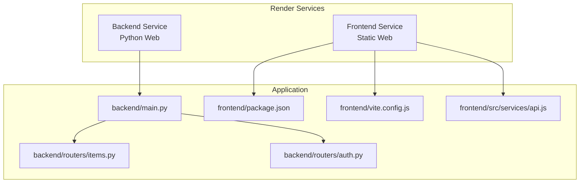
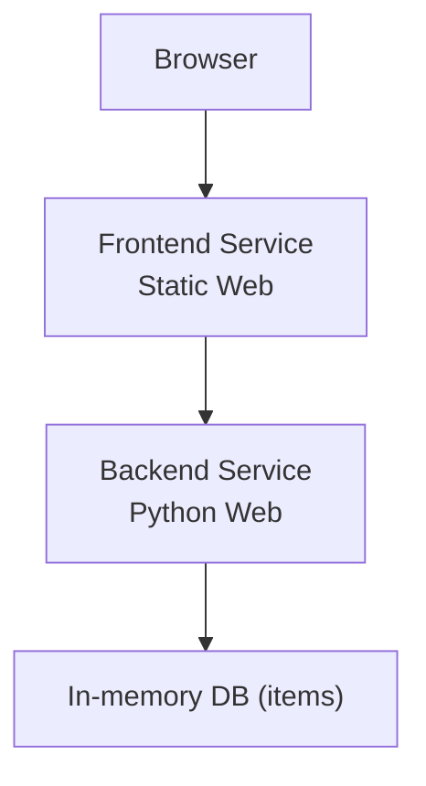
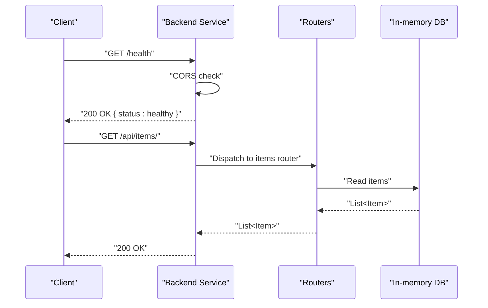
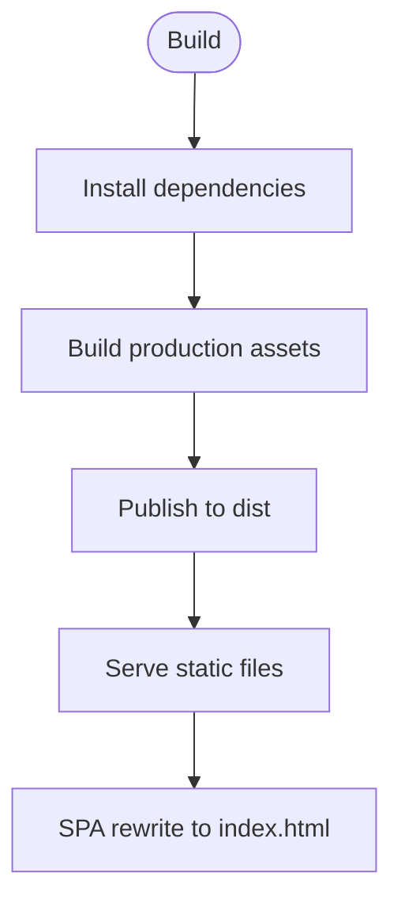
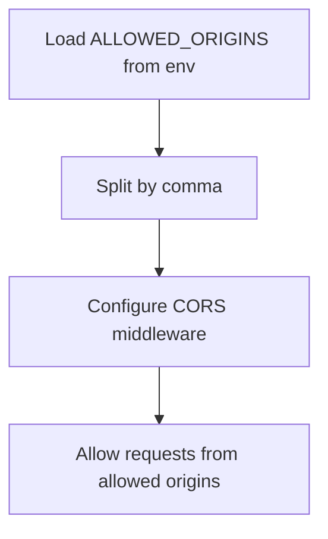
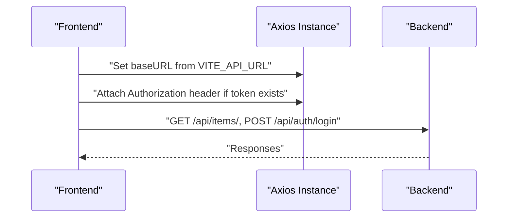
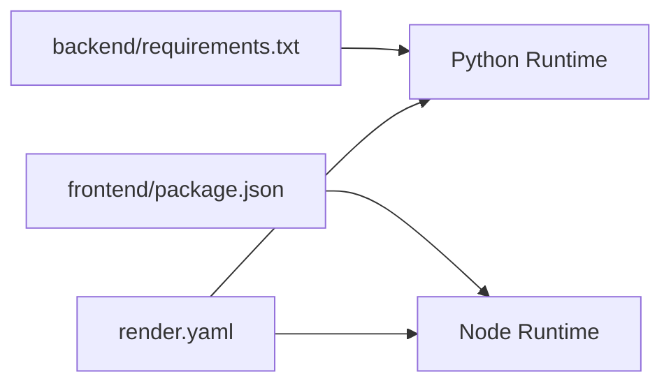

# Deployment Guide

<cite>
**Referenced Files in This Document**
- [render.yaml](file://render.yaml)
- [backend/main.py](file://backend/main.py)
- [backend/routers/items.py](file://backend/routers/items.py)
- [backend/routers/auth.py](file://backend/routers/auth.py)
- [backend/requirements.txt](file://backend/requirements.txt)
- [frontend/package.json](file://frontend/package.json)
- [frontend/vite.config.js](file://frontend/vite.config.js)
- [frontend/src/services/api.js](file://frontend/src/services/api.js)
- [README.md](file://README.md)
</cite>

## Table of Contents
1. [Introduction](#introduction)
2. [Project Structure](#project-structure)
3. [Core Components](#core-components)
4. [Architecture Overview](#architecture-overview)
5. [Detailed Component Analysis](#detailed-component-analysis)
6. [Dependency Analysis](#dependency-analysis)
7. [Performance Considerations](#performance-considerations)
8. [Troubleshooting Guide](#troubleshooting-guide)
9. [Conclusion](#conclusion)
10. [Appendices](#appendices)

## Introduction
This guide documents deploying the ishwarambare-app on Render using Render Blueprints. It covers automatic deployment via Blueprint, manual configuration, environment variables, CORS setup, custom domain configuration (DNS and SSL), health checks, monitoring, scaling, backups, and maintenance.

## Project Structure
The repository contains a FastAPI backend and a React/Vite frontend, orchestrated by a single render.yaml Blueprint that defines two services: a Python web service for the backend and a static web service for the frontend.

**Diagram sources**
- [render.yaml:4-43](file://render.yaml#L4-L43)
- [backend/main.py:10-32](file://backend/main.py#L10-L32)
- [backend/routers/items.py:1-72](file://backend/routers/items.py#L1-L72)
- [backend/routers/auth.py:1-39](file://backend/routers/auth.py#L1-L39)
- [frontend/package.json:1-24](file://frontend/package.json#L1-L24)
- [frontend/vite.config.js:1-23](file://frontend/vite.config.js#L1-L23)
- [frontend/src/services/api.js:1-29](file://frontend/src/services/api.js#L1-L29)

**Section sources**
- [README.md:5-25](file://README.md#L5-L25)
- [render.yaml:4-43](file://render.yaml#L4-L43)

## Core Components
- Backend service (Python web): FastAPI app with CORS middleware, health endpoint, and API routers for items and authentication.
- Frontend service (static web): React + Vite app configured for development proxy and production build output.

Key behaviors:
- Backend exposes a root and health endpoint and includes routers under API prefixes.
- Frontend uses an environment variable for the API base URL and attaches an Authorization header when available.

**Section sources**
- [backend/main.py:10-43](file://backend/main.py#L10-L43)
- [backend/routers/items.py:36-71](file://backend/routers/items.py#L36-L71)
- [backend/routers/auth.py:18-38](file://backend/routers/auth.py#L18-L38)
- [frontend/src/services/api.js:3-28](file://frontend/src/services/api.js#L3-L28)

## Architecture Overview
Render Blueprints define two services:
- Backend: Python runtime, rootDir backend, healthCheckPath /health, envVars for ALLOWED_ORIGINS, ENVIRONMENT, SECRET_KEY.
- Frontend: Static runtime, rootDir frontend, buildCommand npm install && npm run build, staticPublishPath dist, SPA rewrite to index.html, envVars for VITE_API_URL.

**Diagram sources**
- [render.yaml:4-43](file://render.yaml#L4-L43)
- [backend/main.py:36-43](file://backend/main.py#L36-L43)
- [backend/routers/items.py:24-31](file://backend/routers/items.py#L24-L31)

## Detailed Component Analysis

### Backend Service (Python Web)
- Runtime and region: Python runtime in Singapore.
- Build and start commands: installs Python dependencies from requirements.txt and starts Uvicorn on $PORT.
- Health check: GET /health.
- Environment variables:
  - ALLOWED_ORIGINS: comma-separated origins for CORS.
  - ENVIRONMENT: production.
  - SECRET_KEY: generated securely by Render.
- CORS middleware: allows credentials, all methods/headers, configured from ALLOWED_ORIGINS.

**Diagram sources**
- [render.yaml:6-21](file://render.yaml#L6-L21)
- [backend/main.py:17-28](file://backend/main.py#L17-L28)
- [backend/main.py:41-43](file://backend/main.py#L41-L43)
- [backend/routers/items.py:36-39](file://backend/routers/items.py#L36-L39)

**Section sources**
- [render.yaml:6-21](file://render.yaml#L6-L21)
- [backend/main.py:17-28](file://backend/main.py#L17-L28)
- [backend/main.py:41-43](file://backend/main.py#L41-L43)
- [backend/requirements.txt:1-20](file://backend/requirements.txt#L1-L20)

### Frontend Service (Static Web)
- Runtime and region: Static runtime in Singapore.
- Build command: installs dependencies and builds production assets.
- Publish path: dist.
- Headers: Cache-Control set to no-cache.
- Routes: rewrite all unmatched paths to index.html for SPA routing.
- Environment variable:
  - VITE_API_URL: points to the backend service URL on Render.

**Diagram sources**
- [render.yaml:24-42](file://render.yaml#L24-L42)
- [frontend/package.json:6-10](file://frontend/package.json#L6-L10)
- [frontend/vite.config.js:18-22](file://frontend/vite.config.js#L18-L22)

**Section sources**
- [render.yaml:24-42](file://render.yaml#L24-L42)
- [frontend/package.json:6-10](file://frontend/package.json#L6-L10)
- [frontend/vite.config.js:18-22](file://frontend/vite.config.js#L18-L22)

### CORS Configuration
- ALLOWED_ORIGINS is loaded from environment and split into a list for CORS middleware.
- Defaults include localhost for development and the production domains.
- Credentials are allowed, and all methods/headers are permitted.

**Diagram sources**
- [backend/main.py:17-28](file://backend/main.py#L17-L28)

**Section sources**
- [backend/main.py:17-28](file://backend/main.py#L17-L28)

### API Client Configuration
- Frontend constructs axios baseURL from VITE_API_URL.
- Automatically attaches Authorization header if a token exists in localStorage.
- Exposes convenience functions for items and auth endpoints.

**Diagram sources**
- [frontend/src/services/api.js:3-28](file://frontend/src/services/api.js#L3-L28)

**Section sources**
- [frontend/src/services/api.js:3-28](file://frontend/src/services/api.js#L3-L28)

## Dependency Analysis
- Backend depends on FastAPI, Uvicorn, and python-dotenv for environment loading.
- Frontend depends on React, React DOM, React Router, Axios, and Vite with React plugin.
- Blueprint orchestrates both services and sets environment variables.

**Diagram sources**
- [backend/requirements.txt:1-20](file://backend/requirements.txt#L1-L20)
- [frontend/package.json:11-22](file://frontend/package.json#L11-L22)
- [render.yaml:4-43](file://render.yaml#L4-L43)

**Section sources**
- [backend/requirements.txt:1-20](file://backend/requirements.txt#L1-L20)
- [frontend/package.json:11-22](file://frontend/package.json#L11-L22)
- [render.yaml:4-43](file://render.yaml#L4-L43)

## Performance Considerations
- Use Render’s free plan initially for development; upgrade to paid plans for production traffic and CPU/memory needs.
- Enable caching headers selectively; the current configuration disables cache for static assets.
- Monitor health endpoint regularly to detect downtime.
- Consider enabling gzip compression at the CDN level if using a custom domain.

[No sources needed since this section provides general guidance]

## Troubleshooting Guide
Common issues and resolutions:
- CORS errors:
  - Ensure ALLOWED_ORIGINS includes the frontend origin(s).
  - Verify the frontend VITE_API_URL points to the backend service URL.
- Health check failures:
  - Confirm healthCheckPath is set to /health and the backend responds.
- Frontend not loading:
  - Verify staticPublishPath is dist and SPA rewrite is configured.
- Authentication failures:
  - Replace demo login logic with real JWT and database-backed authentication.
- Environment variables:
  - SECRET_KEY is generated automatically; ensure it persists across deploys.
- DNS and SSL:
  - Add custom domains in the Render dashboard and configure DNS records as documented.

**Section sources**
- [backend/main.py:17-28](file://backend/main.py#L17-L28)
- [render.yaml:14](file://render.yaml#L14)
- [render.yaml:36-39](file://render.yaml#L36-L39)
- [README.md:96-108](file://README.md#L96-L108)

## Conclusion
The ishwarambare-app is designed for straightforward deployment on Render using Blueprints. The backend and frontend are configured with environment variables, CORS, and health checks. Custom domains and SSL are handled via Render’s dashboard and DNS settings. Monitor health, scale resources as needed, and replace demo authentication with a production-grade solution.

[No sources needed since this section summarizes without analyzing specific files]

## Appendices

### Environment Variable Reference
- Backend:
  - ALLOWED_ORIGINS: Comma-separated origins for CORS.
  - ENVIRONMENT: production.
  - SECRET_KEY: Generated securely by Render.
- Frontend:
  - VITE_API_URL: Base URL for API requests.

**Section sources**
- [render.yaml:15-21](file://render.yaml#L15-L21)
- [render.yaml:40-42](file://render.yaml#L40-L42)
- [frontend/src/services/api.js:4](file://frontend/src/services/api.js#L4)

### API Endpoints
- GET /: Welcome message
- GET /health: Health check
- GET /api/items/: List all items
- GET /api/items/{id}: Get item by ID
- POST /api/items/: Create item
- DELETE /api/items/{id}: Delete item
- POST /api/auth/login: Login
- GET /api/auth/me: Current user

**Section sources**
- [backend/main.py:36-43](file://backend/main.py#L36-L43)
- [backend/routers/items.py:36-71](file://backend/routers/items.py#L36-L71)
- [backend/routers/auth.py:18-38](file://backend/routers/auth.py#L18-L38)
- [README.md:111-123](file://README.md#L111-L123)

### Custom Domain Setup
Steps:
1. Add ishwarambare.online and www.ishwarambare.online in the frontend service settings.
2. Configure DNS:
   - CNAME: www -> ishwarambare-frontend.onrender.com
   - A: @ -> Render’s IP shown in the dashboard
3. Wait for SSL certificate provisioning.

**Section sources**
- [README.md:96-108](file://README.md#L96-L108)
- [render.yaml:44-48](file://render.yaml#L44-L48)