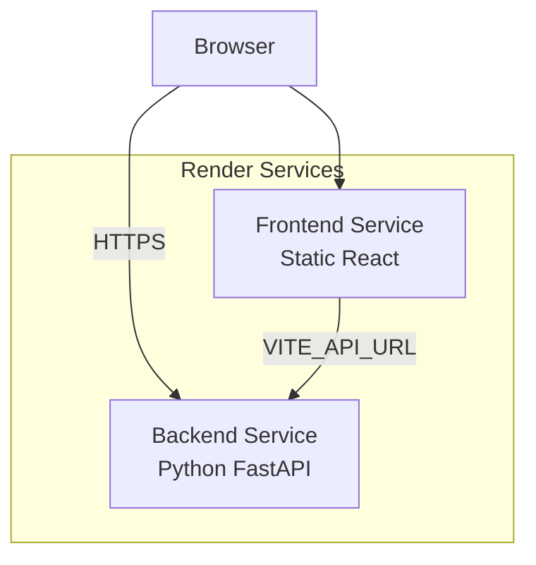
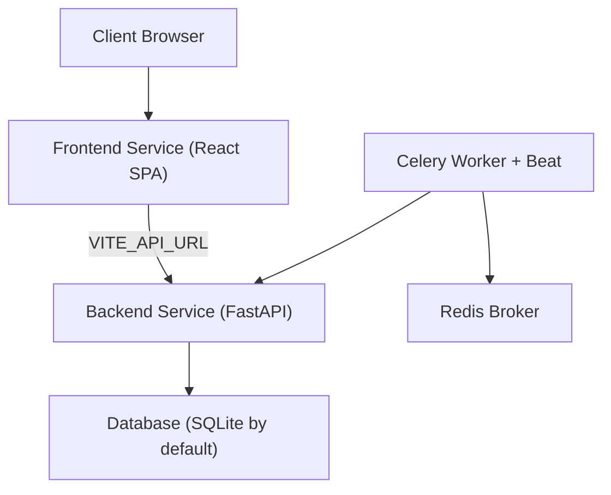
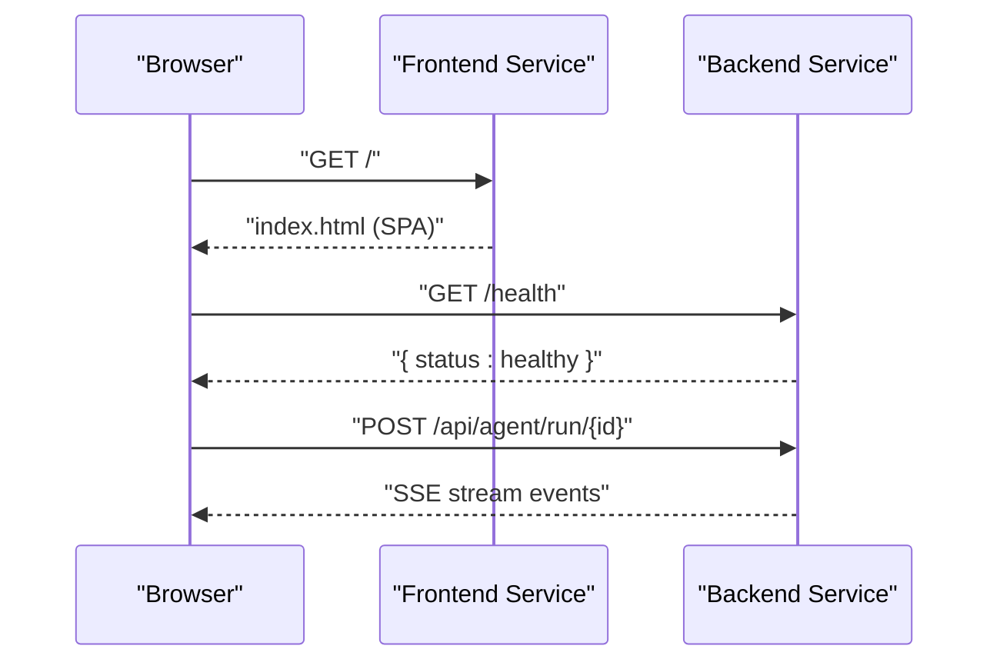
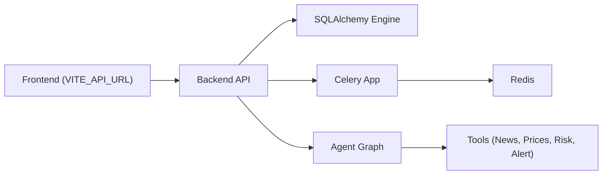

# Deployment and Operations

<cite>
**Referenced Files in This Document**
- [render.yaml](file://render.yaml)
- [README.md](file://README.md)
- [backend/main.py](file://backend/main.py)
- [backend/models/database.py](file://backend/models/database.py)
- [backend/routers/auth.py](file://backend/routers/auth.py)
- [backend/routers/agent.py](file://backend/routers/agent.py)
- [backend/tasks/celery_app.py](file://backend/tasks/celery_app.py)
- [backend/agent/graph.py](file://backend/agent/graph.py)
- [frontend/vite.config.js](file://frontend/vite.config.js)
- [frontend/package.json](file://frontend/package.json)
- [frontend/src/services/api.js](file://frontend/src/services/api.js)
</cite>

## Table of Contents
1. [Introduction](#introduction)
2. [Project Structure](#project-structure)
3. [Core Components](#core-components)
4. [Architecture Overview](#architecture-overview)
5. [Detailed Component Analysis](#detailed-component-analysis)
6. [Dependency Analysis](#dependency-analysis)
7. [Performance Considerations](#performance-considerations)
8. [Troubleshooting Guide](#troubleshooting-guide)
9. [Conclusion](#conclusion)
10. [Appendices](#appendices)

## Introduction
This document provides comprehensive deployment and operations guidance for the ishwarambare-app platform. It covers Render platform configuration, dual-service architecture (frontend and backend), environment variables, custom domain and SSL setup, automatic deployment workflows, environment-specific configurations, database migration procedures, health checks and monitoring, performance optimization, caching strategies, scaling for concurrent agent executions, security configurations (CORS, authentication tokens, HTTPS), troubleshooting, rollback procedures, maintenance windows, and operational procedures for updates, backups, and disaster recovery.

## Project Structure
The platform follows a dual-service architecture:
- Backend: FastAPI web service with Python runtime, serving REST APIs and SSE streaming for agent runs.
- Frontend: Static React site built with Vite, served as a static site on Render.

**Diagram sources**
- [render.yaml:4-43](file://render.yaml#L4-L43)
- [frontend/src/services/api.js:3-9](file://frontend/src/services/api.js#L3-L9)

**Section sources**
- [render.yaml:4-43](file://render.yaml#L4-L43)
- [README.md:1-25](file://README.md#L1-L25)

## Core Components
- Render Blueprint: Defines two services (web) with runtime, region, plan, build/start commands, health check, environment variables, and routing/headers for the frontend.
- Backend: FastAPI app with CORS middleware, startup table creation, routers for items, auth, portfolio, agent, alerts, root and health endpoints.
- Frontend: React SPA with Vite proxy for local dev, environment-driven base API URL, and static publishing configuration.
- Task Scheduler: Celery app configured with Redis broker/backend and a daily scheduled task to analyze portfolios.

**Section sources**
- [render.yaml:4-43](file://render.yaml#L4-L43)
- [backend/main.py:12-58](file://backend/main.py#L12-L58)
- [frontend/vite.config.js:5-22](file://frontend/vite.config.js#L5-L22)
- [backend/tasks/celery_app.py:35-55](file://backend/tasks/celery_app.py#L35-L55)

## Architecture Overview
The system uses a dual-service model on Render:
- Backend service exposes REST endpoints and SSE streaming for live agent runs.
- Frontend service serves the React SPA and rewrites all routes to index.html for SPA support.
- Environment variables configure allowed origins, secret key, API base URL, and database connection.

**Diagram sources**
- [render.yaml:4-43](file://render.yaml#L4-L43)
- [backend/models/database.py:15-20](file://backend/models/database.py#L15-L20)
- [backend/tasks/celery_app.py:29-40](file://backend/tasks/celery_app.py#L29-L40)

## Detailed Component Analysis

### Render Platform Configuration
- Services:
  - Backend service: Python runtime, Singapore region, free plan, root directory backend, build command installs requirements, start command uses Uvicorn with PORT, health check path is /health, environment variables include allowed origins, environment type, and a generated secret key.
  - Frontend service: Static runtime, Singapore region, free plan, root directory frontend, build command installs and builds, publishes to dist, sets Cache-Control header to no-cache, rewrites all routes to index.html, environment variable VITE_API_URL points to the backend service URL.
- Custom Domain:
  - Configure domains in the Render dashboard for the frontend service and update DNS records accordingly.

**Section sources**
- [render.yaml:4-43](file://render.yaml#L4-L43)
- [README.md:96-108](file://README.md#L96-L108)

### Dual-Service Architecture
- Backend:
  - Exposes REST endpoints and SSE streaming for agent runs.
  - Health check endpoint at /health.
  - Startup hook creates database tables.
- Frontend:
  - SPA with route rewriting to index.html.
  - Proxies API requests during development.
  - Builds to dist for static hosting.

**Diagram sources**
- [backend/main.py:56-58](file://backend/main.py#L56-L58)
- [backend/routers/agent.py:39-74](file://backend/routers/agent.py#L39-L74)
- [render.yaml:36-39](file://render.yaml#L36-L39)

**Section sources**
- [backend/main.py:38-58](file://backend/main.py#L38-L58)
- [frontend/vite.config.js:7-17](file://frontend/vite.config.js#L7-L17)
- [render.yaml:36-39](file://render.yaml#L36-L39)

### Environment Variables and Secrets
- Backend:
  - ALLOWED_ORIGINS: Comma-separated list of allowed origins.
  - ENVIRONMENT: Environment identifier (e.g., production).
  - SECRET_KEY: Generated securely by Render.
- Frontend:
  - VITE_API_URL: Base URL for API calls.

Manual configuration guidance and values are documented in the repository.

**Section sources**
- [render.yaml:15-21](file://render.yaml#L15-L21)
- [render.yaml:40-42](file://render.yaml#L40-L42)
- [README.md:86-92](file://README.md#L86-L92)

### Custom Domain and SSL
- Steps to add custom domains and configure DNS are documented in the repository.
- SSL provisioning occurs automatically after DNS updates.

**Section sources**
- [README.md:96-108](file://README.md#L96-L108)

### Automatic Deployment Workflows
- Blueprint-based deployment:
  - Push repository to GitHub and import the blueprint in Render to automatically create both services.
- Manual environment variables:
  - Configure ALLOWED_ORIGINS, SECRET_KEY, and VITE_API_URL as per the manual setup table.

**Section sources**
- [README.md:78-93](file://README.md#L78-L93)

### Environment-Specific Configurations
- Development:
  - Local backend runs with hot reload on port 8000.
  - Local frontend runs on port 5173 with proxy to backend.
  - Database defaults to SQLite for zero-config local development.
- Staging/Production:
  - Render services use free plan with Singapore region.
  - Production database URL can be switched to PostgreSQL via DATABASE_URL environment variable.

**Section sources**
- [README.md:29-75](file://README.md#L29-L75)
- [backend/models/database.py:7-8](file://backend/models/database.py#L7-L8)

### Database Migration Procedures
- On startup, the backend creates database tables.
- For production, switch DATABASE_URL to PostgreSQL and manage migrations externally (e.g., Alembic) as needed.

**Section sources**
- [backend/main.py:33-35](file://backend/main.py#L33-L35)
- [backend/models/database.py:38-41](file://backend/models/database.py#L38-L41)

### Health Check Endpoints
- Backend exposes a /health endpoint for liveness/readiness checks.

**Section sources**
- [backend/main.py:56-58](file://backend/main.py#L56-L58)
- [render.yaml:14-14](file://render.yaml#L14-L14)

### Monitoring Strategies
- Use Render’s dashboard to monitor service logs and health.
- Implement structured logging in backend and Celery tasks.
- Monitor frontend performance and error rates via browser analytics if integrated.

[No sources needed since this section provides general guidance]

### Performance Optimization Techniques
- Frontend:
  - Disable source maps in production builds.
  - Minimize third-party dependencies and bundle size.
- Backend:
  - Use asynchronous patterns where possible.
  - Optimize database queries and consider connection pooling.
  - Tune Celery concurrency and worker count for scheduled tasks.

**Section sources**
- [frontend/vite.config.js:20-20](file://frontend/vite.config.js#L20-L20)
- [backend/tasks/celery_app.py:35-55](file://backend/tasks/celery_app.py#L35-L55)

### Caching Strategies
- Frontend:
  - Cache-control header set to no-cache for static assets.
- Backend:
  - Consider adding cache headers for static assets and API responses where appropriate.
  - Use CDN for static assets if traffic increases.

**Section sources**
- [render.yaml:32-35](file://render.yaml#L32-L35)

### Scaling Considerations for Concurrent Agent Executions
- Celery:
  - Configure Redis as broker/backend.
  - Scale workers horizontally to handle concurrent portfolio analyses.
  - Use separate queues and routing for long-running tasks.
- Backend:
  - Ensure database connections are efficient and threadsafe.
  - Consider horizontal scaling of the web service behind a load balancer.

**Section sources**
- [backend/tasks/celery_app.py:29-40](file://backend/tasks/celery_app.py#L29-L40)

### Security Configurations
- CORS:
  - Middleware allows all origins for SSE compatibility; ensure allowed origins are restricted in production.
- Authentication:
  - Demo login endpoint; replace with JWT and database-backed authentication.
- HTTPS:
  - Render enforces HTTPS for custom domains; ensure all API calls use HTTPS.

**Section sources**
- [backend/main.py:18-30](file://backend/main.py#L18-L30)
- [backend/routers/auth.py:18-32](file://backend/routers/auth.py#L18-L32)
- [README.md:96-108](file://README.md#L96-L108)

### Operational Procedures
- Updates:
  - Push changes to the repository; Render will rebuild services automatically.
- Backups:
  - For SQLite, back up the database file regularly.
  - For PostgreSQL, use managed backup features.
- Disaster Recovery:
  - Recreate services from blueprint if needed.
  - Restore database from backups and redeploy frontend/backend.

[No sources needed since this section provides general guidance]

## Dependency Analysis
The frontend depends on the backend API via VITE_API_URL. The backend depends on SQLAlchemy for ORM and Celery for scheduling. The agent graph orchestrates tools for fetching data and computing risk.

**Diagram sources**
- [frontend/src/services/api.js:3-9](file://frontend/src/services/api.js#L3-L9)
- [backend/models/database.py:11-20](file://backend/models/database.py#L11-L20)
- [backend/tasks/celery_app.py:29-40](file://backend/tasks/celery_app.py#L29-L40)
- [backend/agent/graph.py:26-32](file://backend/agent/graph.py#L26-L32)

**Section sources**
- [frontend/src/services/api.js:3-9](file://frontend/src/services/api.js#L3-L9)
- [backend/models/database.py:11-20](file://backend/models/database.py#L11-L20)
- [backend/tasks/celery_app.py:29-40](file://backend/tasks/celery_app.py#L29-L40)
- [backend/agent/graph.py:26-32](file://backend/agent/graph.py#L26-L32)

## Performance Considerations
- Reduce payload sizes and compress responses where feasible.
- Use pagination for large datasets.
- Cache frequently accessed data at the application level.
- Monitor latency and throughput; scale resources as needed.

[No sources needed since this section provides general guidance]

## Troubleshooting Guide
- Health check failing:
  - Verify /health endpoint is reachable and that startup table creation succeeds.
- CORS errors:
  - Confirm allowed origins and credentials settings; restrict origins in production.
- Frontend not loading:
  - Ensure VITE_API_URL points to the correct backend service URL.
  - Verify SPA rewrite rule is active.
- Database connectivity:
  - Check DATABASE_URL and credentials; switch to PostgreSQL for production.
- Celery tasks not running:
  - Confirm Redis URL and that workers are started; verify scheduled task configuration.

**Section sources**
- [backend/main.py:56-58](file://backend/main.py#L56-L58)
- [backend/main.py:18-30](file://backend/main.py#L18-L30)
- [render.yaml:40-42](file://render.yaml#L40-L42)
- [backend/models/database.py:15-15](file://backend/models/database.py#L15-L15)
- [backend/tasks/celery_app.py:29-55](file://backend/tasks/celery_app.py#L29-L55)

## Conclusion
The ishwarambare-app platform leverages Render’s dual-service architecture to deliver a scalable, secure, and observable financial portfolio agent solution. By following the deployment and operations guidelines outlined here—covering environment configuration, custom domains, health checks, monitoring, performance tuning, security, and operational procedures—you can maintain a reliable and efficient production system.

## Appendices

### API Endpoints
- GET /health: Health check
- GET /api/auth/login: Demo login (replace with JWT)
- GET /api/auth/me: Current user info

**Section sources**
- [README.md:111-122](file://README.md#L111-L122)

### SSE Streaming Details
- Agent streaming endpoint emits structured events for steps, risk metrics, alerts, completion, and errors.

**Section sources**
- [backend/routers/agent.py:39-74](file://backend/routers/agent.py#L39-L74)