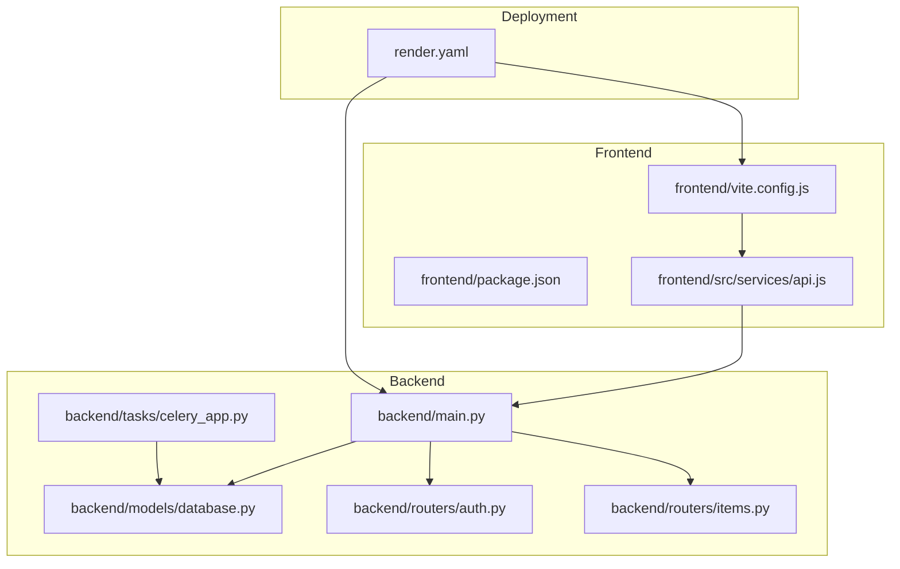
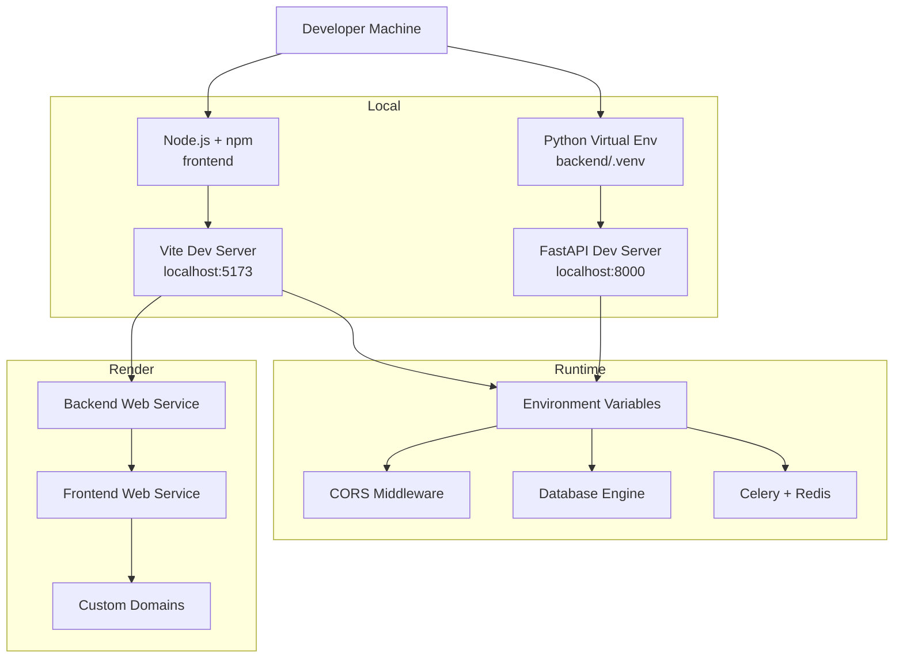
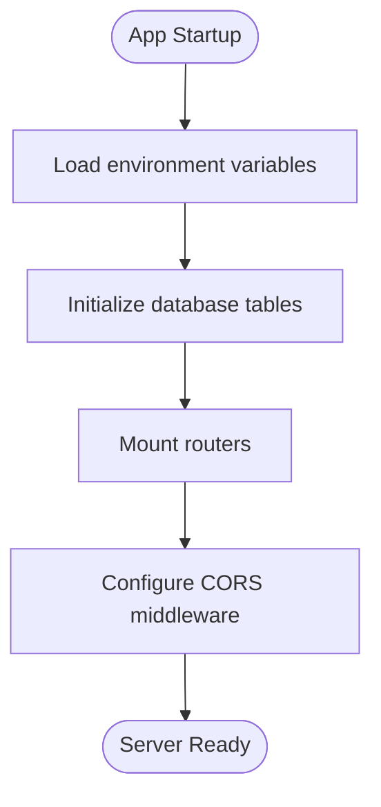
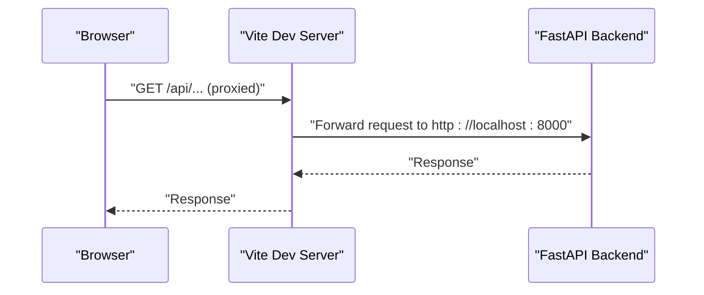
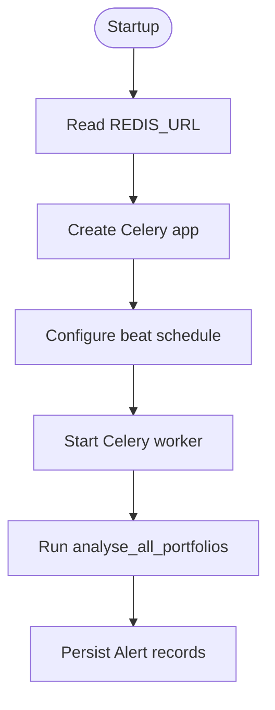
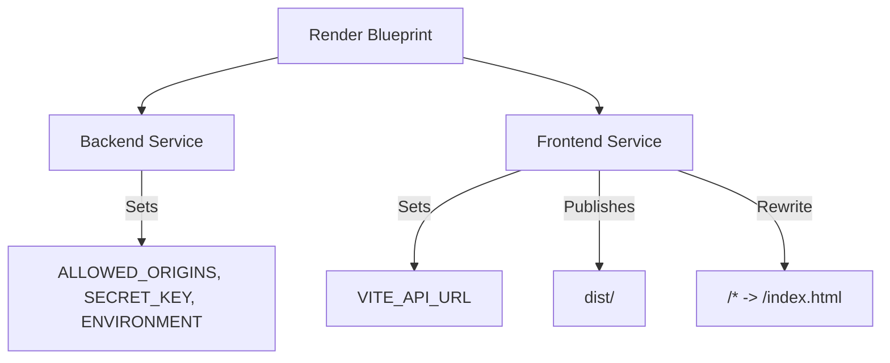
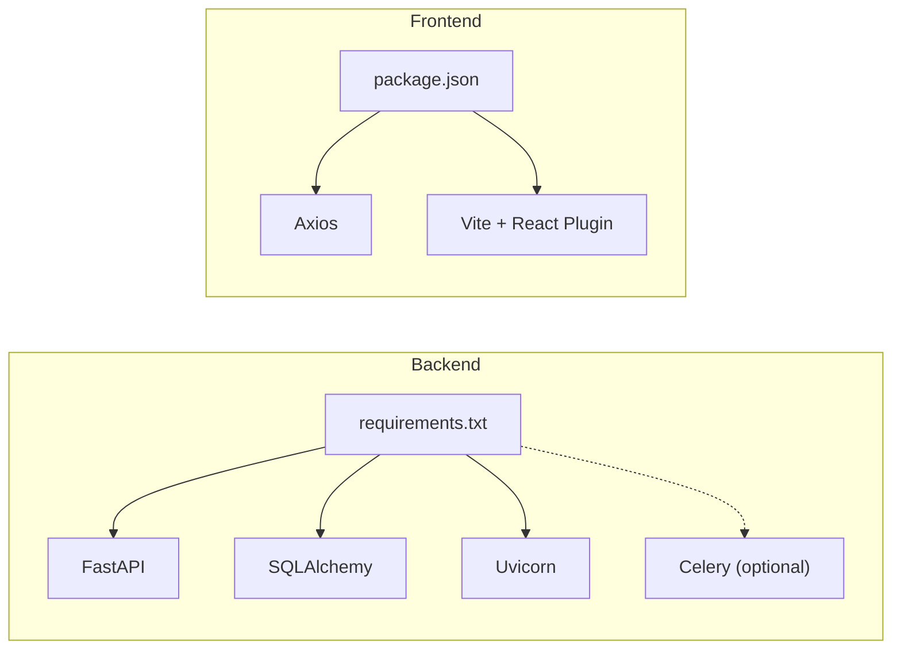

# Environment Setup and Configuration

<cite>
**Referenced Files in This Document**
- [README.md](file://README.md)
- [backend/main.py](file://backend/main.py)
- [backend/models/database.py](file://backend/models/database.py)
- [backend/routers/auth.py](file://backend/routers/auth.py)
- [backend/routers/items.py](file://backend/routers/items.py)
- [backend/tasks/celery_app.py](file://backend/tasks/celery_app.py)
- [frontend/vite.config.js](file://frontend/vite.config.js)
- [frontend/package.json](file://frontend/package.json)
- [frontend/src/services/api.js](file://frontend/src/services/api.js)
- [render.yaml](file://render.yaml)
</cite>

## Table of Contents
1. [Introduction](#introduction)
2. [Project Structure](#project-structure)
3. [Core Components](#core-components)
4. [Architecture Overview](#architecture-overview)
5. [Detailed Component Analysis](#detailed-component-analysis)
6. [Dependency Analysis](#dependency-analysis)
7. [Performance Considerations](#performance-considerations)
8. [Troubleshooting Guide](#troubleshooting-guide)
9. [Conclusion](#conclusion)
10. [Appendices](#appendices)

## Introduction
This document explains how to set up and manage environments for development, staging, and production across the backend (FastAPI) and frontend (React + Vite). It covers environment variables, secrets management, CORS configuration, database initialization, and deployment specifics using Render. Guidance is provided for local development with Python virtual environments and Node.js, plus troubleshooting common configuration pitfalls.

## Project Structure
The repository follows a clear separation of concerns:
- Backend: FastAPI application with routers, SQLAlchemy models, agent orchestration, and Celery task scheduling.
- Frontend: React application built with Vite, configured with a development proxy and environment-driven API base URL.
- Deployment: Render blueprint defines environment variables, regions, health checks, and static site publishing.

**Diagram sources**
- [backend/main.py:1-59](file://backend/main.py#L1-L59)
- [backend/models/database.py:1-42](file://backend/models/database.py#L1-L42)
- [backend/routers/auth.py:1-39](file://backend/routers/auth.py#L1-L39)
- [backend/routers/items.py:1-72](file://backend/routers/items.py#L1-L72)
- [backend/tasks/celery_app.py:1-136](file://backend/tasks/celery_app.py#L1-L136)
- [frontend/vite.config.js:1-23](file://frontend/vite.config.js#L1-L23)
- [frontend/package.json:1-27](file://frontend/package.json#L1-L27)
- [frontend/src/services/api.js:1-35](file://frontend/src/services/api.js#L1-L35)
- [render.yaml:1-48](file://render.yaml#L1-L48)

**Section sources**
- [README.md:1-129](file://README.md#L1-L129)
- [backend/main.py:1-59](file://backend/main.py#L1-L59)
- [frontend/vite.config.js:1-23](file://frontend/vite.config.js#L1-L23)
- [render.yaml:1-48](file://render.yaml#L1-L48)

## Core Components
- Backend environment variables:
  - ALLOWED_ORIGINS: Controls CORS behavior; defaults to localhost and production domains when unspecified.
  - DATABASE_URL: Determines the database backend; defaults to SQLite for zero-config local development.
  - SECRET_KEY: Used by the backend for signing tokens and security-sensitive operations.
  - REDIS_URL: Required for Celery task scheduling and background jobs.
  - ENVIRONMENT: Indicates deployment environment (e.g., production).
- Frontend environment variables:
  - VITE_API_URL: Overrides the Axios base URL for API requests in the browser.
- Render deployment:
  - Backend service sets ALLOWED_ORIGINS, SECRET_KEY, and ENVIRONMENT.
  - Frontend service sets VITE_API_URL and publishes the SPA with a fallback route.

**Section sources**
- [backend/main.py:18-30](file://backend/main.py#L18-L30)
- [backend/models/database.py:15-20](file://backend/models/database.py#L15-L20)
- [backend/tasks/celery_app.py:22-29](file://backend/tasks/celery_app.py#L22-L29)
- [frontend/src/services/api.js:3-9](file://frontend/src/services/api.js#L3-L9)
- [render.yaml:15-22](file://render.yaml#L15-L22)
- [render.yaml:40-42](file://render.yaml#L40-L42)

## Architecture Overview
The environment configuration spans three layers:
- Local development: Python virtual environment, Node.js, and Vite proxy.
- Runtime configuration: Environment variables loaded by the backend and frontend.
- Deployment: Render-managed environment variables and routing.

**Diagram sources**
- [README.md:29-75](file://README.md#L29-L75)
- [backend/main.py:18-30](file://backend/main.py#L18-L30)
- [backend/models/database.py:15-20](file://backend/models/database.py#L15-L20)
- [backend/tasks/celery_app.py:22-29](file://backend/tasks/celery_app.py#L22-L29)
- [frontend/vite.config.js:7-17](file://frontend/vite.config.js#L7-L17)
- [render.yaml:4-43](file://render.yaml#L4-L43)

## Detailed Component Analysis

### Backend Environment and CORS
- CORS middleware allows all origins and headers for SSE compatibility. Production deployments should restrict ALLOWED_ORIGINS to trusted domains.
- Database engine selection depends on DATABASE_URL; SQLite is default for local development.
- Startup event initializes database tables.

**Diagram sources**
- [backend/main.py:18-36](file://backend/main.py#L18-L36)

**Section sources**
- [backend/main.py:18-36](file://backend/main.py#L18-L36)
- [backend/models/database.py:38-42](file://backend/models/database.py#L38-L42)

### Frontend Environment and API Base URL
- Vite proxies API calls from localhost:5173 to localhost:8000 during development.
- The Axios client uses import.meta.env.VITE_API_URL if present; otherwise falls back to a localhost default.
- Build artifacts are emitted to dist; the frontend is published as a static site.

**Diagram sources**
- [frontend/vite.config.js:9-16](file://frontend/vite.config.js#L9-L16)
- [frontend/src/services/api.js:3-9](file://frontend/src/services/api.js#L3-L9)

**Section sources**
- [frontend/vite.config.js:7-22](file://frontend/vite.config.js#L7-L22)
- [frontend/src/services/api.js:1-35](file://frontend/src/services/api.js#L1-L35)
- [frontend/package.json:1-27](file://frontend/package.json#L1-L27)

### Celery and Redis
- Celery uses REDIS_URL for broker and backend; defaults to a local Redis instance.
- Scheduled task runs daily at 08:00 UTC to analyze active portfolios and persist results.

**Diagram sources**
- [backend/tasks/celery_app.py:22-55](file://backend/tasks/celery_app.py#L22-L55)

**Section sources**
- [backend/tasks/celery_app.py:1-136](file://backend/tasks/celery_app.py#L1-L136)

### Render Deployment Configuration
- Backend service:
  - Uses Python runtime, installs requirements, starts with uvicorn, health checks /health, sets ALLOWED_ORIGINS, SECRET_KEY, and ENVIRONMENT.
- Frontend service:
  - Static site build, publishes dist, rewrites all routes to index.html, sets VITE_API_URL, and applies cache-control header.
- Custom domain setup requires adding ishwarambare.online and www.ishwarambare.online in Render and configuring DNS.

**Diagram sources**
- [render.yaml:4-43](file://render.yaml#L4-L43)

**Section sources**
- [render.yaml:1-48](file://render.yaml#L1-L48)

## Dependency Analysis
- Backend dependencies include FastAPI, Uvicorn, SQLAlchemy, and optional Celery/Redis for background tasks.
- Frontend dependencies include React, Vite, and Axios; development uses Vite’s React plugin and proxy.

**Diagram sources**
- [backend/requirements.txt:1-20](file://backend/requirements.txt#L1-L20)
- [frontend/package.json:1-27](file://frontend/package.json#L1-L27)

**Section sources**
- [backend/requirements.txt:1-20](file://backend/requirements.txt#L1-L20)
- [frontend/package.json:1-27](file://frontend/package.json#L1-L27)

## Performance Considerations
- Database choice:
  - SQLite is convenient for local development but not recommended for production concurrency; switch DATABASE_URL to PostgreSQL in staging/production.
- CORS:
  - Restrict ALLOWED_ORIGINS in production to reduce overhead and improve security.
- Static site:
  - Frontend build disables source maps by default; keep this for production to minimize bundle size.

[No sources needed since this section provides general guidance]

## Troubleshooting Guide
Common environment setup issues and resolutions:
- Missing environment files:
  - Backend: copy .env.example to .env and set required variables (DATABASE_URL, SECRET_KEY, ALLOWED_ORIGINS, REDIS_URL, ENVIRONMENT).
  - Frontend: copy .env.example to .env.local and set VITE_API_URL.
- CORS errors:
  - Ensure ALLOWED_ORIGINS includes the frontend origin (localhost:5173 during dev, production domains in Render).
- Database connectivity:
  - Verify DATABASE_URL points to a reachable database; SQLite works out-of-the-box for local development.
- Celery/Redis:
  - If Celery is unavailable, install celery[redis] and redis; ensure REDIS_URL points to a running Redis instance.
- Frontend proxy:
  - Confirm Vite proxy target matches the backend port (default 8000); otherwise adjust vite.config.js accordingly.
- Health checks:
  - Backend health endpoint is /health; Render uses this for service monitoring.

**Section sources**
- [README.md:49-71](file://README.md#L49-L71)
- [backend/main.py:18-30](file://backend/main.py#L18-L30)
- [backend/models/database.py:15-20](file://backend/models/database.py#L15-L20)
- [backend/tasks/celery_app.py:6-11](file://backend/tasks/celery_app.py#L6-L11)
- [frontend/vite.config.js:9-16](file://frontend/vite.config.js#L9-L16)
- [render.yaml:14-14](file://render.yaml#L14-L14)

## Conclusion
Environment configuration hinges on explicit environment variables and careful CORS/DB choices. For local development, use .env and .env.local templates; for production on Render, rely on the blueprint to inject environment variables and publish the frontend as a static site. Keep secrets out of version control, validate environment variables at startup, and tailor CORS and database backends per environment.

[No sources needed since this section summarizes without analyzing specific files]

## Appendices

### Environment Variable Reference
- Backend:
  - ALLOWED_ORIGINS: Comma-separated list of allowed origins; defaults to localhost and production domains.
  - DATABASE_URL: SQLAlchemy connection string; defaults to SQLite for local development.
  - SECRET_KEY: Secret key for signing tokens and security operations.
  - REDIS_URL: Redis broker/backend URL for Celery.
  - ENVIRONMENT: Deployment environment identifier (e.g., production).
- Frontend:
  - VITE_API_URL: API base URL override for the browser.

**Section sources**
- [backend/main.py:18-22](file://backend/main.py#L18-L22)
- [backend/models/database.py:15-15](file://backend/models/database.py#L15-L15)
- [backend/tasks/celery_app.py:22-29](file://backend/tasks/celery_app.py#L22-L29)
- [frontend/src/services/api.js:3-9](file://frontend/src/services/api.js#L3-L9)
- [render.yaml:15-22](file://render.yaml#L15-L22)
- [render.yaml:40-42](file://render.yaml#L40-L42)

### Local Development Checklist
- Backend:
  - Create and activate a Python virtual environment.
  - Install dependencies from requirements.txt.
  - Create .env from .env.example and set variables.
  - Start Uvicorn on port 8000.
- Frontend:
  - Install Node.js and npm.
  - Install dependencies from package.json.
  - Create .env.local from .env.example and set VITE_API_URL.
  - Start Vite dev server on port 5173; confirm proxy forwards /api to backend.

**Section sources**
- [README.md:35-75](file://README.md#L35-L75)