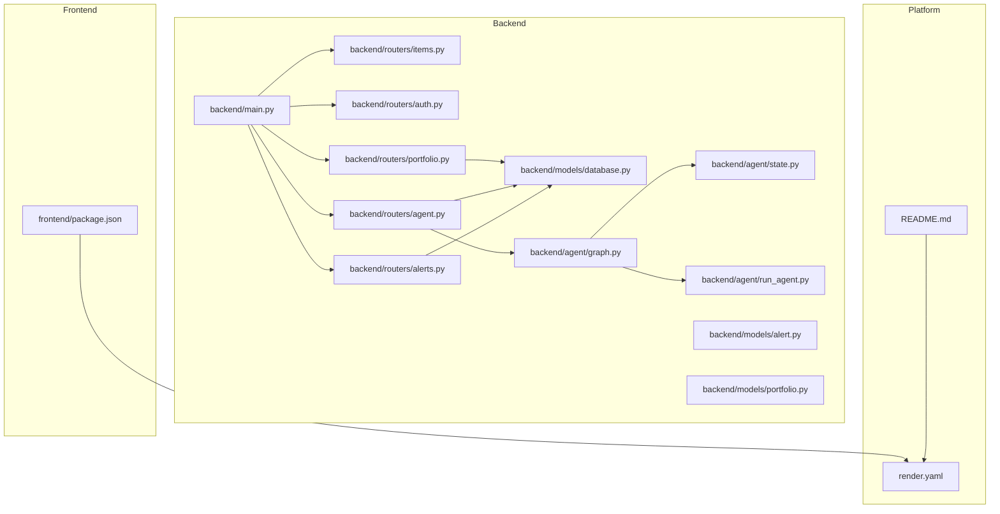
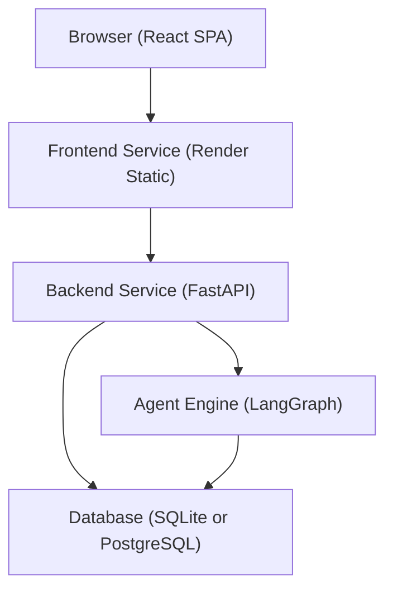
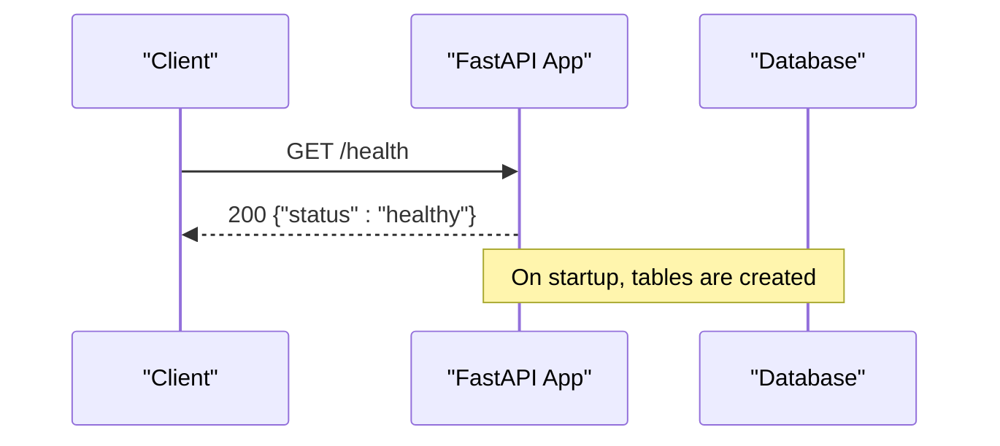
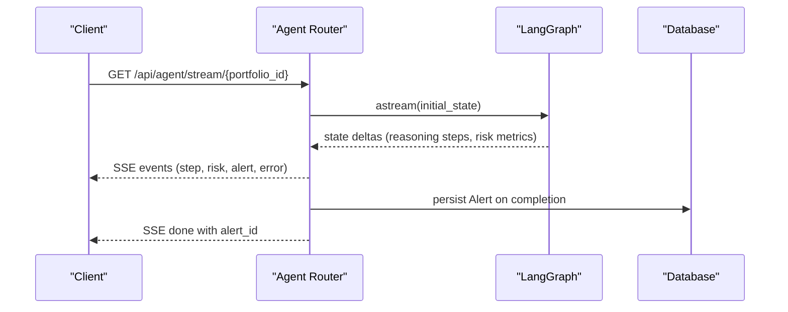
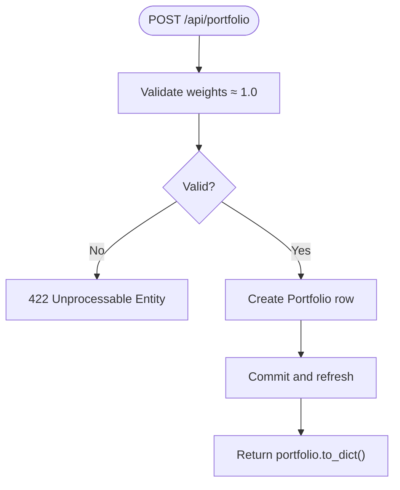
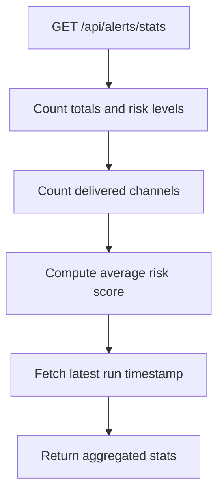
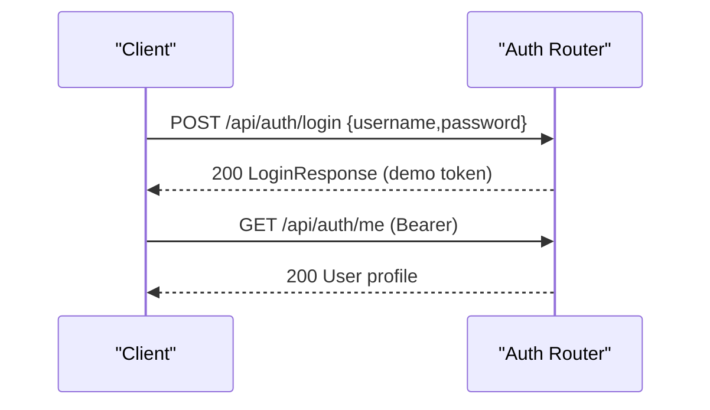
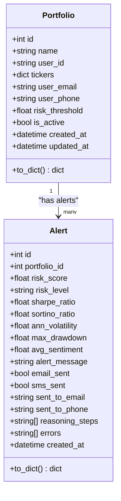
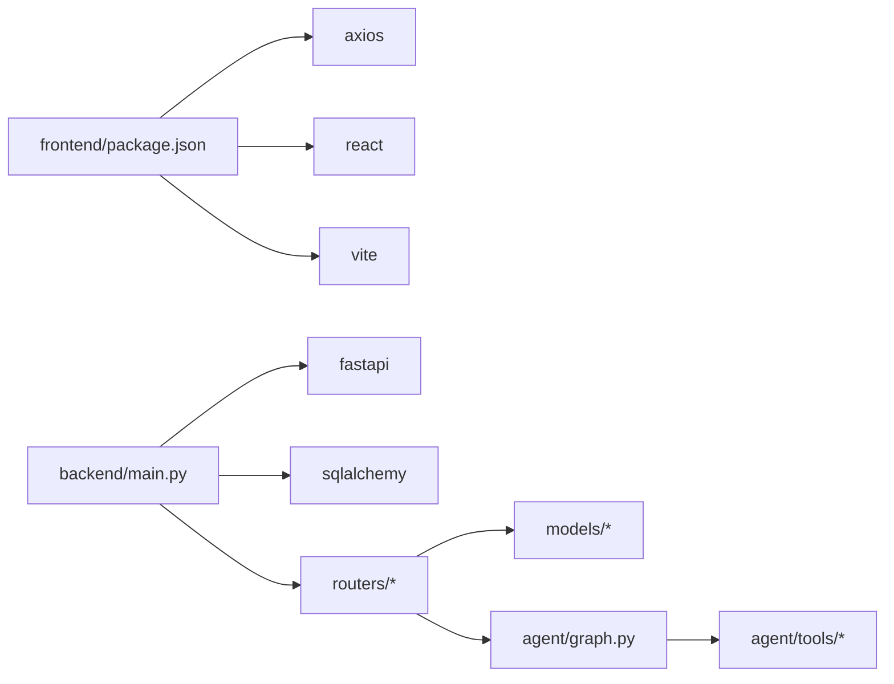

# Operational Procedures and Maintenance

<cite>
**Referenced Files in This Document**
- [README.md](file://README.md)
- [render.yaml](file://render.yaml)
- [backend/main.py](file://backend/main.py)
- [backend/models/database.py](file://backend/models/database.py)
- [backend/routers/items.py](file://backend/routers/items.py)
- [backend/routers/auth.py](file://backend/routers/auth.py)
- [backend/routers/portfolio.py](file://backend/routers/portfolio.py)
- [backend/routers/agent.py](file://backend/routers/agent.py)
- [backend/routers/alerts.py](file://backend/routers/alerts.py)
- [backend/models/alert.py](file://backend/models/alert.py)
- [backend/models/portfolio.py](file://backend/models/portfolio.py)
- [backend/agent/graph.py](file://backend/agent/graph.py)
- [backend/agent/state.py](file://backend/agent/state.py)
- [backend/agent/run_agent.py](file://backend/agent/run_agent.py)
- [frontend/package.json](file://frontend/package.json)
</cite>

## Table of Contents
1. [Introduction](#introduction)
2. [Project Structure](#project-structure)
3. [Core Components](#core-components)
4. [Architecture Overview](#architecture-overview)
5. [Detailed Component Analysis](#detailed-component-analysis)
6. [Dependency Analysis](#dependency-analysis)
7. [Performance Considerations](#performance-considerations)
8. [Troubleshooting Guide](#troubleshooting-guide)
9. [Backup and Disaster Recovery](#backup-and-disaster-recovery)
10. [Capacity Planning](#capacity-planning)
11. [Security Maintenance](#security-maintenance)
12. [Operational Runbooks](#operational-runbooks)
13. [Conclusion](#conclusion)

## Introduction
This document provides comprehensive operational procedures for maintaining and operating the ishwarambare-app platform. It covers routine maintenance tasks, update and deployment procedures, monitoring and alerting, incident response, backup and disaster recovery, capacity planning, security maintenance, and operational runbooks. The platform consists of a FastAPI backend and a React frontend deployed on Render with a health check endpoint and SQLite by default, with the option to use PostgreSQL in production.

## Project Structure
The repository is organized into:
- backend: FastAPI application, routers, SQLAlchemy models, Celery tasks, and agent logic
- frontend: React application built with Vite
- render.yaml: Render blueprint for automated deployment
- README.md: Project overview, local development, deployment, and API endpoints

**Diagram sources**
- [backend/main.py:1-59](file://backend/main.py#L1-L59)
- [backend/models/database.py:1-42](file://backend/models/database.py#L1-L42)
- [backend/routers/items.py:1-72](file://backend/routers/items.py#L1-L72)
- [backend/routers/auth.py:1-39](file://backend/routers/auth.py#L1-L39)
- [backend/routers/portfolio.py:1-124](file://backend/routers/portfolio.py#L1-L124)
- [backend/routers/agent.py:1-243](file://backend/routers/agent.py#L1-L243)
- [backend/routers/alerts.py:1-84](file://backend/routers/alerts.py#L1-L84)
- [backend/models/alert.py:1-77](file://backend/models/alert.py#L1-L77)
- [backend/models/portfolio.py:1-63](file://backend/models/portfolio.py#L1-L63)
- [backend/agent/graph.py:1-243](file://backend/agent/graph.py#L1-L243)
- [backend/agent/state.py:1-58](file://backend/agent/state.py#L1-L58)
- [backend/agent/run_agent.py:1-93](file://backend/agent/run_agent.py#L1-L93)
- [frontend/package.json:1-27](file://frontend/package.json#L1-L27)
- [render.yaml:1-48](file://render.yaml#L1-L48)
- [README.md:1-129](file://README.md#L1-L129)

**Section sources**
- [README.md:1-129](file://README.md#L1-L129)
- [render.yaml:1-48](file://render.yaml#L1-L48)

## Core Components
- Backend service (FastAPI)
  - Health check endpoint at /health
  - CORS middleware configured for SSE compatibility
  - Database initialization on startup
  - Routers for items, auth, portfolio, agent, alerts
- Database
  - SQLAlchemy engine with SQLite default and optional PostgreSQL via DATABASE_URL
  - Session factory and dependency for requests
  - Table creation on startup
- Agent and Graph
  - LangGraph StateGraph with nodes for fetching news, getting prices, calculating risk, sending alerts, and logging
  - SSE streaming endpoint for live agent execution
  - Synchronous run endpoint returning a JSON summary
- Frontend
  - React application built with Vite
  - Environment variable for API base URL
- Deployment
  - Render blueprint defines two services (backend and frontend), health checks, regions, and environment variables

**Section sources**
- [backend/main.py:1-59](file://backend/main.py#L1-L59)
- [backend/models/database.py:1-42](file://backend/models/database.py#L1-L42)
- [backend/routers/agent.py:1-243](file://backend/routers/agent.py#L1-L243)
- [backend/agent/graph.py:1-243](file://backend/agent/graph.py#L1-L243)
- [frontend/package.json:1-27](file://frontend/package.json#L1-L27)
- [render.yaml:1-48](file://render.yaml#L1-L48)

## Architecture Overview
The system follows a standard web application architecture:
- Frontend (React SPA) communicates with the backend via HTTPS
- Backend exposes REST endpoints and SSE streaming
- Database persists portfolios and alerts
- Agent orchestrates risk analysis and optional alert dispatch

**Diagram sources**
- [render.yaml:24-43](file://render.yaml#L24-L43)
- [backend/main.py:1-59](file://backend/main.py#L1-L59)
- [backend/models/database.py:1-42](file://backend/models/database.py#L1-L42)
- [backend/agent/graph.py:1-243](file://backend/agent/graph.py#L1-L243)

## Detailed Component Analysis

### Backend Service and Health Monitoring
- Health check endpoint: GET /health
- Startup behavior: initializes database tables
- CORS: configured for SSE compatibility
- Routers: items, auth, portfolio, agent, alerts

**Diagram sources**
- [backend/main.py:56-59](file://backend/main.py#L56-L59)
- [backend/models/database.py:38-42](file://backend/models/database.py#L38-L42)

**Section sources**
- [backend/main.py:1-59](file://backend/main.py#L1-L59)
- [backend/models/database.py:1-42](file://backend/models/database.py#L1-L42)

### Agent Execution and Streaming
- SSE endpoint: GET /api/agent/stream/{portfolio_id}
- Synchronous run: POST /api/agent/run/{portfolio_id}
- Status endpoint: GET /api/agent/status
- Streaming events include step updates, risk metrics, alert decisions, and errors
- Final result persisted to Alert model

**Diagram sources**
- [backend/routers/agent.py:39-168](file://backend/routers/agent.py#L39-L168)
- [backend/agent/graph.py:162-203](file://backend/agent/graph.py#L162-L203)
- [backend/models/alert.py:1-77](file://backend/models/alert.py#L1-L77)

**Section sources**
- [backend/routers/agent.py:1-243](file://backend/routers/agent.py#L1-L243)
- [backend/agent/graph.py:1-243](file://backend/agent/graph.py#L1-L243)
- [backend/models/alert.py:1-77](file://backend/models/alert.py#L1-L77)

### Portfolio Management Endpoints
- List, create, get, update, delete portfolios
- Weight validation ensures approximate sum to 1.0
- Uses SQLAlchemy ORM and dependency injection for sessions

**Diagram sources**
- [backend/routers/portfolio.py:56-77](file://backend/routers/portfolio.py#L56-L77)

**Section sources**
- [backend/routers/portfolio.py:1-124](file://backend/routers/portfolio.py#L1-L124)
- [backend/models/portfolio.py:1-63](file://backend/models/portfolio.py#L1-L63)

### Alerts History and Metrics
- Read-only endpoints for listing alerts, retrieving details, and portfolio-specific alerts
- Stats endpoint aggregates counts and averages across alerts

**Diagram sources**
- [backend/routers/alerts.py:59-83](file://backend/routers/alerts.py#L59-L83)

**Section sources**
- [backend/routers/alerts.py:1-84](file://backend/routers/alerts.py#L1-L84)
- [backend/models/alert.py:1-77](file://backend/models/alert.py#L1-L77)

### Authentication Stub
- Demo login endpoint returns a bearer token for admin/admin
- Me endpoint returns a stub user profile

**Diagram sources**
- [backend/routers/auth.py:18-38](file://backend/routers/auth.py#L18-L38)

**Section sources**
- [backend/routers/auth.py:1-39](file://backend/routers/auth.py#L1-L39)

### Data Models Overview

**Diagram sources**
- [backend/models/portfolio.py:16-63](file://backend/models/portfolio.py#L16-L63)
- [backend/models/alert.py:14-77](file://backend/models/alert.py#L14-L77)

**Section sources**
- [backend/models/portfolio.py:1-63](file://backend/models/portfolio.py#L1-L63)
- [backend/models/alert.py:1-77](file://backend/models/alert.py#L1-L77)

## Dependency Analysis
- Backend depends on:
  - SQLAlchemy for ORM and sessions
  - FastAPI for routing and middleware
  - LangGraph for agent orchestration
  - Environment variables for configuration (allowed origins, secret key, database URL)
- Frontend depends on:
  - Axios for HTTP requests
  - React ecosystem for UI components
  - Vite for build and dev server
- Deployment:
  - Render blueprint defines services, health checks, environment variables, and routing

**Diagram sources**
- [frontend/package.json:11-25](file://frontend/package.json#L11-L25)
- [backend/main.py:1-16](file://backend/main.py#L1-L16)
- [backend/agent/graph.py:26-34](file://backend/agent/graph.py#L26-L34)

**Section sources**
- [frontend/package.json:1-27](file://frontend/package.json#L1-L27)
- [backend/main.py:1-16](file://backend/main.py#L1-L16)
- [backend/agent/graph.py:1-243](file://backend/agent/graph.py#L1-L243)

## Performance Considerations
- SSE streaming
  - StreamingResponse with appropriate headers for SSE and Nginx buffering
  - Client disconnection detection to stop unnecessary work
- Database
  - SQLite default for simplicity; consider PostgreSQL for production scalability
  - Session lifecycle managed per-request via dependency
- Agent execution
  - Async streaming reduces latency for UI feedback
  - Executor used for DB writes to avoid blocking the async loop
- CORS
  - Allow all origins for SSE compatibility; ensure allowed origins align with deployment domains

[No sources needed since this section provides general guidance]

## Troubleshooting Guide
Common operational issues and resolutions:
- Service outages
  - Verify health check endpoint availability
  - Check Render logs for backend and frontend services
- Database connectivity problems
  - Confirm DATABASE_URL environment variable
  - For SQLite, ensure file permissions and path correctness
  - For PostgreSQL, verify host, port, credentials, and network access
- API rate limiting
  - No explicit rate limiting in the provided code; monitor logs for excessive requests
- SSE connection drops
  - Client disconnection is handled; inspect logs for exceptions during streaming
- Authentication failures
  - Demo credentials are admin/admin; replace with JWT-based authentication

**Section sources**
- [backend/main.py:56-59](file://backend/main.py#L56-L59)
- [backend/models/database.py:15-22](file://backend/models/database.py#L15-L22)
- [backend/routers/agent.py:86-89](file://backend/routers/agent.py#L86-L89)

## Backup and Disaster Recovery
- Database backup strategy
  - SQLite: Back up the database file regularly; schedule automated copies
  - PostgreSQL: Use logical or physical backups; maintain offsite copies
- Data export/import
  - Export portfolios and alerts via existing endpoints or database queries
  - Import by seeding data into the target database
- Service restoration
  - Recreate backend and frontend services on Render using render.yaml
  - Restore database from the latest backup and repoint DATABASE_URL
- Zero-downtime considerations
  - The current Render blueprint uses free plans; plan for scaling or migration to higher tiers for redundancy

**Section sources**
- [backend/models/database.py:1-9](file://backend/models/database.py#L1-L9)
- [render.yaml:1-48](file://render.yaml#L1-L48)

## Capacity Planning
Guidelines for increased concurrent agent executions and user traffic:
- Horizontal scaling
  - Increase Render service plans or migrate to a platform supporting autoscaling
- Database
  - Transition from SQLite to PostgreSQL for concurrency and reliability
  - Optimize queries and add indexes on frequently filtered columns
- Agent throughput
  - Monitor SSE endpoint latency and adjust concurrency limits
  - Consider queueing mechanisms if agent runs become CPU-bound
- Frontend
  - Ensure CDN caching and efficient asset delivery
- Monitoring
  - Track response times, error rates, and resource utilization

[No sources needed since this section provides general guidance]

## Security Maintenance
- Certificate renewal
  - Render manages TLS certificates for custom domains; monitor domain provisioning status
- Dependency updates
  - Regularly update backend and frontend dependencies
  - Review security advisories and apply patches promptly
- Vulnerability assessments
  - Scan dependencies periodically and remediate high/medium severity issues
- Secrets management
  - Store secrets in Render environment variables; rotate SECRET_KEY and other tokens
- Allowed origins
  - Align ALLOWED_ORIGINS with production domains

**Section sources**
- [render.yaml:15-21](file://render.yaml#L15-L21)
- [backend/main.py:19-30](file://backend/main.py#L19-L30)
- [README.md:96-107](file://README.md#L96-L107)

## Operational Runbooks

### Routine Maintenance Tasks
- Database backups
  - Schedule regular backups of the database file or PostgreSQL dump
  - Store encrypted offsite copies
- Log rotation
  - Configure platform log retention policies
  - Archive logs periodically and monitor disk usage
- Performance monitoring
  - Monitor /health endpoint and response times
  - Track database query performance and connection pool usage

**Section sources**
- [backend/main.py:56-59](file://backend/main.py#L56-L59)
- [backend/models/database.py:15-22](file://backend/models/database.py#L15-L22)

### Update Procedures
- Backend updates
  - Commit changes to the backend branch and redeploy via Render
  - Validate /health endpoint post-deployment
- Frontend updates
  - Build and deploy the static site; confirm routing and assets
- Zero-downtime deployment
  - Use Render’s blue/green or rolling deployment features if available
  - Keep both services healthy during rollout

**Section sources**
- [render.yaml:6-13](file://render.yaml#L6-L13)
- [render.yaml:24-31](file://render.yaml#L24-L31)

### Monitoring and Alerting
- Health checks
  - Use GET /health for automated health probes
- Performance metrics
  - Track response times, error rates, and concurrency
- Error tracking
  - Inspect backend logs for exceptions during agent runs and SSE streaming

**Section sources**
- [backend/main.py:56-59](file://backend/main.py#L56-L59)
- [backend/routers/agent.py:123-126](file://backend/routers/agent.py#L123-L126)

### Incident Response Procedures
- Service outage
  - Check Render service status and logs
  - Validate /health and reverse proxy configuration
- Database connectivity
  - Verify DATABASE_URL and credentials
  - Test connectivity from backend container
- API rate limiting
  - Investigate client-side throttling or backend bottlenecks
  - Apply rate-limiting middleware if needed

**Section sources**
- [backend/models/database.py:15-22](file://backend/models/database.py#L15-L22)
- [backend/routers/agent.py:86-89](file://backend/routers/agent.py#L86-L89)

### Administrative Tasks and Escalation
- Administrative tasks
  - Manage environment variables in Render dashboard
  - Rotate secrets and update allowed origins as needed
- Escalation
  - For infrastructure issues, contact Render support
  - For application bugs, review logs and open issues with reproduction steps

**Section sources**
- [render.yaml:15-21](file://render.yaml#L15-L21)
- [README.md:96-107](file://README.md#L96-L107)

## Conclusion
This operational guide consolidates maintenance, deployment, monitoring, and incident response practices for the ishwarambare-app platform. By following the outlined procedures—covering backups, updates, monitoring, and security—you can sustain reliable operation and scale effectively as demand grows.