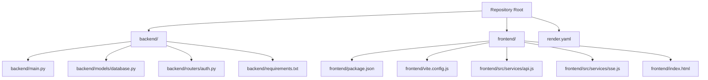
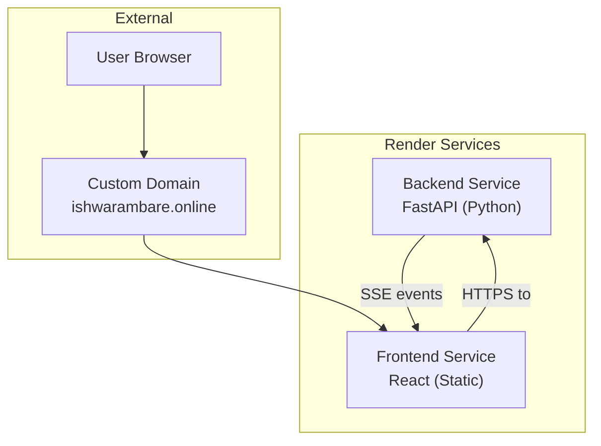
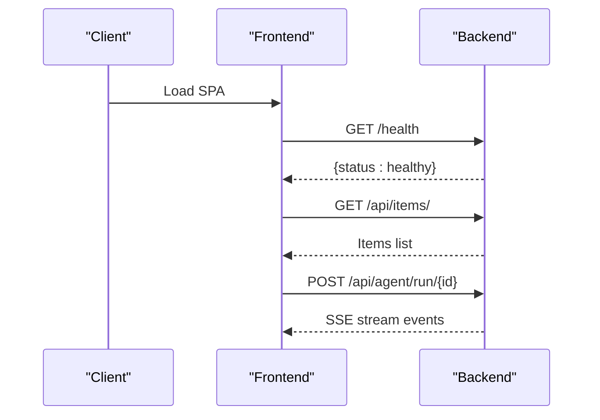
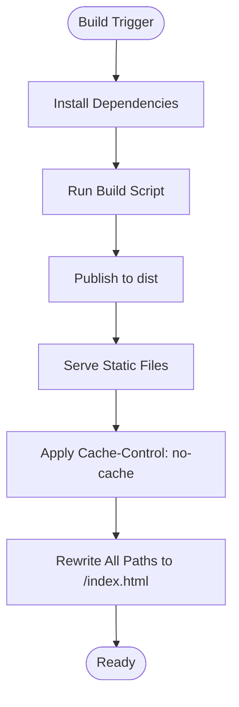
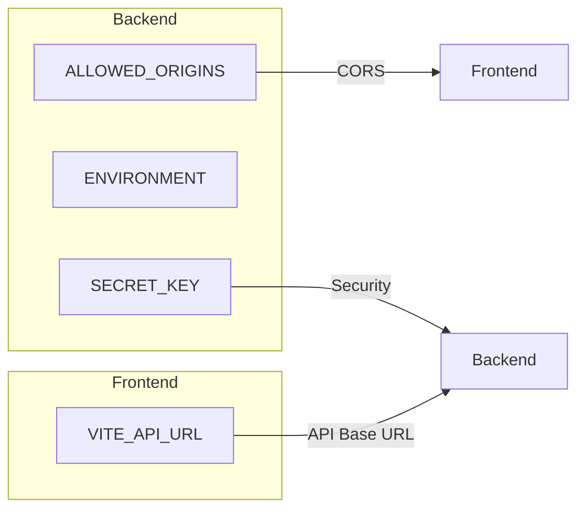
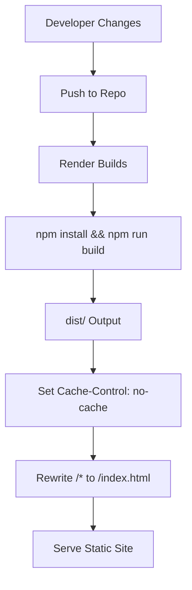
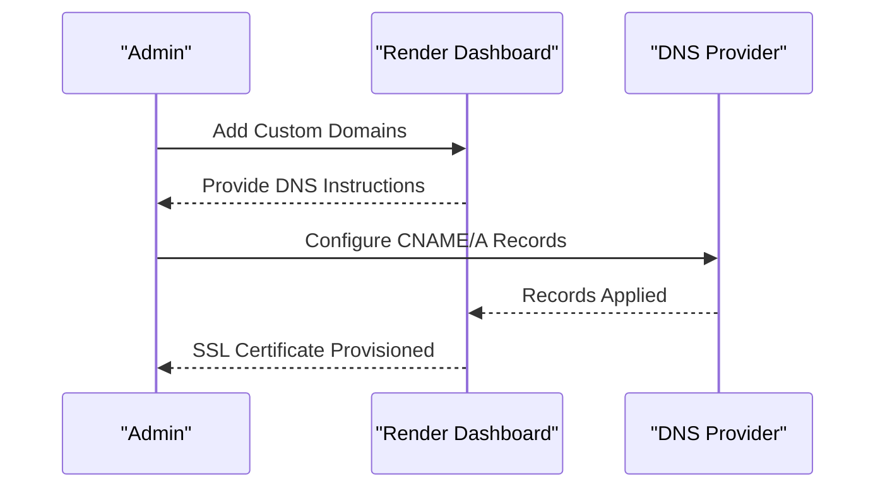
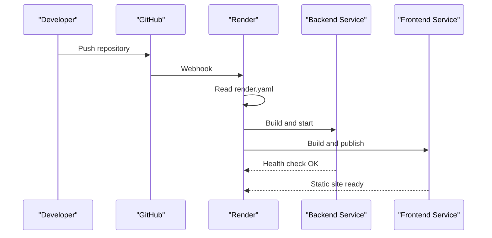
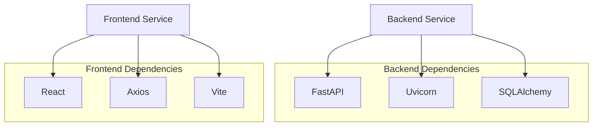

# Render Platform Configuration

<cite>
**Referenced Files in This Document**
- [render.yaml](file://render.yaml)
- [README.md](file://README.md)
- [backend/main.py](file://backend/main.py)
- [backend/models/database.py](file://backend/models/database.py)
- [backend/routers/auth.py](file://backend/routers/auth.py)
- [backend/requirements.txt](file://backend/requirements.txt)
- [frontend/package.json](file://frontend/package.json)
- [frontend/vite.config.js](file://frontend/vite.config.js)
- [frontend/src/services/api.js](file://frontend/src/services/api.js)
- [frontend/src/services/sse.js](file://frontend/src/services/sse.js)
- [frontend/index.html](file://frontend/index.html)
</cite>

## Table of Contents
1. [Introduction](#introduction)
2. [Project Structure](#project-structure)
3. [Core Components](#core-components)
4. [Architecture Overview](#architecture-overview)
5. [Detailed Component Analysis](#detailed-component-analysis)
6. [Dependency Analysis](#dependency-analysis)
7. [Performance Considerations](#performance-considerations)
8. [Troubleshooting Guide](#troubleshooting-guide)
9. [Conclusion](#conclusion)
10. [Appendices](#appendices)

## Introduction
This document explains the Render platform configuration for the ishwarambare-app dual-service architecture. It covers the Render blueprint specification, service definitions, runtime configurations, region selection, resource plans, build and startup processes, health checks, environment variable management, static site publishing for the React frontend, custom domain setup, and deployment workflows. The application consists of:
- A FastAPI backend service (Python) deployed as a web service
- A React frontend (static site) deployed as a static web service

## Project Structure
The repository follows a dual-service layout with distinct backend and frontend directories. The Render blueprint defines two services: one for the FastAPI backend and another for the React frontend. Both services share the same repository and are orchestrated by the Render blueprint.

**Diagram sources**
- [render.yaml:1-48](file://render.yaml#L1-L48)
- [backend/main.py:1-59](file://backend/main.py#L1-L59)
- [backend/models/database.py:1-42](file://backend/models/database.py#L1-L42)
- [backend/routers/auth.py:1-39](file://backend/routers/auth.py#L1-L39)
- [backend/requirements.txt:1-20](file://backend/requirements.txt#L1-L20)
- [frontend/package.json:1-27](file://frontend/package.json#L1-L27)
- [frontend/vite.config.js:1-23](file://frontend/vite.config.js#L1-L23)
- [frontend/src/services/api.js:1-35](file://frontend/src/services/api.js#L1-L35)
- [frontend/src/services/sse.js:1-62](file://frontend/src/services/sse.js#L1-L62)
- [frontend/index.html:1-18](file://frontend/index.html#L1-L18)

**Section sources**
- [render.yaml:1-48](file://render.yaml#L1-L48)
- [README.md:1-129](file://README.md#L1-L129)

## Core Components
This section documents the Render blueprint services and their configuration.

- Backend service (FastAPI)
  - Runtime: Python
  - Region: Singapore (optimized for India)
  - Plan: Free
  - Root directory: backend
  - Build command: pip install -r requirements.txt
  - Startup command: uvicorn main:app --host 0.0.0.0 --port $PORT
  - Health check path: /health
  - Environment variables:
    - ALLOWED_ORIGINS: https://ishwarambare.online,https://www.ishwarambare.online
    - ENVIRONMENT: production
    - SECRET_KEY: generated by Render
  - CORS middleware configured to allow all origins for SSE compatibility

- Frontend service (React static site)
  - Runtime: Static
  - Region: Singapore
  - Plan: Free
  - Root directory: frontend
  - Build command: npm install && npm run build
  - Static publish path: dist
  - Headers:
    - Cache-Control: no-cache for all paths
  - Routes:
    - Rewrite all paths to /index.html for SPA fallback
  - Environment variables:
    - VITE_API_URL: https://ishwarambare-api.onrender.com

**Section sources**
- [render.yaml:4-43](file://render.yaml#L4-L43)
- [backend/main.py:18-30](file://backend/main.py#L18-L30)

## Architecture Overview
The Render deployment orchestrates two independent services:
- Backend service exposes REST endpoints and SSE streams for real-time updates.
- Frontend service serves a static React application that communicates with the backend via HTTPS.

**Diagram sources**
- [render.yaml:4-43](file://render.yaml#L4-L43)
- [frontend/src/services/api.js:3](file://frontend/src/services/api.js#L3)
- [frontend/src/services/sse.js:19](file://frontend/src/services/sse.js#L19)

## Detailed Component Analysis

### Backend Service (FastAPI)
The backend service is defined as a Python web service with a health check endpoint and CORS configuration. It initializes database tables on startup and exposes API endpoints for items, authentication, portfolio, agent, and alerts.

Key characteristics:
- Health check endpoint: /health
- CORS middleware allows all origins for SSE compatibility
- Startup event creates database tables
- Exposes multiple routers under /api/* prefixes

**Diagram sources**
- [backend/main.py:56-58](file://backend/main.py#L56-L58)
- [frontend/src/services/api.js:12-32](file://frontend/src/services/api.js#L12-L32)
- [frontend/src/services/sse.js:21-44](file://frontend/src/services/sse.js#L21-L44)

**Section sources**
- [render.yaml:6-22](file://render.yaml#L6-L22)
- [backend/main.py:12-58](file://backend/main.py#L12-L58)
- [backend/models/database.py:38-42](file://backend/models/database.py#L38-L42)
- [backend/routers/auth.py:18-38](file://backend/routers/auth.py#L18-L38)

### Frontend Service (React Static Site)
The frontend service builds a static React application and publishes it to the dist directory. It sets cache-control headers and rewrites all routes to index.html for SPA routing.

Key characteristics:
- Build pipeline: npm install && npm run build
- Publish path: dist
- Cache-control header: no-cache for all paths
- SPA rewrite: /* -> /index.html
- API base URL sourced from VITE_API_URL environment variable

**Diagram sources**
- [render.yaml:24-43](file://render.yaml#L24-L43)
- [frontend/package.json:6-10](file://frontend/package.json#L6-L10)
- [frontend/vite.config.js:18-22](file://frontend/vite.config.js#L18-L22)

**Section sources**
- [render.yaml:24-43](file://render.yaml#L24-L43)
- [frontend/package.json:1-27](file://frontend/package.json#L1-L27)
- [frontend/vite.config.js:1-23](file://frontend/vite.config.js#L1-L23)
- [frontend/src/services/api.js:3](file://frontend/src/services/api.js#L3)

### Environment Variable Management
Both services rely on environment variables managed by Render:

Backend variables:
- ALLOWED_ORIGINS: Controls CORS origins for the backend
- ENVIRONMENT: Production flag
- SECRET_KEY: Generated securely by Render

Frontend variables:
- VITE_API_URL: Base URL for API requests from the frontend

**Diagram sources**
- [render.yaml:15-21](file://render.yaml#L15-L21)
- [render.yaml:40-42](file://render.yaml#L40-L42)
- [backend/main.py:19-22](file://backend/main.py#L19-L22)
- [frontend/src/services/api.js:3](file://frontend/src/services/api.js#L3)

**Section sources**
- [render.yaml:15-21](file://render.yaml#L15-L21)
- [render.yaml:40-42](file://render.yaml#L40-L42)
- [backend/main.py:19-22](file://backend/main.py#L19-L22)
- [frontend/src/services/api.js:3](file://frontend/src/services/api.js#L3)

### Static Site Publishing Configuration
The React frontend is published as a static site with:
- Cache-control header set to no-cache for all paths
- SPA routing rewrite to index.html for client-side navigation
- Build output directed to dist

**Diagram sources**
- [render.yaml:32-39](file://render.yaml#L32-L39)
- [frontend/vite.config.js:18-22](file://frontend/vite.config.js#L18-L22)

**Section sources**
- [render.yaml:30-39](file://render.yaml#L30-L39)
- [frontend/vite.config.js:18-22](file://frontend/vite.config.js#L18-L22)

### Custom Domain Setup
To configure a custom domain:
1. Add ishwarambare.online and www.ishwarambare.online in the frontend service settings
2. Configure DNS records:
   - CNAME for www pointing to ishwarambare-frontend.onrender.com
   - A record for @ pointing to Render’s IP shown in the dashboard
3. Wait for SSL certificate provisioning (~5 minutes)

**Diagram sources**
- [render.yaml:44-47](file://render.yaml#L44-L47)
- [README.md:96-107](file://README.md#L96-L107)

**Section sources**
- [render.yaml:44-47](file://render.yaml#L44-L47)
- [README.md:96-107](file://README.md#L96-L107)

### Deployment Triggers and Workflows
Automatic deployment workflow:
1. Push repository to GitHub
2. Navigate to Render → New → Blueprint
3. Connect GitHub repository
4. Render reads render.yaml and provisions both services

Manual environment variable setup (alternative):
- Backend: ALLOWED_ORIGINS, SECRET_KEY
- Frontend: VITE_API_URL

**Diagram sources**
- [README.md:78-93](file://README.md#L78-L93)
- [render.yaml:4-43](file://render.yaml#L4-L43)

**Section sources**
- [README.md:78-93](file://README.md#L78-L93)
- [render.yaml:4-43](file://render.yaml#L4-L43)

### Service Scaling Considerations
- Both services are configured with the free plan
- No explicit scaling policies are defined in the blueprint
- Consider upgrading to paid plans for production traffic and reliability SLAs

[No sources needed since this section provides general guidance]

## Dependency Analysis
The backend depends on FastAPI, Uvicorn, and SQLAlchemy for ORM. The frontend depends on React, Axios, and Vite for development and build.

**Diagram sources**
- [backend/requirements.txt:1-20](file://backend/requirements.txt#L1-L20)
- [frontend/package.json:11-25](file://frontend/package.json#L11-L25)

**Section sources**
- [backend/requirements.txt:1-20](file://backend/requirements.txt#L1-L20)
- [frontend/package.json:1-27](file://frontend/package.json#L1-L27)

## Performance Considerations
- CORS configuration allows all origins to support SSE streaming; ensure this remains scoped appropriately for production.
- Cache-control header is set to no-cache for the frontend; consider enabling caching for static assets in production.
- Health check endpoint ensures Render can monitor service availability.
- Database initialization occurs on startup; ensure database URL is configured for production environments.

[No sources needed since this section provides general guidance]

## Troubleshooting Guide
Common issues and resolutions:
- CORS errors: Verify ALLOWED_ORIGINS includes the frontend origin.
- API connectivity: Confirm VITE_API_URL points to the backend service URL.
- Health check failures: Ensure /health endpoint is reachable and returns a healthy status.
- SPA routing: Confirm rewrite rules are enabled to serve index.html for all routes.
- SSL certificates: Allow time for Render to provision certificates after adding custom domains.

**Section sources**
- [backend/main.py:19-22](file://backend/main.py#L19-L22)
- [frontend/src/services/api.js:3](file://frontend/src/services/api.js#L3)
- [render.yaml:14](file://render.yaml#L14)
- [render.yaml:37-39](file://render.yaml#L37-L39)
- [README.md:107](file://README.md#L107)

## Conclusion
The Render blueprint defines a clean dual-service architecture with a FastAPI backend and a React static frontend. The configuration emphasizes simplicity with shared regions and free plans, while providing essential elements for CORS, health checks, static publishing, and SPA routing. Custom domain setup and environment variable management are straightforward through Render’s dashboard and the blueprint.

[No sources needed since this section summarizes without analyzing specific files]

## Appendices

### API Endpoints Reference
- GET /health: Health check
- GET /api/items/: List all items
- GET /api/items/{id}: Get item by ID
- POST /api/items/: Create item
- DELETE /api/items/{id}: Delete item
- POST /api/auth/login: Login
- GET /api/auth/me: Current user

**Section sources**
- [README.md:111-123](file://README.md#L111-L123)
- [backend/main.py:56-58](file://backend/main.py#L56-L58)