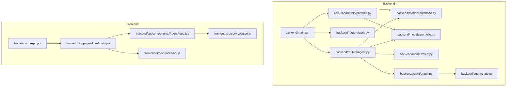
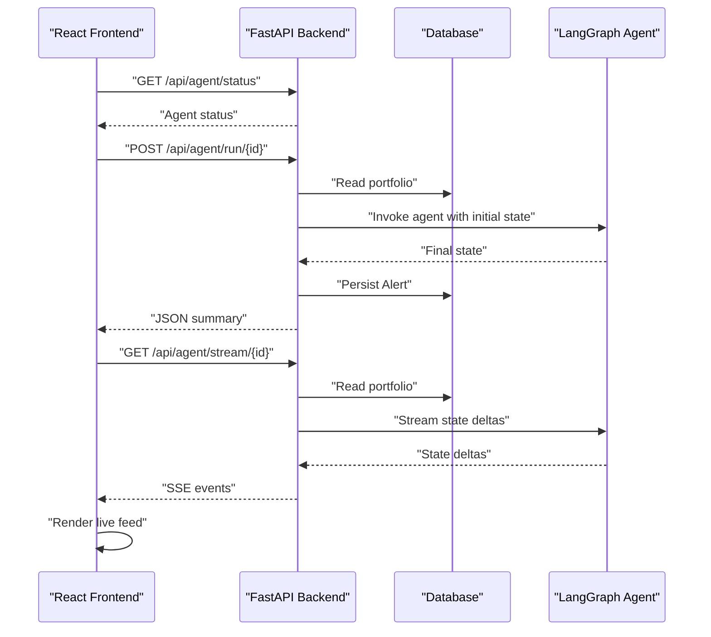
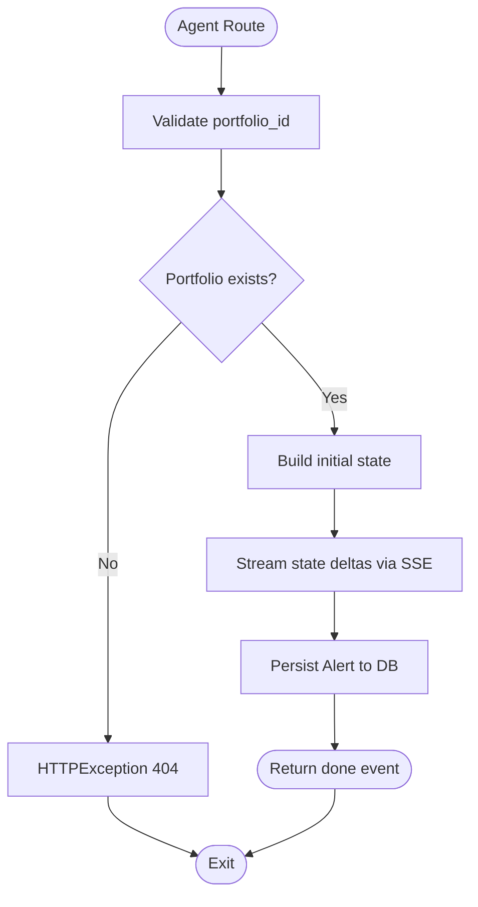
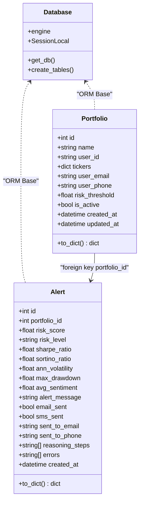
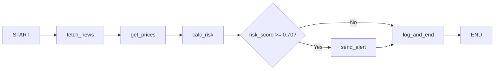
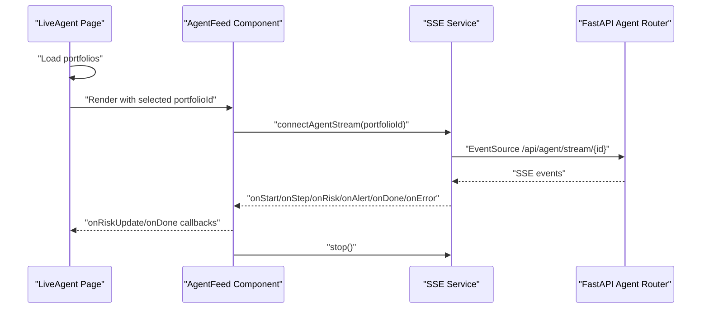
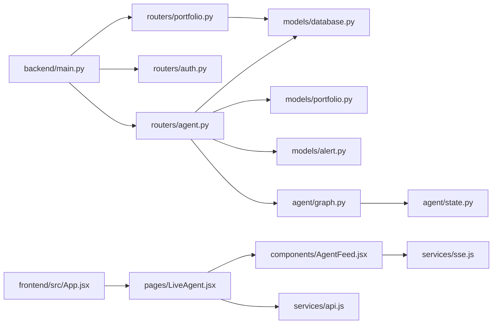

# Coding Standards and Conventions

<cite>
**Referenced Files in This Document**
- [backend/main.py](file://backend/main.py)
- [backend/routers/agent.py](file://backend/routers/agent.py)
- [backend/routers/auth.py](file://backend/routers/auth.py)
- [backend/routers/portfolio.py](file://backend/routers/portfolio.py)
- [backend/models/database.py](file://backend/models/database.py)
- [backend/models/portfolio.py](file://backend/models/portfolio.py)
- [backend/models/alert.py](file://backend/models/alert.py)
- [backend/agent/graph.py](file://backend/agent/graph.py)
- [backend/agent/state.py](file://backend/agent/state.py)
- [frontend/src/App.jsx](file://frontend/src/App.jsx)
- [frontend/src/pages/LiveAgent.jsx](file://frontend/src/pages/LiveAgent.jsx)
- [frontend/src/components/AgentFeed.jsx](file://frontend/src/components/AgentFeed.jsx)
- [frontend/src/services/api.js](file://frontend/src/services/api.js)
- [frontend/src/services/sse.js](file://frontend/src/services/sse.js)
- [frontend/package.json](file://frontend/package.json)
</cite>

## Table of Contents
1. [Introduction](#introduction)
2. [Project Structure](#project-structure)
3. [Core Components](#core-components)
4. [Architecture Overview](#architecture-overview)
5. [Detailed Component Analysis](#detailed-component-analysis)
6. [Dependency Analysis](#dependency-analysis)
7. [Performance Considerations](#performance-considerations)
8. [Troubleshooting Guide](#troubleshooting-guide)
9. [Conclusion](#conclusion)
10. [Appendices](#appendices)

## Introduction
This document defines the coding standards and conventions for the ishwarambare-app project. It consolidates backend Python and FastAPI practices, frontend JavaScript/React conventions, file organization, import ordering, formatting, comments, documentation, error handling, logging, and security practices. The goal is to ensure consistency, readability, maintainability, and safety across the codebase.

## Project Structure
The project follows a clear separation between backend and frontend:
- Backend: FastAPI application with routers, models, agent graph, and Celery tasks.
- Frontend: React SPA with components, pages, services, and assets.

**Diagram sources**
- [backend/main.py:1-59](file://backend/main.py#L1-L59)
- [backend/routers/agent.py:1-243](file://backend/routers/agent.py#L1-L243)
- [backend/routers/auth.py:1-39](file://backend/routers/auth.py#L1-L39)
- [backend/routers/portfolio.py:1-124](file://backend/routers/portfolio.py#L1-L124)
- [backend/models/database.py:1-42](file://backend/models/database.py#L1-L42)
- [backend/models/portfolio.py:1-63](file://backend/models/portfolio.py#L1-L63)
- [backend/models/alert.py:1-77](file://backend/models/alert.py#L1-L77)
- [backend/agent/graph.py:1-243](file://backend/agent/graph.py#L1-L243)
- [backend/agent/state.py:1-58](file://backend/agent/state.py#L1-L58)
- [frontend/src/App.jsx:1-21](file://frontend/src/App.jsx#L1-L21)
- [frontend/src/pages/LiveAgent.jsx:1-95](file://frontend/src/pages/LiveAgent.jsx#L1-L95)
- [frontend/src/components/AgentFeed.jsx:1-175](file://frontend/src/components/AgentFeed.jsx#L1-L175)
- [frontend/src/services/api.js:1-35](file://frontend/src/services/api.js#L1-L35)
- [frontend/src/services/sse.js:1-63](file://frontend/src/services/sse.js#L1-L63)

**Section sources**
- [backend/main.py:1-59](file://backend/main.py#L1-L59)
- [frontend/src/App.jsx:1-21](file://frontend/src/App.jsx#L1-L21)

## Core Components
This section outlines the foundational standards for both backend and frontend.

- Python Backend Standards
  - PEP 8 compliance: Use 4 spaces for indentation, limit lines to 79–100 characters, use blank lines sparingly, and separate top-level functions and classes with two blank lines.
  - Naming conventions:
    - Modules: lowercase_with_underscores.py
    - Classes: PascalCase
    - Functions and variables: snake_case
    - Constants: UPPERCASE
    - Protected/private: _leading_underscore
  - Type annotations: Prefer explicit types for parameters, return values, and attributes. Use typing generics and TypedDict for structured state.
  - Imports: Standard library first, third-party second, local application last; group imports per section and separate with blank lines.
  - Logging: Use the standard logging module with appropriate levels (info, warning, error). Log exceptions with context and avoid logging sensitive data.
  - Error handling: Raise HTTPException with appropriate status codes and details; handle database and external service errors gracefully.
  - Security: Environment variables for secrets and configuration; restrict CORS appropriately; avoid exposing internal details in responses.
  - Documentation: Module docstrings, function/class docstrings, and inline comments for complex logic.

- FastAPI Conventions
  - Routers: Define APIRouter instances per feature module; prefix routes and tag them for OpenAPI grouping.
  - Dependencies: Use Depends(get_db) for SQLAlchemy sessions; ensure sessions are closed in finally blocks.
  - Type hints: Pydantic models for request/response schemas; annotate route handlers with types.
  - SSE: Use StreamingResponse with proper headers; emit structured events; handle client disconnects.
  - Health checks: Provide lightweight endpoints for readiness/liveness.

- JavaScript/React Frontend Standards
  - ES6+ syntax: Use const/let, arrow functions, destructuring, template literals, and modules.
  - Component naming: PascalCase for component files and exports; functional components with hooks.
  - Props: Use camelCase; validate shapes with PropTypes or TypeScript if adopted.
  - State management: Prefer React hooks (useState, useEffect); keep global state minimal.
  - Services: Encapsulate API calls in dedicated modules; centralize base URLs and interceptors.
  - Styling: CSS-in-JS or styled components are acceptable; otherwise, scoped CSS modules or BEM-like naming.
  - Comments: Inline comments for complex logic; JSDoc-style comments for exported functions/components.

**Section sources**
- [backend/main.py:12-59](file://backend/main.py#L12-L59)
- [backend/routers/agent.py:17-27](file://backend/routers/agent.py#L17-L27)
- [backend/routers/portfolio.py:27-46](file://backend/routers/portfolio.py#L27-L46)
- [backend/models/database.py:29-42](file://backend/models/database.py#L29-L42)
- [backend/agent/graph.py:24-36](file://backend/agent/graph.py#L24-L36)
- [backend/agent/state.py:28-58](file://backend/agent/state.py#L28-L58)
- [frontend/src/App.jsx:1-21](file://frontend/src/App.jsx#L1-L21)
- [frontend/src/services/api.js:1-35](file://frontend/src/services/api.js#L1-L35)
- [frontend/src/services/sse.js:1-63](file://frontend/src/services/sse.js#L1-L63)

## Architecture Overview
The system integrates a FastAPI backend with a React frontend. The backend exposes REST endpoints and SSE for live agent reasoning, while the frontend consumes APIs and SSE to render real-time updates.

**Diagram sources**
- [backend/routers/agent.py:186-242](file://backend/routers/agent.py#L186-L242)
- [backend/models/database.py:29-42](file://backend/models/database.py#L29-L42)
- [backend/agent/graph.py:202-243](file://backend/agent/graph.py#L202-L243)
- [frontend/src/services/sse.js:21-62](file://frontend/src/services/sse.js#L21-L62)

## Detailed Component Analysis

### Backend: FastAPI Application and Routers
- Application initialization and middleware:
  - Configure CORS with allow-all headers for SSE compatibility; adjust origins in production.
  - Startup event to initialize database tables.
  - Centralized router registration with prefixes and tags.
- Agent router:
  - SSE endpoint streams structured events: start, step, risk, alert, done, error.
  - Synchronous run endpoint computes final state and persists alert.
  - Uses dependency injection for database sessions and logging.
- Portfolio router:
  - CRUD endpoints with Pydantic validation and weight normalization.
  - Proper HTTP status codes and error messages.
- Auth router:
  - Demo login returning a placeholder token; includes stub user info endpoint.

**Diagram sources**
- [backend/routers/agent.py:39-168](file://backend/routers/agent.py#L39-L168)

**Section sources**
- [backend/main.py:12-59](file://backend/main.py#L12-L59)
- [backend/routers/agent.py:1-243](file://backend/routers/agent.py#L1-L243)
- [backend/routers/portfolio.py:1-124](file://backend/routers/portfolio.py#L1-L124)
- [backend/routers/auth.py:1-39](file://backend/routers/auth.py#L1-L39)

### Backend: Models and Data Access
- Database:
  - Engine and session factory; SQLite by default with thread allowance for FastAPI; optional PostgreSQL via environment variable.
  - Dependency provider yields a session and ensures closure.
- Portfolio model:
  - Stores name, user identifiers, tickers as JSON, contact preferences, risk threshold, and timestamps.
  - Property getters/setters serialize/deserialize tickers safely.
- Alert model:
  - Persists risk metrics, alert delivery flags, reasoning logs, and errors as JSON.
  - Provides a to_dict method for serialization.

**Diagram sources**
- [backend/models/database.py:15-42](file://backend/models/database.py#L15-L42)
- [backend/models/portfolio.py:16-63](file://backend/models/portfolio.py#L16-L63)
- [backend/models/alert.py:14-77](file://backend/models/alert.py#L14-L77)

**Section sources**
- [backend/models/database.py:1-42](file://backend/models/database.py#L1-L42)
- [backend/models/portfolio.py:1-63](file://backend/models/portfolio.py#L1-L63)
- [backend/models/alert.py:1-77](file://backend/models/alert.py#L1-L77)

### Backend: Agent Graph and State
- State graph:
  - Defines nodes for fetching news, retrieving prices, computing risk, sending alerts, and logging.
  - Conditional routing based on risk score threshold.
  - Compiles a StateGraph supporting synchronous invocation and asynchronous streaming.
- Initial state factory:
  - Creates a clean AgentState with portfolio context and empty audit trails.

**Diagram sources**
- [backend/agent/graph.py:146-197](file://backend/agent/graph.py#L146-L197)
- [backend/agent/graph.py:210-243](file://backend/agent/graph.py#L210-L243)

**Section sources**
- [backend/agent/graph.py:1-243](file://backend/agent/graph.py#L1-L243)
- [backend/agent/state.py:1-58](file://backend/agent/state.py#L1-L58)

### Frontend: React Application and Services
- App shell:
  - Configures routing and includes the navigation bar.
- Live Agent page:
  - Lists portfolios, allows selection, and renders AgentFeed and RiskGauge side-by-side.
- Agent feed component:
  - Manages streaming lifecycle, auto-scrolls to latest entries, and classifies messages.
- Services:
  - API client encapsulates base URL and HTTP methods for portfolio, agent, and alerts.
  - SSE wrapper wraps EventSource, dispatches typed events, and returns a stop controller.

**Diagram sources**
- [frontend/src/pages/LiveAgent.jsx:15-95](file://frontend/src/pages/LiveAgent.jsx#L15-L95)
- [frontend/src/components/AgentFeed.jsx:28-96](file://frontend/src/components/AgentFeed.jsx#L28-L96)
- [frontend/src/services/sse.js:21-62](file://frontend/src/services/sse.js#L21-L62)
- [backend/routers/agent.py:39-168](file://backend/routers/agent.py#L39-L168)

**Section sources**
- [frontend/src/App.jsx:1-21](file://frontend/src/App.jsx#L1-L21)
- [frontend/src/pages/LiveAgent.jsx:1-95](file://frontend/src/pages/LiveAgent.jsx#L1-L95)
- [frontend/src/components/AgentFeed.jsx:1-175](file://frontend/src/components/AgentFeed.jsx#L1-L175)
- [frontend/src/services/api.js:1-35](file://frontend/src/services/api.js#L1-L35)
- [frontend/src/services/sse.js:1-63](file://frontend/src/services/sse.js#L1-L63)

## Dependency Analysis
- Backend dependencies:
  - FastAPI app depends on routers and database initialization.
  - Routers depend on models and database sessions.
  - Agent graph depends on state and tools; tools depend on external services.
- Frontend dependencies:
  - Pages depend on components and services.
  - Components depend on services for SSE and API calls.

**Diagram sources**
- [backend/main.py:6-43](file://backend/main.py#L6-L43)
- [backend/routers/agent.py:21-24](file://backend/routers/agent.py#L21-L24)
- [backend/models/database.py:29-42](file://backend/models/database.py#L29-L42)
- [backend/agent/graph.py:28-32](file://backend/agent/graph.py#L28-L32)
- [frontend/src/App.jsx:1-21](file://frontend/src/App.jsx#L1-L21)
- [frontend/src/pages/LiveAgent.jsx:8-12](file://frontend/src/pages/LiveAgent.jsx#L8-L12)
- [frontend/src/components/AgentFeed.jsx:8-10](file://frontend/src/components/AgentFeed.jsx#L8-L10)
- [frontend/src/services/api.js:1-9](file://frontend/src/services/api.js#L1-L9)
- [frontend/src/services/sse.js:19-23](file://frontend/src/services/sse.js#L19-L23)

**Section sources**
- [backend/main.py:1-59](file://backend/main.py#L1-L59)
- [backend/routers/agent.py:1-243](file://backend/routers/agent.py#L1-L243)
- [backend/agent/graph.py:1-243](file://backend/agent/graph.py#L1-L243)
- [frontend/src/App.jsx:1-21](file://frontend/src/App.jsx#L1-L21)
- [frontend/src/services/api.js:1-35](file://frontend/src/services/api.js#L1-L35)
- [frontend/src/services/sse.js:1-63](file://frontend/src/services/sse.js#L1-L63)

## Performance Considerations
- Asynchronous streaming:
  - Use async route handlers and StreamingResponse for SSE to avoid blocking the event loop.
  - Emit small delays intentionally for visual pacing but keep them minimal.
- Database writes:
  - Offload blocking operations to an executor to prevent blocking the async loop.
- Caching and headers:
  - Set appropriate cache-control headers for SSE endpoints; configure proxies accordingly.
- Frontend rendering:
  - Memoize expensive computations; avoid unnecessary re-renders by using stable references and keys.
  - Debounce or throttle frequent updates when integrating with SSE.

[No sources needed since this section provides general guidance]

## Troubleshooting Guide
- CORS issues:
  - Verify allowed origins and headers; ensure wildcard usage is intentional and safe.
- SSE disconnections:
  - Check client disconnect detection and handle cleanup; ensure headers support streaming.
- Database errors:
  - Wrap writes in executors; log exceptions with context; return meaningful error messages.
- Authentication:
  - Replace demo login with secure JWT-based authentication and enforce token validation.
- Frontend SSE:
  - Ensure base URL is configured correctly; handle SSE errors and reconnect logic.

**Section sources**
- [backend/main.py:18-30](file://backend/main.py#L18-L30)
- [backend/routers/agent.py:86-90](file://backend/routers/agent.py#L86-L90)
- [backend/models/database.py:29-42](file://backend/models/database.py#L29-L42)
- [backend/routers/auth.py:18-32](file://backend/routers/auth.py#L18-L32)
- [frontend/src/services/sse.js:54-57](file://frontend/src/services/sse.js#L54-L57)

## Conclusion
These standards unify development practices across the backend and frontend, ensuring consistent code quality, maintainability, and security. By adhering to PEP 8, FastAPI conventions, React best practices, and robust error/logging/security patterns, the team can scale efficiently and onboard contributors effectively.

[No sources needed since this section summarizes without analyzing specific files]

## Appendices

### Backend: File Organization Principles
- Group modules by responsibility: routers, models, agent, tasks.
- Keep route handlers thin; delegate business logic to services or agent nodes.
- Use descriptive module docstrings and function/class docstrings.
- Place type annotations consistently; favor TypedDict for state.

**Section sources**
- [backend/routers/agent.py:1-10](file://backend/routers/agent.py#L1-L10)
- [backend/agent/state.py:1-7](file://backend/agent/state.py#L1-L7)

### Backend: Import Ordering
- Standard library
- Third-party (e.g., fastapi, sqlalchemy, langgraph)
- Local application modules

**Section sources**
- [backend/routers/agent.py:12-24](file://backend/routers/agent.py#L12-L24)
- [backend/agent/graph.py:22-32](file://backend/agent/graph.py#L22-L32)

### Backend: Comment and Documentation Standards
- Module-level: brief description and purpose.
- Function/class: describe intent, parameters, return values, and exceptions.
- Complex logic: explain rationale and trade-offs.

**Section sources**
- [backend/models/alert.py:1-6](file://backend/models/alert.py#L1-L6)
- [backend/agent/graph.py:1-20](file://backend/agent/graph.py#L1-L20)

### Frontend: Component and Prop Naming
- Component files: PascalCase (e.g., AgentFeed.jsx).
- Props: camelCase; pass only required data.
- Handlers: prefix with on/prefixed verbs (e.g., onRiskUpdate).

**Section sources**
- [frontend/src/components/AgentFeed.jsx:28-58](file://frontend/src/components/AgentFeed.jsx#L28-L58)
- [frontend/src/pages/LiveAgent.jsx:16-18](file://frontend/src/pages/LiveAgent.jsx#L16-L18)

### Frontend: Service Layer Patterns
- Centralize HTTP client configuration and base URL resolution.
- Export cohesive groups (portfolioApi, agentApi, alertsApi).
- Expose a stop controller from SSE wrappers for lifecycle management.

**Section sources**
- [frontend/src/services/api.js:3-34](file://frontend/src/services/api.js#L3-L34)
- [frontend/src/services/sse.js:19-62](file://frontend/src/services/sse.js#L19-L62)

### Security Coding Practices
- Environment variables for secrets and configuration.
- Restrict CORS origins in production; avoid wildcards.
- Sanitize and validate inputs; reject malformed payloads.
- Use HTTPS in production; enforce secure cookies and headers.

**Section sources**
- [backend/main.py:19-22](file://backend/main.py#L19-L22)
- [backend/routers/portfolio.py:58-65](file://backend/routers/portfolio.py#L58-L65)
- [frontend/package.json:11-26](file://frontend/package.json#L11-L26)