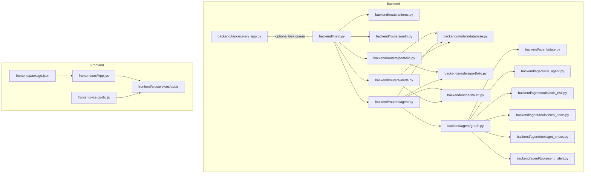
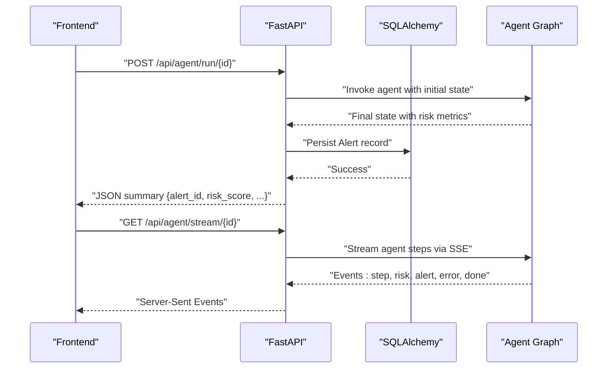
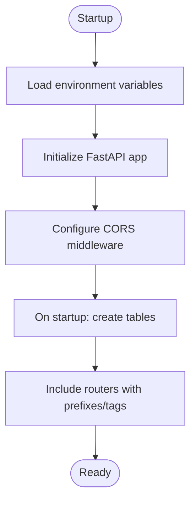
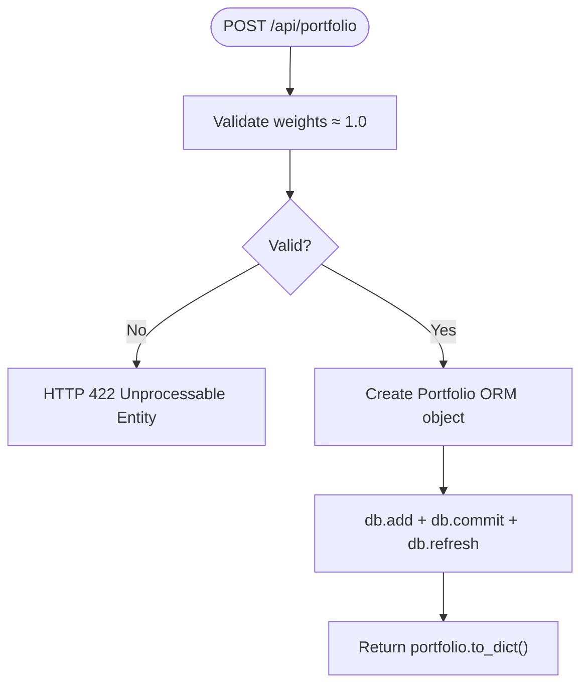
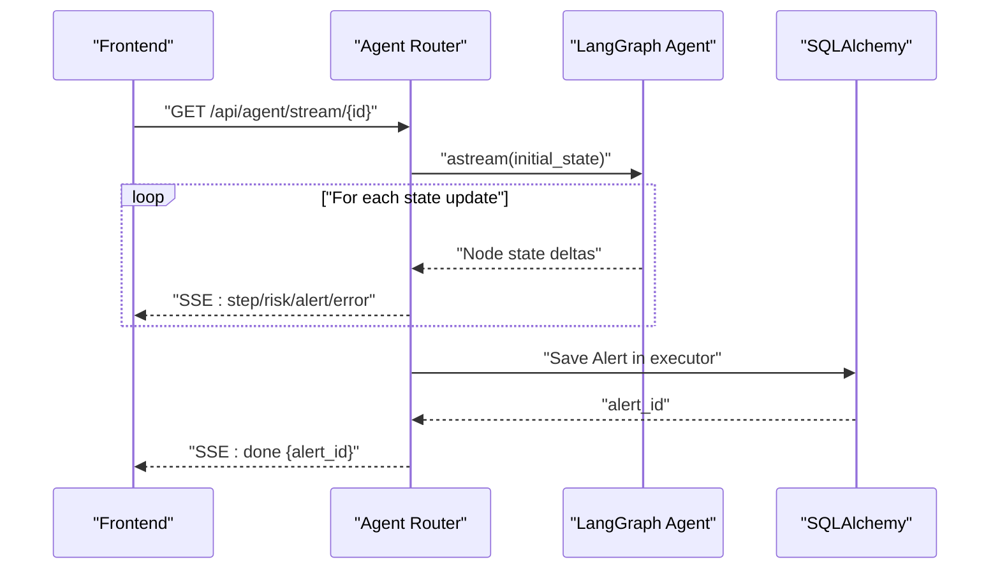
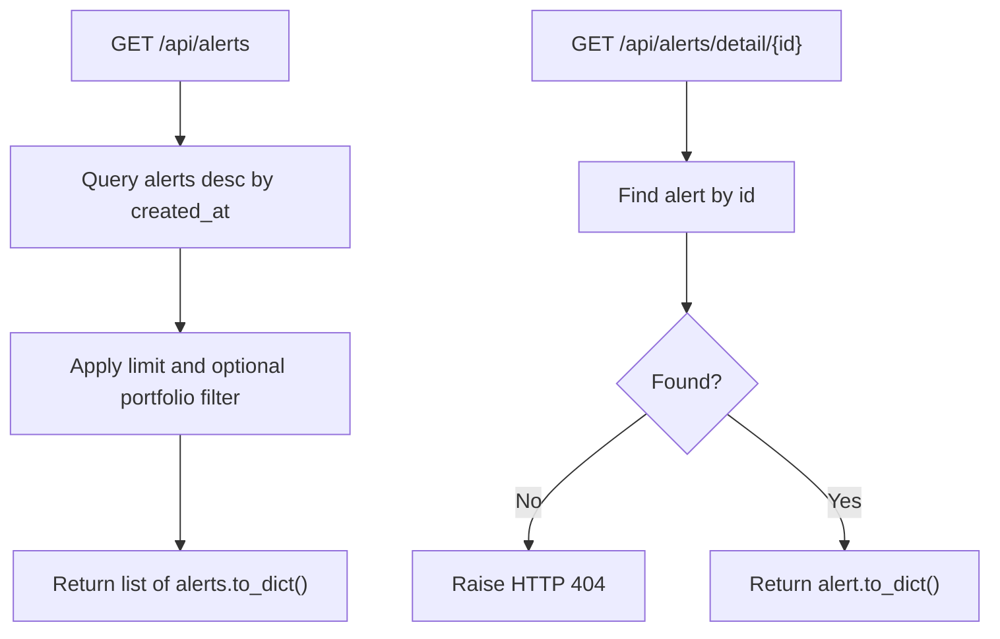
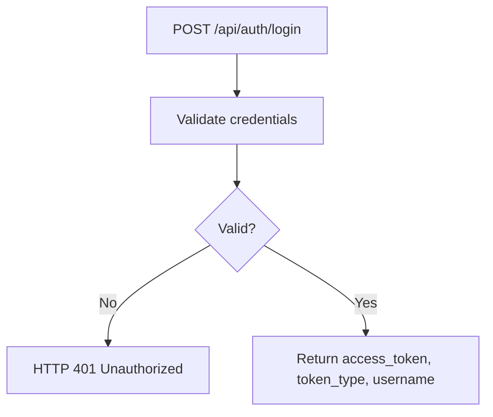
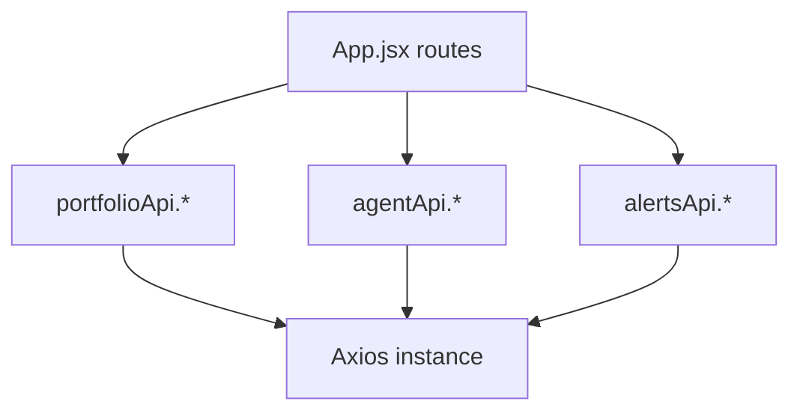
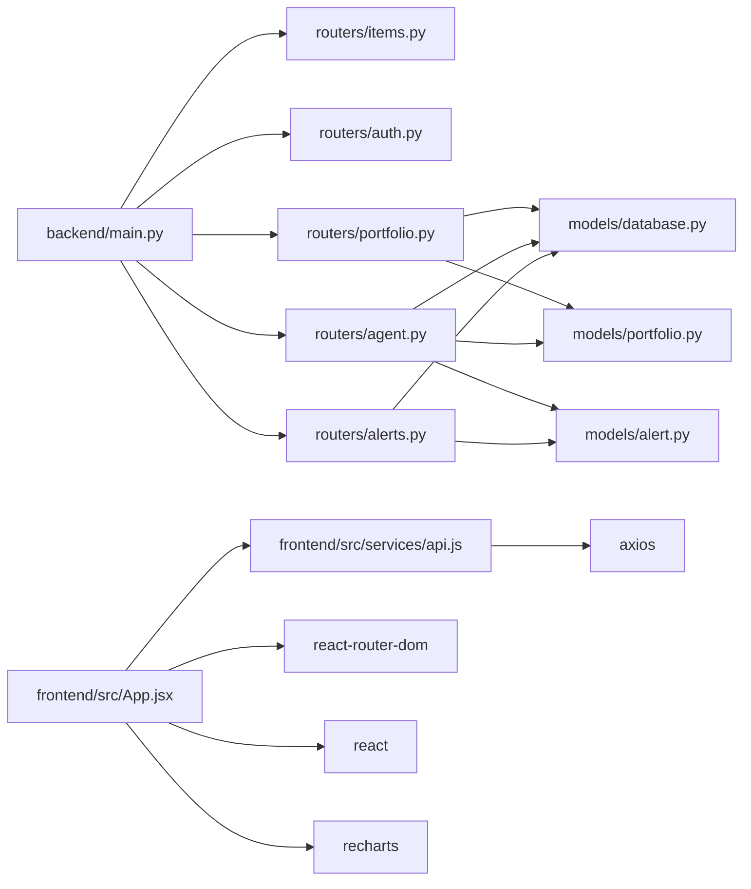

# Development Guidelines

<cite>
**Referenced Files in This Document**
- [README.md](file://README.md)
- [backend/main.py](file://backend/main.py)
- [backend/routers/items.py](file://backend/routers/items.py)
- [backend/routers/auth.py](file://backend/routers/auth.py)
- [backend/routers/portfolio.py](file://backend/routers/portfolio.py)
- [backend/routers/agent.py](file://backend/routers/agent.py)
- [backend/routers/alerts.py](file://backend/routers/alerts.py)
- [backend/models/database.py](file://backend/models/database.py)
- [backend/models/portfolio.py](file://backend/models/portfolio.py)
- [backend/models/alert.py](file://backend/models/alert.py)
- [backend/tasks/celery_app.py](file://backend/tasks/celery_app.py)
- [backend/agent/graph.py](file://backend/agent/graph.py)
- [backend/agent/state.py](file://backend/agent/state.py)
- [backend/agent/run_agent.py](file://backend/agent/run_agent.py)
- [backend/agent/tools/calc_risk.py](file://backend/agent/tools/calc_risk.py)
- [backend/agent/tools/fetch_news.py](file://backend/agent/tools/fetch_news.py)
- [backend/agent/tools/get_prices.py](file://backend/agent/tools/get_prices.py)
- [backend/agent/tools/send_alert.py](file://backend/agent/tools/send_alert.py)
- [frontend/src/App.jsx](file://frontend/src/App.jsx)
- [frontend/src/services/api.js](file://frontend/src/services/api.js)
- [frontend/vite.config.js](file://frontend/vite.config.js)
- [frontend/package.json](file://frontend/package.json)
- [render.yaml](file://render.yaml)
</cite>

## Table of Contents
1. [Introduction](#introduction)
2. [Project Structure](#project-structure)
3. [Core Components](#core-components)
4. [Architecture Overview](#architecture-overview)
5. [Detailed Component Analysis](#detailed-component-analysis)
6. [Dependency Analysis](#dependency-analysis)
7. [Performance Considerations](#performance-considerations)
8. [Troubleshooting Guide](#troubleshooting-guide)
9. [Contribution Workflow](#contribution-workflow)
10. [Testing Strategies](#testing-strategies)
11. [Debugging and Local Testing](#debugging-and-local-testing)
12. [Extending Functionality and Compatibility](#extending-functionality-and-compatibility)
13. [Conclusion](#conclusion)

## Introduction
This document provides comprehensive development guidelines for contributing to the ishwarambare-app project. It covers code organization standards, coding conventions for Python and JavaScript, development workflow, testing strategies, debugging techniques, and extension practices. The project is a full-stack application built with FastAPI (Python) for the backend and React + Vite for the frontend, integrated with LangGraph-powered agent workflows and SQLAlchemy-backed persistence.

## Project Structure
The repository follows a clear separation of concerns:
- Backend: FastAPI application with routers, models, agent subsystem, and Celery task support.
- Frontend: React SPA with components, pages, services, and styles.
- Deployment: Render blueprint for automated deployment.

**Diagram sources**
- [backend/main.py:1-59](file://backend/main.py#L1-L59)
- [backend/routers/items.py:1-72](file://backend/routers/items.py#L1-L72)
- [backend/routers/auth.py:1-39](file://backend/routers/auth.py#L1-L39)
- [backend/routers/portfolio.py:1-124](file://backend/routers/portfolio.py#L1-L124)
- [backend/routers/agent.py:1-243](file://backend/routers/agent.py#L1-L243)
- [backend/routers/alerts.py:1-84](file://backend/routers/alerts.py#L1-L84)
- [backend/models/database.py:1-42](file://backend/models/database.py#L1-L42)
- [backend/models/portfolio.py:1-63](file://backend/models/portfolio.py#L1-L63)
- [backend/models/alert.py:1-77](file://backend/models/alert.py#L1-L77)
- [backend/agent/graph.py](file://backend/agent/graph.py)
- [backend/agent/state.py](file://backend/agent/state.py)
- [backend/agent/run_agent.py](file://backend/agent/run_agent.py)
- [backend/agent/tools/calc_risk.py](file://backend/agent/tools/calc_risk.py)
- [backend/agent/tools/fetch_news.py](file://backend/agent/tools/fetch_news.py)
- [backend/agent/tools/get_prices.py](file://backend/agent/tools/get_prices.py)
- [backend/agent/tools/send_alert.py](file://backend/agent/tools/send_alert.py)
- [backend/tasks/celery_app.py](file://backend/tasks/celery_app.py)
- [frontend/src/App.jsx:1-21](file://frontend/src/App.jsx#L1-L21)
- [frontend/src/services/api.js:1-35](file://frontend/src/services/api.js#L1-L35)
- [frontend/vite.config.js:1-23](file://frontend/vite.config.js#L1-L23)
- [frontend/package.json:1-27](file://frontend/package.json#L1-L27)

**Section sources**
- [README.md:5-25](file://README.md#L5-L25)
- [backend/main.py:1-59](file://backend/main.py#L1-L59)
- [frontend/src/App.jsx:1-21](file://frontend/src/App.jsx#L1-L21)

## Core Components
- Backend entrypoint initializes FastAPI, middleware, database tables, and routes.
- Routers encapsulate REST endpoints for items, auth, portfolio, agent, and alerts.
- Models define SQLAlchemy ORM entities for portfolios and alerts with helper properties.
- Agent subsystem orchestrates LangGraph workflows, emits SSE events, and persists results.
- Frontend provides routing, API service wrappers, and development proxy configuration.

Key conventions observed:
- Python: module-level routers grouped under routers/, models under models/, agent logic under agent/.
- JavaScript: React components under src/components/, pages under src/pages/, services under src/services/.

**Section sources**
- [backend/main.py:1-59](file://backend/main.py#L1-L59)
- [backend/routers/items.py:1-72](file://backend/routers/items.py#L1-L72)
- [backend/routers/auth.py:1-39](file://backend/routers/auth.py#L1-L39)
- [backend/routers/portfolio.py:1-124](file://backend/routers/portfolio.py#L1-L124)
- [backend/routers/agent.py:1-243](file://backend/routers/agent.py#L1-L243)
- [backend/routers/alerts.py:1-84](file://backend/routers/alerts.py#L1-L84)
- [backend/models/database.py:1-42](file://backend/models/database.py#L1-L42)
- [backend/models/portfolio.py:1-63](file://backend/models/portfolio.py#L1-L63)
- [backend/models/alert.py:1-77](file://backend/models/alert.py#L1-L77)
- [frontend/src/App.jsx:1-21](file://frontend/src/App.jsx#L1-L21)
- [frontend/src/services/api.js:1-35](file://frontend/src/services/api.js#L1-L35)

## Architecture Overview
The backend exposes REST APIs and SSE endpoints. The frontend consumes these endpoints via Axios, with Vite proxying API calls to the backend during development. The agent pipeline computes risk metrics and optionally triggers alerts, persisting results to the database.

**Diagram sources**
- [backend/routers/agent.py:186-232](file://backend/routers/agent.py#L186-L232)
- [backend/models/alert.py:1-77](file://backend/models/alert.py#L1-L77)
- [frontend/src/services/api.js:20-24](file://frontend/src/services/api.js#L20-L24)

**Section sources**
- [backend/routers/agent.py:1-243](file://backend/routers/agent.py#L1-L243)
- [backend/models/alert.py:1-77](file://backend/models/alert.py#L1-L77)
- [frontend/src/services/api.js:1-35](file://frontend/src/services/api.js#L1-L35)

## Detailed Component Analysis

### Backend Application Initialization
- Sets up FastAPI with title, description, version.
- Configures CORS middleware and startup table creation.
- Includes routers with prefixes and tags for clean API grouping.

**Diagram sources**
- [backend/main.py:10-44](file://backend/main.py#L10-L44)

**Section sources**
- [backend/main.py:1-59](file://backend/main.py#L1-L59)

### Portfolio Management Router
- Defines Pydantic schemas for create/update requests.
- Validates weight sums to near 1.0.
- Uses SQLAlchemy session dependency injection.
- Provides CRUD endpoints with proper HTTP status codes.

**Diagram sources**
- [backend/routers/portfolio.py:56-77](file://backend/routers/portfolio.py#L56-L77)

**Section sources**
- [backend/routers/portfolio.py:1-124](file://backend/routers/portfolio.py#L1-L124)
- [backend/models/portfolio.py:1-63](file://backend/models/portfolio.py#L1-L63)

### Agent Router (SSE and Sync)
- SSE endpoint streams reasoning steps, risk metrics, alert decisions, and errors.
- Sync endpoint runs the agent and returns a JSON summary.
- Persists alert records with metrics and reasoning logs.
- Uses thread executor for database writes to avoid blocking the async loop.

**Diagram sources**
- [backend/routers/agent.py:39-168](file://backend/routers/agent.py#L39-L168)

**Section sources**
- [backend/routers/agent.py:1-243](file://backend/routers/agent.py#L1-L243)
- [backend/models/alert.py:1-77](file://backend/models/alert.py#L1-L77)

### Alerts Router (Read-only)
- Lists alerts with optional portfolio filter and limit.
- Retrieves detailed alert with reasoning log.
- Computes summary statistics across alerts.

**Diagram sources**
- [backend/routers/alerts.py:22-40](file://backend/routers/alerts.py#L22-L40)

**Section sources**
- [backend/routers/alerts.py:1-84](file://backend/routers/alerts.py#L1-L84)

### Authentication Router (Demo)
- Login endpoint returns a demo token and user info.
- Me endpoint returns stub user details.
- Intended for replacement with JWT and database-backed auth.

**Diagram sources**
- [backend/routers/auth.py:18-32](file://backend/routers/auth.py#L18-L32)

**Section sources**
- [backend/routers/auth.py:1-39](file://backend/routers/auth.py#L1-L39)

### Frontend Routing and Services
- React Router defines top-level routes.
- Axios service wraps base URL and exports typed API groups.
- Vite proxy forwards /api requests to the backend during development.

**Diagram sources**
- [frontend/src/App.jsx:1-21](file://frontend/src/App.jsx#L1-L21)
- [frontend/src/services/api.js:1-35](file://frontend/src/services/api.js#L1-L35)
- [frontend/vite.config.js:7-17](file://frontend/vite.config.js#L7-L17)

**Section sources**
- [frontend/src/App.jsx:1-21](file://frontend/src/App.jsx#L1-L21)
- [frontend/src/services/api.js:1-35](file://frontend/src/services/api.js#L1-L35)
- [frontend/vite.config.js:1-23](file://frontend/vite.config.js#L1-L23)

## Dependency Analysis
- Backend FastAPI depends on routers, models, and agent modules.
- Routers depend on SQLAlchemy sessions and models.
- Agent depends on graph, state, and tools modules.
- Frontend depends on React, React Router, Axios, and Recharts.

**Diagram sources**
- [backend/main.py:6-8](file://backend/main.py#L6-L8)
- [backend/routers/portfolio.py:19-20](file://backend/routers/portfolio.py#L19-L20)
- [backend/routers/agent.py:21-24](file://backend/routers/agent.py#L21-L24)
- [backend/routers/alerts.py:16-17](file://backend/routers/alerts.py#L16-L17)
- [frontend/src/App.jsx:1-21](file://frontend/src/App.jsx#L1-L21)
- [frontend/src/services/api.js:1-9](file://frontend/src/services/api.js#L1-L9)

**Section sources**
- [backend/main.py:1-59](file://backend/main.py#L1-L59)
- [backend/routers/portfolio.py:1-124](file://backend/routers/portfolio.py#L1-L124)
- [backend/routers/agent.py:1-243](file://backend/routers/agent.py#L1-L243)
- [backend/routers/alerts.py:1-84](file://backend/routers/alerts.py#L1-L84)
- [frontend/src/App.jsx:1-21](file://frontend/src/App.jsx#L1-L21)
- [frontend/src/services/api.js:1-35](file://frontend/src/services/api.js#L1-L35)

## Performance Considerations
- SSE streaming: Minimal per-event delays to improve UX; ensure client disconnection checks to prevent orphaned streams.
- Async I/O: Keep database writes off the main async loop using executors to avoid blocking.
- Weight validation: Pre-validate portfolio weights to fail fast and reduce downstream errors.
- CORS: Allow origins as configured; consider tightening for production.
- Build artifacts: Disable source maps in production builds to reduce bundle size.

[No sources needed since this section provides general guidance]

## Troubleshooting Guide
Common issues and resolutions:
- CORS errors: Verify ALLOWED_ORIGINS and middleware configuration.
- Database initialization: Ensure startup table creation runs and DATABASE_URL is set appropriately.
- SSE connectivity: Confirm client-side EventSource usage and server headers for SSE.
- Frontend proxy: Validate Vite proxy target and API base URL.
- Environment variables: Confirm .env presence and required keys for backend and frontend.

**Section sources**
- [backend/main.py:19-30](file://backend/main.py#L19-L30)
- [backend/models/database.py:15-22](file://backend/models/database.py#L15-L22)
- [frontend/vite.config.js:9-16](file://frontend/vite.config.js#L9-L16)
- [frontend/src/services/api.js:3-9](file://frontend/src/services/api.js#L3-L9)

## Contribution Workflow
- Branching: Use feature branches prefixed with feature/, fix/, or chore/.
- Commit messages: Use imperative mood; reference issue numbers when applicable.
- Pull Requests: Open PRs targeting main; include a summary, screenshots if UI-related, and test coverage notes.
- Code Review: Ensure at least one reviewer approves; address comments promptly.
- Quality Gates: Lint passes, tests green, no new lint errors, and documentation updated as needed.
- Merge: Squash or rebase commits; ensure clean history and descriptive commit messages.

[No sources needed since this section doesn't analyze specific files]

## Testing Strategies
Backend API testing:
- Unit tests: Mock SQLAlchemy sessions and agent invocations; assert HTTP status codes and response schemas.
- Integration tests: Spin up a test database; run full flows including SSE streaming and alert persistence.
- Validation tests: Verify portfolio weight validation and error responses.

Frontend component testing:
- Unit tests: Test React components with mocked services; assert rendering and prop handling.
- Integration tests: Simulate API responses and route transitions; validate UI interactions.
- End-to-end tests: Use Playwright/Cypress to automate user journeys (optional).

[No sources needed since this section provides general guidance]

## Debugging and Local Testing
- Backend: Use uvicorn reload mode; inspect FastAPI docs at /docs; enable database echo for SQL logs.
- Frontend: Use Vite dev server; verify proxy configuration; inspect network tab for API calls.
- Agent: Log intermediate states; capture reasoning logs; confirm alert persistence.
- Environment: Follow README prerequisites and setup steps for both backend and frontend.

**Section sources**
- [README.md:29-75](file://README.md#L29-L75)
- [backend/models/database.py:20-22](file://backend/models/database.py#L20-L22)

## Extending Functionality and Compatibility
- New endpoints: Add a new router under backend/routers/ with appropriate Pydantic models and SQLAlchemy dependencies.
- New models: Define ORM classes under backend/models/ with helper properties and to_dict methods.
- Agent tools: Extend backend/agent/tools/ and integrate into the graph; emit structured SSE events.
- Frontend features: Add components under src/components/ and pages under src/pages/; update src/services/api.js accordingly.
- Backward compatibility: Avoid breaking changes to existing endpoints; introduce new endpoints with new paths and versions when necessary.

[No sources needed since this section provides general guidance]

## Conclusion
These guidelines consolidate the project’s structure, conventions, and operational practices. By adhering to the outlined standards and workflows, contributors can efficiently develop, test, and deploy enhancements while maintaining code quality and system reliability.