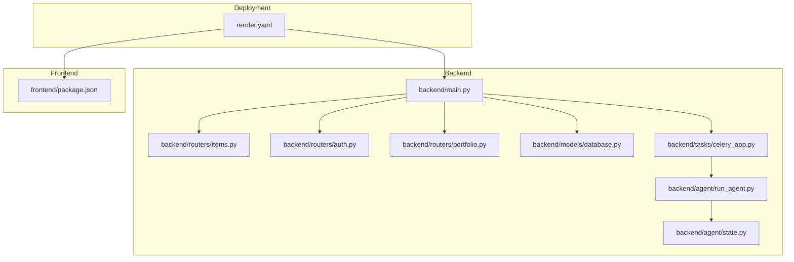
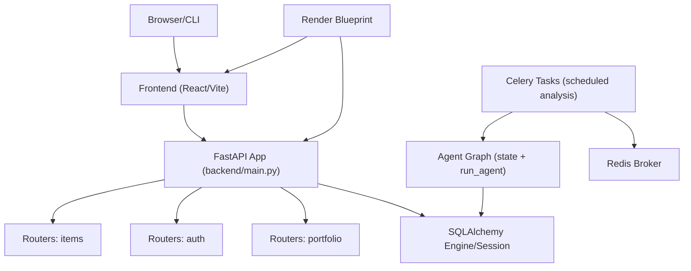
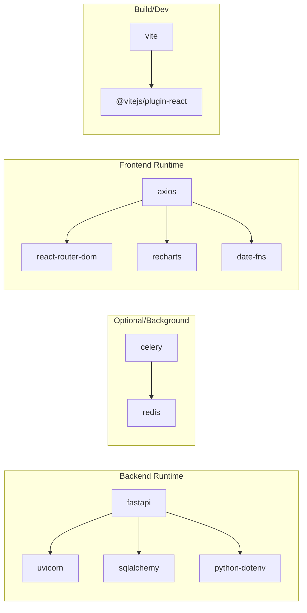

# Development Workflow and Contribution Process

<cite>
**Referenced Files in This Document**
- [README.md](file://README.md)
- [backend/main.py](file://backend/main.py)
- [backend/routers/items.py](file://backend/routers/items.py)
- [backend/routers/auth.py](file://backend/routers/auth.py)
- [backend/routers/portfolio.py](file://backend/routers/portfolio.py)
- [backend/models/database.py](file://backend/models/database.py)
- [backend/tasks/celery_app.py](file://backend/tasks/celery_app.py)
- [backend/agent/run_agent.py](file://backend/agent/run_agent.py)
- [backend/agent/state.py](file://backend/agent/state.py)
- [frontend/package.json](file://frontend/package.json)
- [render.yaml](file://render.yaml)
- [backend/requirements.txt](file://backend/requirements.txt)
</cite>

## Table of Contents
1. [Introduction](#introduction)
2. [Project Structure](#project-structure)
3. [Core Components](#core-components)
4. [Architecture Overview](#architecture-overview)
5. [Detailed Component Analysis](#detailed-component-analysis)
6. [Dependency Analysis](#dependency-analysis)
7. [Performance Considerations](#performance-considerations)
8. [Troubleshooting Guide](#troubleshooting-guide)
9. [Conclusion](#conclusion)
10. [Appendices](#appendices)

## Introduction
This document defines the end-to-end development workflow for contributing to the ishwarambare-app project. It covers local environment setup, branch and commit practices, pull request and code review procedures, issue and feature request handling, release and deployment processes, and collaboration norms. The goal is to ensure consistent, reliable contributions while maintaining a high-quality codebase and smooth developer experience.

## Project Structure
The project is a full-stack application composed of:
- A FastAPI backend (Python) with routers, models, tasks, and agent logic
- A React frontend (Vite) with routing, components, pages, and services
- Deployment configuration for Render using a blueprint

**Diagram sources**
- [backend/main.py:12-43](file://backend/main.py#L12-L43)
- [backend/routers/items.py:1-72](file://backend/routers/items.py#L1-L72)
- [backend/routers/auth.py:1-39](file://backend/routers/auth.py#L1-L39)
- [backend/routers/portfolio.py:1-124](file://backend/routers/portfolio.py#L1-L124)
- [backend/models/database.py:1-42](file://backend/models/database.py#L1-L42)
- [backend/tasks/celery_app.py:1-136](file://backend/tasks/celery_app.py#L1-L136)
- [backend/agent/run_agent.py:1-93](file://backend/agent/run_agent.py#L1-L93)
- [backend/agent/state.py:1-58](file://backend/agent/state.py#L1-L58)
- [frontend/package.json:1-27](file://frontend/package.json#L1-L27)
- [render.yaml:1-48](file://render.yaml#L1-L48)

**Section sources**
- [README.md:5-25](file://README.md#L5-L25)
- [backend/main.py:12-43](file://backend/main.py#L12-L43)
- [frontend/package.json:1-27](file://frontend/package.json#L1-L27)
- [render.yaml:4-43](file://render.yaml#L4-L43)

## Core Components
- Backend API server and routers define the REST endpoints for items, authentication, portfolio management, agent, and alerts.
- SQLAlchemy database module sets up the engine and session factory, with table creation on startup.
- Celery task orchestrates daily portfolio analysis jobs and integrates with the agent graph.
- Agent module defines the state schema and a standalone runner for testing agent behavior.
- Frontend package configuration defines dependencies and scripts for development and build.
- Render blueprint automates deployment of backend and frontend services.

Key responsibilities:
- API surface: items, auth, portfolio, agent, alerts
- Persistence: database initialization and ORM session management
- Automation: scheduled portfolio analysis via Celery
- Agent orchestration: state-driven execution with streaming reasoning
- Frontend build and runtime: Vite-based React app
- Deployment: Render blueprint with environment variables and health checks

**Section sources**
- [backend/main.py:12-59](file://backend/main.py#L12-L59)
- [backend/routers/items.py:1-72](file://backend/routers/items.py#L1-L72)
- [backend/routers/auth.py:1-39](file://backend/routers/auth.py#L1-L39)
- [backend/routers/portfolio.py:1-124](file://backend/routers/portfolio.py#L1-L124)
- [backend/models/database.py:1-42](file://backend/models/database.py#L1-L42)
- [backend/tasks/celery_app.py:1-136](file://backend/tasks/celery_app.py#L1-L136)
- [backend/agent/run_agent.py:1-93](file://backend/agent/run_agent.py#L1-L93)
- [backend/agent/state.py:1-58](file://backend/agent/state.py#L1-L58)
- [frontend/package.json:1-27](file://frontend/package.json#L1-L27)
- [render.yaml:4-43](file://render.yaml#L4-L43)

## Architecture Overview
The system follows a clean separation of concerns:
- Backend FastAPI app wires routers and middleware, exposes health and root endpoints, and initializes the database.
- Routers encapsulate domain-specific endpoints and depend on the database session.
- Models define the persistence layer and table creation routine.
- Tasks coordinate asynchronous workloads (daily analysis) using Celery and Redis.
- Agent executes a LangGraph-based pipeline that streams reasoning and persists results.
- Frontend consumes the backend API via Axios and React Router, with Vite for development and build.
- Render blueprint provisions backend and frontend services, sets environment variables, and configures health checks and rewrites.

**Diagram sources**
- [backend/main.py:12-59](file://backend/main.py#L12-L59)
- [backend/routers/items.py:1-72](file://backend/routers/items.py#L1-L72)
- [backend/routers/auth.py:1-39](file://backend/routers/auth.py#L1-L39)
- [backend/routers/portfolio.py:1-124](file://backend/routers/portfolio.py#L1-L124)
- [backend/models/database.py:1-42](file://backend/models/database.py#L1-L42)
- [backend/tasks/celery_app.py:1-136](file://backend/tasks/celery_app.py#L1-L136)
- [backend/agent/run_agent.py:1-93](file://backend/agent/run_agent.py#L1-L93)
- [backend/agent/state.py:1-58](file://backend/agent/state.py#L1-L58)
- [render.yaml:4-43](file://render.yaml#L4-L43)

## Detailed Component Analysis

### Local Environment Setup
- Backend prerequisites: Python 3.14+, virtual environment activation, dependency installation, environment file copy/edit, and running Uvicorn with reload.
- Frontend prerequisites: Node.js 18+, dependency installation, environment file copy/edit, and running Vite dev server.
- API docs available at the backend development host; frontend proxies API calls to the backend port.

Recommended steps:
- Create and activate a Python virtual environment in the backend directory.
- Install backend dependencies from the requirements file.
- Copy the environment example to .env and adjust values as needed.
- Start the backend with the development server.
- In another terminal, install frontend dependencies and start the Vite dev server.

**Section sources**
- [README.md:29-75](file://README.md#L29-L75)
- [backend/main.py:12-16](file://backend/main.py#L12-L16)

### Branch Naming Conventions
Proposed conventions to improve clarity and automation readiness:
- feature/<issue-number>-short-description
- fix/<issue-number>-short-description
- chore/<description>
- docs/<description>
- refactor/<description>
- perf/<description>

Examples:
- feature/123-user-authentication-flow
- fix/456-login-error-handling
- chore/789-update-dependencies
- docs/321-readme-improvements

[No sources needed since this section provides general guidance]

### Commit Message Standards
Guidelines to ensure consistent and searchable commits:
- Type: feat:, fix:, docs:, style:, refactor:, perf:, test:, chore:
- Scope: module or component affected (e.g., backend:routers, frontend:components)
- Subject: concise imperative description (< 50 chars)
- Body: optional contextual details, links to issues
- Footer: breaking changes, related issues

Examples:
- feat(backend:routers): add portfolio weight validation
- fix(frontend:services): resolve API URL override in dev
- chore(deps): bump axios and react-router-dom

[No sources needed since this section provides general guidance]

### Pull Request Process
- Create a PR from a feature branch to the default branch (e.g., main).
- Use the provided PR template to describe the change, rationale, testing performed, and migration notes.
- Assign reviewers based on component ownership or rotate among maintainers.
- Ensure CI passes and address reviewer feedback promptly.

PR template outline:
- What changed
- Why this change
- How it was tested
- Migration notes (if applicable)
- Related issues

[No sources needed since this section provides general guidance]

### Code Review Process
Checklist for reviewers:
- Requirements satisfied (functionality, UX, performance)
- Code quality (readability, maintainability, comments)
- Security considerations (input validation, secrets handling)
- Testing coverage and correctness
- Documentation updates (README, docstrings, API docs)
- No hardcoded secrets or sensitive data
- Environment variable usage and defaults

Feedback handling:
- Request changes with specific suggestions
- Discuss trade-offs and alternatives
- Iterate until consensus is reached
- Approve only when ready

[No sources needed since this section provides general guidance]

### Issue Reporting, Feature Requests, Bug Fixes
Issue categories and guidance:
- Bug report: environment, steps to reproduce, expected vs actual behavior, logs
- Feature request: problem statement, proposed solution, acceptance criteria
- Task: small improvements, refactors, documentation updates

Labels and workflows:
- Use labels to categorize (bug, enhancement, documentation, chore)
- Assign and estimate effort
- Link PRs and commits to issues

[No sources needed since this section provides general guidance]

### Release Process, Version Tagging, and Deployment
Release and deployment practices:
- Versioning: align backend API version with major.minor.patch semantics
- Tagging: create annotated tags for releases (e.g., v2.1.0)
- Changelog: summarize breaking changes, features, fixes
- Deployment: push to the upstream repository and rely on Render blueprint for automated builds

Backend version exposure:
- The backend FastAPI app declares a version field used by the framework.

Frontend version:
- The frontend package.json includes a semantic version.

Render deployment:
- The blueprint defines health checks, environment variables, and route rewrites for SPA support.

**Section sources**
- [backend/main.py:12-16](file://backend/main.py#L12-L16)
- [frontend/package.json:4](file://frontend/package.json#L4)
- [render.yaml:14](file://render.yaml#L14)
- [README.md:78-93](file://README.md#L78-L93)

### Collaboration Best Practices and Communication
- Use a shared communication channel (e.g., chat or forum) for coordination
- Keep PRs focused and small for faster reviews
- Provide context in PR descriptions and comments
- Rotate review assignments to distribute workload
- Respect deadlines and blockers; escalate blockers promptly

[No sources needed since this section provides general guidance]

### Templates for Common Contribution Scenarios
- New API endpoint
  - Define schema(s) and endpoint in the appropriate router
  - Add tests and update API documentation
  - Update changelog and PR description
- Database model change
  - Add migration or table creation logic
  - Update seeding and tests
  - Document schema changes
- Frontend feature
  - Add component/page and integrate with services
  - Update routing and styling
  - Verify proxy and environment variables
- Scheduled task
  - Implement Celery task and schedule
  - Test locally with Redis
  - Document environment variables and monitoring

[No sources needed since this section provides general guidance]

## Dependency Analysis
Runtime and build dependencies:
- Backend: FastAPI, Uvicorn, SQLAlchemy, Python-dotenv, and optional Celery/Redis for scheduling
- Frontend: React, React Router, Axios, Recharts, date-fns, and Vite toolchain

**Diagram sources**
- [backend/requirements.txt:1-20](file://backend/requirements.txt#L1-L20)
- [frontend/package.json:11-25](file://frontend/package.json#L11-L25)

**Section sources**
- [backend/requirements.txt:1-20](file://backend/requirements.txt#L1-L20)
- [frontend/package.json:11-25](file://frontend/package.json#L11-L25)

## Performance Considerations
- Backend
  - Use async-compatible patterns where possible and avoid blocking operations in request handlers.
  - Leverage database connection pooling and minimize N+1 queries.
  - Cache infrequent computations and avoid heavy CPU work in hot paths.
- Frontend
  - Lazy-load components and split bundles.
  - Debounce or throttle frequent API calls.
  - Use efficient chart rendering and limit data sizes.
- Background tasks
  - Configure Celery workers and schedulers appropriately.
  - Monitor task queues and tune concurrency.
- Observability
  - Add structured logging and metrics.
  - Use health checks and readiness probes.

[No sources needed since this section provides general guidance]

## Troubleshooting Guide
Common issues and resolutions:
- Backend fails to start
  - Verify virtual environment activation and dependency installation.
  - Check environment variables and database URL.
  - Confirm port availability and CORS configuration.
- Frontend proxy errors
  - Ensure API URL matches backend host/port.
  - Confirm .env.local values and Vite proxy settings.
- Celery task failures
  - Confirm Redis connectivity and broker URL.
  - Check task serialization and timezone settings.
  - Review logs for exceptions and retries.
- Database initialization
  - On startup, tables are created automatically; verify engine configuration and permissions.
- Deployment issues
  - Confirm Render environment variables and health check path.
  - Validate custom domain DNS records and SSL provisioning.

**Section sources**
- [README.md:29-75](file://README.md#L29-L75)
- [backend/main.py:18-30](file://backend/main.py#L18-L30)
- [backend/models/database.py:15-42](file://backend/models/database.py#L15-L42)
- [backend/tasks/celery_app.py:29-55](file://backend/tasks/celery_app.py#L29-L55)
- [render.yaml:14](file://render.yaml#L14)

## Conclusion
By following the workflow and practices outlined here, contributors can efficiently develop, review, and deploy changes to the ishwarambare-app project. Adhering to branch naming, commit standards, PR and review processes, and deployment procedures ensures a high-quality, maintainable codebase and a smooth collaboration experience.

[No sources needed since this section summarizes without analyzing specific files]

## Appendices

### API Reference (Endpoints)
- GET /health — Health check
- GET /api/items/, GET /api/items/{id}, POST /api/items/, DELETE /api/items/{id}
- POST /api/auth/login, GET /api/auth/me
- GET/POST/GET/PUT/DELETE /api/portfolio/{id}

**Section sources**
- [README.md:111-123](file://README.md#L111-L123)
- [backend/main.py:46-59](file://backend/main.py#L46-L59)
- [backend/routers/items.py:36-71](file://backend/routers/items.py#L36-L71)
- [backend/routers/auth.py:18-38](file://backend/routers/auth.py#L18-L38)
- [backend/routers/portfolio.py:50-123](file://backend/routers/portfolio.py#L50-L123)

### Governance Model
- Maintainers approve merges and enforce standards
- Contributors propose changes via issues and PRs
- Decisions documented in PR discussions and changelogs
- Community participation encouraged with clear communication channels

[No sources needed since this section provides general guidance]