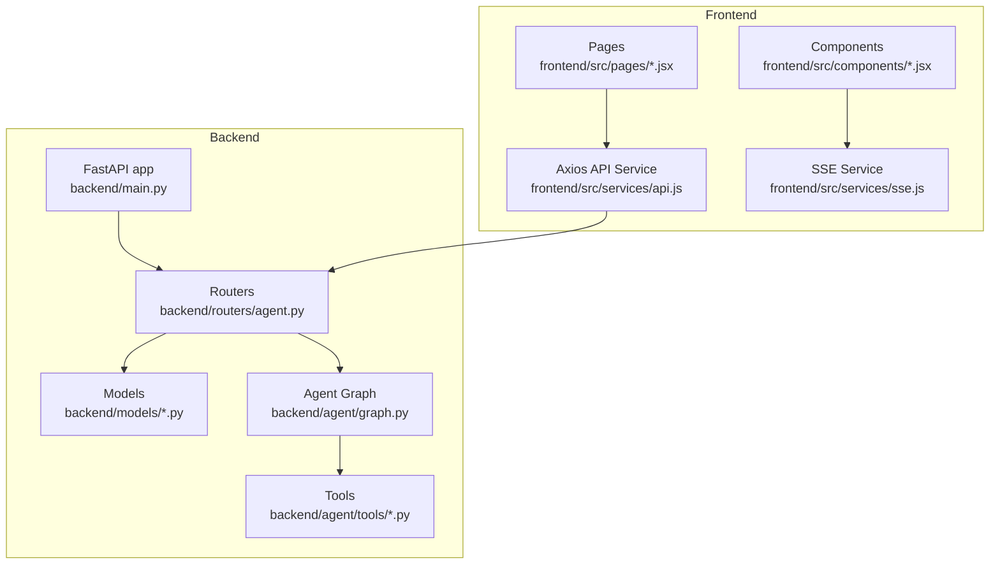
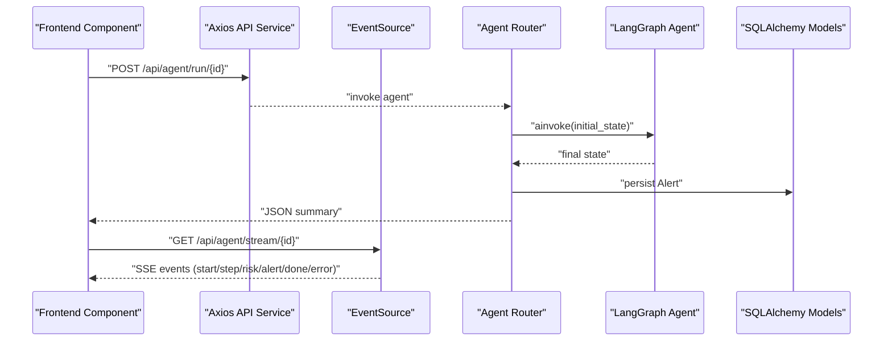
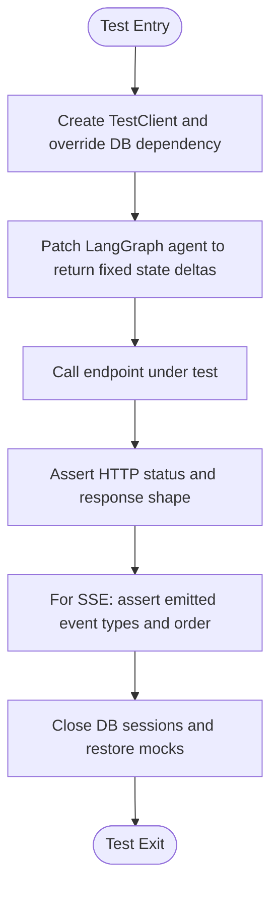
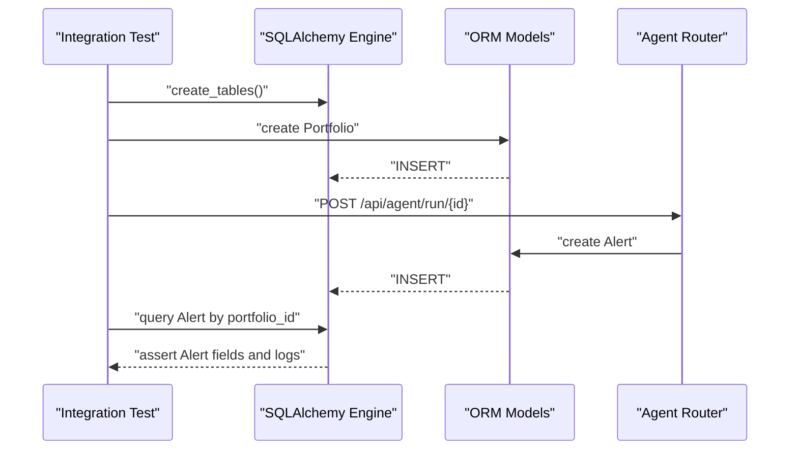
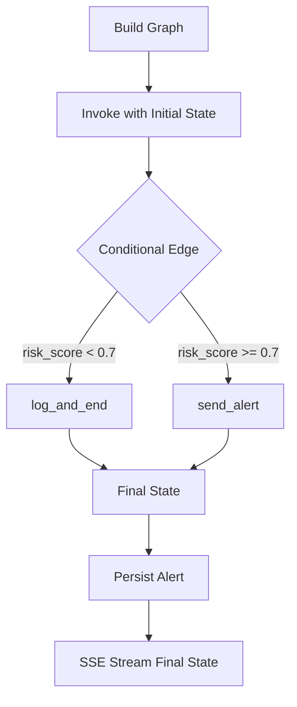
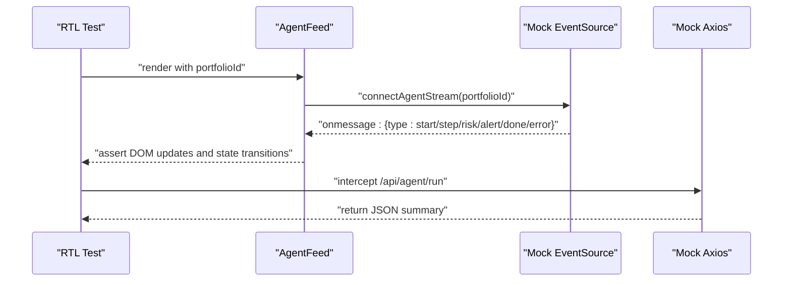
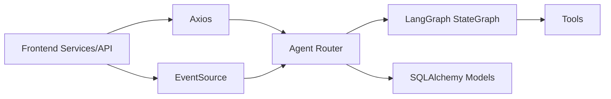

# Testing Strategies and Quality Assurance

<cite>
**Referenced Files in This Document**
- [backend/main.py](file://backend/main.py)
- [backend/routers/agent.py](file://backend/routers/agent.py)
- [backend/models/database.py](file://backend/models/database.py)
- [backend/models/portfolio.py](file://backend/models/portfolio.py)
- [backend/models/alert.py](file://backend/models/alert.py)
- [backend/agent/graph.py](file://backend/agent/graph.py)
- [backend/agent/state.py](file://backend/agent/state.py)
- [backend/agent/tools/fetch_news.py](file://backend/agent/tools/fetch_news.py)
- [backend/agent/tools/get_prices.py](file://backend/agent/tools/get_prices.py)
- [backend/agent/tools/calc_risk.py](file://backend/agent/tools/calc_risk.py)
- [frontend/src/services/api.js](file://frontend/src/services/api.js)
- [frontend/src/services/sse.js](file://frontend/src/services/sse.js)
- [frontend/src/components/AgentFeed.jsx](file://frontend/src/components/AgentFeed.jsx)
- [frontend/src/pages/LiveAgent.jsx](file://frontend/src/pages/LiveAgent.jsx)
- [frontend/package.json](file://frontend/package.json)
</cite>

## Table of Contents
1. [Introduction](#introduction)
2. [Project Structure](#project-structure)
3. [Core Components](#core-components)
4. [Architecture Overview](#architecture-overview)
5. [Detailed Component Analysis](#detailed-component-analysis)
6. [Dependency Analysis](#dependency-analysis)
7. [Performance Considerations](#performance-considerations)
8. [Troubleshooting Guide](#troubleshooting-guide)
9. [Conclusion](#conclusion)
10. [Appendices](#appendices)

## Introduction
This document defines a comprehensive testing strategy for the ishwarambare-app project. It covers backend testing (unit and integration for FastAPI endpoints, database operations, and the LangGraph agent workflow), frontend testing (React component testing, API integration tests, and UI behavior), and operational testing (real-time features via Server-Sent Events, state management, and asynchronous operations). It also outlines best practices for coverage, CI/CD pipelines, debugging, performance, and load testing tailored for financial applications.

## Project Structure
The project follows a clear separation of concerns:
- Backend: FastAPI application with routers, SQLAlchemy models, LangGraph agent, and tools.
- Frontend: React SPA with Axios-based API service, EventSource-based SSE service, and UI components.

**Diagram sources**
- [backend/main.py:12-59](file://backend/main.py#L12-L59)
- [backend/routers/agent.py:1-243](file://backend/routers/agent.py#L1-L243)
- [backend/models/database.py:1-42](file://backend/models/database.py#L1-L42)
- [backend/agent/graph.py:1-243](file://backend/agent/graph.py#L1-L243)
- [backend/agent/tools/fetch_news.py:1-164](file://backend/agent/tools/fetch_news.py#L1-L164)
- [backend/agent/tools/get_prices.py:1-139](file://backend/agent/tools/get_prices.py#L1-L139)
- [backend/agent/tools/calc_risk.py:1-255](file://backend/agent/tools/calc_risk.py#L1-L255)
- [frontend/src/services/api.js:1-35](file://frontend/src/services/api.js#L1-L35)
- [frontend/src/services/sse.js:1-63](file://frontend/src/services/sse.js#L1-L63)
- [frontend/src/components/AgentFeed.jsx:1-175](file://frontend/src/components/AgentFeed.jsx#L1-L175)
- [frontend/src/pages/LiveAgent.jsx:1-95](file://frontend/src/pages/LiveAgent.jsx#L1-L95)

**Section sources**
- [backend/main.py:12-59](file://backend/main.py#L12-L59)
- [frontend/package.json:1-27](file://frontend/package.json#L1-L27)

## Core Components
- FastAPI application with CORS middleware, startup table creation, and router registration.
- Agent router exposing SSE streaming and synchronous run endpoints, plus a status endpoint.
- SQLAlchemy models for Portfolio and Alert persistence.
- LangGraph StateGraph with typed state and four nodes: fetch_news, get_prices, calc_risk, conditional routing to send_alert or log_and_end.
- Tools implementing financial computations and data fetching with fallbacks for offline/demo scenarios.
- Frontend services for API and SSE, and React components for live agent feed and risk visualization.

**Section sources**
- [backend/main.py:12-59](file://backend/main.py#L12-L59)
- [backend/routers/agent.py:1-243](file://backend/routers/agent.py#L1-L243)
- [backend/models/database.py:1-42](file://backend/models/database.py#L1-L42)
- [backend/models/portfolio.py:1-63](file://backend/models/portfolio.py#L1-L63)
- [backend/models/alert.py:1-77](file://backend/models/alert.py#L1-L77)
- [backend/agent/graph.py:1-243](file://backend/agent/graph.py#L1-L243)
- [backend/agent/state.py:1-58](file://backend/agent/state.py#L1-L58)
- [backend/agent/tools/fetch_news.py:1-164](file://backend/agent/tools/fetch_news.py#L1-L164)
- [backend/agent/tools/get_prices.py:1-139](file://backend/agent/tools/get_prices.py#L1-L139)
- [backend/agent/tools/calc_risk.py:1-255](file://backend/agent/tools/calc_risk.py#L1-L255)
- [frontend/src/services/api.js:1-35](file://frontend/src/services/api.js#L1-L35)
- [frontend/src/services/sse.js:1-63](file://frontend/src/services/sse.js#L1-L63)
- [frontend/src/components/AgentFeed.jsx:1-175](file://frontend/src/components/AgentFeed.jsx#L1-L175)
- [frontend/src/pages/LiveAgent.jsx:1-95](file://frontend/src/pages/LiveAgent.jsx#L1-L95)

## Architecture Overview
The testing strategy aligns with the layered architecture:
- Backend tests validate FastAPI endpoints, database persistence, and agent workflow correctness.
- Frontend tests validate component rendering, API interactions, and SSE-driven UI updates.
- Financial-specific validations ensure numeric stability, thresholds, and risk scoring accuracy.

**Diagram sources**
- [backend/routers/agent.py:184-232](file://backend/routers/agent.py#L184-L232)
- [backend/agent/graph.py:162-203](file://backend/agent/graph.py#L162-L203)
- [backend/models/alert.py:14-77](file://backend/models/alert.py#L14-L77)
- [frontend/src/services/api.js:20-24](file://frontend/src/services/api.js#L20-L24)
- [frontend/src/services/sse.js:21-62](file://frontend/src/services/sse.js#L21-L62)

## Detailed Component Analysis

### Backend Testing Strategy

#### Unit Testing FastAPI Endpoints
- Test coverage targets:
  - Positive paths: valid portfolio ID, successful agent run, SSE stream emits expected event types.
  - Negative paths: invalid portfolio ID raises 404, SSE disconnect handled gracefully, DB executor errors return appropriate SSE error events.
- Testing frameworks:
  - Use FastAPI’s TestClient for HTTP-level tests.
  - Use pytest for fixtures and parametrized tests.
- Mocking strategies:
  - Patch database session and SQLAlchemy engine to avoid external dependencies.
  - Mock LangGraph agent to return deterministic state deltas for SSE streaming.
  - Mock external tools (NewsAPI, yfinance) to return controlled datasets or errors.
- Test data management:
  - Use factories or Pydantic models to construct Portfolio and Alert records.
  - Seed SQLite in-memory database for isolated tests.

**Diagram sources**
- [backend/routers/agent.py:39-168](file://backend/routers/agent.py#L39-L168)
- [backend/models/database.py:29-35](file://backend/models/database.py#L29-L35)

**Section sources**
- [backend/routers/agent.py:39-168](file://backend/routers/agent.py#L39-L168)
- [backend/models/database.py:29-35](file://backend/models/database.py#L29-L35)

#### Integration Testing for Database Operations
- Test coverage targets:
  - Table creation on startup, CRUD operations for Portfolio and Alert, foreign key constraints, JSON field serialization/deserialization.
- Testing frameworks:
  - pytest with SQLAlchemy fixtures.
  - Separate test database or in-memory SQLite per test module.
- Validation:
  - Verify Alert persistence includes reasoning logs and errors.
  - Confirm Portfolio tickers JSON conversion and property access.

**Diagram sources**
- [backend/models/database.py:38-42](file://backend/models/database.py#L38-L42)
- [backend/models/portfolio.py:38-62](file://backend/models/portfolio.py#L38-L62)
- [backend/models/alert.py:46-76](file://backend/models/alert.py#L46-L76)
- [backend/routers/agent.py:184-232](file://backend/routers/agent.py#L184-L232)

**Section sources**
- [backend/models/database.py:38-42](file://backend/models/database.py#L38-L42)
- [backend/models/portfolio.py:38-62](file://backend/models/portfolio.py#L38-L62)
- [backend/models/alert.py:46-76](file://backend/models/alert.py#L46-L76)
- [backend/routers/agent.py:184-232](file://backend/routers/agent.py#L184-L232)

#### Testing the LangGraph Agent Workflow
- Test coverage targets:
  - Node functions produce expected partial state updates.
  - Conditional edge routing matches risk thresholds.
  - Full graph execution returns consistent final state.
  - SSE streaming emits ordered deltas and final persisted alert ID.
- Testing frameworks:
  - pytest with deterministic inputs and controlled randomness seeds.
  - Patch external tools to return fixed outputs for reproducibility.
- Validation:
  - Compare reasoning steps, risk metrics, and alert decisions against expected outcomes.
  - Validate that errors propagate through state and are serialized to SSE.

**Diagram sources**
- [backend/agent/graph.py:162-203](file://backend/agent/graph.py#L162-L203)
- [backend/agent/state.py:28-58](file://backend/agent/state.py#L28-L58)
- [backend/agent/tools/calc_risk.py:149-255](file://backend/agent/tools/calc_risk.py#L149-L255)

**Section sources**
- [backend/agent/graph.py:162-203](file://backend/agent/graph.py#L162-L203)
- [backend/agent/state.py:28-58](file://backend/agent/state.py#L28-L58)
- [backend/agent/tools/calc_risk.py:149-255](file://backend/agent/tools/calc_risk.py#L149-L255)

#### Tool-Level Testing (Financial Computations)
- Test coverage targets:
  - Portfolio returns calculation with aligned series lengths.
  - Sharpe, Sortino, volatility, and max drawdown calculations.
  - Composite risk score thresholds and labeling.
  - Mock vs real data fallback behavior.
- Testing frameworks:
  - pytest with NumPy arrays and controlled inputs.
  - Parameterized tests for edge cases (empty inputs, insufficient observations).
- Validation:
  - Assert numeric ranges and thresholds.
  - Verify error logging for invalid inputs.

**Section sources**
- [backend/agent/tools/calc_risk.py:55-147](file://backend/agent/tools/calc_risk.py#L55-L147)
- [backend/agent/tools/get_prices.py:60-138](file://backend/agent/tools/get_prices.py#L60-L138)
- [backend/agent/tools/fetch_news.py:98-164](file://backend/agent/tools/fetch_news.py#L98-L164)

### Frontend Testing Strategy

#### Component Testing with React Testing Library
- Test coverage targets:
  - AgentFeed renders messages, applies classification, auto-scrolls, and handles start/stop/reset.
  - LiveAgent page selects portfolio, passes props to AgentFeed and RiskGauge, and displays interview points.
- Testing frameworks:
  - React Testing Library with Jest or Vitest.
  - Mock EventSource to simulate SSE events.
- Mocking strategies:
  - Stub connectAgentStream to inject handlers and emit controlled events.
  - Mock axios to intercept API calls and return predefined responses.

**Diagram sources**
- [frontend/src/components/AgentFeed.jsx:28-96](file://frontend/src/components/AgentFeed.jsx#L28-L96)
- [frontend/src/services/sse.js:21-62](file://frontend/src/services/sse.js#L21-L62)
- [frontend/src/services/api.js:20-24](file://frontend/src/services/api.js#L20-L24)

**Section sources**
- [frontend/src/components/AgentFeed.jsx:28-96](file://frontend/src/components/AgentFeed.jsx#L28-L96)
- [frontend/src/pages/LiveAgent.jsx:15-94](file://frontend/src/pages/LiveAgent.jsx#L15-L94)
- [frontend/src/services/sse.js:21-62](file://frontend/src/services/sse.js#L21-L62)
- [frontend/src/services/api.js:20-24](file://frontend/src/services/api.js#L20-L24)

#### Integration Testing for API Interactions
- Test coverage targets:
  - Portfolio list/get/create/update/delete endpoints.
  - Agent run and status endpoints.
  - Alerts list, detail, stats, and portfolio-scoped queries.
- Testing frameworks:
  - Vitest with React Testing Library for component integration.
  - Use a test backend (or FastAPI TestClient) to validate API responses.
- Validation:
  - Assert correct request payloads and response shapes.
  - Simulate network failures and timeouts.

**Section sources**
- [frontend/src/services/api.js:12-34](file://frontend/src/services/api.js#L12-L34)

#### User Interface Testing Approaches
- Real-time UI testing:
  - Use fake timers to advance time and validate SSE event timing.
  - Simulate client disconnection and verify graceful handling.
- State management testing:
  - Verify that AgentFeed maintains internal state (lines, running, status, stepCount) and resets correctly.
  - Validate prop propagation from LiveAgent to child components.
- Asynchronous operation validation:
  - Assert that UI reflects loading, success, and error states after async operations.

**Section sources**
- [frontend/src/components/AgentFeed.jsx:28-96](file://frontend/src/components/AgentFeed.jsx#L28-L96)
- [frontend/src/pages/LiveAgent.jsx:15-94](file://frontend/src/pages/LiveAgent.jsx#L15-L94)

### Testing Best Practices for Financial Applications
- Numeric precision and rounding: validate financial ratios and risk scores within expected tolerances.
- Threshold-based logic: thoroughly test boundary conditions around HIGH/MEDIUM/LOW risk thresholds.
- Error propagation: ensure errors from external APIs or tools are captured and surfaced to users.
- Data integrity: confirm JSON serialization/deserialization for complex fields (reasoning logs, tickers).
- Security and CORS: validate that SSE endpoints work with CORS configuration and that sensitive data is not exposed.

[No sources needed since this section provides general guidance]

## Dependency Analysis
Backend and frontend components interact through well-defined contracts:
- Backend exposes REST endpoints and SSE streams.
- Frontend consumes Axios for REST and EventSource for SSE.
- Agent workflow depends on typed state and deterministic tool outputs.

**Diagram sources**
- [frontend/src/services/api.js:1-35](file://frontend/src/services/api.js#L1-L35)
- [frontend/src/services/sse.js:1-63](file://frontend/src/services/sse.js#L1-L63)
- [backend/routers/agent.py:1-243](file://backend/routers/agent.py#L1-L243)
- [backend/agent/graph.py:1-243](file://backend/agent/graph.py#L1-L243)
- [backend/models/alert.py:1-77](file://backend/models/alert.py#L1-L77)

**Section sources**
- [frontend/src/services/api.js:1-35](file://frontend/src/services/api.js#L1-L35)
- [frontend/src/services/sse.js:1-63](file://frontend/src/services/sse.js#L1-L63)
- [backend/routers/agent.py:1-243](file://backend/routers/agent.py#L1-L243)
- [backend/agent/graph.py:1-243](file://backend/agent/graph.py#L1-L243)
- [backend/models/alert.py:1-77](file://backend/models/alert.py#L1-L77)

## Performance Considerations
- Backend:
  - Measure endpoint latency and throughput; mock expensive tools to isolate performance characteristics.
  - Validate SSE streaming performance under concurrent connections.
- Frontend:
  - Profile rendering performance of AgentFeed with large log histories.
  - Optimize re-renders by memoizing derived data and event handlers.
- Financial computations:
  - Benchmark portfolio return calculations and risk metrics; cache results where safe.
- Database:
  - Monitor query performance and connection pooling; use connection args suitable for SQLite threading.

[No sources needed since this section provides general guidance]

## Troubleshooting Guide
- SSE connectivity:
  - Verify EventSource URL and CORS configuration; handle onerror and automatic closure.
- Agent errors:
  - Inspect reasoning logs and errors stored in Alert model; surface errors via SSE error events.
- Database issues:
  - Ensure table creation runs on startup; confirm session lifecycle and proper closing.
- Tool failures:
  - Confirm fallback behavior for yfinance and NewsAPI; validate mock data generation.

**Section sources**
- [frontend/src/services/sse.js:21-62](file://frontend/src/services/sse.js#L21-L62)
- [backend/routers/agent.py:123-158](file://backend/routers/agent.py#L123-L158)
- [backend/models/database.py:38-42](file://backend/models/database.py#L38-L42)
- [backend/agent/tools/get_prices.py:60-138](file://backend/agent/tools/get_prices.py#L60-L138)
- [backend/agent/tools/fetch_news.py:98-164](file://backend/agent/tools/fetch_news.py#L98-L164)

## Conclusion
A robust testing strategy for ishwarambare-app requires coordinated backend and frontend efforts:
- Backend tests validate endpoints, database persistence, and agent workflow correctness with targeted mocking.
- Frontend tests ensure reliable UI behavior for real-time streaming and API interactions.
- Financial-specific validations protect numeric accuracy and threshold logic.
- CI/CD pipelines should enforce coverage, run backend and frontend suites, and include performance checks.

[No sources needed since this section summarizes without analyzing specific files]

## Appendices

### Test Coverage Requirements
- Backend:
  - Unit tests: > 85%
  - Integration tests: > 80%
  - Agent workflow tests: > 90%
- Frontend:
  - Component tests: > 80%
  - Integration tests: > 75%

[No sources needed since this section provides general guidance]

### Continuous Integration Testing and Automated Pipelines
- Backend:
  - Run FastAPI tests with pytest; collect coverage; fail on coverage thresholds.
  - Use tox or GitHub Actions to test multiple Python versions.
- Frontend:
  - Run React tests with Vitest; enforce linting and formatting.
  - Build and preview checks for regressions.
- Shared:
  - Parallelize backend and frontend jobs; cache dependencies; upload coverage artifacts.

[No sources needed since this section provides general guidance]

### Debugging Techniques
- Backend:
  - Enable FastAPI debug mode; use structured logging; instrument tool invocations.
- Frontend:
  - Use React DevTools; log SSE events; mock network requests for isolation.
- Financial:
  - Validate intermediate values (daily returns, sentiment, ratios) to localize issues.

[No sources needed since this section provides general guidance]