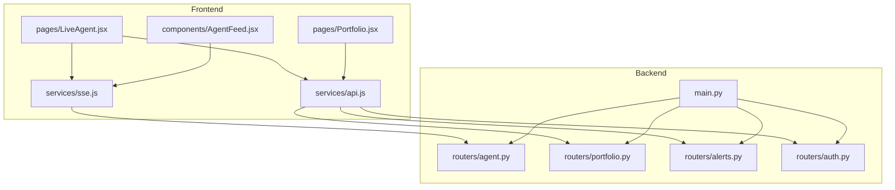
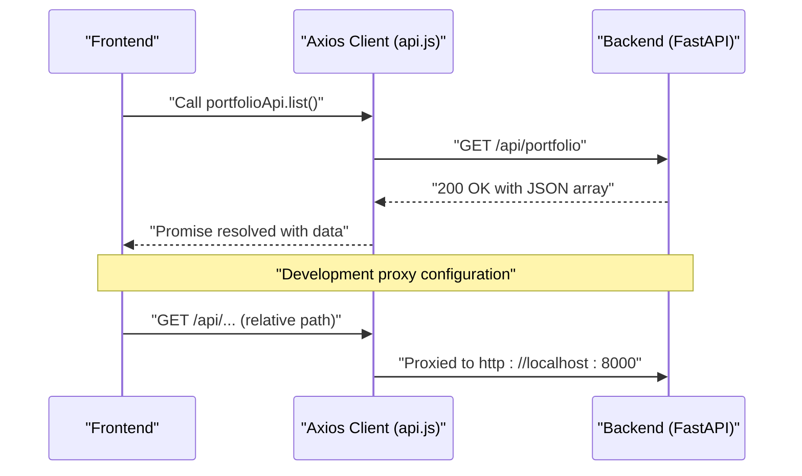
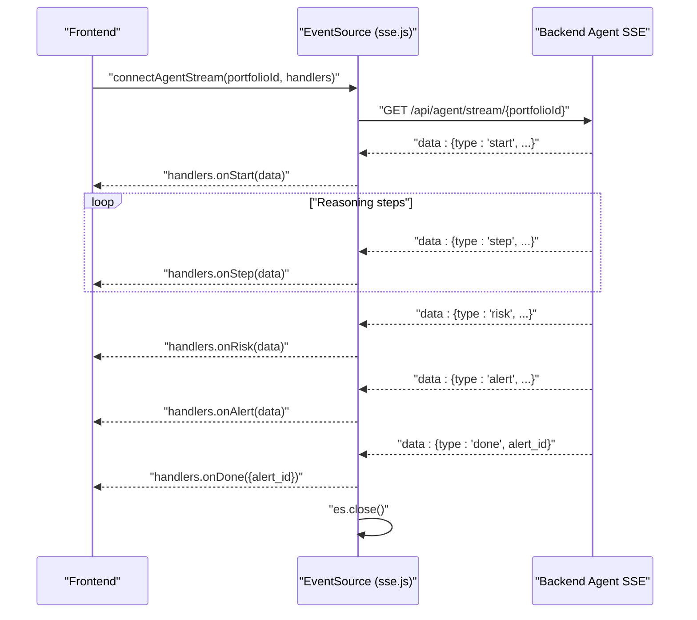
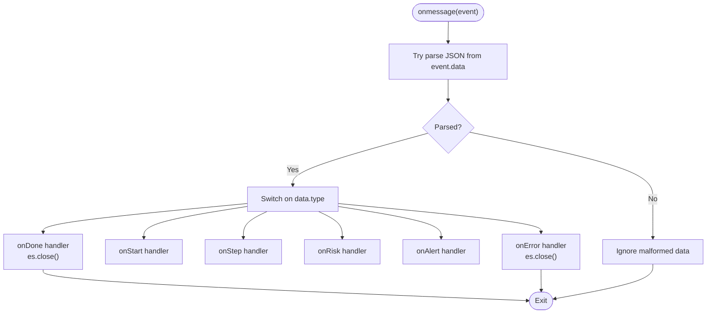
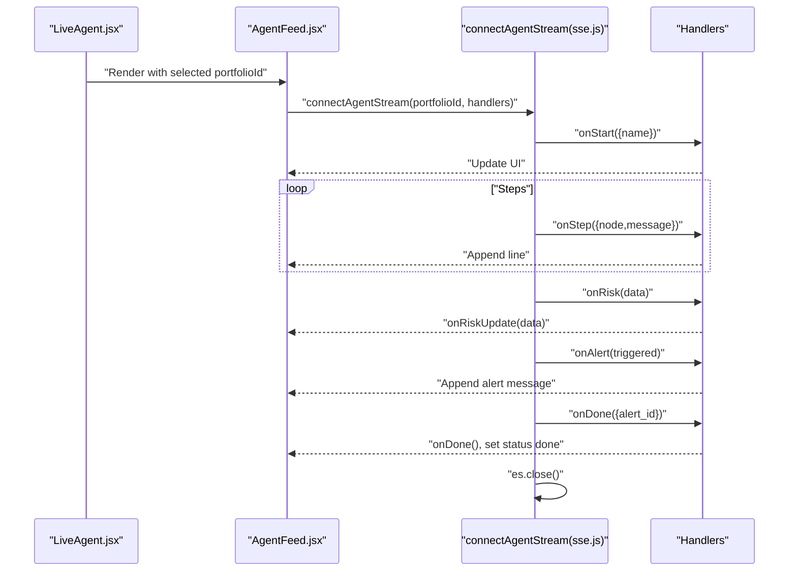
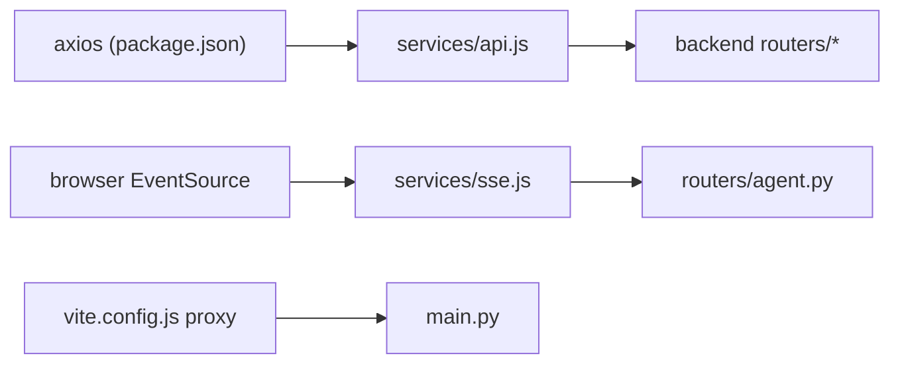

# API Integration Layer

<cite>
**Referenced Files in This Document**
- [api.js](file://frontend/src/services/api.js)
- [sse.js](file://frontend/src/services/sse.js)
- [LiveAgent.jsx](file://frontend/src/pages/LiveAgent.jsx)
- [AgentFeed.jsx](file://frontend/src/components/AgentFeed.jsx)
- [Portfolio.jsx](file://frontend/src/pages/Portfolio.jsx)
- [main.py](file://backend/main.py)
- [agent.py](file://backend/routers/agent.py)
- [portfolio.py](file://backend/routers/portfolio.py)
- [alerts.py](file://backend/routers/alerts.py)
- [auth.py](file://backend/routers/auth.py)
- [vite.config.js](file://frontend/vite.config.js)
- [package.json](file://frontend/package.json)
- [README.md](file://README.md)
</cite>

## Table of Contents
1. [Introduction](#introduction)
2. [Project Structure](#project-structure)
3. [Core Components](#core-components)
4. [Architecture Overview](#architecture-overview)
5. [Detailed Component Analysis](#detailed-component-analysis)
6. [Dependency Analysis](#dependency-analysis)
7. [Performance Considerations](#performance-considerations)
8. [Troubleshooting Guide](#troubleshooting-guide)
9. [Conclusion](#conclusion)
10. [Appendices](#appendices)

## Introduction
This document describes the API integration layer of the ishwarambare-app frontend, focusing on HTTP client configuration with Axios and Server-Sent Events (SSE) for real-time communication. It explains how the frontend constructs API service modules, how Axios is configured, how SSE streams are connected and processed, and how error handling and lifecycle management are implemented. It also provides guidance for extending the service layer with new endpoints while maintaining consistency across the application.

## Project Structure
The API integration layer resides in the frontend under src/services and is consumed by React components and pages. The backend exposes REST and SSE endpoints that the frontend consumes.

**Diagram sources**
- [api.js:1-35](file://frontend/src/services/api.js#L1-L35)
- [sse.js:1-63](file://frontend/src/services/sse.js#L1-L63)
- [LiveAgent.jsx:1-95](file://frontend/src/pages/LiveAgent.jsx#L1-L95)
- [AgentFeed.jsx:1-175](file://frontend/src/components/AgentFeed.jsx#L1-L175)
- [Portfolio.jsx:1-387](file://frontend/src/pages/Portfolio.jsx#L1-L387)
- [main.py:1-59](file://backend/main.py#L1-L59)
- [agent.py:1-243](file://backend/routers/agent.py#L1-L243)
- [portfolio.py:1-124](file://backend/routers/portfolio.py#L1-L124)
- [alerts.py:1-84](file://backend/routers/alerts.py#L1-L84)
- [auth.py:1-39](file://backend/routers/auth.py#L1-L39)

**Section sources**
- [api.js:1-35](file://frontend/src/services/api.js#L1-L35)
- [sse.js:1-63](file://frontend/src/services/sse.js#L1-L63)
- [main.py:1-59](file://backend/main.py#L1-L59)

## Core Components
- Axios-based HTTP client with centralized base URL and shared configuration.
- API service modules for portfolio, agent, and alerts.
- SSE wrapper for connecting to the backend’s agent stream and dispatching events to handlers.
- Frontend consumers that orchestrate authenticated operations and real-time updates.

Key characteristics:
- Base URL resolution via environment variable with sensible fallback.
- No global request/response interceptors or token management in the Axios client.
- SSE connection lifecycle managed by the caller with explicit stop control.

**Section sources**
- [api.js:1-35](file://frontend/src/services/api.js#L1-L35)
- [sse.js:1-63](file://frontend/src/services/sse.js#L1-L63)

## Architecture Overview
The frontend communicates with the backend through REST endpoints and SSE streams. The backend enforces CORS and exposes routes for portfolios, alerts, authentication, and agent streaming. The frontend proxies API calls during development and resolves production API URLs via environment variables.

**Diagram sources**
- [api.js:1-35](file://frontend/src/services/api.js#L1-L35)
- [vite.config.js:1-23](file://frontend/vite.config.js#L1-L23)
- [main.py:1-59](file://backend/main.py#L1-L59)

## Detailed Component Analysis

### Axios HTTP Client and API Services (api.js)
- Base URL: Resolved from VITE_API_URL with a local fallback.
- Timeout: 30 seconds.
- Headers: Content-Type set to application/json.
- Service modules:
  - portfolioApi: CRUD operations for portfolios.
  - agentApi: trigger agent run and fetch status.
  - alertsApi: list alerts, detail, stats, and portfolio-scoped alerts.

Implementation highlights:
- Centralized baseURL and timeout reduce duplication and improve maintainability.
- No global interceptors are defined; authentication tokens are not injected here.
- Export default Axios instance for potential future extension.

Usage examples (paths only):
- Listing portfolios: [portfolioApi.list:12-18](file://frontend/src/services/api.js#L12-L18)
- Running agent: [agentApi.run:21-24](file://frontend/src/services/api.js#L21-L24)
- Fetching alerts with params: [alertsApi.list:27-32](file://frontend/src/services/api.js#L27-L32)

Error handling approach:
- Consumers handle errors via Promise rejection and .catch blocks.
- Example pattern: [Portfolio.jsx:258-287](file://frontend/src/pages/Portfolio.jsx#L258-L287)

Extensibility:
- Add new endpoints by exporting a new module (e.g., alertsApi) and importing into pages/components.
- Keep consistent naming and grouping by domain (portfolio, agent, alerts).

**Section sources**
- [api.js:1-35](file://frontend/src/services/api.js#L1-L35)
- [Portfolio.jsx:162-178](file://frontend/src/pages/Portfolio.jsx#L162-L178)
- [README.md:111-123](file://README.md#L111-L123)

### Server-Sent Events (SSE) Implementation (sse.js)
- Base URL: Resolved from VITE_API_URL with a local fallback.
- Endpoint: /api/agent/stream/{portfolioId}.
- Event types dispatched to handlers:
  - onStart: Initial handshake with portfolio metadata.
  - onStep: Node traversal messages.
  - onRisk: Risk metrics and level.
  - onAlert: Alert trigger decision.
  - onDone: Finalization with alert_id; closes the stream.
  - onError: Error messages; closes the stream.
- Lifecycle:
  - Establish connection with EventSource.
  - Parse incoming JSON safely; ignore malformed data.
  - Close on done or error.
  - Expose stop() method to caller for manual closure.

**Diagram sources**
- [sse.js:21-62](file://frontend/src/services/sse.js#L21-L62)
- [agent.py:39-168](file://backend/routers/agent.py#L39-L168)

**Section sources**
- [sse.js:1-63](file://frontend/src/services/sse.js#L1-L63)
- [agent.py:39-168](file://backend/routers/agent.py#L39-L168)

### SSE Event Processing Pipeline and Filtering
- Parsing: Incoming event.data is parsed as JSON; malformed data is ignored.
- Dispatching: Switch on data.type to route to appropriate handler.
- Filtering: Handlers receive only the events they subscribe to; no global filtering occurs in the SSE module.
- Completion: onDone closes the connection; onError also closes the connection.

**Diagram sources**
- [sse.js:25-57](file://frontend/src/services/sse.js#L25-L57)

**Section sources**
- [sse.js:25-57](file://frontend/src/services/sse.js#L25-L57)

### Real-Time Data Updates in AgentFeed
- AgentFeed orchestrates the SSE connection lifecycle:
  - Starts stream on demand with connectAgentStream.
  - Updates risk data via onRiskUpdate callback.
  - Handles completion and errors.
  - Provides stop/reset controls.

**Diagram sources**
- [LiveAgent.jsx:15-58](file://frontend/src/pages/LiveAgent.jsx#L15-L58)
- [AgentFeed.jsx:28-96](file://frontend/src/components/AgentFeed.jsx#L28-L96)
- [sse.js:21-62](file://frontend/src/services/sse.js#L21-L62)

**Section sources**
- [LiveAgent.jsx:15-58](file://frontend/src/pages/LiveAgent.jsx#L15-L58)
- [AgentFeed.jsx:28-96](file://frontend/src/components/AgentFeed.jsx#L28-L96)

### API Service Patterns and Data Transformation Utilities
- Service modules encapsulate endpoint calls and return Axios promises.
- Data transformation:
  - Portfolio form converts percentage weights to decimals before sending.
  - SSE handlers transform raw event payloads into UI-friendly state updates.
- Error handling:
  - Pages catch errors and surface user-facing messages.
  - Example: Portfolio save catches and displays error details.

Examples (paths only):
- Portfolio save payload construction: [Portfolio.jsx:162-178](file://frontend/src/pages/Portfolio.jsx#L162-L178)
- SSE risk data forwarding: [AgentFeed.jsx:56-58](file://frontend/src/components/AgentFeed.jsx#L56-L58)

**Section sources**
- [Portfolio.jsx:162-178](file://frontend/src/pages/Portfolio.jsx#L162-L178)
- [AgentFeed.jsx:56-58](file://frontend/src/components/AgentFeed.jsx#L56-L58)

### Authentication Token Management
- The Axios client does not inject Authorization headers.
- Authentication endpoints exist in the backend (login, current user).
- Recommendation: Add a global request interceptor to attach tokens from storage and handle token refresh/retry on 401.

Note: This section outlines recommended improvements; the current implementation does not include interceptors.

**Section sources**
- [api.js:1-35](file://frontend/src/services/api.js#L1-L35)
- [auth.py:18-38](file://backend/routers/auth.py#L18-L38)

### Making Authenticated Requests and Managing Concurrent Calls
- Current state: No token injection; backend demo login returns a static token.
- Recommended approach:
  - Store token after login (e.g., localStorage/sessionStorage).
  - Add an Axios request interceptor to attach Authorization header.
  - Add a response interceptor to detect 401 and trigger logout or token refresh.
  - For concurrent calls, use Promise.all and ensure consistent error handling per call.

[No sources needed since this section provides general guidance]

### Connection Lifecycle Management and Reconnection Logic
- SSE lifecycle:
  - Caller initiates connection via connectAgentStream.
  - Handlers.onDone and onError close the connection.
  - Caller can stop the stream via returned stop() method.
- Reconnection:
  - Not implemented in the current SSE module.
  - Recommendation: Implement exponential backoff and retry in the caller when desired.

**Section sources**
- [sse.js:59-62](file://frontend/src/services/sse.js#L59-L62)
- [AgentFeed.jsx:79-84](file://frontend/src/components/AgentFeed.jsx#L79-L84)

## Dependency Analysis
- Frontend depends on Axios for HTTP and browser EventSource for SSE.
- Backend exposes REST and SSE endpoints grouped by routers.
- Development proxy forwards /api requests to the backend server.

**Diagram sources**
- [package.json:11-18](file://frontend/package.json#L11-L18)
- [api.js:1-35](file://frontend/src/services/api.js#L1-L35)
- [sse.js:1-63](file://frontend/src/services/sse.js#L1-L63)
- [vite.config.js:9-16](file://frontend/vite.config.js#L9-L16)
- [main.py:39-43](file://backend/main.py#L39-L43)

**Section sources**
- [package.json:11-18](file://frontend/package.json#L11-L18)
- [vite.config.js:9-16](file://frontend/vite.config.js#L9-L16)
- [main.py:39-43](file://backend/main.py#L39-L43)

## Performance Considerations
- Axios timeout: 30 seconds balances responsiveness with long-running operations.
- SSE throttling: Backend intentionally delays steps slightly for readability; adjust as needed.
- Frontend rendering: Large event logs can impact performance; consider pagination or virtualization for long feeds.
- Network reliability: Implement retry/backoff for SSE connections if frequent disconnections occur.

[No sources needed since this section provides general guidance]

## Troubleshooting Guide
Common issues and remedies:
- API calls fail locally:
  - Verify VITE_API_URL and development proxy configuration.
  - Confirm backend is running on the target port.
- CORS errors:
  - Backend allows all origins for SSE compatibility; ensure correct origin in production.
- SSE not receiving events:
  - Check portfolioId selection and that the portfolio exists.
  - Inspect browser network tab for EventSource connectivity.
- Error handling:
  - Ensure callers wrap API calls in try/catch and handle error responses gracefully.

**Section sources**
- [vite.config.js:9-16](file://frontend/vite.config.js#L9-L16)
- [main.py:18-30](file://backend/main.py#L18-L30)
- [AgentFeed.jsx:71-75](file://frontend/src/components/AgentFeed.jsx#L71-L75)

## Conclusion
The API integration layer uses a clean separation between HTTP and SSE concerns. Axios centralizes REST calls with a simple configuration, while SSE provides a straightforward wrapper for real-time updates. Extending the service layer involves adding new endpoints to the API modules and integrating them into pages/components. Future enhancements should focus on authentication token management, SSE reconnection, and robust error handling across the board.

## Appendices

### API Endpoints Overview
- Portfolios: list, create, get, update, delete.
- Agent: run, status, stream.
- Alerts: list, detail, stats, portfolio-scoped.
- Auth: login, current user.

**Section sources**
- [portfolio.py:50-123](file://backend/routers/portfolio.py#L50-L123)
- [agent.py:39-242](file://backend/routers/agent.py#L39-L242)
- [alerts.py:22-83](file://backend/routers/alerts.py#L22-L83)
- [auth.py:18-38](file://backend/routers/auth.py#L18-L38)
- [README.md:111-123](file://README.md#L111-L123)