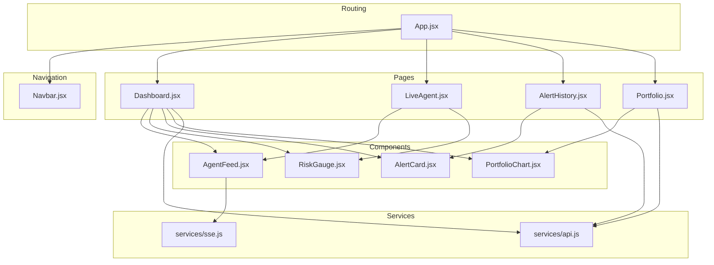
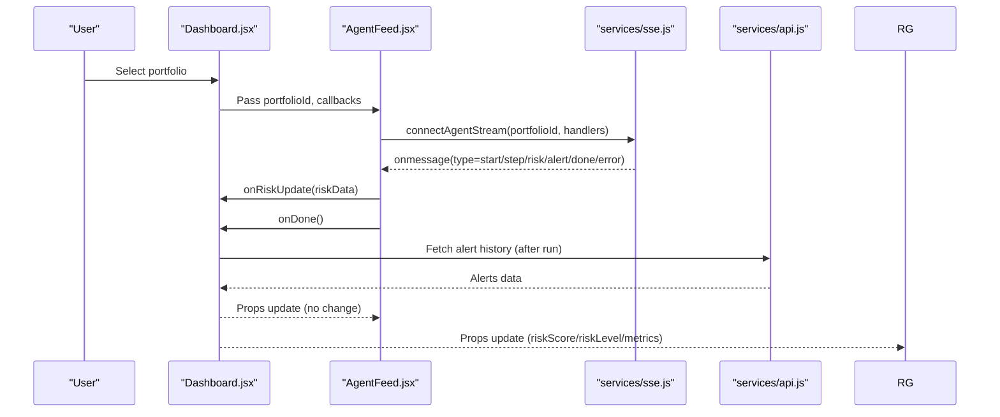
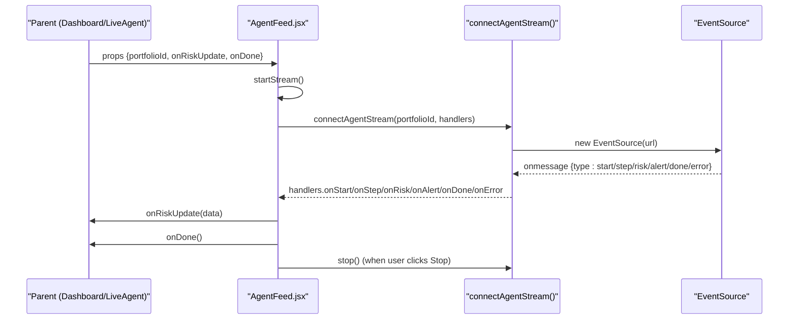
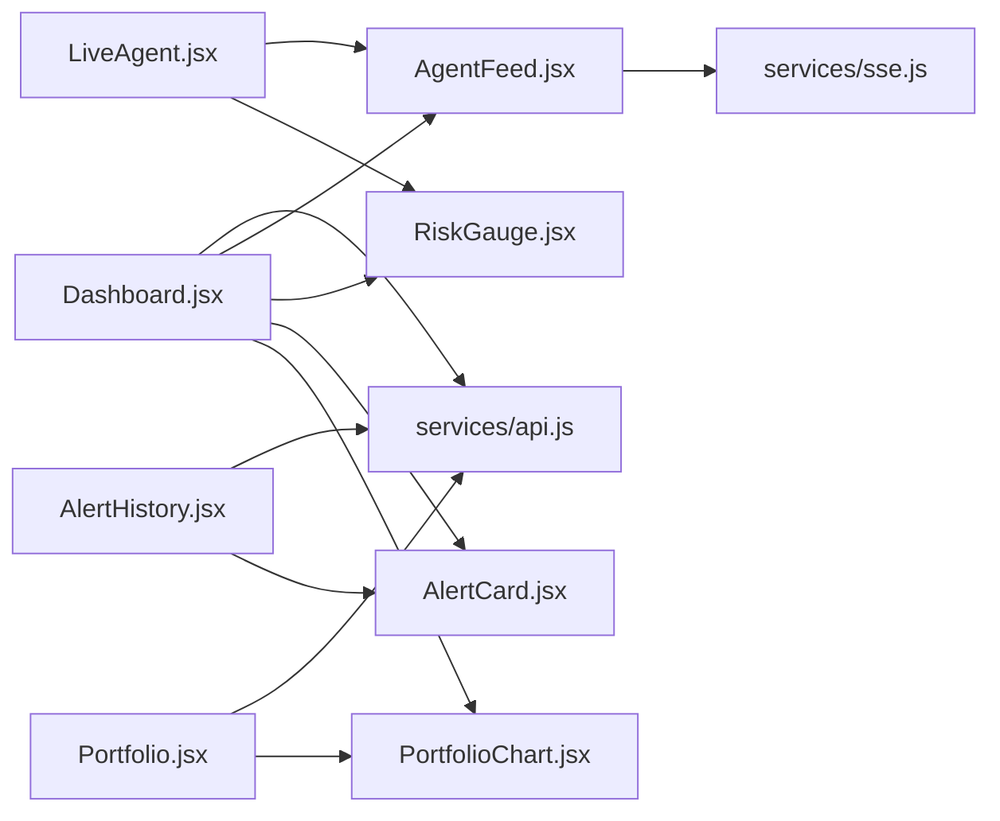

# Component Library

<cite>
**Referenced Files in This Document**
- [Navbar.jsx](file://frontend/src/components/Navbar.jsx)
- [RiskGauge.jsx](file://frontend/src/components/RiskGauge.jsx)
- [AgentFeed.jsx](file://frontend/src/components/AgentFeed.jsx)
- [AlertCard.jsx](file://frontend/src/components/AlertCard.jsx)
- [PortfolioChart.jsx](file://frontend/src/components/PortfolioChart.jsx)
- [App.jsx](file://frontend/src/App.jsx)
- [Dashboard.jsx](file://frontend/src/pages/Dashboard.jsx)
- [LiveAgent.jsx](file://frontend/src/pages/LiveAgent.jsx)
- [AlertHistory.jsx](file://frontend/src/pages/AlertHistory.jsx)
- [Portfolio.jsx](file://frontend/src/pages/Portfolio.jsx)
- [api.js](file://frontend/src/services/api.js)
- [sse.js](file://frontend/src/services/sse.js)
- [index.css](file://frontend/src/index.css)
- [package.json](file://frontend/package.json)
</cite>

## Table of Contents
1. [Introduction](#introduction)
2. [Project Structure](#project-structure)
3. [Core Components](#core-components)
4. [Architecture Overview](#architecture-overview)
5. [Detailed Component Analysis](#detailed-component-analysis)
6. [Dependency Analysis](#dependency-analysis)
7. [Performance Considerations](#performance-considerations)
8. [Troubleshooting Guide](#troubleshooting-guide)
9. [Conclusion](#conclusion)
10. [Appendices](#appendices)

## Introduction
This document describes the React component library used in the ishwarambare-app frontend. It focuses on five reusable components: Navbar for navigation, RiskGauge for visualizing risk metrics, AgentFeed for displaying agent execution progress, AlertCard for presenting individual alerts, and PortfolioChart for portfolio visualization. For each component, we explain the props interface, internal state, event handling, styling approach, composition patterns, and reusability. We also document the component hierarchy, parent-child relationships, and data flow across the app, along with performance optimization techniques and accessibility considerations grounded in the existing codebase.

## Project Structure
The frontend is organized around a small set of presentational components under src/components and page-level containers under src/pages. Routing is handled via react-router-dom, and shared services encapsulate API and SSE integrations. The design system is centralized in index.css with CSS custom properties for theme tokens.

**Diagram sources**
- [App.jsx:8-20](file://frontend/src/App.jsx#L8-L20)
- [Dashboard.jsx:11-14](file://frontend/src/pages/Dashboard.jsx#L11-L14)
- [LiveAgent.jsx:10-11](file://frontend/src/pages/LiveAgent.jsx#L10-L11)
- [AlertHistory.jsx:10](file://frontend/src/pages/AlertHistory.jsx#L10)
- [Portfolio.jsx:11](file://frontend/src/pages/Portfolio.jsx#L11)
- [AgentFeed.jsx:28](file://frontend/src/components/AgentFeed.jsx#L28)
- [RiskGauge.jsx:20](file://frontend/src/components/RiskGauge.jsx#L20)
- [AlertCard.jsx:10](file://frontend/src/components/AlertCard.jsx#L10)
- [PortfolioChart.jsx:34-118](file://frontend/src/components/PortfolioChart.jsx#L34-L118)
- [api.js:12-32](file://frontend/src/services/api.js#L12-L32)
- [sse.js:21-62](file://frontend/src/services/sse.js#L21-L62)

**Section sources**
- [App.jsx:8-20](file://frontend/src/App.jsx#L8-L20)
- [index.css:8-50](file://frontend/src/index.css#L8-L50)

## Core Components
This section outlines the five core components, their responsibilities, and how they fit into the application.

- Navbar: Provides top-level navigation with active state styling and icons.
- RiskGauge: Renders a responsive radial gauge and metric grid for risk scores.
- AgentFeed: Streams agent reasoning steps via SSE, manages lifecycle, and exposes callbacks for risk updates and completion.
- AlertCard: Displays a single alert with risk-based styling, metrics, and delivery indicators.
- PortfolioChart: Provides an allocation pie chart and a risk history area chart.

**Section sources**
- [Navbar.jsx:4-50](file://frontend/src/components/Navbar.jsx#L4-L50)
- [RiskGauge.jsx:20-100](file://frontend/src/components/RiskGauge.jsx#L20-L100)
- [AgentFeed.jsx:28-174](file://frontend/src/components/AgentFeed.jsx#L28-L174)
- [AlertCard.jsx:10-88](file://frontend/src/components/AlertCard.jsx#L10-L88)
- [PortfolioChart.jsx:34-118](file://frontend/src/components/PortfolioChart.jsx#L34-L118)

## Architecture Overview
The app follows a unidirectional data flow:
- Pages orchestrate state and pass data down to components via props.
- AgentFeed subscribes to SSE events and invokes callbacks to update parent state.
- RiskGauge, AlertCard, and PortfolioChart are pure presentational components that receive data via props.
- Services encapsulate API and SSE concerns, returning promises or event-driven streams.

**Diagram sources**
- [Dashboard.jsx:46-47](file://frontend/src/pages/Dashboard.jsx#L46-L47)
- [AgentFeed.jsx:41-77](file://frontend/src/components/AgentFeed.jsx#L41-L77)
- [sse.js:21-62](file://frontend/src/services/sse.js#L21-L62)
- [api.js:27-32](file://frontend/src/services/api.js#L27-L32)

## Detailed Component Analysis

### Navbar
- Purpose: Top navigation with brand identity and route links.
- Props: None.
- State: None.
- Event handling: Uses react-router-dom NavLink for active state styling.
- Styling: Uses CSS custom properties and nav-specific classes from index.css.
- Accessibility: Leverages semantic anchor elements; consider adding aria-current for active link.
- Composition: Included once in App.jsx and rendered at the top of the layout.

Usage example (integration):
- See [App.jsx:11](file://frontend/src/App.jsx#L11).

**Section sources**
- [Navbar.jsx:4-50](file://frontend/src/components/Navbar.jsx#L4-L50)
- [App.jsx:8-20](file://frontend/src/App.jsx#L8-L20)
- [index.css:152-203](file://frontend/src/index.css#L152-L203)

### RiskGauge
- Purpose: Visualize composite risk score with a radial gauge and metrics grid.
- Props:
  - riskScore: number (0..1), default 0
  - riskLevel: string, default 'LOW'
  - metrics: object (e.g., sharpe_ratio, sortino_ratio, annualised_volatility, max_drawdown)
- State: None (pure functional component).
- Event handling: None.
- Styling: ResponsiveContainer, Recharts components, CSS classes for labels and badges.
- Composition: Used in Dashboard and LiveAgent to reflect live risk updates.
- Accessibility: Uses semantic span elements and relies on color + label for meaning; consider ARIA attributes for screen readers.

Usage example (integration):
- See [Dashboard.jsx:160-164](file://frontend/src/pages/Dashboard.jsx#L160-L164) and [LiveAgent.jsx:66-70](file://frontend/src/pages/LiveAgent.jsx#L66-L70).

**Section sources**
- [RiskGauge.jsx:20-100](file://frontend/src/components/RiskGauge.jsx#L20-L100)
- [Dashboard.jsx:160-164](file://frontend/src/pages/Dashboard.jsx#L160-L164)
- [LiveAgent.jsx:66-70](file://frontend/src/pages/LiveAgent.jsx#L66-L70)

### AgentFeed
- Purpose: Real-time streaming of agent reasoning steps via SSE.
- Props:
  - portfolioId: number | null
  - onRiskUpdate: function (receives risk data)
  - onDone: function (called when run completes)
- Internal state:
  - lines: array of log entries
  - running: boolean
  - status: 'idle' | 'running' | 'done' | 'error'
  - stepCount: number
  - bottomRef, ctrlRef: DOM and controller refs
- Event handling:
  - startStream: validates portfolioId, clears state, connects SSE, appends lines, updates stepCount, emits onRiskUpdate/onDone/onError.
  - stopStream: closes SSE stream and resets UI.
  - reset: stops stream and clears logs.
- Styling: Uses CSS classes for header, feed container, status bar, and per-line classification.
- Composition: Consumed by Dashboard and LiveAgent; integrates with portfolio selection and risk updates.
- Accessibility: Uses semantic divs and buttons; consider adding role="log" to the feed container and keyboard shortcuts for controls.

**Diagram sources**
- [AgentFeed.jsx:28](file://frontend/src/components/AgentFeed.jsx#L28)
- [AgentFeed.jsx:41-77](file://frontend/src/components/AgentFeed.jsx#L41-L77)
- [sse.js:21-62](file://frontend/src/services/sse.js#L21-L62)

**Section sources**
- [AgentFeed.jsx:28-174](file://frontend/src/components/AgentFeed.jsx#L28-L174)
- [Dashboard.jsx:133-137](file://frontend/src/pages/Dashboard.jsx#L133-L137)
- [LiveAgent.jsx:54-58](file://frontend/src/pages/LiveAgent.jsx#L54-L58)
- [sse.js:21-62](file://frontend/src/services/sse.js#L21-L62)

### AlertCard
- Purpose: Display a single alert with risk level, metrics, and delivery status.
- Props:
  - alert: object (risk_score, risk_level, sharpe_ratio, sortino_ratio, ann_volatility, avg_sentiment, email_sent, sms_sent, created_at, portfolio_id)
  - onClick: function (optional)
- State: None.
- Event handling: onClick delegates to parent handler.
- Styling: Uses CSS custom properties for risk colors, badges, and typography.
- Composition: Used in Dashboard (recent alerts) and AlertHistory (full list).
- Accessibility: Uses clickable container with explicit cursor; consider adding role="button" and tabindex for keyboard navigation.

Usage example (integration):
- See [Dashboard.jsx:189-191](file://frontend/src/pages/Dashboard.jsx#L189-L191) and [AlertHistory.jsx:103-106](file://frontend/src/pages/AlertHistory.jsx#L103-L106).

**Section sources**
- [AlertCard.jsx:10-88](file://frontend/src/components/AlertCard.jsx#L10-L88)
- [Dashboard.jsx:189-191](file://frontend/src/pages/Dashboard.jsx#L189-L191)
- [AlertHistory.jsx:103-106](file://frontend/src/pages/AlertHistory.jsx#L103-L106)

### PortfolioChart
- Purpose: Provide portfolio allocation visualization and risk history chart.
- Props:
  - AllocationPie.tickers: object (ticker -> weight)
  - RiskHistory.alerts: array of alert objects
- Internal state: None.
- Event handling: None.
- Styling: Recharts components with custom tooltip and legend; responsive sizing.
- Composition: Used in Dashboard and Portfolio pages.
- Accessibility: Recharts tooltips rely on native hover; consider adding aria-labels and keyboard navigation for interactive elements.

Usage example (integration):
- See [Dashboard.jsx:140-149](file://frontend/src/pages/Dashboard.jsx#L140-L149) and [Portfolio.jsx:355](file://frontend/src/pages/Portfolio.jsx#L355).

**Section sources**
- [PortfolioChart.jsx:34-118](file://frontend/src/components/PortfolioChart.jsx#L34-L118)
- [Dashboard.jsx:140-149](file://frontend/src/pages/Dashboard.jsx#L140-L149)
- [Portfolio.jsx:355](file://frontend/src/pages/Portfolio.jsx#L355)

## Dependency Analysis
- Component-to-service dependencies:
  - AgentFeed depends on services/sse.js for streaming.
  - Dashboard and AlertHistory depend on services/api.js for fetching data.
  - PortfolioChart is a pure presentation component with no external dependencies.
- Component-to-component dependencies:
  - Dashboard composes AgentFeed, RiskGauge, AlertCard, and PortfolioChart.
  - LiveAgent composes AgentFeed and RiskGauge.
  - AlertHistory composes AlertCard.
  - Portfolio page composes PortfolioChart.
- External libraries:
  - Recharts for charts.
  - date-fns for time formatting.
  - lucide-react for icons.
  - axios for HTTP requests.
  - react-router-dom for routing.

**Diagram sources**
- [AgentFeed.jsx:9](file://frontend/src/components/AgentFeed.jsx#L9)
- [Dashboard.jsx:11-14](file://frontend/src/pages/Dashboard.jsx#L11-L14)
- [AlertHistory.jsx:10](file://frontend/src/pages/AlertHistory.jsx#L10)
- [Portfolio.jsx:11](file://frontend/src/pages/Portfolio.jsx#L11)
- [LiveAgent.jsx:10-11](file://frontend/src/pages/LiveAgent.jsx#L10-L11)

**Section sources**
- [package.json:11-18](file://frontend/package.json#L11-L18)
- [api.js:12-32](file://frontend/src/services/api.js#L12-L32)
- [sse.js:21-62](file://frontend/src/services/sse.js#L21-L62)

## Performance Considerations
- Minimize re-renders:
  - Use memoization for expensive computations inside components (e.g., metric formatting) if needed.
  - Keep callback functions stable across renders by using useCallback in parent components when passing to children.
- Virtualize long lists:
  - For very large alert histories, consider virtualized lists to reduce DOM nodes.
- Chart rendering:
  - PortfolioChart uses Recharts; ensure data arrays are stable to avoid unnecessary redraws.
- Streaming:
  - AgentFeed appends lines efficiently; consider batching updates if throughput becomes high.
- CSS custom properties:
  - index.css centralizes theme tokens; avoid frequent style recalculations by reusing variables.

[No sources needed since this section provides general guidance]

## Troubleshooting Guide
- AgentFeed does not start:
  - Ensure portfolioId is set before invoking startStream.
  - Verify SSE endpoint availability and CORS configuration.
- Risk updates not reflected:
  - Confirm onRiskUpdate callback is passed and invoked by AgentFeed.
  - Check that parent state updates are reflected in props to RiskGauge.
- Charts not visible:
  - Ensure responsive containers have explicit height and width.
  - Verify tickers/alerts arrays are populated before rendering charts.
- Styling inconsistencies:
  - Confirm CSS custom properties are defined in index.css and used consistently across components.

**Section sources**
- [AgentFeed.jsx:41-77](file://frontend/src/components/AgentFeed.jsx#L41-L77)
- [Dashboard.jsx:46-47](file://frontend/src/pages/Dashboard.jsx#L46-L47)
- [index.css:8-50](file://frontend/src/index.css#L8-L50)

## Conclusion
The component library is designed around clear separation of concerns: pages orchestrate state and data fetching, while presentational components focus on rendering and minimal interactivity. The design system built with CSS custom properties ensures consistent theming. The streaming AgentFeed integrates seamlessly with SSE, and the charts provide rich visualizations for risk and allocations. Following the composition patterns and performance tips outlined here will help maintain scalability and usability.

[No sources needed since this section summarizes without analyzing specific files]

## Appendices

### Props Reference Summary
- Navbar
  - None
- RiskGauge
  - riskScore?: number
  - riskLevel?: string
  - metrics?: object
- AgentFeed
  - portfolioId?: number | null
  - onRiskUpdate?: function
  - onDone?: function
- AlertCard
  - alert: object
  - onClick?: function
- PortfolioChart.AllocationPie
  - tickers: object
- PortfolioChart.RiskHistory
  - alerts: array

**Section sources**
- [RiskGauge.jsx:20](file://frontend/src/components/RiskGauge.jsx#L20)
- [AgentFeed.jsx:28](file://frontend/src/components/AgentFeed.jsx#L28)
- [AlertCard.jsx:10](file://frontend/src/components/AlertCard.jsx#L10)
- [PortfolioChart.jsx:34](file://frontend/src/components/PortfolioChart.jsx#L34)
- [PortfolioChart.jsx:77](file://frontend/src/components/PortfolioChart.jsx#L77)

### Usage Examples (Paths)
- Navbar integration:
  - [App.jsx:11](file://frontend/src/App.jsx#L11)
- RiskGauge integration:
  - [Dashboard.jsx:160-164](file://frontend/src/pages/Dashboard.jsx#L160-L164)
  - [LiveAgent.jsx:66-70](file://frontend/src/pages/LiveAgent.jsx#L66-L70)
- AgentFeed integration:
  - [Dashboard.jsx:133-137](file://frontend/src/pages/Dashboard.jsx#L133-L137)
  - [LiveAgent.jsx:54-58](file://frontend/src/pages/LiveAgent.jsx#L54-L58)
- AlertCard integration:
  - [Dashboard.jsx:189-191](file://frontend/src/pages/Dashboard.jsx#L189-L191)
  - [AlertHistory.jsx:103-106](file://frontend/src/pages/AlertHistory.jsx#L103-L106)
- PortfolioChart integration:
  - [Dashboard.jsx:140-149](file://frontend/src/pages/Dashboard.jsx#L140-L149)
  - [Portfolio.jsx:355](file://frontend/src/pages/Portfolio.jsx#L355)

**Section sources**
- [Dashboard.jsx:133-191](file://frontend/src/pages/Dashboard.jsx#L133-L191)
- [LiveAgent.jsx:54-70](file://frontend/src/pages/LiveAgent.jsx#L54-L70)
- [AlertHistory.jsx:103-106](file://frontend/src/pages/AlertHistory.jsx#L103-L106)
- [Portfolio.jsx:355](file://frontend/src/pages/Portfolio.jsx#L355)