# Frontend Architecture

<cite>
**Referenced Files in This Document**
- [main.jsx](file://frontend/src/main.jsx)
- [App.jsx](file://frontend/src/App.jsx)
- [Navbar.jsx](file://frontend/src/components/Navbar.jsx)
- [RiskGauge.jsx](file://frontend/src/components/RiskGauge.jsx)
- [AgentFeed.jsx](file://frontend/src/components/AgentFeed.jsx)
- [AlertCard.jsx](file://frontend/src/components/AlertCard.jsx)
- [PortfolioChart.jsx](file://frontend/src/components/PortfolioChart.jsx)
- [Dashboard.jsx](file://frontend/src/pages/Dashboard.jsx)
- [LiveAgent.jsx](file://frontend/src/pages/LiveAgent.jsx)
- [AlertHistory.jsx](file://frontend/src/pages/AlertHistory.jsx)
- [Portfolio.jsx](file://frontend/src/pages/Portfolio.jsx)
- [api.js](file://frontend/src/services/api.js)
- [sse.js](file://frontend/src/services/sse.js)
- [package.json](file://frontend/package.json)
- [vite.config.js](file://frontend/vite.config.js)
</cite>

## Table of Contents
1. [Introduction](#introduction)
2. [Project Structure](#project-structure)
3. [Core Components](#core-components)
4. [Architecture Overview](#architecture-overview)
5. [Detailed Component Analysis](#detailed-component-analysis)
6. [Dependency Analysis](#dependency-analysis)
7. [Performance Considerations](#performance-considerations)
8. [Troubleshooting Guide](#troubleshooting-guide)
9. [Conclusion](#conclusion)
10. [Appendices](#appendices)

## Introduction
This document describes the frontend architecture of the ishwarambare-app React application. It explains the component-based structure, routing, state management, service layer, styling, build configuration, and performance characteristics. It focuses on reusable components, page-level components, and the integration of HTTP and Server-Sent Events for real-time agent execution and alert history.

## Project Structure
The frontend is organized into clear layers:
- Entry point initializes the app and mounts the root component.
- Routing is configured via React Router with a shared Navbar and route-specific pages.
- Pages encapsulate page-level concerns and orchestrate reusable components.
- Services abstract HTTP and SSE integrations.
- Components are small, focused, and composable.

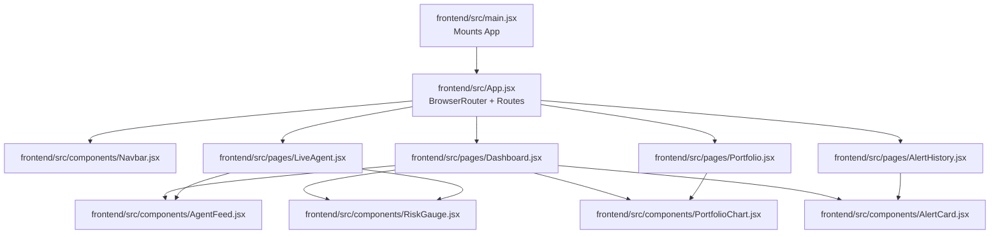

**Diagram sources**
- [main.jsx:1-11](file://frontend/src/main.jsx#L1-L11)
- [App.jsx:1-21](file://frontend/src/App.jsx#L1-L21)
- [Navbar.jsx:1-51](file://frontend/src/components/Navbar.jsx#L1-L51)
- [Dashboard.jsx:1-211](file://frontend/src/pages/Dashboard.jsx#L1-L211)
- [LiveAgent.jsx:1-95](file://frontend/src/pages/LiveAgent.jsx#L1-L95)
- [AlertHistory.jsx:1-163](file://frontend/src/pages/AlertHistory.jsx#L1-L163)
- [Portfolio.jsx:1-387](file://frontend/src/pages/Portfolio.jsx#L1-L387)
- [AgentFeed.jsx:1-175](file://frontend/src/components/AgentFeed.jsx#L1-L175)
- [RiskGauge.jsx:1-101](file://frontend/src/components/RiskGauge.jsx#L1-L101)
- [PortfolioChart.jsx:1-119](file://frontend/src/components/PortfolioChart.jsx#L1-L119)
- [AlertCard.jsx:1-89](file://frontend/src/components/AlertCard.jsx#L1-L89)

**Section sources**
- [main.jsx:1-11](file://frontend/src/main.jsx#L1-L11)
- [App.jsx:1-21](file://frontend/src/App.jsx#L1-L21)

## Core Components
- Navbar: Navigation links integrated with React Router’s NavLink to reflect active routes.
- RiskGauge: Recharts-based radial gauge rendering risk score, level, and metrics.
- AgentFeed: Real-time agent reasoning log backed by Server-Sent Events; exposes callbacks for risk updates and completion.
- AlertCard: Compact card for alert history entries with delivery indicators and metrics.
- PortfolioChart: Recharts-based allocation pie and risk history area chart.

These components are designed for reuse across pages and are kept stateless where possible, delegating state to parent pages.

**Section sources**
- [Navbar.jsx:1-51](file://frontend/src/components/Navbar.jsx#L1-L51)
- [RiskGauge.jsx:1-101](file://frontend/src/components/RiskGauge.jsx#L1-L101)
- [AgentFeed.jsx:1-175](file://frontend/src/components/AgentFeed.jsx#L1-L175)
- [AlertCard.jsx:1-89](file://frontend/src/components/AlertCard.jsx#L1-L89)
- [PortfolioChart.jsx:1-119](file://frontend/src/components/PortfolioChart.jsx#L1-L119)

## Architecture Overview
The frontend follows a layered architecture:
- Presentation Layer: Pages and components.
- Service Layer: HTTP client and SSE wrapper.
- Backend: FastAPI endpoints exposed under /api.

Routing is centralized in App.jsx with four primary routes. Pages compose reusable components and interact with services to fetch and mutate data.

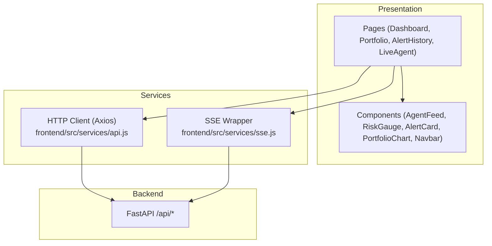

**Diagram sources**
- [App.jsx:1-21](file://frontend/src/App.jsx#L1-L21)
- [Dashboard.jsx:1-211](file://frontend/src/pages/Dashboard.jsx#L1-L211)
- [LiveAgent.jsx:1-95](file://frontend/src/pages/LiveAgent.jsx#L1-L95)
- [AlertHistory.jsx:1-163](file://frontend/src/pages/AlertHistory.jsx#L1-L163)
- [Portfolio.jsx:1-387](file://frontend/src/pages/Portfolio.jsx#L1-L387)
- [api.js:1-35](file://frontend/src/services/api.js#L1-L35)
- [sse.js:1-63](file://frontend/src/services/sse.js#L1-L63)

## Detailed Component Analysis

### Routing and Navigation
- BrowserRouter wraps the app and defines routes for Dashboard, Portfolio, AlertHistory, and LiveAgent.
- Navbar uses NavLink to reflect active routes and integrates Lucide icons for visual cues.

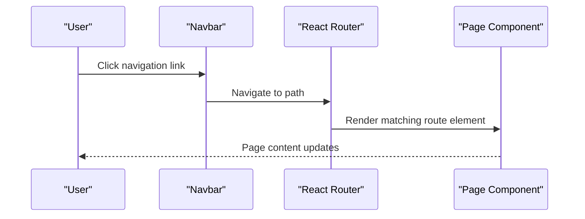

**Diagram sources**
- [App.jsx:1-21](file://frontend/src/App.jsx#L1-L21)
- [Navbar.jsx:1-51](file://frontend/src/components/Navbar.jsx#L1-L51)

**Section sources**
- [App.jsx:1-21](file://frontend/src/App.jsx#L1-L21)
- [Navbar.jsx:1-51](file://frontend/src/components/Navbar.jsx#L1-L51)

### Service Layer: HTTP and SSE
- HTTP client: Axios instance configured with base URL from environment, timeouts, and JSON headers. Exposes typed API groups for portfolio, agent, and alerts.
- SSE: EventSource wrapper that connects to a backend SSE endpoint, dispatches events to handlers, and returns a stop controller.

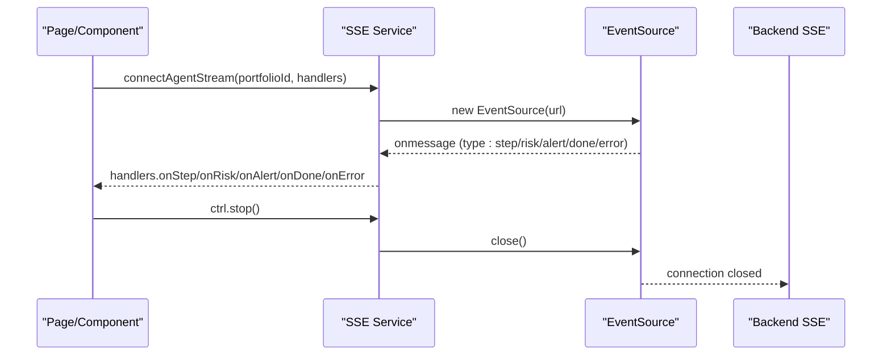

**Diagram sources**
- [sse.js:1-63](file://frontend/src/services/sse.js#L1-L63)

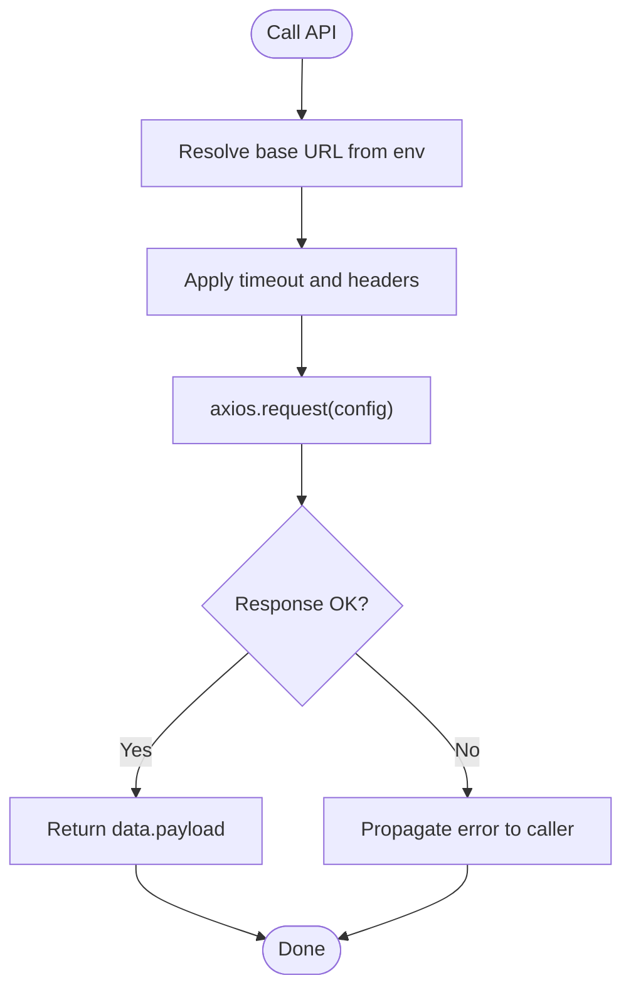

**Diagram sources**
- [api.js:1-35](file://frontend/src/services/api.js#L1-L35)

**Section sources**
- [api.js:1-35](file://frontend/src/services/api.js#L1-L35)
- [sse.js:1-63](file://frontend/src/services/sse.js#L1-L63)

### Dashboard Page
- Loads portfolios, stats, and recent alerts concurrently.
- Provides portfolio selection and live risk visualization via RiskGauge.
- Streams agent reasoning via AgentFeed and updates risk metrics in real time.
- Displays recent alerts with AlertCard and risk history chart.

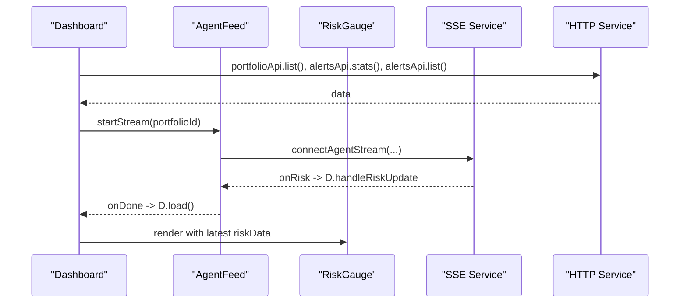

**Diagram sources**
- [Dashboard.jsx:1-211](file://frontend/src/pages/Dashboard.jsx#L1-L211)
- [AgentFeed.jsx:1-175](file://frontend/src/components/AgentFeed.jsx#L1-L175)
- [RiskGauge.jsx:1-101](file://frontend/src/components/RiskGauge.jsx#L1-L101)
- [api.js:1-35](file://frontend/src/services/api.js#L1-L35)
- [sse.js:1-63](file://frontend/src/services/sse.js#L1-L63)

**Section sources**
- [Dashboard.jsx:1-211](file://frontend/src/pages/Dashboard.jsx#L1-L211)

### Live Agent Page
- Dedicated full-screen layout for real-time agent execution.
- Selects a portfolio and streams reasoning logs while updating the risk gauge.

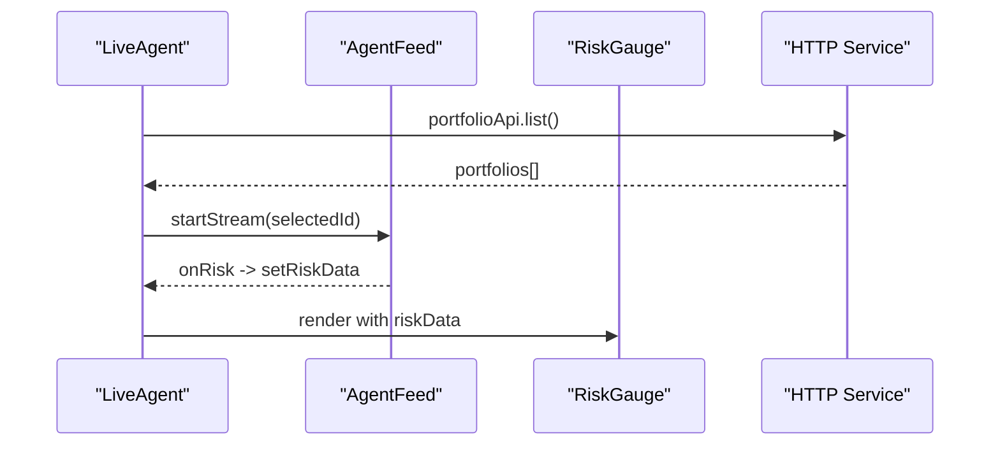

**Diagram sources**
- [LiveAgent.jsx:1-95](file://frontend/src/pages/LiveAgent.jsx#L1-L95)
- [AgentFeed.jsx:1-175](file://frontend/src/components/AgentFeed.jsx#L1-L175)
- [RiskGauge.jsx:1-101](file://frontend/src/components/RiskGauge.jsx#L1-L101)
- [api.js:1-35](file://frontend/src/services/api.js#L1-L35)

**Section sources**
- [LiveAgent.jsx:1-95](file://frontend/src/pages/LiveAgent.jsx#L1-L95)

### Alert History Page
- Lists alerts with filtering by risk level and expandable reasoning logs.
- Displays stats and paginates/alerts via concurrent loads.

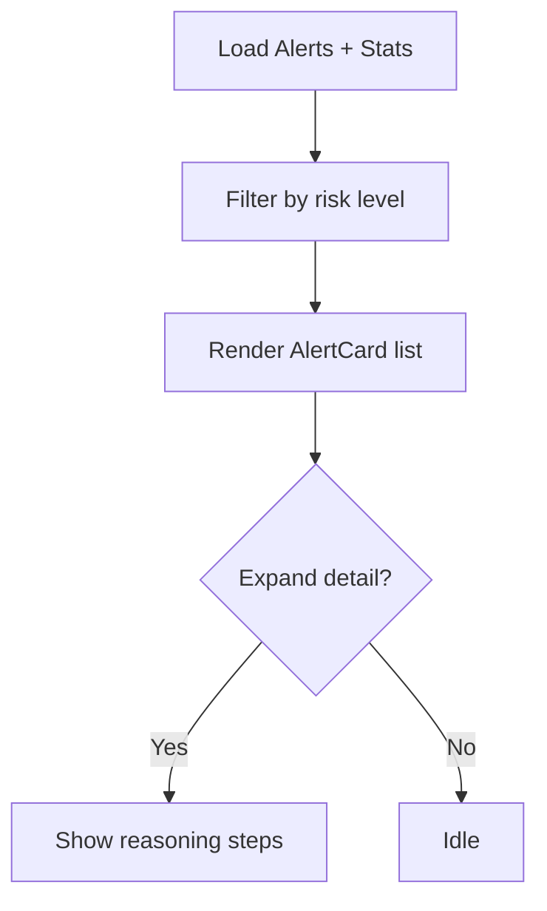

**Diagram sources**
- [AlertHistory.jsx:1-163](file://frontend/src/pages/AlertHistory.jsx#L1-L163)
- [AlertCard.jsx:1-89](file://frontend/src/components/AlertCard.jsx#L1-L89)

**Section sources**
- [AlertHistory.jsx:1-163](file://frontend/src/pages/AlertHistory.jsx#L1-L163)
- [AlertCard.jsx:1-89](file://frontend/src/components/AlertCard.jsx#L1-L89)

### Portfolio Management Page
- Manages creation, editing, and deletion of portfolios.
- Inline ticker/weight editor with live validation ensuring weights sum to 100%.
- Integrates with portfolio API and displays allocation pie.

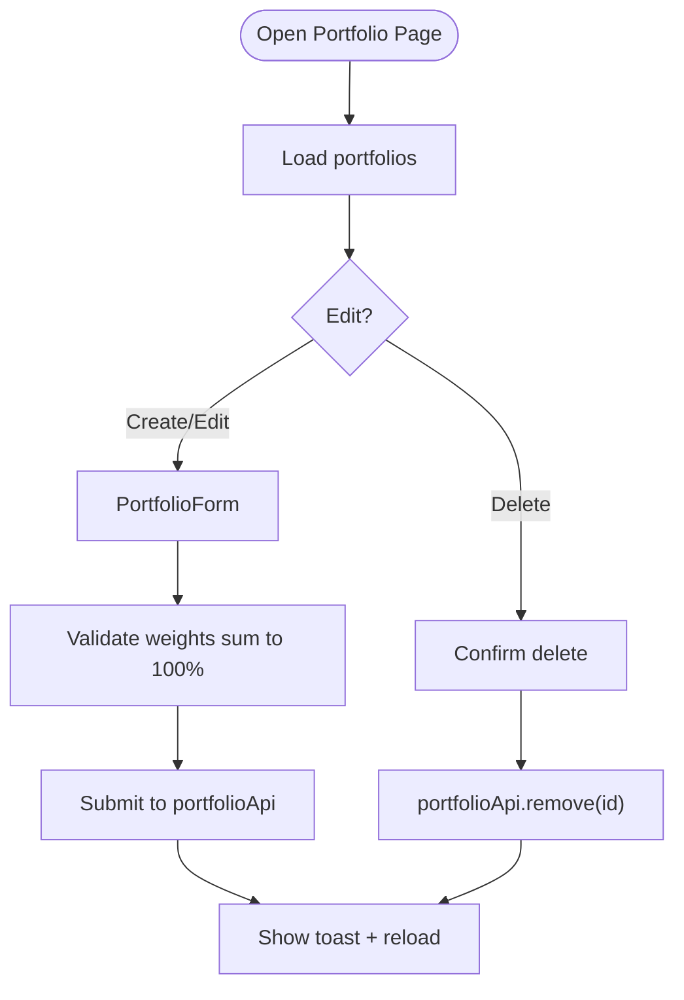

**Diagram sources**
- [Portfolio.jsx:1-387](file://frontend/src/pages/Portfolio.jsx#L1-L387)
- [api.js:1-35](file://frontend/src/services/api.js#L1-L35)
- [PortfolioChart.jsx:1-119](file://frontend/src/components/PortfolioChart.jsx#L1-L119)

**Section sources**
- [Portfolio.jsx:1-387](file://frontend/src/pages/Portfolio.jsx#L1-L387)

### RiskGauge Component
- Renders a Recharts RadialBarChart with a centered numeric label and risk level badge.
- Accepts risk score, level, and metrics; computes color and percentage internally.

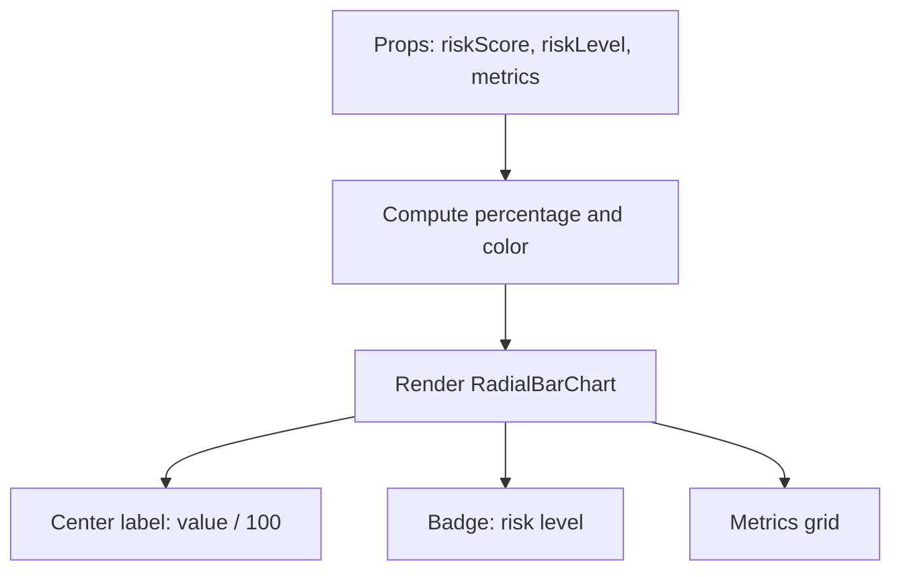

**Diagram sources**
- [RiskGauge.jsx:1-101](file://frontend/src/components/RiskGauge.jsx#L1-L101)

**Section sources**
- [RiskGauge.jsx:1-101](file://frontend/src/components/RiskGauge.jsx#L1-L101)

### AgentFeed Component
- Manages SSE lifecycle, maintains a scrollable log, and classifies messages by sentiment.
- Emits callbacks for risk updates and completion to parents.

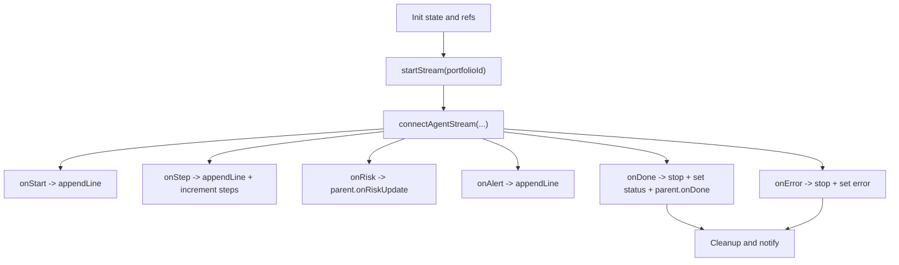

**Diagram sources**
- [AgentFeed.jsx:1-175](file://frontend/src/components/AgentFeed.jsx#L1-L175)
- [sse.js:1-63](file://frontend/src/services/sse.js#L1-L63)

**Section sources**
- [AgentFeed.jsx:1-175](file://frontend/src/components/AgentFeed.jsx#L1-L175)

## Dependency Analysis
- React and React Router: Core framework and routing.
- Recharts: Visualization for gauges and charts.
- Axios: HTTP client for API communication.
- date-fns: Date formatting utilities.
- lucide-react: Icons for UI.

Build and dev tooling:
- Vite: Build tool with React plugin, dev server, and proxy for /api to backend.
- Environment variables: VITE_API_URL controls the backend base URL.

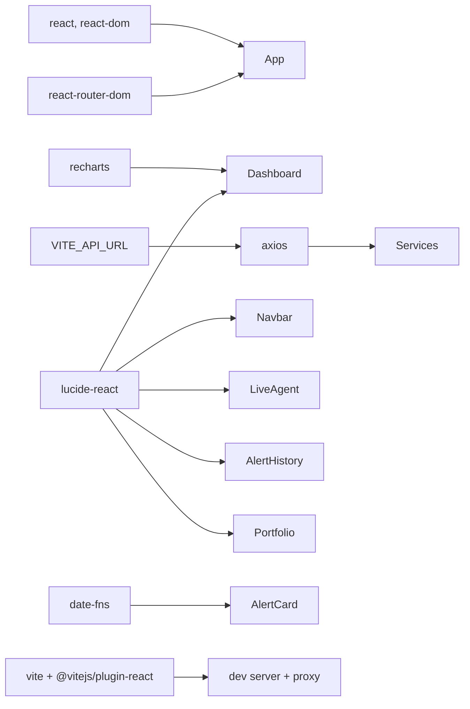

**Diagram sources**
- [package.json:1-27](file://frontend/package.json#L1-L27)
- [vite.config.js:1-23](file://frontend/vite.config.js#L1-L23)
- [api.js:1-35](file://frontend/src/services/api.js#L1-L35)
- [Navbar.jsx:1-51](file://frontend/src/components/Navbar.jsx#L1-L51)
- [Dashboard.jsx:1-211](file://frontend/src/pages/Dashboard.jsx#L1-L211)
- [LiveAgent.jsx:1-95](file://frontend/src/pages/LiveAgent.jsx#L1-L95)
- [AlertHistory.jsx:1-163](file://frontend/src/pages/AlertHistory.jsx#L1-L163)
- [Portfolio.jsx:1-387](file://frontend/src/pages/Portfolio.jsx#L1-L387)
- [AlertCard.jsx:1-89](file://frontend/src/components/AlertCard.jsx#L1-L89)

**Section sources**
- [package.json:1-27](file://frontend/package.json#L1-L27)
- [vite.config.js:1-23](file://frontend/vite.config.js#L1-L23)

## Performance Considerations
- Concurrent loading: Pages use Promise.all to reduce total latency when fetching related data.
- Memoization: Dashboard uses a memoized loader to avoid unnecessary re-renders.
- Efficient charts: Recharts components are responsive and optimized for small datasets.
- SSE lifecycle: AgentFeed ensures streams are stopped when unmounted or when requested, preventing resource leaks.
- Build optimizations: Vite provides fast HMR and production builds; sourcemaps disabled in production.

[No sources needed since this section provides general guidance]

## Troubleshooting Guide
- API connectivity:
  - Verify VITE_API_URL points to the correct backend host/port.
  - Check proxy configuration in dev server for /api requests.
- SSE errors:
  - AgentFeed emits error events and closes the stream; confirm backend SSE endpoint availability.
  - Inspect browser network tab for EventSource failures.
- Missing data:
  - Ensure portfolio selection is present before starting agent streams.
  - Confirm alert history filters and pagination parameters.

**Section sources**
- [vite.config.js:1-23](file://frontend/vite.config.js#L1-L23)
- [api.js:1-35](file://frontend/src/services/api.js#L1-L35)
- [sse.js:1-63](file://frontend/src/services/sse.js#L1-L63)
- [AgentFeed.jsx:1-175](file://frontend/src/components/AgentFeed.jsx#L1-L175)

## Conclusion
The frontend employs a clean, component-driven architecture with clear separation between pages, reusable components, and a focused service layer. React Router manages navigation, Axios handles HTTP, and SSE powers real-time agent execution. The design emphasizes composability, maintainability, and responsiveness, with room for further enhancements around state management and advanced charting.

## Appendices

### Styling Architecture
- CSS Modules and scoped styles are not used in the current codebase; styling relies on global CSS classes and inline styles within components.
- Design system principles observed:
  - Consistent spacing and typography tokens via CSS variables.
  - Semantic color tokens for risk levels (e.g., --risk-high, --risk-medium, --risk-low).
  - Card-based layout with consistent borders and shadows.
  - Responsive grids and flexible layouts.

[No sources needed since this section doesn't analyze specific files]

### Accessibility Considerations
- Keyboard navigable via focusable buttons and selects.
- Sufficient color contrast for risk badges and metrics.
- Clear labels and hints for form inputs.
- ARIA roles and attributes are not explicitly used; adding role="button" and aria-* attributes would improve screen reader support.

[No sources needed since this section provides general guidance]

### Responsive Design Patterns
- Grid-based layouts adapt to viewport width.
- Recharts containers use ResponsiveContainer for adaptive sizing.
- Inline styles adjust widths and gaps for smaller screens.

[No sources needed since this section provides general guidance]