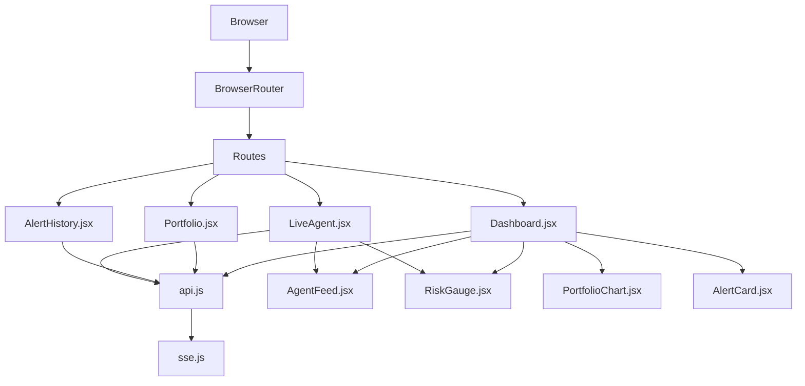
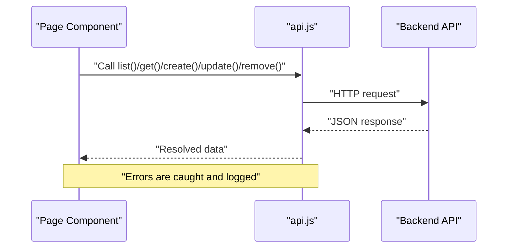
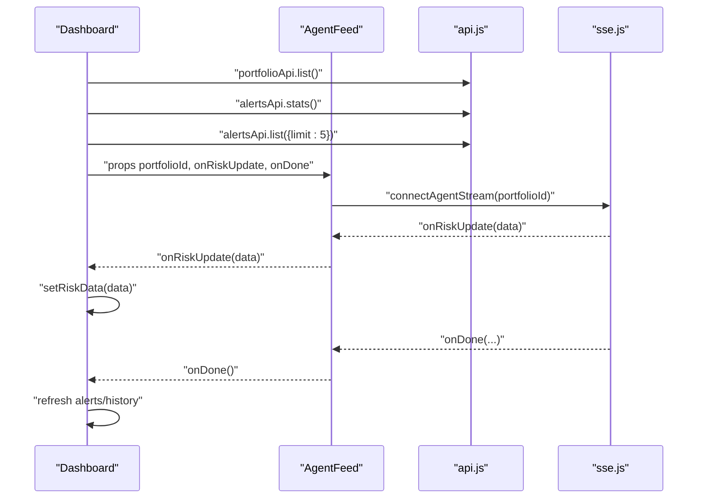
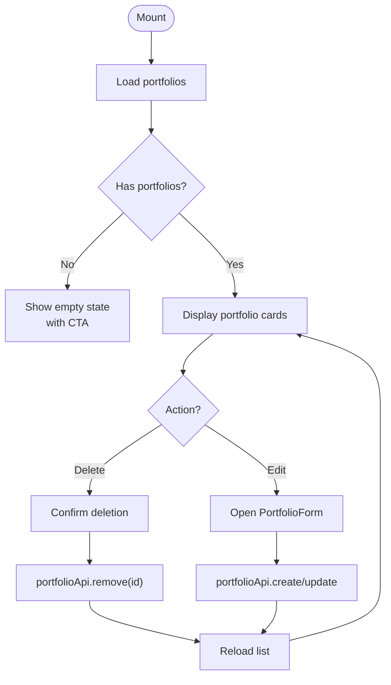
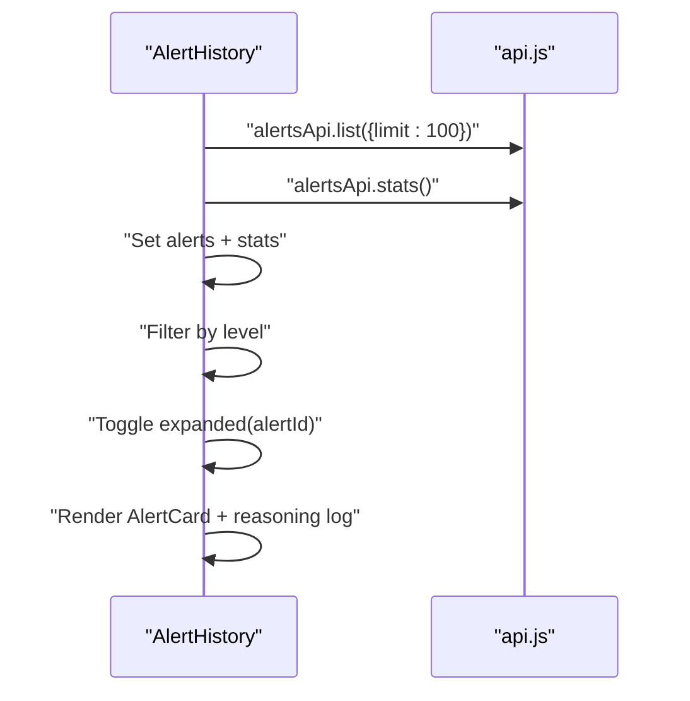
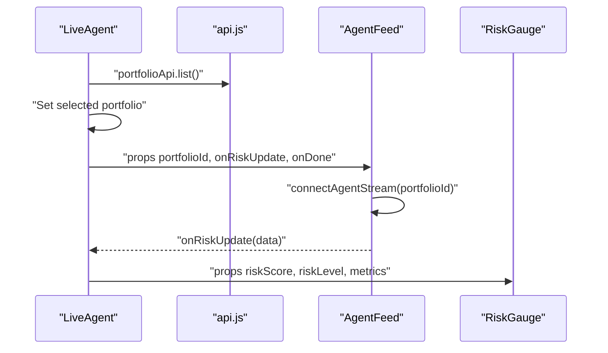
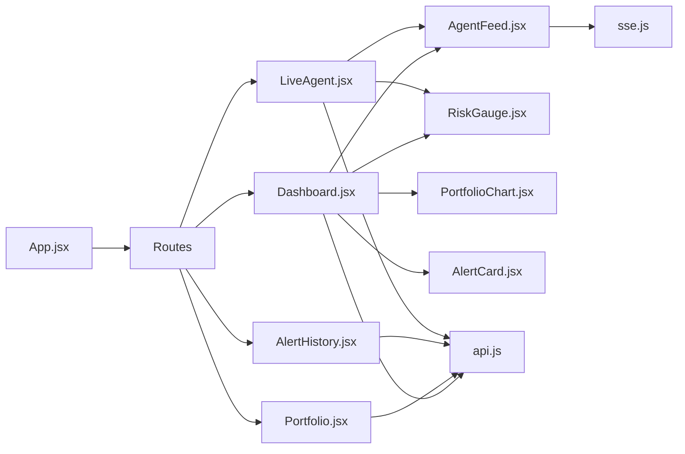

# Page Components

<cite>
**Referenced Files in This Document**
- [App.jsx](file://frontend/src/App.jsx)
- [Navbar.jsx](file://frontend/src/components/Navbar.jsx)
- [Dashboard.jsx](file://frontend/src/pages/Dashboard.jsx)
- [Portfolio.jsx](file://frontend/src/pages/Portfolio.jsx)
- [AlertHistory.jsx](file://frontend/src/pages/AlertHistory.jsx)
- [LiveAgent.jsx](file://frontend/src/pages/LiveAgent.jsx)
- [AgentFeed.jsx](file://frontend/src/components/AgentFeed.jsx)
- [RiskGauge.jsx](file://frontend/src/components/RiskGauge.jsx)
- [PortfolioChart.jsx](file://frontend/src/components/PortfolioChart.jsx)
- [AlertCard.jsx](file://frontend/src/components/AlertCard.jsx)
- [api.js](file://frontend/src/services/api.js)
- [sse.js](file://frontend/src/services/sse.js)
- [index.html](file://frontend/index.html)
- [package.json](file://frontend/package.json)
</cite>

## Table of Contents
1. [Introduction](#introduction)
2. [Project Structure](#project-structure)
3. [Core Components](#core-components)
4. [Architecture Overview](#architecture-overview)
5. [Detailed Component Analysis](#detailed-component-analysis)
6. [Dependency Analysis](#dependency-analysis)
7. [Performance Considerations](#performance-considerations)
8. [Troubleshooting Guide](#troubleshooting-guide)
9. [Conclusion](#conclusion)
10. [Appendices](#appendices)

## Introduction
This document describes the page-level components of the frontend for ishwarambare-app. It focuses on four main pages:
- Dashboard: overview and quick actions for portfolio monitoring
- Portfolio: portfolio creation, editing, and deletion
- AlertHistory: historical alert records with filtering and expandable reasoning logs
- LiveAgent: dedicated full-screen real-time agent run with live risk visualization

It explains data fetching patterns, service-layer integration, page lifecycle, state management, navigation, styling, responsiveness, routing, parameter handling, error boundaries, performance optimization, lazy loading, SEO, and page-to-page data sharing.

## Project Structure
The frontend is a React application bootstrapped with Vite. Pages are routed under BrowserRouter and rendered by App. Navigation is provided by Navbar. Services encapsulate HTTP and SSE integrations. Shared components power charts, gauges, and cards.

**Diagram sources**
- [App.jsx:1-21](file://frontend/src/App.jsx#L1-L21)
- [Navbar.jsx:1-51](file://frontend/src/components/Navbar.jsx#L1-L51)
- [Dashboard.jsx:1-211](file://frontend/src/pages/Dashboard.jsx#L1-L211)
- [Portfolio.jsx:1-387](file://frontend/src/pages/Portfolio.jsx#L1-L387)
- [AlertHistory.jsx:1-163](file://frontend/src/pages/AlertHistory.jsx#L1-L163)
- [LiveAgent.jsx:1-95](file://frontend/src/pages/LiveAgent.jsx#L1-L95)
- [AgentFeed.jsx:1-175](file://frontend/src/components/AgentFeed.jsx#L1-L175)
- [RiskGauge.jsx:1-101](file://frontend/src/components/RiskGauge.jsx#L1-L101)
- [PortfolioChart.jsx:1-119](file://frontend/src/components/PortfolioChart.jsx#L1-L119)
- [AlertCard.jsx:1-89](file://frontend/src/components/AlertCard.jsx#L1-L89)
- [api.js:1-35](file://frontend/src/services/api.js#L1-L35)
- [sse.js:1-63](file://frontend/src/services/sse.js#L1-L63)

**Section sources**
- [App.jsx:1-21](file://frontend/src/App.jsx#L1-L21)
- [Navbar.jsx:1-51](file://frontend/src/components/Navbar.jsx#L1-L51)
- [package.json:1-27](file://frontend/package.json#L1-L27)

## Core Components
- Dashboard: orchestrates portfolio selection, risk visualization, recent alerts, and agent feed. Uses concurrent data fetching and a callback-driven risk update pattern.
- Portfolio: manages portfolio lifecycle (list, create, edit, delete) with inline ticker/weight editor and live validation.
- AlertHistory: lists alerts with filtering, statistics, and expandable reasoning logs.
- LiveAgent: dedicated full-screen run page with portfolio selector and live risk gauge.

**Section sources**
- [Dashboard.jsx:16-199](file://frontend/src/pages/Dashboard.jsx#L16-L199)
- [Portfolio.jsx:252-386](file://frontend/src/pages/Portfolio.jsx#L252-L386)
- [AlertHistory.jsx:12-162](file://frontend/src/pages/AlertHistory.jsx#L12-L162)
- [LiveAgent.jsx:15-94](file://frontend/src/pages/LiveAgent.jsx#L15-L94)

## Architecture Overview
The pages integrate with a service layer:
- api.js: Axios-based HTTP client exposing portfolio, agent, and alerts endpoints.
- sse.js: EventSource wrapper for agent streaming with a stop controller.

**Diagram sources**
- [api.js:11-32](file://frontend/src/services/api.js#L11-L32)
- [Dashboard.jsx:24-42](file://frontend/src/pages/Dashboard.jsx#L24-L42)
- [Portfolio.jsx:258-287](file://frontend/src/pages/Portfolio.jsx#L258-L287)
- [AlertHistory.jsx:19-32](file://frontend/src/pages/AlertHistory.jsx#L19-L32)

## Detailed Component Analysis

### Dashboard
- Purpose: Portfolio overview with stats, risk gauge, allocation pie, recent alerts, and agent feed.
- Data fetching: Concurrently loads portfolios, stats, and recent alerts; sets selected portfolio if none is chosen.
- State management:
  - Local state for portfolios, selected portfolio, stats, recent alerts, risk data, and loading.
  - Callbacks propagate risk updates and completion events to parent.
- Lifecycle: Loads on mount; refresh button re-runs load.
- Coordination:
  - AgentFeed receives portfolioId and callbacks to update riskData and refresh history.
  - RiskGauge displays live risk score and metrics.
  - PortfolioChart shows allocation pie and risk history area chart.
  - AlertCard renders compact alert summaries.

**Diagram sources**
- [Dashboard.jsx:24-47](file://frontend/src/pages/Dashboard.jsx#L24-L47)
- [AgentFeed.jsx:41-77](file://frontend/src/components/AgentFeed.jsx#L41-L77)
- [sse.js:21-62](file://frontend/src/services/sse.js#L21-L62)

**Section sources**
- [Dashboard.jsx:16-199](file://frontend/src/pages/Dashboard.jsx#L16-L199)
- [AgentFeed.jsx:28-175](file://frontend/src/components/AgentFeed.jsx#L28-L175)
- [RiskGauge.jsx:20-101](file://frontend/src/components/RiskGauge.jsx#L20-L101)
- [PortfolioChart.jsx:34-119](file://frontend/src/components/PortfolioChart.jsx#L34-L119)
- [AlertCard.jsx:10-89](file://frontend/src/components/AlertCard.jsx#L10-L89)

### Portfolio
- Purpose: Manage portfolios (list, create, edit, delete) with inline ticker/weight editor and validation.
- Data fetching: Loads portfolio list on mount.
- State management:
  - Local state for portfolios, editing mode, loading, and toast notifications.
  - TickerEditor maintains rows and validates total weight to 100%.
- Lifecycle: Loads on mount; saves trigger reloads list.
- UI patterns:
  - Quick presets for common allocations.
  - Inline editing with immediate parent updates.
  - Confirmation dialog for deletions.

**Diagram sources**
- [Portfolio.jsx:258-287](file://frontend/src/pages/Portfolio.jsx#L258-L287)
- [Portfolio.jsx:153-250](file://frontend/src/pages/Portfolio.jsx#L153-L250)
- [Portfolio.jsx:20-151](file://frontend/src/pages/Portfolio.jsx#L20-L151)

**Section sources**
- [Portfolio.jsx:252-386](file://frontend/src/pages/Portfolio.jsx#L252-L386)
- [Portfolio.jsx:153-250](file://frontend/src/pages/Portfolio.jsx#L153-L250)
- [Portfolio.jsx:20-151](file://frontend/src/pages/Portfolio.jsx#L20-L151)

### AlertHistory
- Purpose: Paginated table-like display of alerts with filtering and expandable reasoning logs.
- Data fetching: Concurrent load of alerts and stats; supports manual refresh.
- State management:
  - Local state for alerts, stats, loading, filter, and expanded alert id.
  - Filtering by risk level; counts shown per level.
- UI patterns:
  - Stats grid for totals and averages.
  - Expandable cards to show agent reasoning steps.
  - Empty state when no alerts.

**Diagram sources**
- [AlertHistory.jsx:19-32](file://frontend/src/pages/AlertHistory.jsx#L19-L32)
- [AlertHistory.jsx:34-162](file://frontend/src/pages/AlertHistory.jsx#L34-L162)
- [AlertCard.jsx:10-89](file://frontend/src/components/AlertCard.jsx#L10-L89)

**Section sources**
- [AlertHistory.jsx:12-162](file://frontend/src/pages/AlertHistory.jsx#L12-L162)
- [AlertCard.jsx:10-89](file://frontend/src/components/AlertCard.jsx#L10-L89)

### LiveAgent
- Purpose: Dedicated full-screen live agent run with real-time feed and risk gauge.
- Data fetching: Loads portfolio list on mount; allows selecting a portfolio to run.
- State management:
  - Local state for portfolios, selected portfolio id, and risk data.
  - Resets risk metrics when changing portfolio.
- UI patterns:
  - Two-column layout: agent feed on left, risk gauge and interview points on right.
  - Back link to Dashboard.

**Diagram sources**
- [LiveAgent.jsx:15-94](file://frontend/src/pages/LiveAgent.jsx#L15-L94)
- [AgentFeed.jsx:41-77](file://frontend/src/components/AgentFeed.jsx#L41-L77)
- [RiskGauge.jsx:20-101](file://frontend/src/components/RiskGauge.jsx#L20-L101)

**Section sources**
- [LiveAgent.jsx:15-94](file://frontend/src/pages/LiveAgent.jsx#L15-L94)
- [AgentFeed.jsx:28-175](file://frontend/src/components/AgentFeed.jsx#L28-L175)
- [RiskGauge.jsx:20-101](file://frontend/src/components/RiskGauge.jsx#L20-L101)

## Dependency Analysis
- Routing: BrowserRouter with routes for Dashboard, Portfolio, AlertHistory, and LiveAgent.
- Navigation: Navbar links route to each page; active state is handled by NavLink.
- Service layer:
  - api.js exposes portfolioApi, agentApi, and alertsApi.
  - sse.js wraps EventSource for agent streaming and returns a stop controller.
- Component dependencies:
  - Dashboard composes AgentFeed, RiskGauge, PortfolioChart, and AlertCard.
  - LiveAgent composes AgentFeed and RiskGauge.

**Diagram sources**
- [App.jsx:8-20](file://frontend/src/App.jsx#L8-L20)
- [Navbar.jsx:4-50](file://frontend/src/components/Navbar.jsx#L4-L50)
- [Dashboard.jsx:10-14](file://frontend/src/pages/Dashboard.jsx#L10-L14)
- [LiveAgent.jsx:9-13](file://frontend/src/pages/LiveAgent.jsx#L9-L13)
- [api.js:11-32](file://frontend/src/services/api.js#L11-L32)
- [sse.js:21-62](file://frontend/src/services/sse.js#L21-L62)

**Section sources**
- [App.jsx:1-21](file://frontend/src/App.jsx#L1-L21)
- [Navbar.jsx:1-51](file://frontend/src/components/Navbar.jsx#L1-L51)
- [api.js:1-35](file://frontend/src/services/api.js#L1-L35)
- [sse.js:1-63](file://frontend/src/services/sse.js#L1-L63)

## Performance Considerations
- Concurrent data fetching: Pages use Promise.all to reduce total load time.
- Minimal re-renders: useCallback in Dashboard’s loader avoids unnecessary effect reruns.
- Streaming updates: SSE provides incremental UI updates without polling.
- Chart responsiveness: Recharts components are wrapped in ResponsiveContainer for adaptive sizing.
- Lazy loading: Not currently implemented; consider React.lazy for non-critical pages if bundle grows.
- Bundle size: Dependencies include axios, date-fns, lucide-react, react-router-dom, and recharts.

[No sources needed since this section provides general guidance]

## Troubleshooting Guide
- Network errors:
  - api.js catches and logs errors during data fetches; surface messages via toasts or error banners.
  - Verify VITE_API_URL environment variable.
- SSE connectivity:
  - sse.js handles onerror and closes the connection; ensure backend SSE endpoint is reachable.
- Validation failures:
  - Portfolio ticker weights must sum to 100%; display validation feedback inline.
- Navigation:
  - Navbar uses NavLink with active class; ensure routes match paths.

**Section sources**
- [Dashboard.jsx:38-42](file://frontend/src/pages/Dashboard.jsx#L38-L42)
- [Portfolio.jsx:162-178](file://frontend/src/pages/Portfolio.jsx#L162-L178)
- [AlertHistory.jsx:28](file://frontend/src/pages/AlertHistory.jsx#L28)
- [sse.js:54-57](file://frontend/src/services/sse.js#L54-L57)

## Conclusion
The page components implement a cohesive, data-driven interface around portfolio management, risk monitoring, and agent streaming. They leverage a clean service layer, responsive charts, and real-time updates to deliver a smooth user experience. Future enhancements could include lazy loading, improved error boundaries, and SEO metadata injection.

[No sources needed since this section summarizes without analyzing specific files]

## Appendices

### Routing Configuration and Parameter Handling
- Routes:
  - "/" → Dashboard
  - "/portfolio" → Portfolio
  - "/alerts" → AlertHistory
  - "/live" → LiveAgent
- Parameters:
  - Dashboard and LiveAgent pass portfolioId to AgentFeed via props.
  - AlertHistory uses query param limit for paginated loading.
- Navigation:
  - Navbar links navigate between pages; active state is styled.

**Section sources**
- [App.jsx:12-17](file://frontend/src/App.jsx#L12-L17)
- [Navbar.jsx:13-46](file://frontend/src/components/Navbar.jsx#L13-L46)
- [AlertHistory.jsx:22-25](file://frontend/src/pages/AlertHistory.jsx#L22-L25)
- [Dashboard.jsx:133-137](file://frontend/src/pages/Dashboard.jsx#L133-L137)
- [LiveAgent.jsx:54-58](file://frontend/src/pages/LiveAgent.jsx#L54-L58)

### Page Lifecycle and State Management
- Mount effects trigger data loading.
- Local state drives UI updates; shared components receive props and callbacks.
- Dashboard’s riskData is updated via AgentFeed’s onRiskUpdate handler.

**Section sources**
- [Dashboard.jsx:24-47](file://frontend/src/pages/Dashboard.jsx#L24-L47)
- [Portfolio.jsx:258-267](file://frontend/src/pages/Portfolio.jsx#L258-L267)
- [AlertHistory.jsx:19-32](file://frontend/src/pages/AlertHistory.jsx#L19-L32)
- [LiveAgent.jsx:20-25](file://frontend/src/pages/LiveAgent.jsx#L20-L25)

### Styling and Responsive Design
- Global styles and theme tokens are referenced via CSS variables.
- Responsive containers in charts adapt to screen size.
- Layouts use CSS Grid and Flexbox for responsive two-column designs.

**Section sources**
- [Dashboard.jsx:129-175](file://frontend/src/pages/Dashboard.jsx#L129-L175)
- [LiveAgent.jsx:53-91](file://frontend/src/pages/LiveAgent.jsx#L53-L91)
- [PortfolioChart.jsx:47-74](file://frontend/src/components/PortfolioChart.jsx#L47-L74)
- [RiskGauge.jsx:28-63](file://frontend/src/components/RiskGauge.jsx#L28-L63)

### SEO Considerations
- Meta description and title are set in index.html.
- Consider adding structured metadata for key pages and canonical URLs if search visibility is prioritized.

**Section sources**
- [index.html:4-11](file://frontend/index.html#L4-L11)

### Page-to-Page Data Sharing and State Synchronization
- Dashboard ↔ AgentFeed: onRiskUpdate callback synchronizes live risk metrics.
- Dashboard ↔ AlertHistory: refresh after run ensures up-to-date recent alerts.
- LiveAgent ↔ AgentFeed: portfolioId prop and onRiskUpdate keep live state synchronized.

**Section sources**
- [Dashboard.jsx:46-47](file://frontend/src/pages/Dashboard.jsx#L46-L47)
- [AgentFeed.jsx:56-70](file://frontend/src/components/AgentFeed.jsx#L56-L70)
- [LiveAgent.jsx:54-58](file://frontend/src/pages/LiveAgent.jsx#L54-L58)