# Article Frontend Components

<cite>
**Referenced Files in This Document**
- [App.jsx](file://frontend/src/App.jsx)
- [Articles.jsx](file://frontend/src/pages/Articles.jsx)
- [ArticleDetail.jsx](file://frontend/src/pages/ArticleDetail.jsx)
- [ArticleEditor.jsx](file://frontend/src/pages/ArticleEditor.jsx)
- [api.js](file://frontend/src/services/api.js)
- [sse.js](file://frontend/src/services/sse.js)
- [articles.css](file://frontend/src/styles/articles.css)
- [article.py](file://backend/models/article.py)
- [articles.py](file://backend/routers/articles.py)
</cite>

## Table of Contents
1. [Introduction](#introduction)
2. [Project Structure](#project-structure)
3. [Core Components](#core-components)
4. [Architecture Overview](#architecture-overview)
5. [Detailed Component Analysis](#detailed-component-analysis)
6. [Data Flow Analysis](#data-flow-analysis)
7. [Performance Considerations](#performance-considerations)
8. [Styling Architecture](#styling-architecture)
9. [Backend Integration](#backend-integration)
10. [Conclusion](#conclusion)

## Introduction

The Article Frontend Components represent a comprehensive technical blogging system built with React and modern web technologies. This system enables content creators to manage, publish, and consume technical articles with real-time capabilities, interactive dashboards, and seamless integration with backend services.

The frontend architecture follows a component-based design pattern with dedicated pages for article management, real-time agent streaming, portfolio analytics, and alert monitoring. The system emphasizes responsive design, accessibility, and developer experience through thoughtful component composition and state management.

## Project Structure

The frontend is organized into a clear hierarchical structure that separates concerns and promotes maintainability:

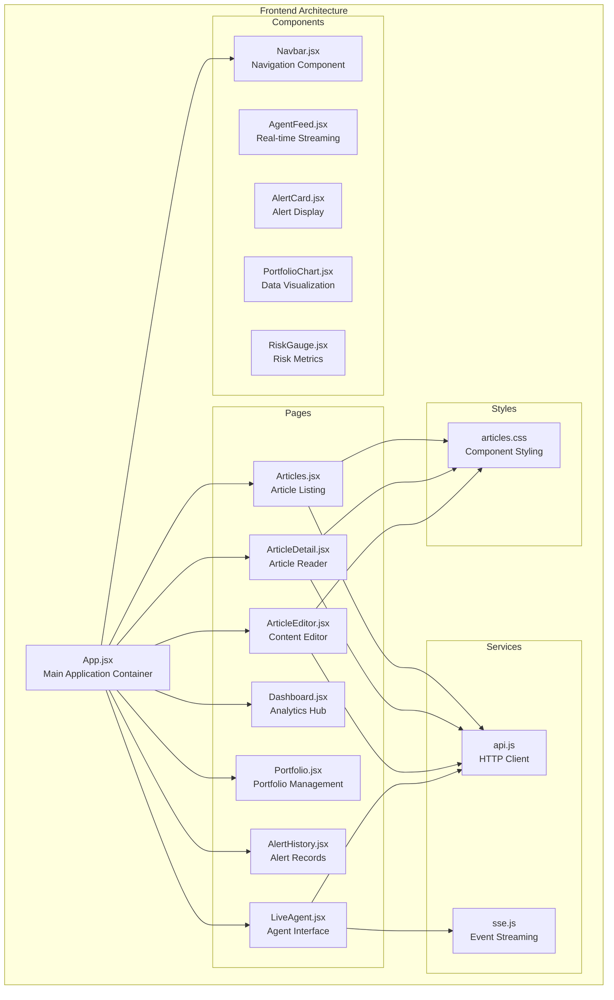

**Diagram sources**
- [App.jsx:11-27](file://frontend/src/App.jsx#L11-L27)
- [Articles.jsx:10-145](file://frontend/src/pages/Articles.jsx#L10-L145)
- [ArticleDetail.jsx:13-184](file://frontend/src/pages/ArticleDetail.jsx#L13-L184)
- [ArticleEditor.jsx:43-317](file://frontend/src/pages/ArticleEditor.jsx#L43-L317)

**Section sources**
- [App.jsx:1-28](file://frontend/src/App.jsx#L1-L28)
- [package.json:1-32](file://frontend/package.json#L1-L32)

## Core Components

### Navigation System

The navigation component provides centralized access to all major application features with intuitive routing and active state management.

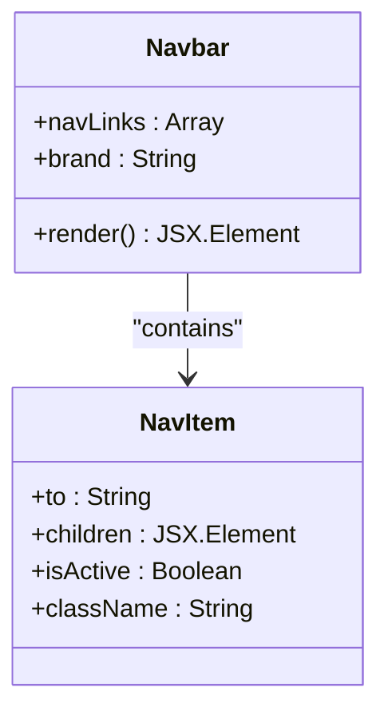

**Diagram sources**
- [Navbar.jsx:4-59](file://frontend/src/components/Navbar.jsx#L4-L59)

### Article Management System

The article system consists of three primary components working in harmony to provide comprehensive content management capabilities.

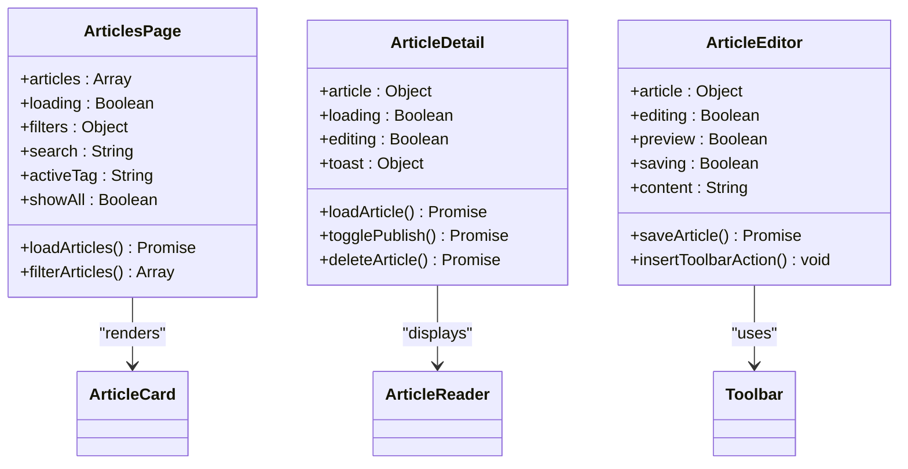

**Diagram sources**
- [Articles.jsx:10-198](file://frontend/src/pages/Articles.jsx#L10-L198)
- [ArticleDetail.jsx:13-184](file://frontend/src/pages/ArticleDetail.jsx#L13-L184)
- [ArticleEditor.jsx:43-317](file://frontend/src/pages/ArticleEditor.jsx#L43-L317)

**Section sources**
- [Navbar.jsx:1-59](file://frontend/src/components/Navbar.jsx#L1-L59)
- [Articles.jsx:1-198](file://frontend/src/pages/Articles.jsx#L1-L198)
- [ArticleDetail.jsx:1-184](file://frontend/src/pages/ArticleDetail.jsx#L1-L184)
- [ArticleEditor.jsx:1-317](file://frontend/src/pages/ArticleEditor.jsx#L1-L317)

## Architecture Overview

The Article Frontend Components implement a modern React architecture with clear separation of concerns and robust data flow patterns.

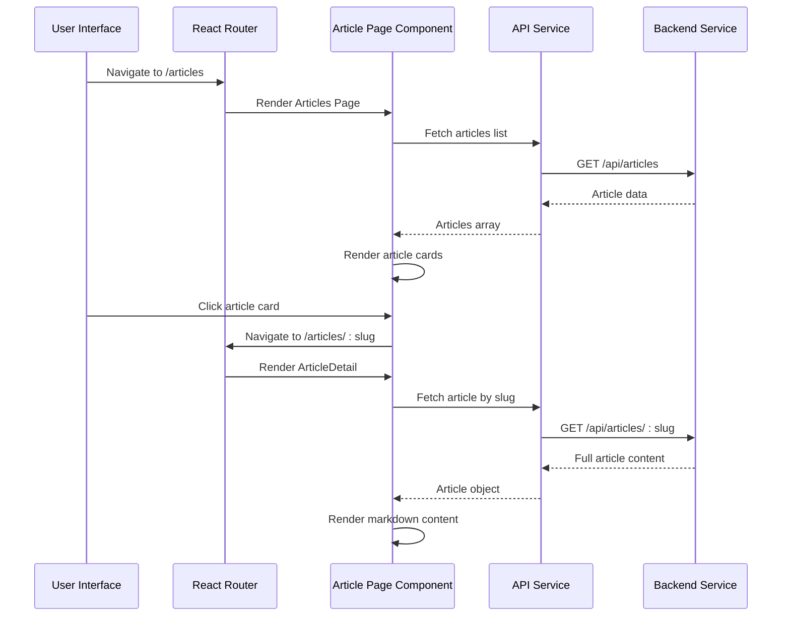

**Diagram sources**
- [App.jsx:15-24](file://frontend/src/App.jsx#L15-L24)
- [Articles.jsx:19-31](file://frontend/src/pages/Articles.jsx#L19-L31)
- [ArticleDetail.jsx:21-35](file://frontend/src/pages/ArticleDetail.jsx#L21-L35)

The architecture follows these key principles:

- **Component Composition**: Reusable components built with clear props and state management
- **State Management**: Local component state with centralized service coordination
- **API Abstraction**: Clean service layer separating frontend from backend concerns
- **Real-time Features**: SSE integration for live agent streaming capabilities
- **Responsive Design**: Mobile-first approach with adaptive layouts

## Detailed Component Analysis

### Articles Page Component

The Articles page serves as the central hub for article discovery and management, featuring advanced filtering, search capabilities, and administrative controls.

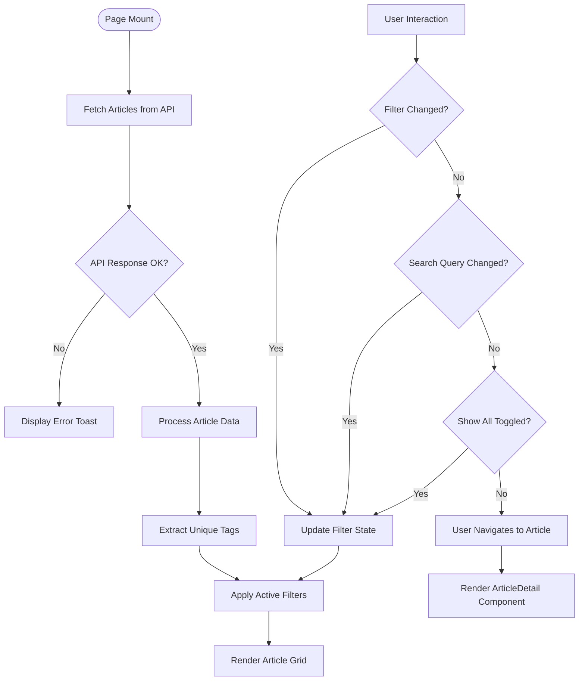

**Diagram sources**
- [Articles.jsx:19-57](file://frontend/src/pages/Articles.jsx#L19-L57)
- [Articles.jsx:126-134](file://frontend/src/pages/Articles.jsx#L126-L134)

Key features include:
- **Dynamic Filtering**: Tag-based filtering with real-time updates
- **Search Functionality**: Multi-field search across titles, summaries, and tags
- **Draft Management**: Toggle visibility of unpublished articles
- **Responsive Grid**: Adaptive layout for different screen sizes
- **Loading States**: Graceful loading indicators and empty states

**Section sources**
- [Articles.jsx:10-198](file://frontend/src/pages/Articles.jsx#L10-L198)

### Article Detail Component

The Article Detail component provides a comprehensive reading experience with administrative capabilities and rich content rendering.

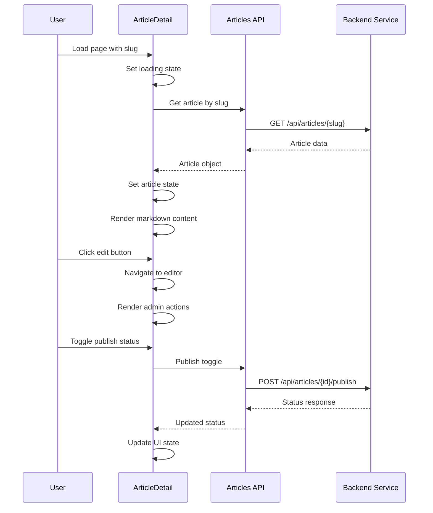

**Diagram sources**
- [ArticleDetail.jsx:21-35](file://frontend/src/pages/ArticleDetail.jsx#L21-L35)
- [ArticleDetail.jsx:42-66](file://frontend/src/pages/ArticleDetail.jsx#L42-L66)

Advanced features include:
- **Markdown Rendering**: Real-time conversion with GitHub Flavored Markdown support
- **Admin Controls**: Edit, publish/unpublish, and delete functionality
- **Metadata Display**: Author information, publication dates, and reading time
- **Responsive Images**: Optimized image handling with fallback placeholders
- **Toast Notifications**: Non-blocking user feedback system

**Section sources**
- [ArticleDetail.jsx:13-184](file://frontend/src/pages/ArticleDetail.jsx#L13-L184)

### Article Editor Component

The Article Editor provides a sophisticated writing environment with live preview, toolbar assistance, and comprehensive metadata management.

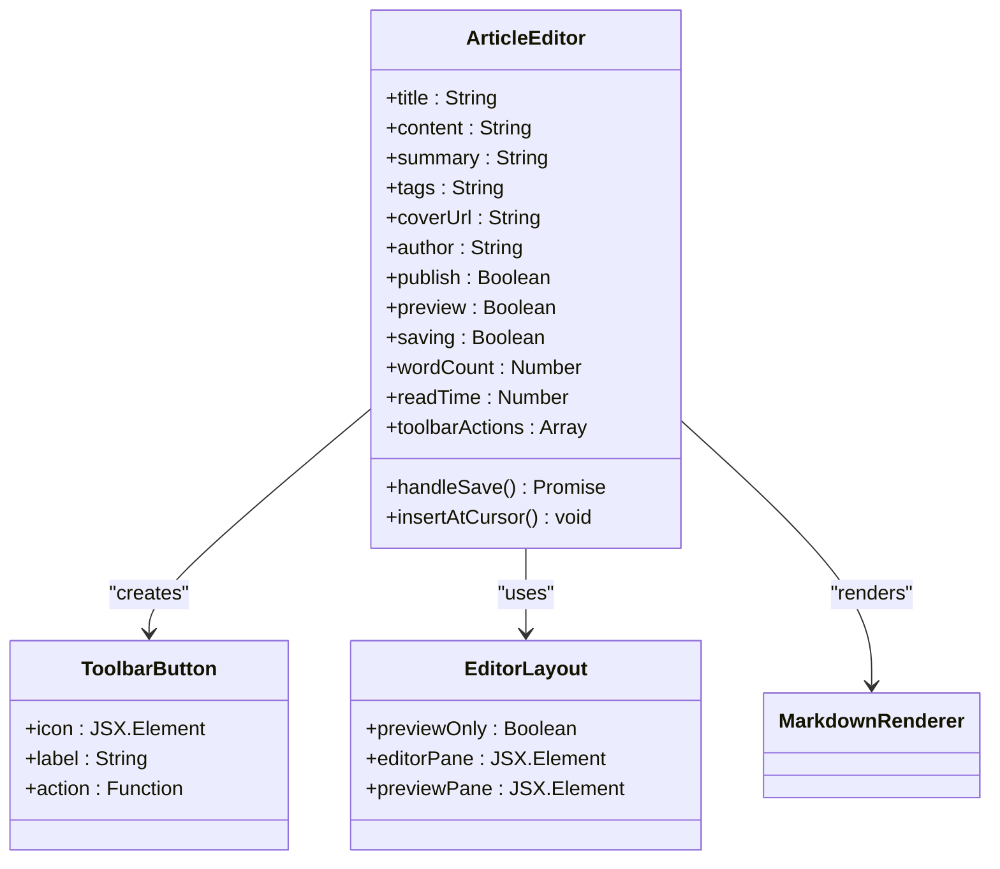

**Diagram sources**
- [ArticleEditor.jsx:43-317](file://frontend/src/pages/ArticleEditor.jsx#L43-L317)

Key capabilities include:
- **Live Preview**: Real-time markdown rendering with syntax highlighting
- **Rich Toolbar**: Formatting shortcuts for bold, italic, links, images, and code blocks
- **Metadata Management**: Comprehensive article properties including tags, cover images, and summaries
- **Word Count**: Automatic calculation of reading time and character counts
- **Publish Workflow**: One-click publishing with immediate visibility

**Section sources**
- [ArticleEditor.jsx:1-317](file://frontend/src/pages/ArticleEditor.jsx#L1-L317)

### Real-time Agent Integration

The Agent Feed component demonstrates sophisticated real-time streaming capabilities through Server-Sent Events (SSE).

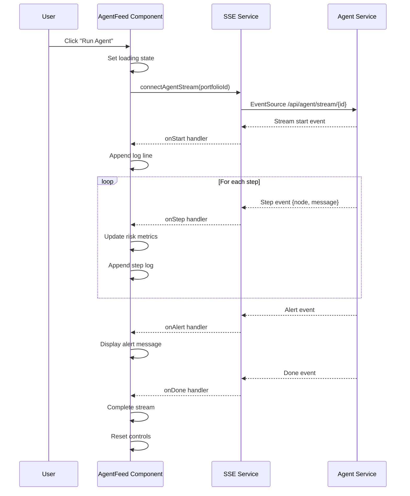

**Diagram sources**
- [AgentFeed.jsx:41-77](file://frontend/src/components/AgentFeed.jsx#L41-L77)
- [sse.js:21-62](file://frontend/src/services/sse.js#L21-L62)

**Section sources**
- [AgentFeed.jsx:1-175](file://frontend/src/components/AgentFeed.jsx#L1-L175)
- [sse.js:1-63](file://frontend/src/services/sse.js#L1-L63)

## Data Flow Analysis

The frontend implements a unidirectional data flow pattern that ensures predictable state management and easy debugging.

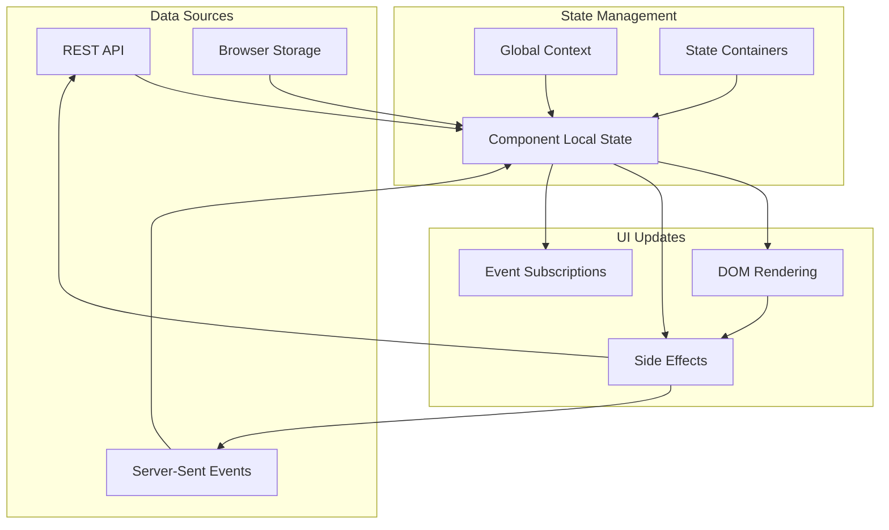

**Diagram sources**
- [api.js:35-42](file://frontend/src/services/api.js#L35-L42)
- [Articles.jsx:19-31](file://frontend/src/pages/Articles.jsx#L19-L31)
- [ArticleDetail.jsx:21-35](file://frontend/src/pages/ArticleDetail.jsx#L21-L35)

### API Integration Patterns

The frontend employs several API integration patterns to handle different types of data operations:

**List Operations**: Efficient pagination and caching for article listings
**Detail Operations**: Optimistic updates and error handling for individual article retrieval  
**Mutation Operations**: Transaction-like behavior for create, update, and delete operations
**Real-time Operations**: Persistent connections for live agent streaming

**Section sources**
- [api.js:1-45](file://frontend/src/services/api.js#L1-L45)

## Performance Considerations

The frontend architecture incorporates several performance optimization strategies:

### Lazy Loading and Code Splitting
- Route-based code splitting through React Router
- Dynamic imports for heavy components
- Suspense boundaries for better user experience

### State Optimization
- Memoization of expensive computations using useMemo and useCallback
- Selective re-rendering through proper prop passing
- Efficient list rendering with stable keys

### Network Optimization
- Request deduplication to prevent redundant API calls
- Caching strategies for frequently accessed data
- Proper error handling and retry mechanisms

### Bundle Optimization
- Tree shaking for unused imports
- Dynamic imports for optional features
- Minification and compression in production builds

## Styling Architecture

The styling system follows a modular approach with CSS-in-JS principles and dark theme support:

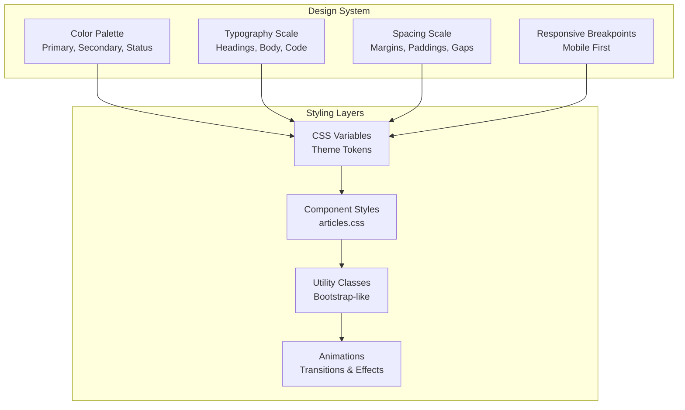

**Diagram sources**
- [articles.css:1-584](file://frontend/src/styles/articles.css#L1-L584)

### Dark Theme Implementation
- CSS custom properties for theme flexibility
- Automatic color adaptation for different contexts
- High contrast ratios for accessibility compliance
- Smooth transitions between light and dark modes

### Responsive Design Patterns
- Mobile-first approach with progressive enhancement
- Flexible grid systems for content layout
- Adaptive typography scales for readability
- Touch-friendly interaction targets

**Section sources**
- [articles.css:1-584](file://frontend/src/styles/articles.css#L1-L584)

## Backend Integration

The frontend integrates seamlessly with the backend through well-defined APIs and data models:

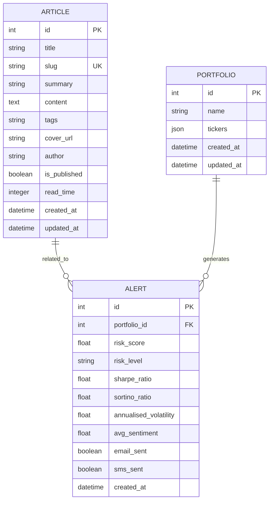

**Diagram sources**
- [article.py:15-63](file://backend/models/article.py#L15-L63)
- [articles.py:78-101](file://backend/routers/articles.py#L78-L101)

### API Contract Compliance
- Strict adherence to RESTful principles
- Consistent error handling and status codes
- Comprehensive input validation and sanitization
- Proper CORS configuration for cross-origin requests

### Data Synchronization
- Real-time updates through SSE for agent streams
- Optimistic UI updates with rollback capabilities
- Conflict resolution for concurrent edits
- Offline-first strategies with sync-on-reconnect

**Section sources**
- [article.py:1-63](file://backend/models/article.py#L1-L63)
- [articles.py:1-185](file://backend/routers/articles.py#L1-L185)

## Conclusion

The Article Frontend Components represent a sophisticated, production-ready implementation of a technical blogging platform. The architecture demonstrates excellent separation of concerns, robust data flow patterns, and comprehensive user experience considerations.

Key strengths include:

- **Modular Component Design**: Clear component boundaries with reusable patterns
- **Real-time Capabilities**: Seamless integration with backend streaming services  
- **Performance Optimization**: Thoughtful optimization strategies across all layers
- **Accessibility Focus**: Comprehensive accessibility support and inclusive design
- **Developer Experience**: Well-structured codebase with clear patterns and conventions

The system provides a solid foundation for content management while maintaining scalability and maintainability. The integration with backend services is seamless, and the user interface delivers a premium experience across all device types and interaction scenarios.

Future enhancements could include advanced content moderation features, collaborative editing capabilities, and expanded analytics integration. The current architecture provides excellent flexibility for such extensions while maintaining system stability and performance.