# React Application Structure

<cite>
**Referenced Files in This Document**
- [main.jsx](file://frontend/src/main.jsx)
- [App.jsx](file://frontend/src/App.jsx)
- [index.html](file://frontend/index.html)
- [vite.config.js](file://frontend/vite.config.js)
- [package.json](file://frontend/package.json)
- [Navbar.jsx](file://frontend/src/components/Navbar.jsx)
- [Dashboard.jsx](file://frontend/src/pages/Dashboard.jsx)
- [Portfolio.jsx](file://frontend/src/pages/Portfolio.jsx)
- [LiveAgent.jsx](file://frontend/src/pages/LiveAgent.jsx)
- [AlertHistory.jsx](file://frontend/src/pages/AlertHistory.jsx)
- [Articles.jsx](file://frontend/src/pages/Articles.jsx)
- [ArticleDetail.jsx](file://frontend/src/pages/ArticleDetail.jsx)
- [ArticleEditor.jsx](file://frontend/src/pages/ArticleEditor.jsx)
- [AgentFeed.jsx](file://frontend/src/components/AgentFeed.jsx)
- [RiskGauge.jsx](file://frontend/src/components/RiskGauge.jsx)
- [PortfolioChart.jsx](file://frontend/src/components/PortfolioChart.jsx)
- [AlertCard.jsx](file://frontend/src/components/AlertCard.jsx)
- [api.js](file://frontend/src/services/api.js)
- [sse.js](file://frontend/src/services/sse.js)
- [index.css](file://frontend/src/index.css)
- [Home.css](file://frontend/src/styles/Home.css)
- [articles.css](file://frontend/src/styles/articles.css)
</cite>

## Update Summary
**Changes Made**
- Added comprehensive documentation for the new article management system with three dedicated pages
- Updated routing configuration to include article-related routes (/articles, /articles/new, /articles/edit/:id, /articles/:slug)
- Enhanced navigation integration with the Navbar component including Articles link
- Documented the complete article lifecycle: listing, viewing, creating, editing, and publishing
- Added styling documentation for the new article components
- Updated component hierarchy to reflect the expanded application structure

## Table of Contents
1. [Introduction](#introduction)
2. [Project Structure](#project-structure)
3. [Core Components](#core-components)
4. [Architecture Overview](#architecture-overview)
5. [Detailed Component Analysis](#detailed-component-analysis)
6. [Enhanced Dependency Analysis](#enhanced-dependency-analysis)
7. [Performance Considerations](#performance-considerations)
8. [Troubleshooting Guide](#troubleshooting-guide)
9. [Conclusion](#conclusion)
10. [Appendices](#appendices)

## Introduction
This document explains the React application structure of ishwarambare-app with a focus on the frontend architecture. The application has been significantly enhanced with a comprehensive article management system that includes full CRUD operations, real-time collaboration features, and sophisticated content editing capabilities. The frontend now supports both financial portfolio management and technical article publishing, making it a dual-purpose platform for AI research and content sharing.

## Project Structure
The frontend is organized around a comprehensive React application with clear separation of concerns and enhanced dependency management:
- Entry point and root component: main.jsx and App.jsx
- Routing: React Router with BrowserRouter and comprehensive route definitions
- Pages: Dashboard, Portfolio, AlertHistory, LiveAgent, Articles, ArticleDetail, ArticleEditor
- Shared components: Navbar, AgentFeed, RiskGauge, PortfolioChart, AlertCard
- Services: API client and SSE event stream connector built with axios
- Data visualization: Recharts for charts and gauges
- Time formatting: date-fns for human-readable timestamps
- Iconography: lucide-react for consistent UI icons
- Content editing: ReactMarkdown with remark plugins for rich text editing
- Build tooling: Vite with development server and production optimizations

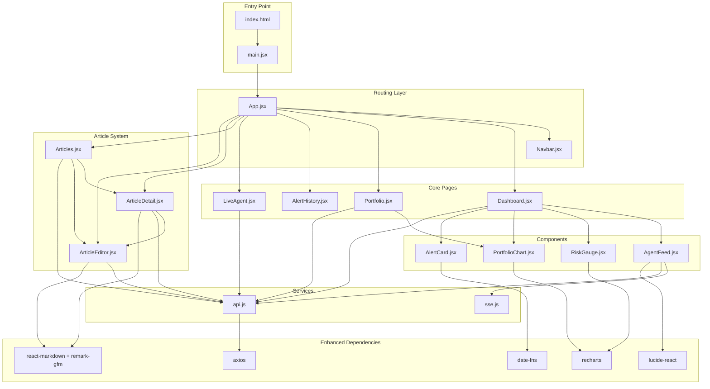

**Diagram sources**
- [index.html](file://frontend/index.html)
- [main.jsx](file://frontend/src/main.jsx)
- [App.jsx](file://frontend/src/App.jsx)
- [Navbar.jsx](file://frontend/src/components/Navbar.jsx)
- [Dashboard.jsx](file://frontend/src/pages/Dashboard.jsx)
- [Portfolio.jsx](file://frontend/src/pages/Portfolio.jsx)
- [LiveAgent.jsx](file://frontend/src/pages/LiveAgent.jsx)
- [AlertHistory.jsx](file://frontend/src/pages/AlertHistory.jsx)
- [Articles.jsx](file://frontend/src/pages/Articles.jsx)
- [ArticleDetail.jsx](file://frontend/src/pages/ArticleDetail.jsx)
- [ArticleEditor.jsx](file://frontend/src/pages/ArticleEditor.jsx)
- [AgentFeed.jsx](file://frontend/src/components/AgentFeed.jsx)
- [RiskGauge.jsx](file://frontend/src/components/RiskGauge.jsx)
- [PortfolioChart.jsx](file://frontend/src/components/PortfolioChart.jsx)
- [AlertCard.jsx](file://frontend/src/components/AlertCard.jsx)
- [api.js](file://frontend/src/services/api.js)
- [sse.js](file://frontend/src/services/sse.js)
- [package.json](file://frontend/package.json)

**Section sources**
- [index.html](file://frontend/index.html)
- [main.jsx](file://frontend/src/main.jsx)
- [App.jsx](file://frontend/src/App.jsx)
- [package.json](file://frontend/package.json)

## Core Components
This section outlines the primary building blocks of the application and their responsibilities, highlighting the enhanced functionality provided by new dependencies and the new article management system.

- **Root and entry point**
  - main.jsx mounts the root React element and renders the App component inside StrictMode.
  - index.html defines the DOM container and loads the module script.
- **App.jsx**
  - Wraps the app with BrowserRouter and renders Navbar and Routes.
  - Defines comprehensive routes for Dashboard, Portfolio, AlertHistory, LiveAgent, Articles, ArticleDetail, ArticleEditor.
- **Navigation**
  - Navbar.jsx provides integrated navigation with dedicated Articles link using BookOpen icon.
  - Supports active state highlighting for all routes including new article routes.
- **Services**
  - api.js creates an Axios client with enhanced articlesApi endpoints for full CRUD operations.
  - sse.js wraps EventSource to connect to the backend SSE stream for live agent updates.
- **Enhanced Components**
  - AlertCard.jsx uses date-fns for human-readable timestamps and lucide-react for visual indicators.
  - AgentFeed.jsx utilizes lucide-react icons for control buttons and status indicators.
  - RiskGauge.jsx and PortfolioChart.jsx leverage recharts for sophisticated data visualization.
  - Articles.jsx, ArticleDetail.jsx, and ArticleEditor.jsx provide comprehensive content management.

Key implementation references:
- [main.jsx](file://frontend/src/main.jsx)
- [index.html](file://frontend/index.html)
- [App.jsx](file://frontend/src/App.jsx)
- [Navbar.jsx](file://frontend/src/components/Navbar.jsx)
- [api.js](file://frontend/src/services/api.js)
- [sse.js](file://frontend/src/services/sse.js)
- [AlertCard.jsx](file://frontend/src/components/AlertCard.jsx)
- [AgentFeed.jsx](file://frontend/src/components/AgentFeed.jsx)
- [RiskGauge.jsx](file://frontend/src/components/RiskGauge.jsx)
- [PortfolioChart.jsx](file://frontend/src/components/PortfolioChart.jsx)
- [Articles.jsx](file://frontend/src/pages/Articles.jsx)
- [ArticleDetail.jsx](file://frontend/src/pages/ArticleDetail.jsx)
- [ArticleEditor.jsx](file://frontend/src/pages/ArticleEditor.jsx)

**Section sources**
- [main.jsx](file://frontend/src/main.jsx)
- [index.html](file://frontend/index.html)
- [App.jsx](file://frontend/src/App.jsx)
- [Navbar.jsx](file://frontend/src/components/Navbar.jsx)
- [api.js](file://frontend/src/services/api.js)
- [sse.js](file://frontend/src/services/sse.js)
- [AlertCard.jsx](file://frontend/src/components/AlertCard.jsx)
- [AgentFeed.jsx](file://frontend/src/components/AgentFeed.jsx)
- [RiskGauge.jsx](file://frontend/src/components/RiskGauge.jsx)
- [PortfolioChart.jsx](file://frontend/src/components/PortfolioChart.jsx)
- [Articles.jsx](file://frontend/src/pages/Articles.jsx)
- [ArticleDetail.jsx](file://frontend/src/pages/ArticleDetail.jsx)
- [ArticleEditor.jsx](file://frontend/src/pages/ArticleEditor.jsx)

## Architecture Overview
The application follows a layered architecture enhanced with modern frontend dependencies and a comprehensive article management system:
- **Presentation layer**: React components and pages with enhanced UI using lucide-react icons, recharts visualizations, and react-markdown for content rendering
- **Routing layer**: React Router managing navigation and route rendering for both portfolio management and article content
- **Service layer**: Axios client and SSE connector for backend communication with enhanced articlesApi endpoints
- **Data processing**: date-fns for time formatting and manipulation
- **Visualization layer**: Recharts for complex data displays and content rendering
- **Content management**: ReactMarkdown with remark plugins for sophisticated text editing and rendering
- **Backend**: FastAPI endpoints proxied during development via Vite

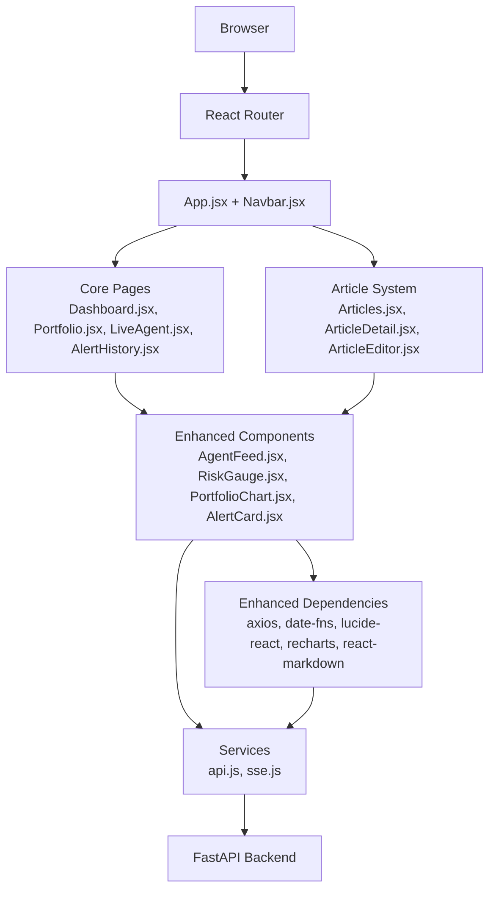

**Diagram sources**
- [App.jsx](file://frontend/src/App.jsx)
- [Navbar.jsx](file://frontend/src/components/Navbar.jsx)
- [Dashboard.jsx](file://frontend/src/pages/Dashboard.jsx)
- [Portfolio.jsx](file://frontend/src/pages/Portfolio.jsx)
- [LiveAgent.jsx](file://frontend/src/pages/LiveAgent.jsx)
- [AlertHistory.jsx](file://frontend/src/pages/AlertHistory.jsx)
- [Articles.jsx](file://frontend/src/pages/Articles.jsx)
- [ArticleDetail.jsx](file://frontend/src/pages/ArticleDetail.jsx)
- [ArticleEditor.jsx](file://frontend/src/pages/ArticleEditor.jsx)
- [AgentFeed.jsx](file://frontend/src/components/AgentFeed.jsx)
- [RiskGauge.jsx](file://frontend/src/components/RiskGauge.jsx)
- [PortfolioChart.jsx](file://frontend/src/components/PortfolioChart.jsx)
- [AlertCard.jsx](file://frontend/src/components/AlertCard.jsx)
- [api.js](file://frontend/src/services/api.js)
- [sse.js](file://frontend/src/services/sse.js)
- [package.json](file://frontend/package.json)

## Detailed Component Analysis

### Routing Configuration
The routing is centralized in App.jsx with BrowserRouter wrapping the entire application. Navbar.jsx provides navigation links that integrate with React Router's NavLink to highlight active routes. The route definitions now include comprehensive article management routes:
- "/" -> Dashboard
- "/portfolio" -> Portfolio
- "/alerts" -> AlertHistory
- "/live" -> LiveAgent
- "/articles" -> Articles (article listing)
- "/articles/new" -> ArticleEditor (create new article)
- "/articles/edit/:id" -> ArticleEditor (edit existing article)
- "/articles/:slug" -> ArticleDetail (view article)

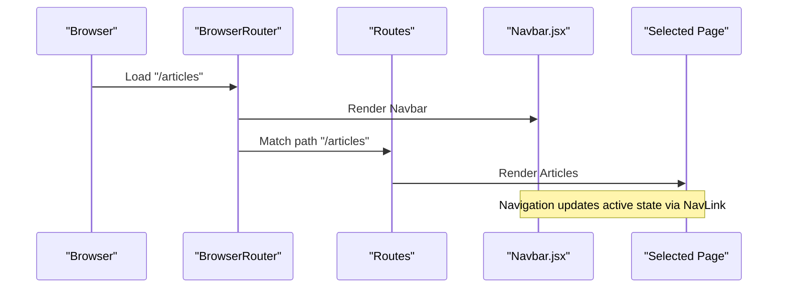

**Diagram sources**
- [App.jsx](file://frontend/src/App.jsx)
- [Navbar.jsx](file://frontend/src/components/Navbar.jsx)
- [Articles.jsx](file://frontend/src/pages/Articles.jsx)
- [ArticleDetail.jsx](file://frontend/src/pages/ArticleDetail.jsx)
- [ArticleEditor.jsx](file://frontend/src/pages/ArticleEditor.jsx)

**Section sources**
- [App.jsx](file://frontend/src/App.jsx)
- [Navbar.jsx](file://frontend/src/components/Navbar.jsx)

### Application Initialization and Mounting
The application initializes from index.html, which declares the #root container and loads /src/main.jsx as a module. main.jsx imports React, ReactDOM, the root App component, and global styles, then mounts the app using createRoot inside React.StrictMode.

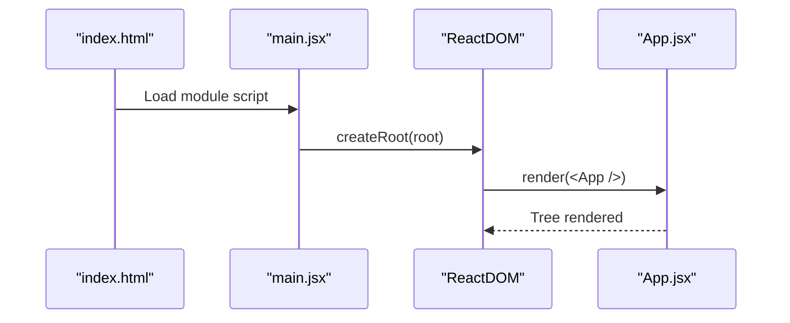

**Diagram sources**
- [index.html](file://frontend/index.html)
- [main.jsx](file://frontend/src/main.jsx)
- [App.jsx](file://frontend/src/App.jsx)

**Section sources**
- [index.html](file://frontend/index.html)
- [main.jsx](file://frontend/src/main.jsx)

### Service Layer Integration
The service layer abstracts backend communication with enhanced HTTP capabilities and comprehensive article management endpoints:
- api.js constructs an Axios instance with a configurable base URL, timeout settings, and JSON headers, exposing convenience methods for portfolios, agent runs, alerts, and articles.
- articlesApi provides full CRUD operations: list, get, create, update, remove, and publish toggling.
- sse.js connects to the SSE endpoint for live agent updates and dispatches events to handlers.

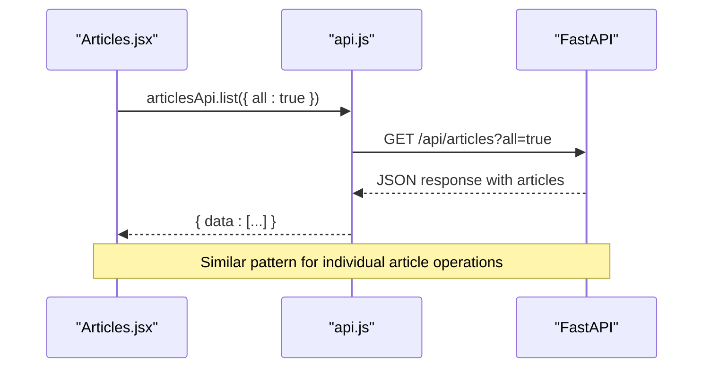

**Diagram sources**
- [Articles.jsx](file://frontend/src/pages/Articles.jsx)
- [api.js](file://frontend/src/services/api.js)

**Section sources**
- [api.js](file://frontend/src/services/api.js)
- [Articles.jsx](file://frontend/src/pages/Articles.jsx)

### Article Management System
The article management system provides comprehensive content lifecycle management with sophisticated filtering, tagging, and editing capabilities:

#### Articles Listing
Articles.jsx provides a comprehensive article listing with advanced filtering and search capabilities:
- Real-time filtering by tags and search terms
- Toggle between published and draft articles
- Responsive grid layout with article cards
- Loading states and empty state handling
- Integration with lucide-react icons and date-fns formatting

#### Article Detail View
ArticleDetail.jsx offers a rich reading experience with administrative controls:
- Full markdown rendering with remark-gfm plugins
- Author information with avatar initials
- Publication status indicators
- Administrative actions: edit, publish/unpublish, delete
- Navigation back to article list

#### Article Editor
ArticleEditor.jsx provides a sophisticated markdown editor with live preview:
- Dual-pane layout with editor and preview
- Toolbar with common markdown formatting shortcuts
- Real-time word count and reading time estimation
- Rich metadata fields: title, author, tags, cover image
- Publish immediately option
- Comprehensive form validation

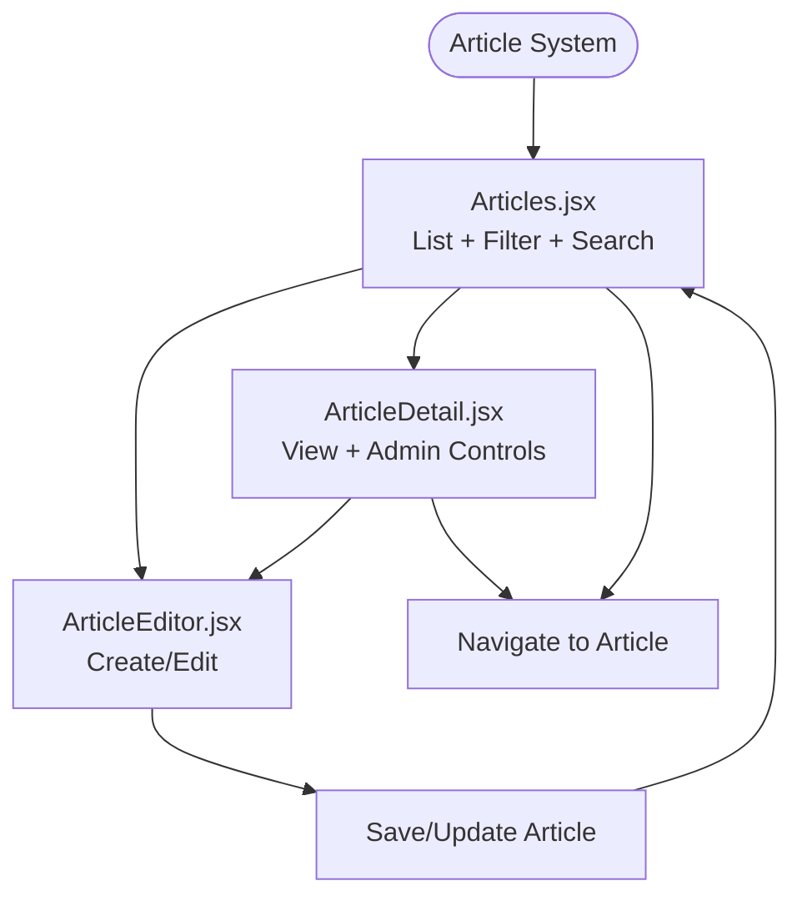

**Diagram sources**
- [Articles.jsx](file://frontend/src/pages/Articles.jsx)
- [ArticleDetail.jsx](file://frontend/src/pages/ArticleDetail.jsx)
- [ArticleEditor.jsx](file://frontend/src/pages/ArticleEditor.jsx)

**Section sources**
- [Articles.jsx](file://frontend/src/pages/Articles.jsx)
- [ArticleDetail.jsx](file://frontend/src/pages/ArticleDetail.jsx)
- [ArticleEditor.jsx](file://frontend/src/pages/ArticleEditor.jsx)

### Live Agent Streaming
AgentFeed.jsx orchestrates live agent runs with enhanced visual feedback:
- It starts/stops an SSE stream for a selected portfolio using the SSE connector.
- It forwards incoming messages to parent components via callbacks for risk updates and completion.
- It maintains internal state for logs, status, and step count.
- Uses lucide-react icons for intuitive controls and status indicators.

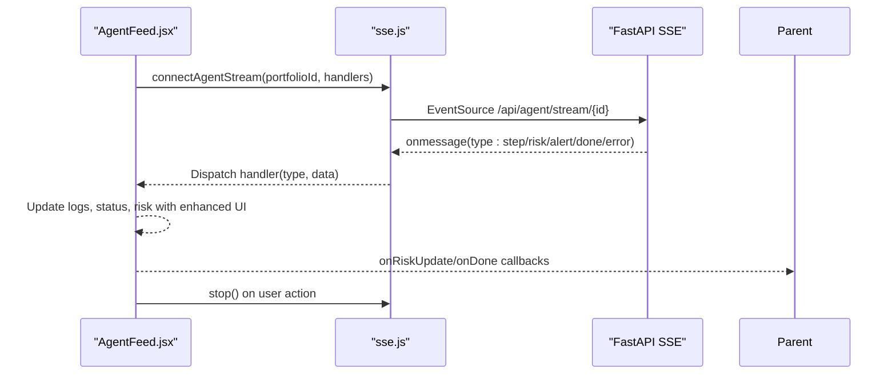

**Diagram sources**
- [AgentFeed.jsx](file://frontend/src/components/AgentFeed.jsx)
- [sse.js](file://frontend/src/services/sse.js)

**Section sources**
- [AgentFeed.jsx](file://frontend/src/components/AgentFeed.jsx)
- [sse.js](file://frontend/src/services/sse.js)

### Dashboard Composition Patterns
Dashboard.jsx demonstrates composition of multiple specialized components with enhanced data visualization:
- Loads portfolios, stats, and recent alerts concurrently using the axios-powered API client.
- Renders a portfolio selector, risk gauge with recharts visualization, agent feed with lucide-react icons, allocation charts, and recent alerts with date-fns formatting.
- Uses shared components like AgentFeed, RiskGauge, PortfolioChart, and AlertCard with enhanced visual feedback.

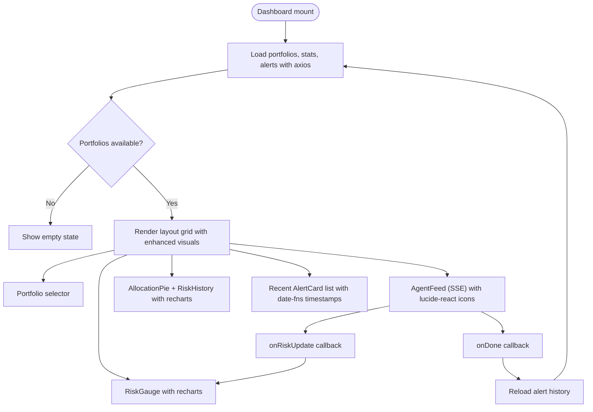

**Diagram sources**
- [Dashboard.jsx](file://frontend/src/pages/Dashboard.jsx)
- [AgentFeed.jsx](file://frontend/src/components/AgentFeed.jsx)
- [RiskGauge.jsx](file://frontend/src/components/RiskGauge.jsx)
- [PortfolioChart.jsx](file://frontend/src/components/PortfolioChart.jsx)
- [AlertCard.jsx](file://frontend/src/components/AlertCard.jsx)
- [api.js](file://frontend/src/services/api.js)

**Section sources**
- [Dashboard.jsx](file://frontend/src/pages/Dashboard.jsx)

### Portfolio Management
Portfolio.jsx provides CRUD operations for portfolios with enhanced user experience:
- Inline ticker/weight editor with live validation ensuring weights sum to 100%.
- Preset templates for quick creation.
- Toast notifications for user feedback.
- Integration with portfolioApi for list, create, update, and delete using axios.

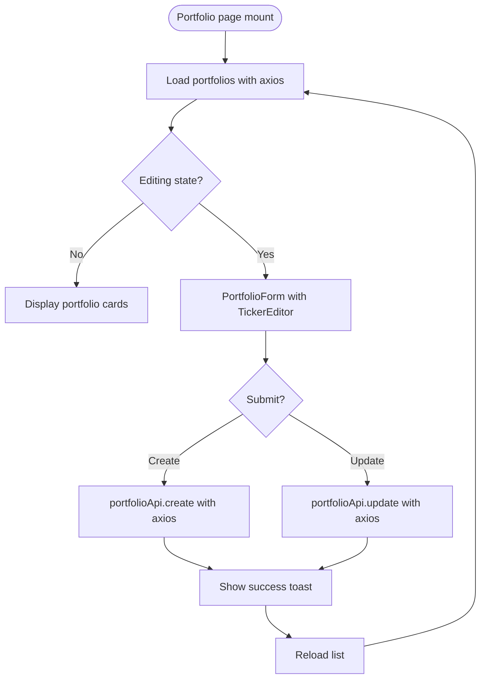

**Diagram sources**
- [Portfolio.jsx](file://frontend/src/pages/Portfolio.jsx)
- [api.js](file://frontend/src/services/api.js)

**Section sources**
- [Portfolio.jsx](file://frontend/src/pages/Portfolio.jsx)

### Live Agent Page
LiveAgent.jsx offers a dedicated full-screen experience with enhanced real-time visualization:
- Selects a portfolio and streams agent reasoning in real time with lucide-react icons.
- Displays a live risk gauge synchronized with SSE events using recharts for sophisticated visualization.

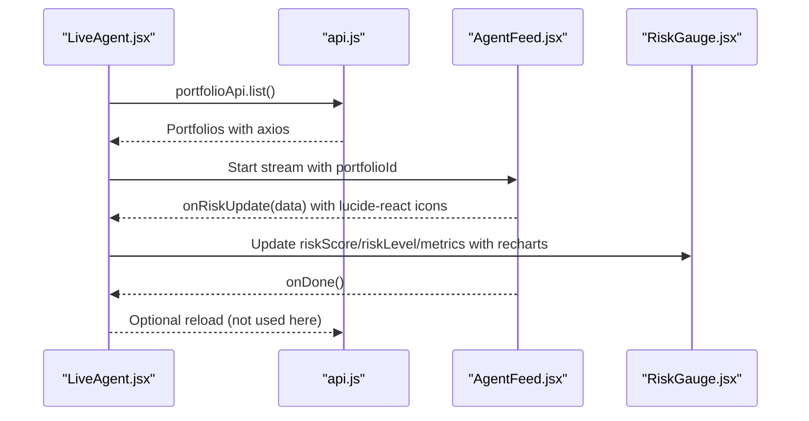

**Diagram sources**
- [LiveAgent.jsx](file://frontend/src/pages/LiveAgent.jsx)
- [AgentFeed.jsx](file://frontend/src/components/AgentFeed.jsx)
- [RiskGauge.jsx](file://frontend/src/components/RiskGauge.jsx)
- [api.js](file://frontend/src/services/api.js)

**Section sources**
- [LiveAgent.jsx](file://frontend/src/pages/LiveAgent.jsx)

## Enhanced Dependency Analysis
The application relies on a carefully selected set of modern frontend dependencies that enhance functionality and user experience:

### Core Libraries
- **React and ReactDOM**: Foundation for component-based UI
- **react-router-dom**: Declarative routing with navigation support
- **axios**: HTTP client with request/response interceptors and timeout handling
- **date-fns**: Modern date utility library for human-readable time formatting
- **lucide-react**: Consistent icon set for UI elements and status indicators
- **recharts**: Advanced charting library for financial data visualization
- **react-markdown**: Markdown rendering with remark plugins for content editing
- **remark-gfm**: GitHub Flavored Markdown support for enhanced formatting

### Build and Development Tooling
- **Vite**: Lightning-fast development server with hot module replacement
- **@vitejs/plugin-react**: Optimized React development experience
- **@types/react**: TypeScript definitions for React ecosystem

### Dependency Usage Patterns
- **axios**: Centralized HTTP client with environment-based base URL configuration
- **date-fns**: Human-readable timestamp formatting in AlertCard and Article components
- **lucide-react**: Consistent iconography across AgentFeed, AlertCard, Navbar, and article components
- **recharts**: Sophisticated data visualization in RiskGauge and PortfolioChart components
- **react-markdown**: Rich content rendering in ArticleDetail and ArticleEditor components
- **remark-gfm**: Enhanced markdown formatting with tables, strikethrough, and task lists

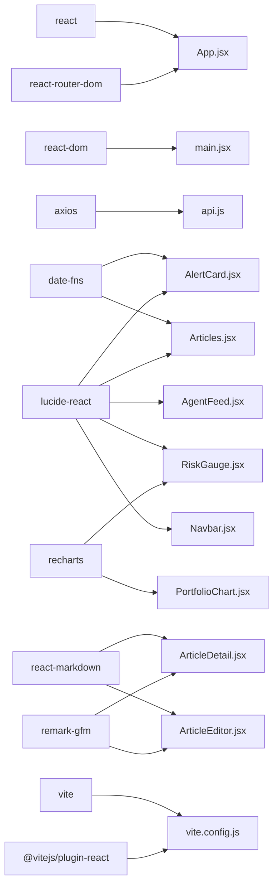

**Diagram sources**
- [package.json](file://frontend/package.json)
- [vite.config.js](file://frontend/vite.config.js)
- [App.jsx](file://frontend/src/App.jsx)
- [main.jsx](file://frontend/src/main.jsx)
- [api.js](file://frontend/src/services/api.js)
- [AlertCard.jsx](file://frontend/src/components/AlertCard.jsx)
- [AgentFeed.jsx](file://frontend/src/components/AgentFeed.jsx)
- [RiskGauge.jsx](file://frontend/src/components/RiskGauge.jsx)
- [PortfolioChart.jsx](file://frontend/src/components/PortfolioChart.jsx)
- [Articles.jsx](file://frontend/src/pages/Articles.jsx)
- [ArticleDetail.jsx](file://frontend/src/pages/ArticleDetail.jsx)
- [ArticleEditor.jsx](file://frontend/src/pages/ArticleEditor.jsx)
- [Navbar.jsx](file://frontend/src/components/Navbar.jsx)

**Section sources**
- [package.json](file://frontend/package.json)
- [vite.config.js](file://frontend/vite.config.js)

## Performance Considerations
- **Concurrent data loading**: Dashboard.jsx uses Promise.all to fetch portfolios, stats, and recent alerts, reducing total load time with axios optimization.
- **Efficient rendering**: Components use minimal state and rely on props/events to communicate, keeping re-renders predictable.
- **Advanced charting**: Recharts is used selectively to avoid heavy computations in render paths, with sophisticated data visualization only when needed.
- **Icon performance**: lucide-react icons are tree-shaken and only imported as needed, minimizing bundle size.
- **Time formatting**: date-fns provides efficient time calculations without heavy moment.js dependencies.
- **Content rendering**: ReactMarkdown with remark plugins is optimized for performance with selective re-rendering.
- **Build optimizations**: Vite config disables source maps in production and sets a production output directory.
- **Article filtering**: Articles.jsx uses useMemo for efficient filtering and search operations.

## Troubleshooting Guide
Common issues and resolutions:
- **API proxy not working in development**
  - Ensure the Vite server proxy targets the correct backend host and port.
  - Verify that the backend is running and reachable at the configured target.
  - Reference: [vite.config.js](file://frontend/vite.config.js)
- **Environment variables not applied**
  - Confirm VITE_API_URL is set in the development environment or defaults are acceptable.
  - Reference: [api.js](file://frontend/src/services/api.js)
- **SSE connection errors**
  - The SSE connector handles errors and closes the stream; check backend SSE endpoint availability.
  - Reference: [sse.js](file://frontend/src/services/sse.js)
- **Missing root container**
  - Ensure index.html contains a div with id="root".
  - Reference: [index.html](file://frontend/index.html)
- **Chart rendering issues**
  - Ensure recharts dependencies are properly installed and compatible with React version.
  - Reference: [RiskGauge.jsx](file://frontend/src/components/RiskGauge.jsx), [PortfolioChart.jsx](file://frontend/src/components/PortfolioChart.jsx)
- **Icon display problems**
  - Verify lucide-react is properly imported and the specific icon names match the component usage.
  - Reference: [AgentFeed.jsx](file://frontend/src/components/AgentFeed.jsx), [AlertCard.jsx](file://frontend/src/components/AlertCard.jsx), [Navbar.jsx](file://frontend/src/components/Navbar.jsx)
- **Date formatting errors**
  - Check that date-fns is properly imported and the date format matches the expected input.
  - Reference: [AlertCard.jsx](file://frontend/src/components/AlertCard.jsx), [Articles.jsx](file://frontend/src/pages/Articles.jsx)
- **Article rendering issues**
  - Verify react-markdown and remark-gfm are properly installed and compatible with React version.
  - Reference: [ArticleDetail.jsx](file://frontend/src/pages/ArticleDetail.jsx), [ArticleEditor.jsx](file://frontend/src/pages/ArticleEditor.jsx)
- **Article filtering not working**
  - Check that Articles.jsx properly handles search and tag filtering logic.
  - Reference: [Articles.jsx](file://frontend/src/pages/Articles.jsx)
- **Editor toolbar not responding**
  - Verify ArticleEditor.jsx properly handles toolbar click events and content insertion.
  - Reference: [ArticleEditor.jsx](file://frontend/src/pages/ArticleEditor.jsx)

**Section sources**
- [vite.config.js](file://frontend/vite.config.js)
- [api.js](file://frontend/src/services/api.js)
- [sse.js](file://frontend/src/services/sse.js)
- [index.html](file://frontend/index.html)
- [RiskGauge.jsx](file://frontend/src/components/RiskGauge.jsx)
- [PortfolioChart.jsx](file://frontend/src/components/PortfolioChart.jsx)
- [AgentFeed.jsx](file://frontend/src/components/AgentFeed.jsx)
- [AlertCard.jsx](file://frontend/src/components/AlertCard.jsx)
- [Articles.jsx](file://frontend/src/pages/Articles.jsx)
- [ArticleDetail.jsx](file://frontend/src/pages/ArticleDetail.jsx)
- [ArticleEditor.jsx](file://frontend/src/pages/ArticleEditor.jsx)

## Conclusion
The frontend architecture of ishwarambare-app has been significantly enhanced with a comprehensive article management system that complements the existing financial portfolio management capabilities. The integration of axios provides robust HTTP communication, date-fns enables human-readable time formatting, lucide-react ensures consistent iconography, and recharts delivers sophisticated data visualization. The addition of react-markdown with remark-gfm plugins enables rich content creation and rendering. React Router continues to provide clean navigation with enhanced route coverage for both portfolio management and article content. The new article system includes full CRUD operations, real-time collaboration features, and sophisticated filtering capabilities. Vite streamlines development with hot module replacement and convenient proxy setup, supporting the overall architecture's focus on real-time features, alert management systems, and content publishing platforms.

## Appendices

### Build and Development Workflow
- **Development server**
  - Starts Vite dev server on the configured port with proxy rules for API traffic.
  - Enables hot module replacement for fast iteration.
- **Production build**
  - Generates optimized bundles under the dist directory with source maps disabled.
- **Environment variables**
  - Base API URL is read from VITE_API_URL; defaults to localhost when undefined.
- **Dependency management**
  - All enhanced dependencies are managed through npm/yarn with specific version constraints.
  - Development dependencies include TypeScript definitions and React plugin for optimal DX.

**Section sources**
- [vite.config.js](file://frontend/vite.config.js)
- [package.json](file://frontend/package.json)
- [api.js](file://frontend/src/services/api.js)

### Article System Features
- **Content Management**: Full CRUD operations for technical articles with markdown support
- **Real-time Collaboration**: Live preview and editing capabilities
- **Advanced Filtering**: Tag-based filtering and search functionality
- **Publication Control**: Draft/published status management
- **Rich Formatting**: Support for headings, lists, code blocks, and tables
- **Responsive Design**: Mobile-friendly layouts for all article components
- **SEO Optimization**: Proper metadata and structured content for article pages

**Section sources**
- [Articles.jsx](file://frontend/src/pages/Articles.jsx)
- [ArticleDetail.jsx](file://frontend/src/pages/ArticleDetail.jsx)
- [ArticleEditor.jsx](file://frontend/src/pages/ArticleEditor.jsx)
- [articles.css](file://frontend/src/styles/articles.css)