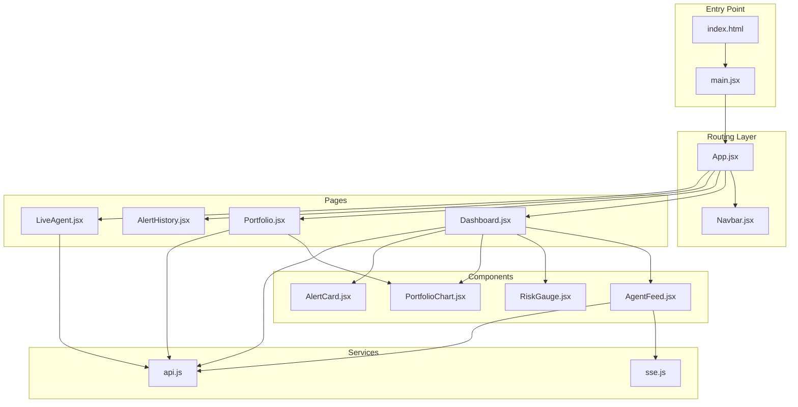
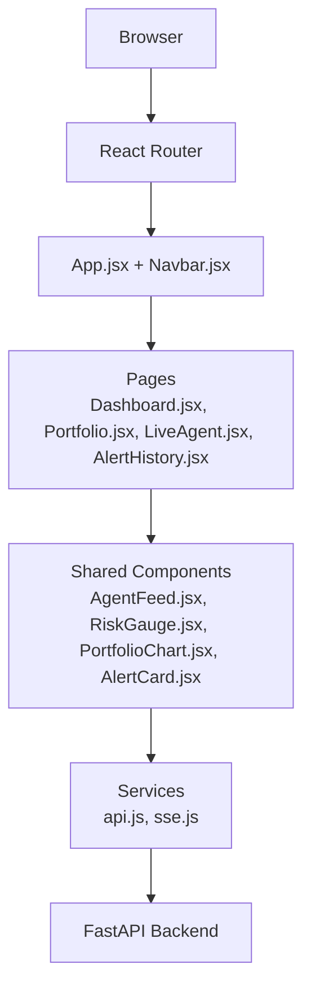
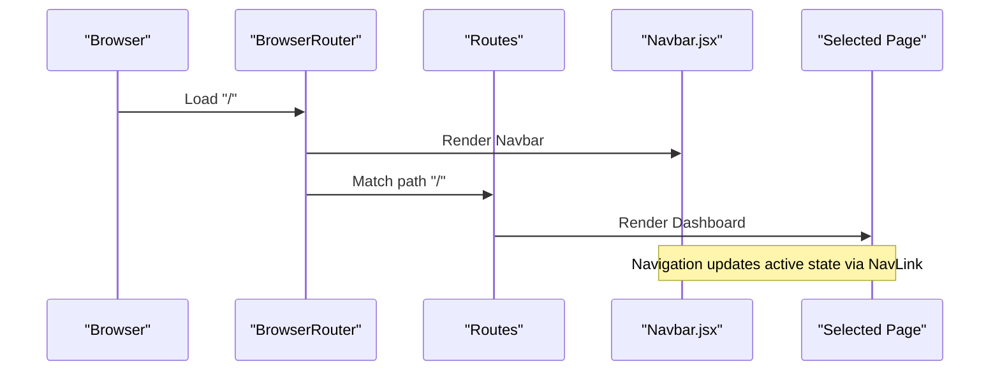
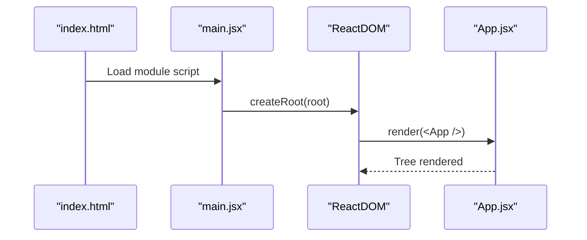
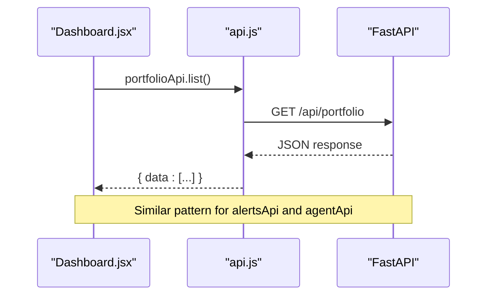
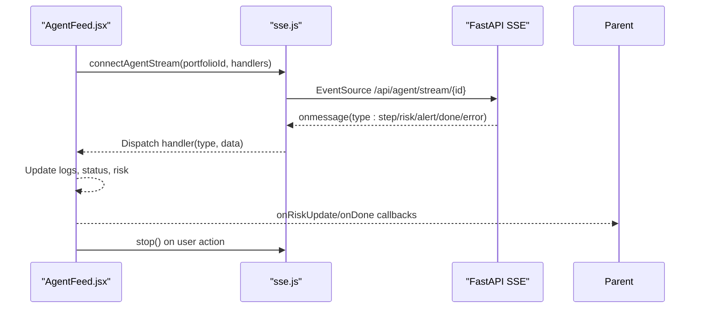
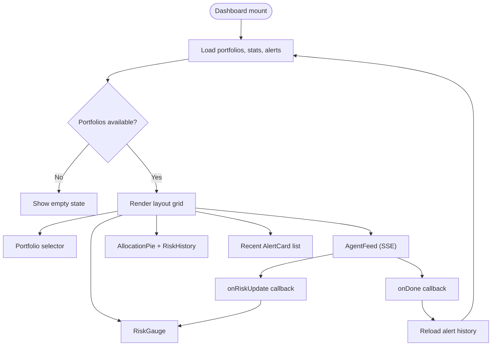
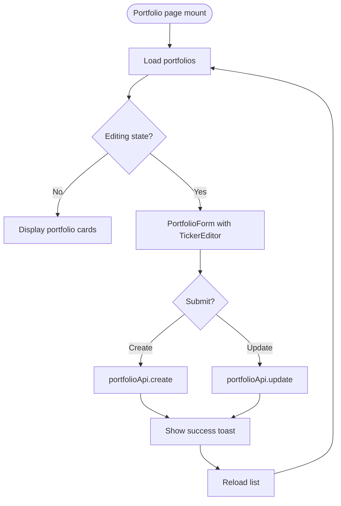
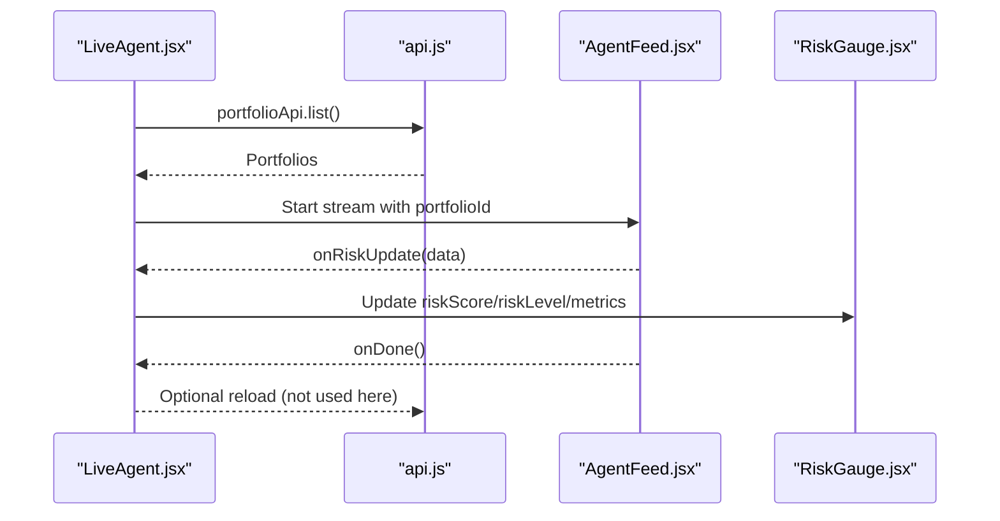
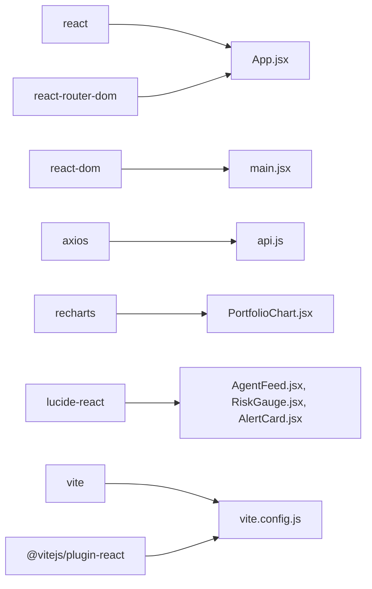

# React Application Structure

<cite>
**Referenced Files in This Document**
- [main.jsx](file://frontend/src/main.jsx)
- [App.jsx](file://frontend/src/App.jsx)
- [index.html](file://frontend/index.html)
- [vite.config.js](file://frontend/vite.config.js)
- [package.json](file://frontend/package.json)
- [Navbar.jsx](file://frontend/src/components/Navbar.jsx)
- [Dashboard.jsx](file://frontend/src/pages/Dashboard.jsx)
- [Portfolio.jsx](file://frontend/src/pages/Portfolio.jsx)
- [LiveAgent.jsx](file://frontend/src/pages/LiveAgent.jsx)
- [AlertHistory.jsx](file://frontend/src/pages/AlertHistory.jsx)
- [AgentFeed.jsx](file://frontend/src/components/AgentFeed.jsx)
- [RiskGauge.jsx](file://frontend/src/components/RiskGauge.jsx)
- [PortfolioChart.jsx](file://frontend/src/components/PortfolioChart.jsx)
- [AlertCard.jsx](file://frontend/src/components/AlertCard.jsx)
- [api.js](file://frontend/src/services/api.js)
- [sse.js](file://frontend/src/services/sse.js)
</cite>

## Table of Contents
1. [Introduction](#introduction)
2. [Project Structure](#project-structure)
3. [Core Components](#core-components)
4. [Architecture Overview](#architecture-overview)
5. [Detailed Component Analysis](#detailed-component-analysis)
6. [Dependency Analysis](#dependency-analysis)
7. [Performance Considerations](#performance-considerations)
8. [Troubleshooting Guide](#troubleshooting-guide)
9. [Conclusion](#conclusion)
10. [Appendices](#appendices)

## Introduction
This document explains the React application structure of ishwarambare-app with a focus on the frontend architecture. It covers the root component setup, routing configuration, entry point and Vite build configuration, component composition patterns, and integration with the service layer. The goal is to help developers understand how the application initializes, how components are organized, and how data flows through the UI.

## Project Structure
The frontend is organized around a small but cohesive React application with clear separation of concerns:
- Entry point and root component: main.jsx and App.jsx
- Routing: React Router with BrowserRouter and route definitions
- Pages: Dashboard, Portfolio, AlertHistory, LiveAgent
- Shared components: Navbar, AgentFeed, RiskGauge, PortfolioChart, AlertCard
- Services: API client and SSE event stream connector
- Build tooling: Vite with development server and production optimizations

**Diagram sources**
- [index.html](file://frontend/index.html)
- [main.jsx](file://frontend/src/main.jsx)
- [App.jsx](file://frontend/src/App.jsx)
- [Navbar.jsx](file://frontend/src/components/Navbar.jsx)
- [Dashboard.jsx](file://frontend/src/pages/Dashboard.jsx)
- [Portfolio.jsx](file://frontend/src/pages/Portfolio.jsx)
- [LiveAgent.jsx](file://frontend/src/pages/LiveAgent.jsx)
- [AlertHistory.jsx](file://frontend/src/pages/AlertHistory.jsx)
- [AgentFeed.jsx](file://frontend/src/components/AgentFeed.jsx)
- [RiskGauge.jsx](file://frontend/src/components/RiskGauge.jsx)
- [PortfolioChart.jsx](file://frontend/src/components/PortfolioChart.jsx)
- [AlertCard.jsx](file://frontend/src/components/AlertCard.jsx)
- [api.js](file://frontend/src/services/api.js)
- [sse.js](file://frontend/src/services/sse.js)

**Section sources**
- [index.html](file://frontend/index.html)
- [main.jsx](file://frontend/src/main.jsx)
- [App.jsx](file://frontend/src/App.jsx)

## Core Components
This section outlines the primary building blocks of the application and their responsibilities.

- Root and entry point
  - main.jsx mounts the root React element and renders the App component inside StrictMode.
  - index.html defines the DOM container and loads the module script.
- App.jsx
  - Wraps the app with BrowserRouter and renders Navbar and Routes.
  - Defines routes for Dashboard, Portfolio, AlertHistory, and LiveAgent.
- Services
  - api.js creates an Axios client with a base URL derived from environment variables and exposes typed API endpoints for portfolios, agent runs, and alerts.
  - sse.js wraps EventSource to connect to the backend SSE stream for live agent updates.

Key implementation references:
- [main.jsx](file://frontend/src/main.jsx)
- [index.html](file://frontend/index.html)
- [App.jsx](file://frontend/src/App.jsx)
- [api.js](file://frontend/src/services/api.js)
- [sse.js](file://frontend/src/services/sse.js)

**Section sources**
- [main.jsx](file://frontend/src/main.jsx)
- [index.html](file://frontend/index.html)
- [App.jsx](file://frontend/src/App.jsx)
- [api.js](file://frontend/src/services/api.js)
- [sse.js](file://frontend/src/services/sse.js)

## Architecture Overview
The application follows a layered architecture:
- Presentation layer: React components and pages
- Routing layer: React Router managing navigation and route rendering
- Service layer: Axios client and SSE connector for backend communication
- Backend: FastAPI endpoints proxied during development via Vite

**Diagram sources**
- [App.jsx](file://frontend/src/App.jsx)
- [Navbar.jsx](file://frontend/src/components/Navbar.jsx)
- [Dashboard.jsx](file://frontend/src/pages/Dashboard.jsx)
- [Portfolio.jsx](file://frontend/src/pages/Portfolio.jsx)
- [LiveAgent.jsx](file://frontend/src/pages/LiveAgent.jsx)
- [AlertHistory.jsx](file://frontend/src/pages/AlertHistory.jsx)
- [AgentFeed.jsx](file://frontend/src/components/AgentFeed.jsx)
- [RiskGauge.jsx](file://frontend/src/components/RiskGauge.jsx)
- [PortfolioChart.jsx](file://frontend/src/components/PortfolioChart.jsx)
- [AlertCard.jsx](file://frontend/src/components/AlertCard.jsx)
- [api.js](file://frontend/src/services/api.js)
- [sse.js](file://frontend/src/services/sse.js)

## Detailed Component Analysis

### Routing Configuration
The routing is centralized in App.jsx with BrowserRouter wrapping the entire application. Navbar.jsx provides navigation links that integrate with React Router’s NavLink to highlight active routes. The route definitions include:
- "/" -> Dashboard
- "/portfolio" -> Portfolio
- "/alerts" -> AlertHistory
- "/live" -> LiveAgent

**Diagram sources**
- [App.jsx](file://frontend/src/App.jsx)
- [Navbar.jsx](file://frontend/src/components/Navbar.jsx)
- [Dashboard.jsx](file://frontend/src/pages/Dashboard.jsx)
- [Portfolio.jsx](file://frontend/src/pages/Portfolio.jsx)
- [LiveAgent.jsx](file://frontend/src/pages/LiveAgent.jsx)
- [AlertHistory.jsx](file://frontend/src/pages/AlertHistory.jsx)

**Section sources**
- [App.jsx](file://frontend/src/App.jsx)
- [Navbar.jsx](file://frontend/src/components/Navbar.jsx)

### Application Initialization and Mounting
The application initializes from index.html, which declares the #root container and loads /src/main.jsx as a module. main.jsx imports React, ReactDOM, the root App component, and global styles, then mounts the app using createRoot inside React.StrictMode.

**Diagram sources**
- [index.html](file://frontend/index.html)
- [main.jsx](file://frontend/src/main.jsx)
- [App.jsx](file://frontend/src/App.jsx)

**Section sources**
- [index.html](file://frontend/index.html)
- [main.jsx](file://frontend/src/main.jsx)

### Service Layer Integration
The service layer abstracts backend communication:
- api.js constructs an Axios instance with a configurable base URL and exposes convenience methods for portfolios, agent runs, and alerts.
- sse.js connects to the SSE endpoint for live agent updates and dispatches events to handlers.

**Diagram sources**
- [Dashboard.jsx](file://frontend/src/pages/Dashboard.jsx)
- [api.js](file://frontend/src/services/api.js)

**Section sources**
- [api.js](file://frontend/src/services/api.js)
- [Dashboard.jsx](file://frontend/src/pages/Dashboard.jsx)

### Live Agent Streaming
AgentFeed.jsx orchestrates live agent runs:
- It starts/stops an SSE stream for a selected portfolio.
- It forwards incoming messages to parent components via callbacks for risk updates and completion.
- It maintains internal state for logs, status, and step count.

**Diagram sources**
- [AgentFeed.jsx](file://frontend/src/components/AgentFeed.jsx)
- [sse.js](file://frontend/src/services/sse.js)

**Section sources**
- [AgentFeed.jsx](file://frontend/src/components/AgentFeed.jsx)
- [sse.js](file://frontend/src/services/sse.js)

### Dashboard Composition Patterns
Dashboard.jsx demonstrates composition of multiple specialized components:
- Loads portfolios, stats, and recent alerts concurrently.
- Renders a portfolio selector, risk gauge, agent feed, allocation pie, and recent alerts.
- Uses shared components like AgentFeed, RiskGauge, PortfolioChart, and AlertCard.

**Diagram sources**
- [Dashboard.jsx](file://frontend/src/pages/Dashboard.jsx)
- [AgentFeed.jsx](file://frontend/src/components/AgentFeed.jsx)
- [RiskGauge.jsx](file://frontend/src/components/RiskGauge.jsx)
- [PortfolioChart.jsx](file://frontend/src/components/PortfolioChart.jsx)
- [AlertCard.jsx](file://frontend/src/components/AlertCard.jsx)

**Section sources**
- [Dashboard.jsx](file://frontend/src/pages/Dashboard.jsx)

### Portfolio Management
Portfolio.jsx provides CRUD operations for portfolios:
- Inline ticker/weight editor with live validation ensuring weights sum to 100%.
- Preset templates for quick creation.
- Toast notifications for user feedback.
- Integration with portfolioApi for list, create, update, and delete.

**Diagram sources**
- [Portfolio.jsx](file://frontend/src/pages/Portfolio.jsx)

**Section sources**
- [Portfolio.jsx](file://frontend/src/pages/Portfolio.jsx)

### Live Agent Page
LiveAgent.jsx offers a dedicated full-screen experience:
- Selects a portfolio and streams agent reasoning in real time.
- Displays a live risk gauge synchronized with SSE events.

**Diagram sources**
- [LiveAgent.jsx](file://frontend/src/pages/LiveAgent.jsx)
- [AgentFeed.jsx](file://frontend/src/components/AgentFeed.jsx)
- [RiskGauge.jsx](file://frontend/src/components/RiskGauge.jsx)
- [api.js](file://frontend/src/services/api.js)

**Section sources**
- [LiveAgent.jsx](file://frontend/src/pages/LiveAgent.jsx)

## Dependency Analysis
The application relies on a small set of core libraries and a clear dependency chain:
- React and ReactDOM for rendering
- react-router-dom for routing
- axios for HTTP requests
- recharts for data visualization
- lucide-react for icons

Build and dev tooling:
- Vite manages bundling, development server, and proxying API requests to the backend during development.
- Environment variables are resolved at build time via Vite’s import.meta.env.

**Diagram sources**
- [package.json](file://frontend/package.json)
- [vite.config.js](file://frontend/vite.config.js)
- [App.jsx](file://frontend/src/App.jsx)
- [main.jsx](file://frontend/src/main.jsx)
- [api.js](file://frontend/src/services/api.js)
- [PortfolioChart.jsx](file://frontend/src/components/PortfolioChart.jsx)
- [AgentFeed.jsx](file://frontend/src/components/AgentFeed.jsx)
- [RiskGauge.jsx](file://frontend/src/components/RiskGauge.jsx)
- [AlertCard.jsx](file://frontend/src/components/AlertCard.jsx)

**Section sources**
- [package.json](file://frontend/package.json)
- [vite.config.js](file://frontend/vite.config.js)

## Performance Considerations
- Concurrent data loading: Dashboard.jsx uses Promise.all to fetch portfolios, stats, and recent alerts, reducing total load time.
- Efficient rendering: Components use minimal state and rely on props/events to communicate, keeping re-renders predictable.
- Charting library: Recharts is used selectively to avoid heavy computations in render paths.
- Build optimizations: Vite config disables source maps in production and sets a production output directory.

[No sources needed since this section provides general guidance]

## Troubleshooting Guide
Common issues and resolutions:
- API proxy not working in development
  - Ensure the Vite server proxy targets the correct backend host and port.
  - Verify that the backend is running and reachable at the configured target.
  - Reference: [vite.config.js](file://frontend/vite.config.js)
- Environment variables not applied
  - Confirm VITE_API_URL is set in the development environment or defaults are acceptable.
  - Reference: [api.js](file://frontend/src/services/api.js)
- SSE connection errors
  - The SSE connector handles errors and closes the stream; check backend SSE endpoint availability.
  - Reference: [sse.js](file://frontend/src/services/sse.js)
- Missing root container
  - Ensure index.html contains a div with id="root".
  - Reference: [index.html](file://frontend/index.html)

**Section sources**
- [vite.config.js](file://frontend/vite.config.js)
- [api.js](file://frontend/src/services/api.js)
- [sse.js](file://frontend/src/services/sse.js)
- [index.html](file://frontend/index.html)

## Conclusion
The frontend architecture of ishwarambare-app is intentionally simple and modular. React Router provides clean navigation, while a small set of shared components and services encapsulate backend integration. Vite streamlines development with hot module replacement and a convenient proxy setup. The component composition patterns emphasize reusable UI elements and clear data flow, supporting maintainability and scalability.

[No sources needed since this section summarizes without analyzing specific files]

## Appendices

### Build and Development Workflow
- Development server
  - Starts Vite dev server on the configured port with proxy rules for API traffic.
  - Enables hot module replacement for fast iteration.
- Production build
  - Generates optimized bundles under the dist directory with source maps disabled.
- Environment variables
  - Base API URL is read from VITE_API_URL; defaults to localhost when undefined.

**Section sources**
- [vite.config.js](file://frontend/vite.config.js)
- [package.json](file://frontend/package.json)
- [api.js](file://frontend/src/services/api.js)