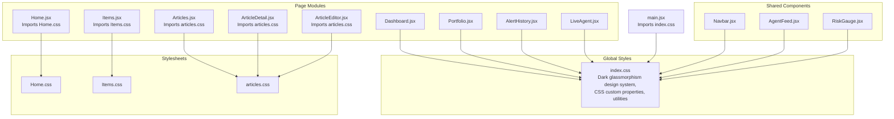
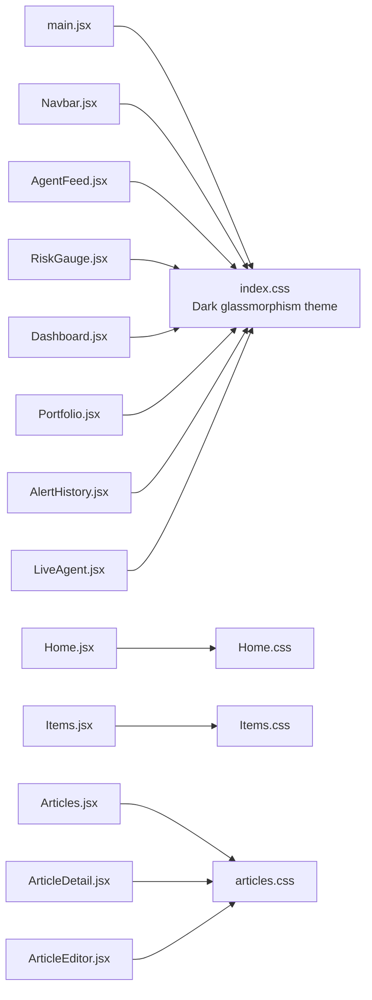
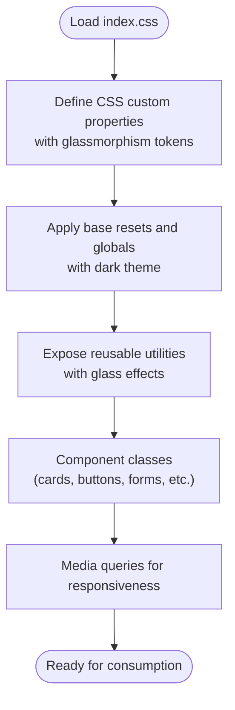
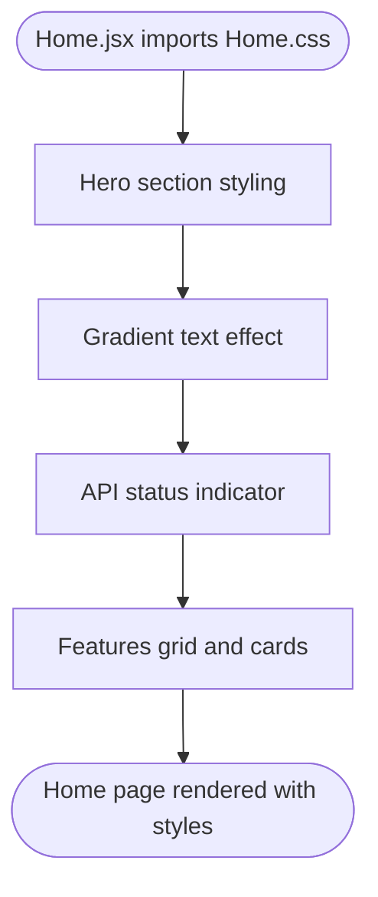
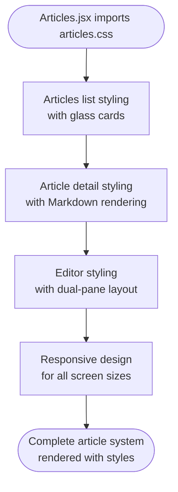
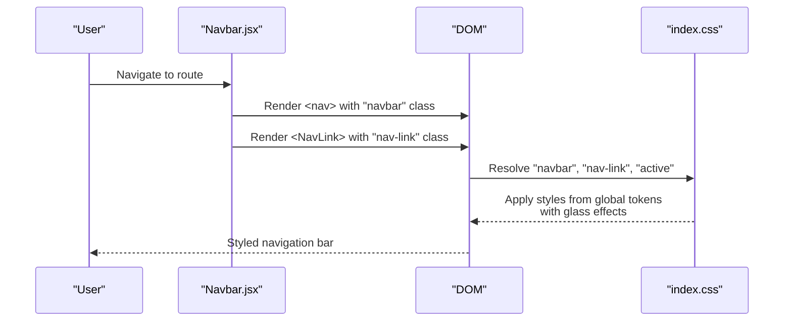
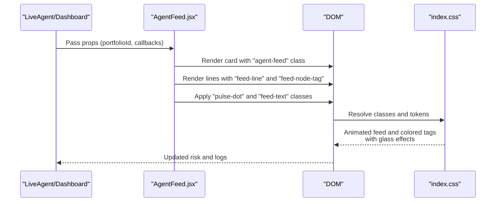
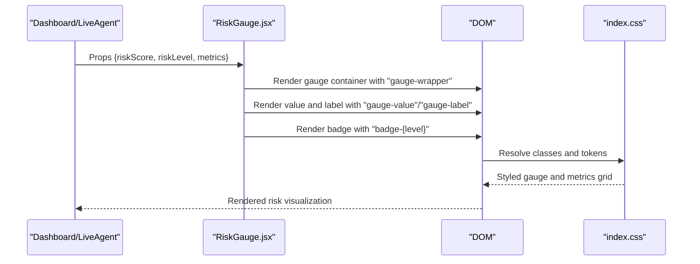
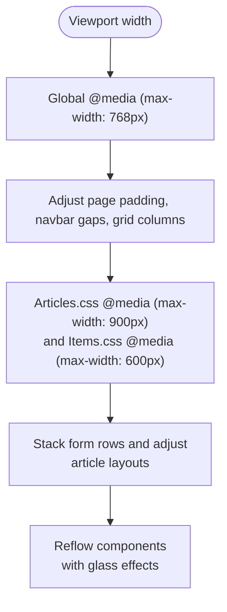
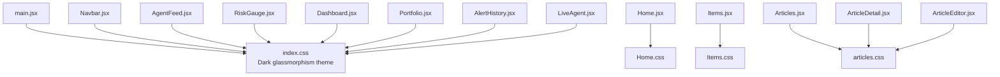

# Styling Architecture

<cite>
**Referenced Files in This Document**
- [index.css](file://frontend/src/index.css)
- [Home.css](file://frontend/src/styles/Home.css)
- [Items.css](file://frontend/src/styles/Items.css)
- [articles.css](file://frontend/src/styles/articles.css)
- [main.jsx](file://frontend/src/main.jsx)
- [App.jsx](file://frontend/src/App.jsx)
- [Navbar.jsx](file://frontend/src/components/Navbar.jsx)
- [Home.jsx](file://frontend/src/pages/Home.jsx)
- [Items.jsx](file://frontend/src/pages/Items.jsx)
- [Articles.jsx](file://frontend/src/pages/Articles.jsx)
- [ArticleDetail.jsx](file://frontend/src/pages/ArticleDetail.jsx)
- [ArticleEditor.jsx](file://frontend/src/pages/ArticleEditor.jsx)
- [Dashboard.jsx](file://frontend/src/pages/Dashboard.jsx)
- [Portfolio.jsx](file://frontend/src/pages/Portfolio.jsx)
- [AlertHistory.jsx](file://frontend/src/pages/AlertHistory.jsx)
- [LiveAgent.jsx](file://frontend/src/pages/LiveAgent.jsx)
- [AgentFeed.jsx](file://frontend/src/components/AgentFeed.jsx)
- [RiskGauge.jsx](file://frontend/src/components/RiskGauge.jsx)
- [api.js](file://frontend/src/services/api.js)
- [package.json](file://frontend/package.json)
- [vite.config.js](file://frontend/vite.config.js)
</cite>

## Update Summary
**Changes Made**
- Added comprehensive documentation for the new article styling system
- Updated architecture overview to include glassmorphism effects and dark theme implementation
- Added detailed coverage of Markdown rendering support and article editor styling
- Enhanced responsive design documentation with new article-specific breakpoints
- Updated color scheme and typography documentation to reflect dark glassmorphism theme

## Table of Contents
1. [Introduction](#introduction)
2. [Project Structure](#project-structure)
3. [Core Components](#core-components)
4. [Architecture Overview](#architecture-overview)
5. [Detailed Component Analysis](#detailed-component-analysis)
6. [Dependency Analysis](#dependency-analysis)
7. [Performance Considerations](#performance-considerations)
8. [Troubleshooting Guide](#troubleshooting-guide)
9. [Conclusion](#conclusion)
10. [Appendices](#appendices)

## Introduction
This document describes the styling architecture of the ishwarambare-app frontend. It explains how global styles are organized in index.css, how component-specific styles are structured in dedicated CSS files including the new articles.css, and how these styles integrate with React components. The architecture features a comprehensive dark glassmorphism design system with advanced CSS custom properties, extensive utility classes, and sophisticated responsive design patterns. The system now includes a complete article management system with Markdown rendering capabilities, glassmorphism effects, and comprehensive styling for both readers and editors.

## Project Structure
The frontend uses a modular CSS architecture with enhanced support for the new article system:
- Global baseline and design system live in a single global stylesheet with dark glassmorphism theme.
- Component-specific styles are imported directly into the pages that use them, including the new articles.css.
- Utility and layout classes are shared across components with enhanced glassmorphism support.
- Article-specific styling provides comprehensive Markdown rendering and editor functionality.

**Diagram sources**
- [index.css](file://frontend/src/index.css)
- [Home.css](file://frontend/src/styles/Home.css)
- [Items.css](file://frontend/src/styles/Items.css)
- [articles.css](file://frontend/src/styles/articles.css)
- [main.jsx](file://frontend/src/main.jsx)
- [Home.jsx](file://frontend/src/pages/Home.jsx)
- [Items.jsx](file://frontend/src/pages/Items.jsx)
- [Articles.jsx](file://frontend/src/pages/Articles.jsx)
- [ArticleDetail.jsx](file://frontend/src/pages/ArticleDetail.jsx)
- [ArticleEditor.jsx](file://frontend/src/pages/ArticleEditor.jsx)
- [Dashboard.jsx](file://frontend/src/pages/Dashboard.jsx)
- [Portfolio.jsx](file://frontend/src/pages/Portfolio.jsx)
- [AlertHistory.jsx](file://frontend/src/pages/AlertHistory.jsx)
- [LiveAgent.jsx](file://frontend/src/pages/LiveAgent.jsx)
- [Navbar.jsx](file://frontend/src/components/Navbar.jsx)
- [AgentFeed.jsx](file://frontend/src/components/AgentFeed.jsx)
- [RiskGauge.jsx](file://frontend/src/components/RiskGauge.jsx)

**Section sources**
- [main.jsx:1-11](file://frontend/src/main.jsx#L1-L11)
- [index.css:1-504](file://frontend/src/index.css#L1-L504)
- [Home.jsx:1-63](file://frontend/src/pages/Home.jsx#L1-L63)
- [Items.jsx:1-125](file://frontend/src/pages/Items.jsx#L1-L125)
- [Articles.jsx:1-198](file://frontend/src/pages/Articles.jsx#L1-L198)
- [ArticleDetail.jsx:1-184](file://frontend/src/pages/ArticleDetail.jsx#L1-L184)
- [ArticleEditor.jsx:1-317](file://frontend/src/pages/ArticleEditor.jsx#L1-L317)

## Core Components
- Global design system and utilities: index.css defines CSS custom properties, base resets, typography, layout helpers, and reusable component classes with dark glassmorphism theme and advanced backdrop filters.
- Page-level styles: Home.css, Items.css, and articles.css encapsulate page-specific visuals and responsive tweaks with specialized styling for article management.
- Shared component styles: Navbar, AgentFeed, and RiskGauge rely on global classes and tokens with enhanced glassmorphism effects.

Key global categories in index.css:
- Design tokens: backgrounds (including glass effects), borders, text, accents, shadows, radii, transitions with advanced backdrop-filter support.
- Base: resets, html/body, fonts, and global animations with dark glassmorphism theme.
- Typography: headings, paragraphs, links, monospace with enhanced fluid sizing.
- Layout: page wrappers, headers, grids with glass card support.
- Components: cards, stat cards, navbar, buttons, badges, forms, tables, agent feed, spinners, gauges, toasts, chips, progress bars, dividers, empty states, scrollbars with glass effects.
- Responsive: media queries targeting tablet/mobile with enhanced breakpoint support.

Integration pattern:
- Global styles are imported once in main.jsx.
- Pages import their specific stylesheets including the new articles.css.
- Components apply class names that resolve to global utilities or page-specific overrides with glassmorphism effects.

**Section sources**
- [index.css:8-50](file://frontend/src/index.css#L8-L50)
- [index.css:52-67](file://frontend/src/index.css#L52-L67)
- [index.css:69-81](file://frontend/src/index.css#L69-L81)
- [index.css:83-104](file://frontend/src/index.css#L83-L104)
- [index.css:106-497](file://frontend/src/index.css#L106-L497)
- [index.css:498-504](file://frontend/src/index.css#L498-L504)
- [main.jsx:1-11](file://frontend/src/main.jsx#L1-L11)
- [Home.jsx](file://frontend/src/pages/Home.jsx#L4)
- [Items.jsx](file://frontend/src/pages/Items.jsx#L3)
- [Articles.jsx](file://frontend/src/pages/Articles.jsx#L6)
- [ArticleDetail.jsx](file://frontend/src/pages/ArticleDetail.jsx#L11)
- [ArticleEditor.jsx](file://frontend/src/pages/ArticleEditor.jsx#L11)

## Architecture Overview
The styling architecture follows a modular, token-driven approach with advanced dark glassmorphism design:
- index.css centralizes design tokens and shared utilities with glassmorphism support.
- Page modules import only the styles they need, including the comprehensive articles.css.
- Components compose global classes with inline styles for dynamic values where appropriate.
- Advanced CSS custom properties support complex glass effects and backdrop filtering.

**Diagram sources**
- [main.jsx:1-11](file://frontend/src/main.jsx#L1-L11)
- [Home.jsx](file://frontend/src/pages/Home.jsx#L4)
- [Items.jsx](file://frontend/src/pages/Items.jsx#L3)
- [Articles.jsx](file://frontend/src/pages/Articles.jsx#L6)
- [ArticleDetail.jsx](file://frontend/src/pages/ArticleDetail.jsx#L11)
- [ArticleEditor.jsx](file://frontend/src/pages/ArticleEditor.jsx#L11)
- [Navbar.jsx:1-51](file://frontend/src/components/Navbar.jsx#L1-L51)
- [AgentFeed.jsx:1-175](file://frontend/src/components/AgentFeed.jsx#L1-L175)
- [RiskGauge.jsx:1-101](file://frontend/src/components/RiskGauge.jsx#L1-L101)
- [Dashboard.jsx:1-211](file://frontend/src/pages/Dashboard.jsx#L1-L211)
- [Portfolio.jsx:1-387](file://frontend/src/pages/Portfolio.jsx#L1-L387)
- [AlertHistory.jsx:1-163](file://frontend/src/pages/AlertHistory.jsx#L1-L163)
- [LiveAgent.jsx:1-95](file://frontend/src/pages/LiveAgent.jsx#L1-L95)
- [index.css:1-504](file://frontend/src/index.css#L1-L504)

## Detailed Component Analysis

### Global Design System (index.css)
- Design tokens: CSS custom properties define backgrounds (including glass effects), borders, text, accents, risk colors, shadows, radii, and transitions with advanced backdrop-filter support.
- Base styles: normalize/reset, html font size, body background and typography, global gradients with dark glassmorphism theme.
- Utilities: typography helpers, layout wrappers and headers, grid helpers, card and stat-card patterns with glass effects, navbar, buttons, badges, forms, tables, agent feed, spinners, gauges, toasts, chips, progress bars, dividers, empty states, and scrollbar customization with glass effects.
- Responsive: a single media query adjusts layout for smaller screens with enhanced breakpoint support.

**Diagram sources**
- [index.css:8-50](file://frontend/src/index.css#L8-L50)
- [index.css:52-67](file://frontend/src/index.css#L52-L67)
- [index.css:69-497](file://frontend/src/index.css#L69-L497)
- [index.css:498-504](file://frontend/src/index.css#L498-L504)

**Section sources**
- [index.css:8-50](file://frontend/src/index.css#L8-L50)
- [index.css:52-67](file://frontend/src/index.css#L52-L67)
- [index.css:69-497](file://frontend/src/index.css#L69-L497)
- [index.css:498-504](file://frontend/src/index.css#L498-L504)

### Page-Specific Styles

#### Home.css
- Purpose: Encapsulates Home page visuals including hero section, gradient text, API status indicator, and feature cards.
- Patterns: Uses global tokens via var() and local spacing tokens (e.g., --space-* placeholders) to keep consistent spacing.
- Responsiveness: No explicit media query in this file; relies on global responsive rules.

**Diagram sources**
- [Home.jsx](file://frontend/src/pages/Home.jsx#L4)
- [Home.css:1-66](file://frontend/src/styles/Home.css#L1-L66)

**Section sources**
- [Home.jsx](file://frontend/src/pages/Home.jsx#L4)
- [Home.css:1-66](file://frontend/src/styles/Home.css#L1-L66)

#### Items.css
- Purpose: Items page layout, form rows, checkboxes, item cards, and pricing.
- Patterns: Uses grid and spacing tokens; includes a narrow-screen media query to stack form rows.

**Diagram sources**
- [Items.jsx](file://frontend/src/pages/Items.jsx#L3)
- [Items.css:1-30](file://frontend/src/styles/Items.css#L1-L30)

**Section sources**
- [Items.jsx](file://frontend/src/pages/Items.jsx#L3)
- [Items.css:1-30](file://frontend/src/styles/Items.css#L1-L30)

#### articles.css
- Purpose: Comprehensive styling for the article management system including article listing, detail reading, and editor interface.
- Features: Dark glassmorphism theme with advanced backdrop filters, comprehensive Markdown rendering support, dual-pane editor with live preview, article cards with glass effects, and responsive design for all screen sizes.
- Patterns: Uses advanced CSS custom properties for glass effects, extensive use of backdrop-filter and -webkit-backdrop-filter, comprehensive grid layouts for article cards, and sophisticated typography for both reading and editing experiences.

**Diagram sources**
- [Articles.jsx](file://frontend/src/pages/Articles.jsx#L6)
- [ArticleDetail.jsx](file://frontend/src/pages/ArticleDetail.jsx#L11)
- [ArticleEditor.jsx](file://frontend/src/pages/ArticleEditor.jsx#L11)
- [articles.css:1-584](file://frontend/src/styles/articles.css#L1-L584)

**Section sources**
- [Articles.jsx](file://frontend/src/pages/Articles.jsx#L6)
- [ArticleDetail.jsx](file://frontend/src/pages/ArticleDetail.jsx#L11)
- [ArticleEditor.jsx](file://frontend/src/pages/ArticleEditor.jsx#L11)
- [articles.css:1-584](file://frontend/src/styles/articles.css#L1-L584)

### Component Styling Patterns

#### Navbar.jsx
- Pattern: Applies global navbar and nav-link classes with glassmorphism effects; uses NavLink for active state toggling.
- Integration: Consumes global tokens for colors, borders, and transitions with enhanced glass effects.

**Diagram sources**
- [Navbar.jsx:1-51](file://frontend/src/components/Navbar.jsx#L1-L51)
- [index.css:152-203](file://frontend/src/index.css#L152-L203)

**Section sources**
- [Navbar.jsx:1-51](file://frontend/src/components/Navbar.jsx#L1-L51)
- [index.css:152-203](file://frontend/src/index.css#L152-L203)

#### AgentFeed.jsx
- Pattern: Uses global card, agent-feed, feed-line, feed-node-tag, and feed-text classes with glassmorphism effects; applies dynamic status badges and spinner classes.
- Integration: Consumes global tokens for colors, borders, and animations with enhanced visual effects.

**Diagram sources**
- [AgentFeed.jsx:28-175](file://frontend/src/components/AgentFeed.jsx#L28-L175)
- [index.css:324-386](file://frontend/src/index.css#L324-L386)

**Section sources**
- [AgentFeed.jsx:28-175](file://frontend/src/components/AgentFeed.jsx#L28-L175)
- [index.css:324-386](file://frontend/src/index.css#L324-L386)

#### RiskGauge.jsx
- Pattern: Uses global gauge-wrapper, gauge-value, gauge-label, and badge classes with dynamic badge variants based on risk level.
- Integration: Consumes global tokens for colors and typography with enhanced visual effects.

**Diagram sources**
- [RiskGauge.jsx:20-101](file://frontend/src/components/RiskGauge.jsx#L20-L101)
- [index.css:410-423](file://frontend/src/index.css#L410-L423)

**Section sources**
- [RiskGauge.jsx:20-101](file://frontend/src/components/RiskGauge.jsx#L20-L101)
- [index.css:410-423](file://frontend/src/index.css#L410-L423)

### Naming Conventions and Modular Approach
- Modularity: Each page imports its own stylesheet, enabling scoped styling and easier maintenance.
- Naming: Uses BEM-like class names (e.g., .hero, .hero__content, .api-status, .api-status__dot) to avoid conflicts and improve readability.
- Tokenization: Extensive use of CSS custom properties (e.g., var(--bg-base), var(--text-primary)) ensures consistent theming across components with glassmorphism effects.
- Utility-first: Global utilities (.card, .btn, .grid-*) enable rapid composition while preserving design consistency with advanced backdrop effects.

**Section sources**
- [Home.css:1-66](file://frontend/src/styles/Home.css#L1-L66)
- [Items.css:1-30](file://frontend/src/styles/Items.css#L1-L30)
- [articles.css:1-584](file://frontend/src/styles/articles.css#L1-L584)
- [index.css:8-50](file://frontend/src/index.css#L8-L50)

### Responsive Design and Mobile-First
- Global responsive rule targets tablets and phones to adjust page padding, navbar gaps, and grid layouts with enhanced breakpoint support.
- Page-specific responsive rules in articles.css and Items.css stack form rows and adjust layouts on narrow screens.
- Components adapt to screen sizes using grid and flex utilities from the global stylesheet with glassmorphism effects preserved.

**Diagram sources**
- [index.css:498-504](file://frontend/src/index.css#L498-L504)
- [Items.css:27-30](file://frontend/src/styles/Items.css#L27-L30)
- [articles.css:570-583](file://frontend/src/styles/articles.css#L570-L583)

**Section sources**
- [index.css:498-504](file://frontend/src/index.css#L498-L504)
- [Items.css:27-30](file://frontend/src/styles/Items.css#L27-L30)
- [articles.css:570-583](file://frontend/src/styles/articles.css#L570-L583)

### Color Scheme, Typography, Spacing, and Tokens
- Color scheme: Dark glassmorphism theme with indigo/violet accents, risk-based colors (low/medium/high), and advanced backdrop-filter effects.
- Typography: Inter for body and headings, JetBrains Mono for code-like elements; clamp-based fluid sizing for headings with enhanced readability.
- Spacing: Consistent use of tokens for paddings, margins, and gaps; page-level spacing tokens are referenced in page styles with glass effects.
- Tokens: Centralized in :root for backgrounds (including glass effects), borders, text, accents, shadows, radii, transitions with advanced backdrop-filter support.

**Section sources**
- [index.css:8-50](file://frontend/src/index.css#L8-L50)
- [index.css:69-81](file://frontend/src/index.css#L69-L81)
- [Home.css:2-27](file://frontend/src/styles/Home.css#L2-L27)
- [Items.css:1-9](file://frontend/src/styles/Items.css#L1-L9)
- [articles.css:1-584](file://frontend/src/styles/articles.css#L1-L584)

### CSS-in-JS Considerations
- Inline styles are used sparingly for dynamic values (e.g., color, width, or computed values) within components (e.g., RiskGauge.jsx, Portfolio.jsx). This keeps styles close to logic while still leveraging global tokens via var().
- Benefits: Dynamic theming and per-render calculations without duplicating CSS.
- Trade-offs: Slightly larger HTML/CSS output; ensure critical tokens remain in global CSS.

**Section sources**
- [RiskGauge.jsx:49-97](file://frontend/src/components/RiskGauge.jsx#L49-L97)
- [Portfolio.jsx:83-99](file://frontend/src/pages/Portfolio.jsx#L83-L99)
- [Dashboard.jsx:101-125](file://frontend/src/pages/Dashboard.jsx#L101-L125)

### Advanced Glassmorphism Effects
- The new article system extensively uses advanced CSS backdrop-filter and -webkit-backdrop-filter properties for glass effects.
- Glass cards with blur(12px) and -webkit-backdrop-filter: blur(12px) create sophisticated depth effects.
- Navbar uses backdrop-filter: blur(20px) and -webkit-backdrop-filter: blur(20px) for enhanced visual appeal.
- Article cards utilize glass effects with hover transitions and glow shadows.

**Section sources**
- [index.css:106-120](file://frontend/src/index.css#L106-L120)
- [index.css:153-162](file://frontend/src/index.css#L153-L162)
- [articles.css:113-131](file://frontend/src/styles/articles.css#L113-L131)
- [articles.css:151-156](file://frontend/src/styles/articles.css#L151-L156)

### Markdown Rendering and Article Styling
- Comprehensive article-markdown styling with support for headings, paragraphs, links, bold/italic, blockquotes, code blocks, lists, images, and tables.
- Syntax highlighting support through rehype-highlight integration with dark theme compatibility.
- Responsive article layouts with proper spacing and typography hierarchy.
- Editor styling with dual-pane layout, toolbar, and character counting.

**Section sources**
- [ArticleDetail.jsx:169-173](file://frontend/src/pages/ArticleDetail.jsx#L169-L173)
- [ArticleEditor.jsx:296-304](file://frontend/src/pages/ArticleEditor.jsx#L296-L304)
- [articles.css:329-470](file://frontend/src/styles/articles.css#L329-L470)

## Dependency Analysis
- main.jsx imports index.css globally with dark glassmorphism theme.
- Pages import their respective stylesheets including the new articles.css.
- Components rely on global classes and tokens with glassmorphism effects.
- Build tooling (Vite) bundles styles with the app and supports advanced CSS features.

**Diagram sources**
- [main.jsx:1-11](file://frontend/src/main.jsx#L1-L11)
- [Home.jsx](file://frontend/src/pages/Home.jsx#L4)
- [Items.jsx](file://frontend/src/pages/Items.jsx#L3)
- [Articles.jsx](file://frontend/src/pages/Articles.jsx#L6)
- [ArticleDetail.jsx](file://frontend/src/pages/ArticleDetail.jsx#L11)
- [ArticleEditor.jsx](file://frontend/src/pages/ArticleEditor.jsx#L11)
- [Navbar.jsx:1-51](file://frontend/src/components/Navbar.jsx#L1-L51)
- [AgentFeed.jsx:1-175](file://frontend/src/components/AgentFeed.jsx#L1-L175)
- [RiskGauge.jsx:1-101](file://frontend/src/components/RiskGauge.jsx#L1-L101)
- [Dashboard.jsx:1-211](file://frontend/src/pages/Dashboard.jsx#L1-L211)
- [Portfolio.jsx:1-387](file://frontend/src/pages/Portfolio.jsx#L1-L387)
- [AlertHistory.jsx:1-163](file://frontend/src/pages/AlertHistory.jsx#L1-L163)
- [LiveAgent.jsx:1-95](file://frontend/src/pages/LiveAgent.jsx#L1-L95)
- [index.css:1-504](file://frontend/src/index.css#L1-L504)

**Section sources**
- [main.jsx:1-11](file://frontend/src/main.jsx#L1-L11)
- [vite.config.js:1-23](file://frontend/vite.config.js#L1-L23)
- [package.json:1-32](file://frontend/package.json#L1-L32)

## Performance Considerations
- Single global stylesheet reduces HTTP requests and ensures token availability across the app with glassmorphism effects.
- Minimal CSS-in-JS usage keeps critical styles in CSS; inline styles are reserved for dynamic values.
- Media queries are consolidated in the global stylesheet to avoid duplication.
- Build configuration disables source maps in production to reduce bundle size footprint.
- Advanced CSS features like backdrop-filter are well-supported in modern browsers with graceful degradation.

Recommendations:
- Keep global stylesheet minimal and focused on tokens and utilities with glass effects.
- Prefer global classes over inline styles where possible.
- Avoid unnecessary re-renders that cause style churn.
- Monitor bundle size growth as new pages/stylesheets are added.
- Test glassmorphism effects across different browser versions for compatibility.

**Section sources**
- [vite.config.js:18-22](file://frontend/vite.config.js#L18-L22)
- [package.json:1-32](file://frontend/package.json#L1-L32)

## Troubleshooting Guide
Common styling issues and resolutions:
- Missing styles on a page: Ensure the page imports its stylesheet and main.jsx imports index.css.
- Inconsistent colors or spacing: Verify CSS custom properties are defined and used consistently with glass effects.
- Responsive layout glitches: Confirm media queries are applied and breakpoints match device widths.
- Inline style conflicts: Review dynamic inline styles and ensure they align with global tokens.
- Glassmorphism rendering issues: Check browser support for backdrop-filter and -webkit-backdrop-filter properties.
- Markdown rendering problems: Verify react-markdown and remark-gfm dependencies are properly configured.
- Article editor layout issues: Ensure grid layouts and responsive breakpoints are correctly implemented.

**Section sources**
- [main.jsx:1-11](file://frontend/src/main.jsx#L1-L11)
- [Home.jsx](file://frontend/src/pages/Home.jsx#L4)
- [Items.jsx](file://frontend/src/pages/Items.jsx#L3)
- [Articles.jsx](file://frontend/src/pages/Articles.jsx#L6)
- [ArticleDetail.jsx](file://frontend/src/pages/ArticleDetail.jsx#L11)
- [ArticleEditor.jsx](file://frontend/src/pages/ArticleEditor.jsx#L11)
- [index.css:8-50](file://frontend/src/index.css#L8-L50)
- [index.css:498-504](file://frontend/src/index.css#L498-L504)
- [articles.css:570-583](file://frontend/src/styles/articles.css#L570-L583)

## Conclusion
The styling architecture emphasizes a centralized design system with CSS custom properties, minimal page-specific stylesheets, and shared component utilities. The addition of the comprehensive article system with dark glassmorphism theme, advanced backdrop filters, and Markdown rendering capabilities significantly enhances the application's visual appeal and functionality. This approach yields a consistent, maintainable, and performant frontend that scales with additional pages and components while providing sophisticated styling capabilities for modern web applications.

## Appendices

### Appendix A: Global Classes Reference
- Layout: .page-wrapper, .page-header, .page-title, .page-subtitle
- Grids: .grid-2, .grid-3, .grid-4
- Cards: .card, .card-header, .card-title with glass effects
- Stat cards: .stat-card, .stat-label, .stat-value, .stat-sub, .stat-delta
- Buttons: .btn, .btn-primary, .btn-secondary, .btn-danger, .btn-sm, .btn-lg, .btn-icon
- Badges: .badge, .badge-high, .badge-medium, .badge-low, .badge-info
- Forms: .form-group, .form-label, .form-input, .form-select, .form-error, .form-hint
- Tables: .table-wrapper, table styles
- Agent feed: .agent-feed, .feed-line, .feed-node-tag, .feed-text, .feed-status-bar
- Gauges: .gauge-wrapper, .gauge-value, .gauge-label
- Toasts: .toast, .toast-success, .toast-error, .toast-info
- Chips: .ticker-chip
- Progress: .progress-bar, .progress-fill
- Dividers: .divider
- Empty states: .empty-state
- Scrollbars: global ::-webkit-scrollbar rules with glass effects

### Appendix B: Article System Classes Reference
- Articles list: .articles-hero, .articles-filter-bar, .articles-grid, .article-card
- Article cards: .article-card-cover, .article-card-body, .article-card-tags, .article-card-title, .article-card-summary, .article-card-meta
- Article detail: .article-reader, .article-reader-back, .article-reader-tags, .article-reader-title, .article-reader-summary, .article-reader-meta
- Markdown styling: .article-markdown, heading styles, paragraph styles, link styles, code styles, blockquote styles
- Editor styling: .editor-layout, .editor-pane, .editor-pane-header, .editor-textarea, .preview-pane, .editor-toolbar
- Responsive: .articles-grid responsive adjustments, editor layout switching

**Section sources**
- [index.css:83-497](file://frontend/src/index.css#L83-L497)
- [articles.css:6-583](file://frontend/src/styles/articles.css#L6-L583)