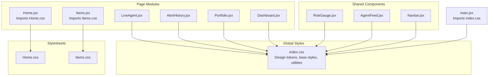
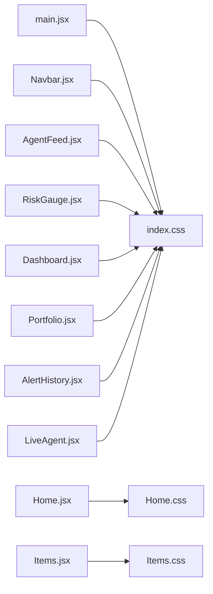
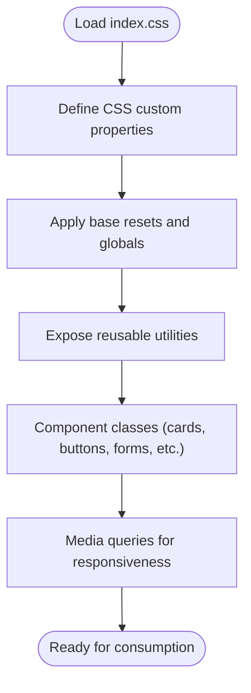
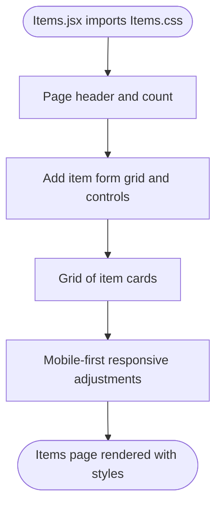
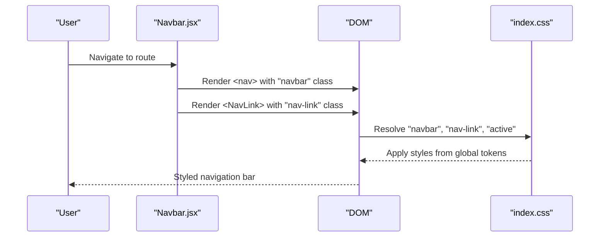
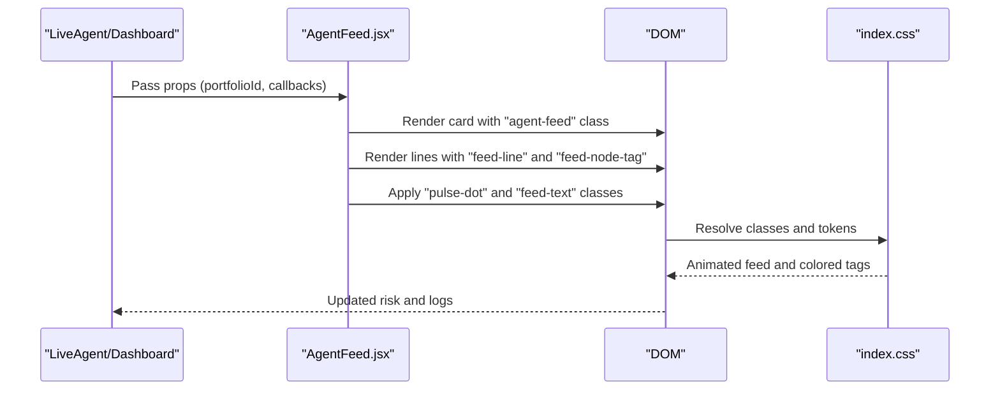
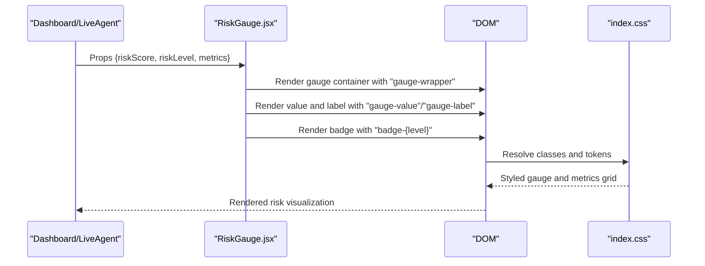
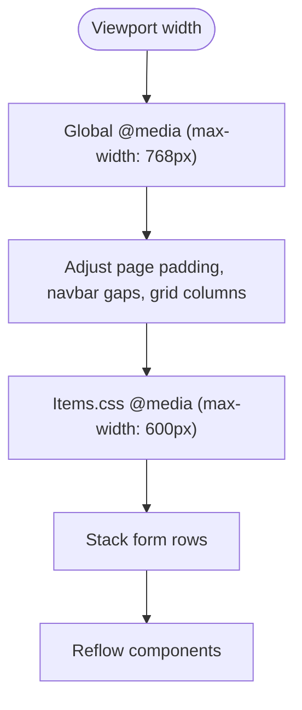
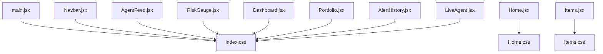

# Styling Architecture

<cite>
**Referenced Files in This Document**
- [index.css](file://frontend/src/index.css)
- [Home.css](file://frontend/src/styles/Home.css)
- [Items.css](file://frontend/src/styles/Items.css)
- [main.jsx](file://frontend/src/main.jsx)
- [App.jsx](file://frontend/src/App.jsx)
- [Navbar.jsx](file://frontend/src/components/Navbar.jsx)
- [Home.jsx](file://frontend/src/pages/Home.jsx)
- [Items.jsx](file://frontend/src/pages/Items.jsx)
- [Dashboard.jsx](file://frontend/src/pages/Dashboard.jsx)
- [Portfolio.jsx](file://frontend/src/pages/Portfolio.jsx)
- [AlertHistory.jsx](file://frontend/src/pages/AlertHistory.jsx)
- [LiveAgent.jsx](file://frontend/src/pages/LiveAgent.jsx)
- [AgentFeed.jsx](file://frontend/src/components/AgentFeed.jsx)
- [RiskGauge.jsx](file://frontend/src/components/RiskGauge.jsx)
- [package.json](file://frontend/package.json)
- [vite.config.js](file://frontend/vite.config.js)
</cite>

## Table of Contents
1. [Introduction](#introduction)
2. [Project Structure](#project-structure)
3. [Core Components](#core-components)
4. [Architecture Overview](#architecture-overview)
5. [Detailed Component Analysis](#detailed-component-analysis)
6. [Dependency Analysis](#dependency-analysis)
7. [Performance Considerations](#performance-considerations)
8. [Troubleshooting Guide](#troubleshooting-guide)
9. [Conclusion](#conclusion)
10. [Appendices](#appendices)

## Introduction
This document describes the styling architecture of the ishwarambare-app frontend. It explains how global styles are organized in index.css, how component-specific styles are structured in dedicated CSS files, and how these styles integrate with React components. It covers the design system built with CSS custom properties, the naming and modularity strategies, responsive design and mobile-first approach, color and typography systems, spacing conventions, and design tokens. It also documents the styling workflow, development versus production differences, and optimization techniques to keep styles maintainable and performant.

## Project Structure
The frontend uses a minimal, flat CSS architecture:
- Global baseline and design system live in a single global stylesheet.
- Component-specific styles are imported directly into the pages that use them.
- Utility and layout classes are shared across components.

**Diagram sources**
- [index.css](file://frontend/src/index.css)
- [Home.css](file://frontend/src/styles/Home.css)
- [Items.css](file://frontend/src/styles/Items.css)
- [main.jsx](file://frontend/src/main.jsx)
- [Home.jsx](file://frontend/src/pages/Home.jsx)
- [Items.jsx](file://frontend/src/pages/Items.jsx)
- [Dashboard.jsx](file://frontend/src/pages/Dashboard.jsx)
- [Portfolio.jsx](file://frontend/src/pages/Portfolio.jsx)
- [AlertHistory.jsx](file://frontend/src/pages/AlertHistory.jsx)
- [LiveAgent.jsx](file://frontend/src/pages/LiveAgent.jsx)
- [Navbar.jsx](file://frontend/src/components/Navbar.jsx)
- [AgentFeed.jsx](file://frontend/src/components/AgentFeed.jsx)
- [RiskGauge.jsx](file://frontend/src/components/RiskGauge.jsx)

**Section sources**
- [main.jsx:1-11](file://frontend/src/main.jsx#L1-L11)
- [index.css:1-504](file://frontend/src/index.css#L1-L504)
- [Home.jsx:1-63](file://frontend/src/pages/Home.jsx#L1-L63)
- [Items.jsx:1-125](file://frontend/src/pages/Items.jsx#L1-L125)

## Core Components
- Global design system and utilities: index.css defines CSS custom properties, base resets, typography, layout helpers, and reusable component classes (cards, buttons, forms, tables, badges, etc.).
- Page-level styles: Home.css and Items.css encapsulate page-specific visuals and responsive tweaks.
- Shared component styles: Navbar, AgentFeed, and RiskGauge rely on global classes and tokens.

Key global categories in index.css:
- Design tokens: backgrounds, borders, text, accents, shadows, radii, transitions.
- Base: resets, html/body, fonts, and global animations.
- Typography: headings, paragraphs, links, monospace.
- Layout: page wrappers, headers, grids.
- Components: cards, stat cards, navbar, buttons, badges, forms, tables, agent feed, spinners, gauges, toasts, chips, progress bars, dividers, empty states, scrollbars.
- Responsive: media queries targeting tablet/mobile.

Integration pattern:
- Global styles are imported once in main.jsx.
- Pages import their specific stylesheets.
- Components apply class names that resolve to global utilities or page-specific overrides.

**Section sources**
- [index.css:8-50](file://frontend/src/index.css#L8-L50)
- [index.css:52-67](file://frontend/src/index.css#L52-L67)
- [index.css:69-81](file://frontend/src/index.css#L69-L81)
- [index.css:83-104](file://frontend/src/index.css#L83-L104)
- [index.css:106-497](file://frontend/src/index.css#L106-L497)
- [index.css:498-504](file://frontend/src/index.css#L498-L504)
- [main.jsx:1-11](file://frontend/src/main.jsx#L1-L11)
- [Home.jsx](file://frontend/src/pages/Home.jsx#L4)
- [Items.jsx](file://frontend/src/pages/Items.jsx#L3)

## Architecture Overview
The styling architecture follows a modular, token-driven approach:
- index.css centralizes design tokens and shared utilities.
- Page modules import only the styles they need.
- Components compose global classes with inline styles for dynamic values where appropriate.

**Diagram sources**
- [main.jsx:1-11](file://frontend/src/main.jsx#L1-L11)
- [Home.jsx](file://frontend/src/pages/Home.jsx#L4)
- [Items.jsx](file://frontend/src/pages/Items.jsx#L3)
- [Navbar.jsx:1-51](file://frontend/src/components/Navbar.jsx#L1-L51)
- [AgentFeed.jsx:1-175](file://frontend/src/components/AgentFeed.jsx#L1-L175)
- [RiskGauge.jsx:1-101](file://frontend/src/components/RiskGauge.jsx#L1-L101)
- [Dashboard.jsx:1-211](file://frontend/src/pages/Dashboard.jsx#L1-L211)
- [Portfolio.jsx:1-387](file://frontend/src/pages/Portfolio.jsx#L1-L387)
- [AlertHistory.jsx:1-163](file://frontend/src/pages/AlertHistory.jsx#L1-L163)
- [LiveAgent.jsx:1-95](file://frontend/src/pages/LiveAgent.jsx#L1-L95)
- [index.css:1-504](file://frontend/src/index.css#L1-L504)

## Detailed Component Analysis

### Global Design System (index.css)
- Design tokens: CSS custom properties define backgrounds, borders, text, accents, risk colors, shadows, radii, and transitions. These tokens are consumed by all components and utilities.
- Base styles: normalize/reset, html font size, body background and typography, global gradients.
- Utilities: typography helpers, layout wrappers and headers, grid helpers, card and stat-card patterns, navbar, buttons, badges, forms, tables, agent feed, spinners, gauges, toasts, chips, progress bars, dividers, empty states, and scrollbar customization.
- Responsive: a single media query adjusts layout for smaller screens.

**Diagram sources**
- [index.css:8-50](file://frontend/src/index.css#L8-L50)
- [index.css:52-67](file://frontend/src/index.css#L52-L67)
- [index.css:69-497](file://frontend/src/index.css#L69-L497)
- [index.css:498-504](file://frontend/src/index.css#L498-L504)

**Section sources**
- [index.css:8-50](file://frontend/src/index.css#L8-L50)
- [index.css:52-67](file://frontend/src/index.css#L52-L67)
- [index.css:69-497](file://frontend/src/index.css#L69-L497)
- [index.css:498-504](file://frontend/src/index.css#L498-L504)

### Page-Specific Styles

#### Home.css
- Purpose: Encapsulates Home page visuals including hero section, gradient text, API status indicator, and feature cards.
- Patterns: Uses global tokens via var() and local spacing tokens (e.g., --space-* placeholders) to keep consistent spacing.
- Responsiveness: No explicit media query in this file; relies on global responsive rules.

**Diagram sources**
- [Home.jsx](file://frontend/src/pages/Home.jsx#L4)
- [Home.css:1-66](file://frontend/src/styles/Home.css#L1-L66)

**Section sources**
- [Home.jsx](file://frontend/src/pages/Home.jsx#L4)
- [Home.css:1-66](file://frontend/src/styles/Home.css#L1-L66)

#### Items.css
- Purpose: Items page layout, form rows, checkboxes, item cards, and pricing.
- Patterns: Uses grid and spacing tokens; includes a narrow-screen media query to stack form rows.

**Diagram sources**
- [Items.jsx](file://frontend/src/pages/Items.jsx#L3)
- [Items.css:1-30](file://frontend/src/styles/Items.css#L1-L30)

**Section sources**
- [Items.jsx](file://frontend/src/pages/Items.jsx#L3)
- [Items.css:1-30](file://frontend/src/styles/Items.css#L1-L30)

### Component Styling Patterns

#### Navbar.jsx
- Pattern: Applies global navbar and nav-link classes; uses NavLink for active state toggling.
- Integration: Consumes global tokens for colors, borders, and transitions.

**Diagram sources**
- [Navbar.jsx:1-51](file://frontend/src/components/Navbar.jsx#L1-L51)
- [index.css:152-203](file://frontend/src/index.css#L152-L203)

**Section sources**
- [Navbar.jsx:1-51](file://frontend/src/components/Navbar.jsx#L1-L51)
- [index.css:152-203](file://frontend/src/index.css#L152-L203)

#### AgentFeed.jsx
- Pattern: Uses global card, agent-feed, feed-line, feed-node-tag, and feed-text classes; applies dynamic status badges and spinner classes.
- Integration: Consumes global tokens for colors, borders, and animations.

**Diagram sources**
- [AgentFeed.jsx:28-175](file://frontend/src/components/AgentFeed.jsx#L28-L175)
- [index.css:324-386](file://frontend/src/index.css#L324-L386)

**Section sources**
- [AgentFeed.jsx:28-175](file://frontend/src/components/AgentFeed.jsx#L28-L175)
- [index.css:324-386](file://frontend/src/index.css#L324-L386)

#### RiskGauge.jsx
- Pattern: Uses global gauge-wrapper, gauge-value, gauge-label, and badge classes; dynamically selects badge variants based on risk level.
- Integration: Consumes global tokens for colors and typography.

**Diagram sources**
- [RiskGauge.jsx:20-101](file://frontend/src/components/RiskGauge.jsx#L20-L101)
- [index.css:410-423](file://frontend/src/index.css#L410-L423)

**Section sources**
- [RiskGauge.jsx:20-101](file://frontend/src/components/RiskGauge.jsx#L20-L101)
- [index.css:410-423](file://frontend/src/index.css#L410-L423)

### Naming Conventions and Modular Approach
- Modularity: Each page imports its own stylesheet, enabling scoped styling and easier maintenance.
- Naming: Uses BEM-like class names (e.g., .hero, .hero__content, .api-status, .api-status__dot) to avoid conflicts and improve readability.
- Tokenization: Extensive use of CSS custom properties (e.g., var(--bg-base), var(--text-primary)) ensures consistent theming across components.
- Utility-first: Global utilities (.card, .btn, .grid-*) enable rapid composition while preserving design consistency.

**Section sources**
- [Home.css:1-66](file://frontend/src/styles/Home.css#L1-L66)
- [Items.css:1-30](file://frontend/src/styles/Items.css#L1-L30)
- [index.css:8-50](file://frontend/src/index.css#L8-L50)

### Responsive Design and Mobile-First
- Global responsive rule targets tablets and phones to adjust page padding, navbar gaps, and grid layouts.
- Page-specific responsive rule in Items.css stacks form rows on narrow screens.
- Components adapt to screen sizes using grid and flex utilities from the global stylesheet.

**Diagram sources**
- [index.css:498-504](file://frontend/src/index.css#L498-L504)
- [Items.css:27-30](file://frontend/src/styles/Items.css#L27-L30)

**Section sources**
- [index.css:498-504](file://frontend/src/index.css#L498-L504)
- [Items.css:27-30](file://frontend/src/styles/Items.css#L27-L30)

### Color Scheme, Typography, Spacing, and Tokens
- Color scheme: Dark theme with indigo/violet accents and risk-based colors (low/medium/high). Defined via CSS custom properties.
- Typography: Inter for body and headings, JetBrains Mono for code-like elements; clamp-based fluid sizing for headings.
- Spacing: Consistent use of tokens for paddings, margins, and gaps; page-level spacing tokens are referenced in page styles.
- Tokens: Centralized in :root for backgrounds, borders, text, accents, shadows, radii, transitions.

**Section sources**
- [index.css:8-50](file://frontend/src/index.css#L8-L50)
- [index.css:69-81](file://frontend/src/index.css#L69-L81)
- [Home.css:2-27](file://frontend/src/styles/Home.css#L2-L27)
- [Items.css:1-9](file://frontend/src/styles/Items.css#L1-L9)

### CSS-in-JS Considerations
- Inline styles are used sparingly for dynamic values (e.g., color, width, or computed values) within components (e.g., RiskGauge.jsx, Portfolio.jsx). This keeps styles close to logic while still leveraging global tokens via var().
- Benefits: Dynamic theming and per-render calculations without duplicating CSS.
- Trade-offs: Slightly larger HTML/CSS output; ensure critical tokens remain in global CSS.

**Section sources**
- [RiskGauge.jsx:49-97](file://frontend/src/components/RiskGauge.jsx#L49-L97)
- [Portfolio.jsx:83-99](file://frontend/src/pages/Portfolio.jsx#L83-L99)
- [Dashboard.jsx:101-125](file://frontend/src/pages/Dashboard.jsx#L101-L125)

## Dependency Analysis
- main.jsx imports index.css globally.
- Pages import their respective stylesheets.
- Components rely on global classes and tokens.
- Build tooling (Vite) bundles styles with the app.

**Diagram sources**
- [main.jsx:1-11](file://frontend/src/main.jsx#L1-L11)
- [Home.jsx](file://frontend/src/pages/Home.jsx#L4)
- [Items.jsx](file://frontend/src/pages/Items.jsx#L3)
- [Navbar.jsx:1-51](file://frontend/src/components/Navbar.jsx#L1-L51)
- [AgentFeed.jsx:1-175](file://frontend/src/components/AgentFeed.jsx#L1-L175)
- [RiskGauge.jsx:1-101](file://frontend/src/components/RiskGauge.jsx#L1-L101)
- [Dashboard.jsx:1-211](file://frontend/src/pages/Dashboard.jsx#L1-L211)
- [Portfolio.jsx:1-387](file://frontend/src/pages/Portfolio.jsx#L1-L387)
- [AlertHistory.jsx:1-163](file://frontend/src/pages/AlertHistory.jsx#L1-L163)
- [LiveAgent.jsx:1-95](file://frontend/src/pages/LiveAgent.jsx#L1-L95)
- [index.css:1-504](file://frontend/src/index.css#L1-L504)

**Section sources**
- [main.jsx:1-11](file://frontend/src/main.jsx#L1-L11)
- [vite.config.js:1-23](file://frontend/vite.config.js#L1-L23)
- [package.json:1-27](file://frontend/package.json#L1-L27)

## Performance Considerations
- Single global stylesheet reduces HTTP requests and ensures token availability across the app.
- Minimal CSS-in-JS usage keeps critical styles in CSS; inline styles are reserved for dynamic values.
- Media queries are consolidated in the global stylesheet to avoid duplication.
- Build configuration disables source maps in production to reduce bundle size footprint.

Recommendations:
- Keep global stylesheet minimal and focused on tokens and utilities.
- Prefer global classes over inline styles where possible.
- Avoid unnecessary re-renders that cause style churn.
- Monitor bundle size growth as new pages/stylesheets are added.

**Section sources**
- [vite.config.js:18-22](file://frontend/vite.config.js#L18-L22)
- [package.json:1-27](file://frontend/package.json#L1-L27)

## Troubleshooting Guide
Common styling issues and resolutions:
- Missing styles on a page: Ensure the page imports its stylesheet and main.jsx imports index.css.
- Inconsistent colors or spacing: Verify CSS custom properties are defined and used consistently.
- Responsive layout glitches: Confirm media queries are applied and breakpoints match device widths.
- Inline style conflicts: Review dynamic inline styles and ensure they align with global tokens.

**Section sources**
- [main.jsx:1-11](file://frontend/src/main.jsx#L1-L11)
- [Home.jsx](file://frontend/src/pages/Home.jsx#L4)
- [Items.jsx](file://frontend/src/pages/Items.jsx#L3)
- [index.css:8-50](file://frontend/src/index.css#L8-L50)
- [index.css:498-504](file://frontend/src/index.css#L498-L504)

## Conclusion
The styling architecture emphasizes a centralized design system with CSS custom properties, minimal page-specific stylesheets, and shared component utilities. This approach yields a consistent, maintainable, and performant frontend that scales with additional pages and components. By combining global tokens with targeted page styles and judicious use of inline styles, the app achieves a clean separation of concerns while preserving flexibility.

## Appendices

### Appendix A: Global Classes Reference
- Layout: .page-wrapper, .page-header, .page-title, .page-subtitle
- Grids: .grid-2, .grid-3, .grid-4
- Cards: .card, .card-header, .card-title
- Stat cards: .stat-card, .stat-label, .stat-value, .stat-sub, .stat-delta
- Buttons: .btn, .btn-primary, .btn-secondary, .btn-danger, .btn-sm, .btn-lg, .btn-icon
- Badges: .badge, .badge-high, .badge-medium, .badge-low, .badge-info
- Forms: .form-group, .form-label, .form-input, .form-select, .form-error, .form-hint
- Tables: .table-wrapper, table styles
- Agent feed: .agent-feed, .feed-line, .feed-node-tag, .feed-text, .feed-status-bar
- Gauges: .gauge-wrapper, .gauge-value, .gauge-label
- Toasts: .toast, .toast-success, .toast-error, .toast-info
- Chips: .ticker-chip
- Progress: .progress-bar, .progress-fill
- Dividers: .divider
- Empty states: .empty-state
- Scrollbars: global ::-webkit-scrollbar rules

**Section sources**
- [index.css:83-497](file://frontend/src/index.css#L83-L497)