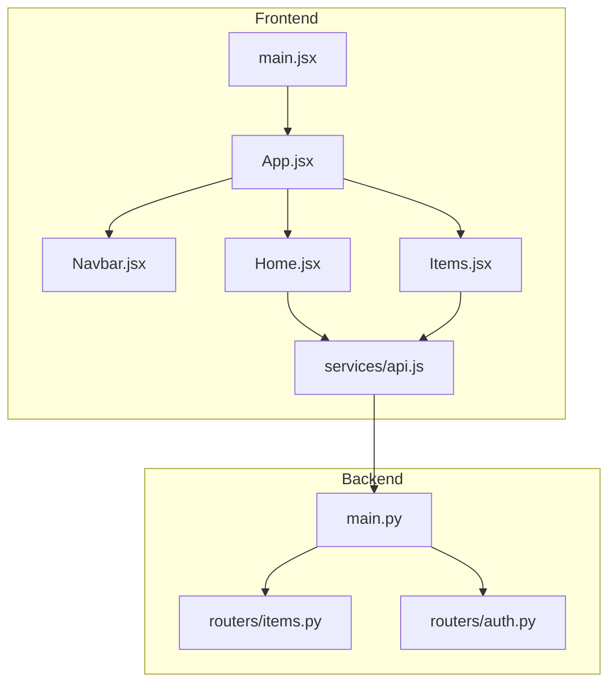
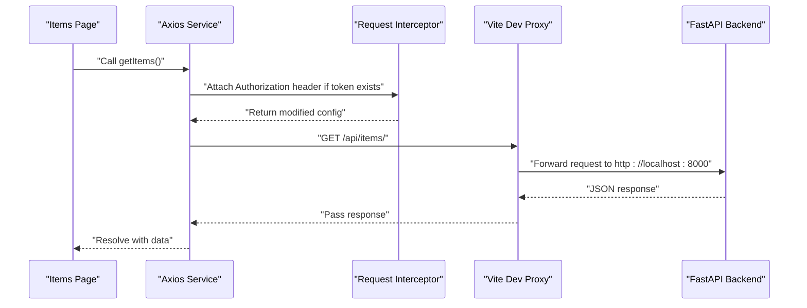
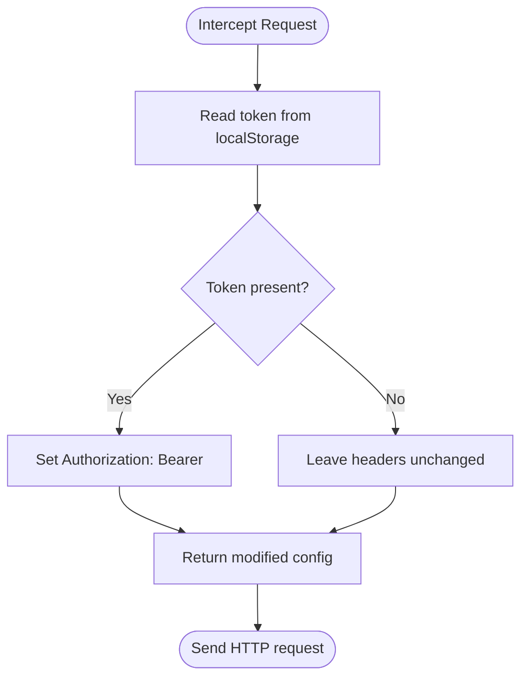
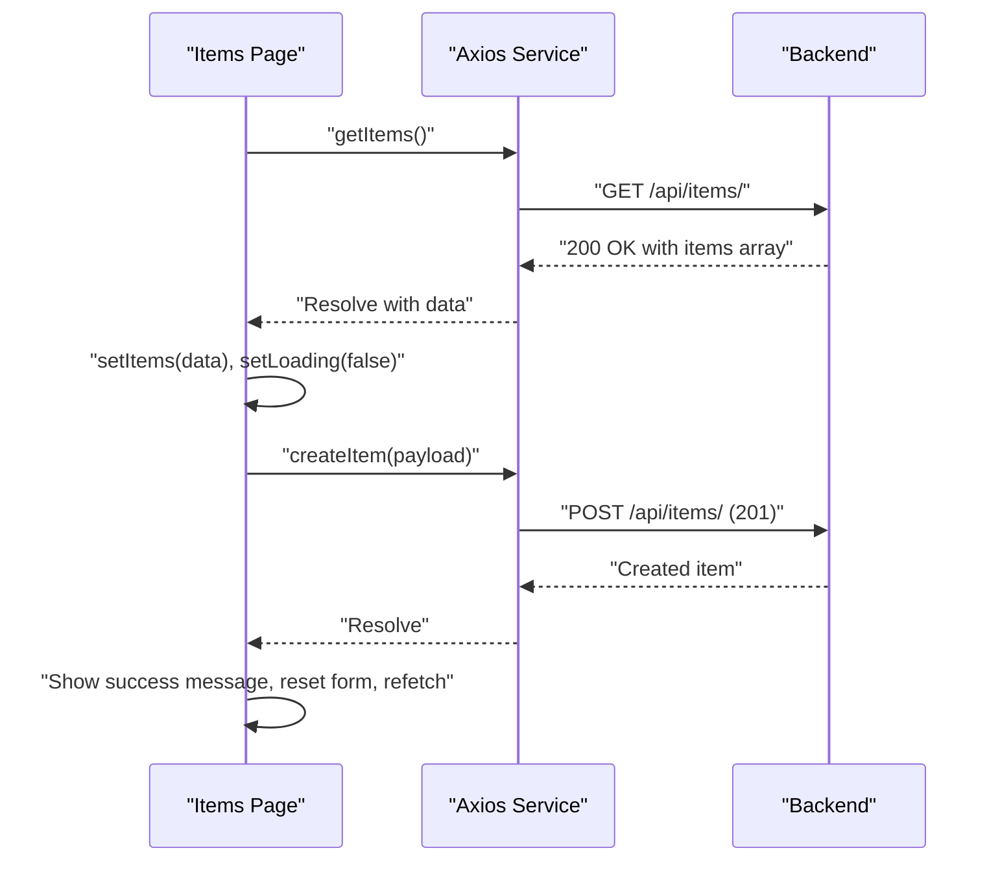
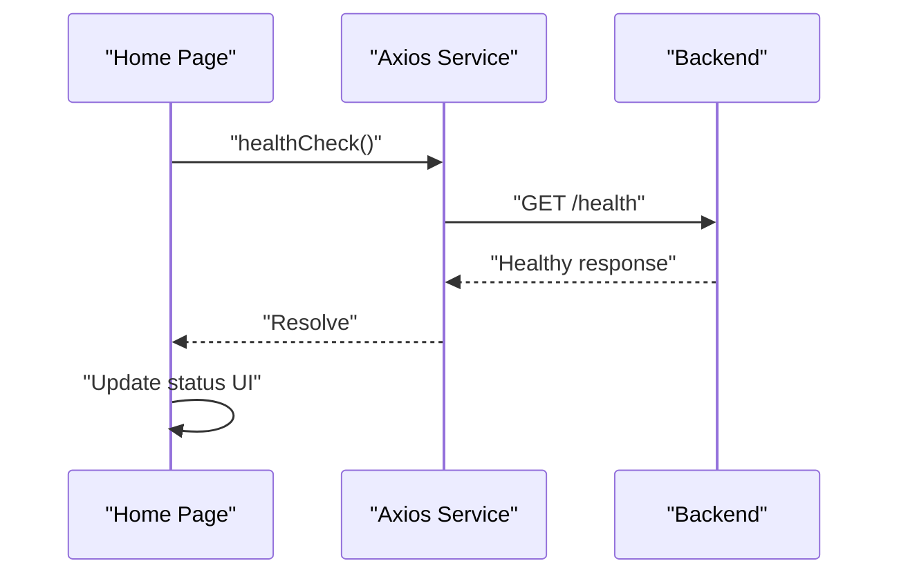
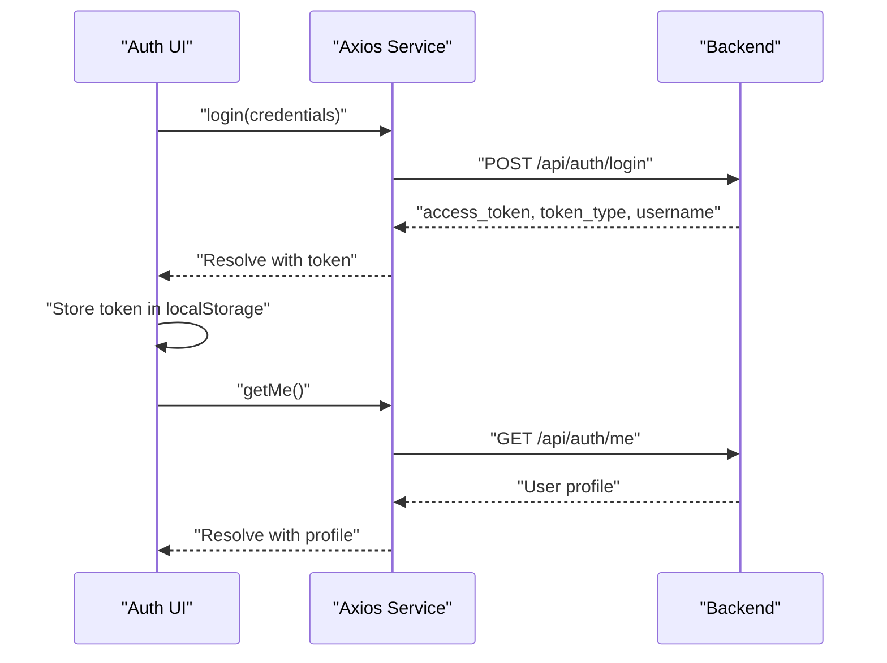
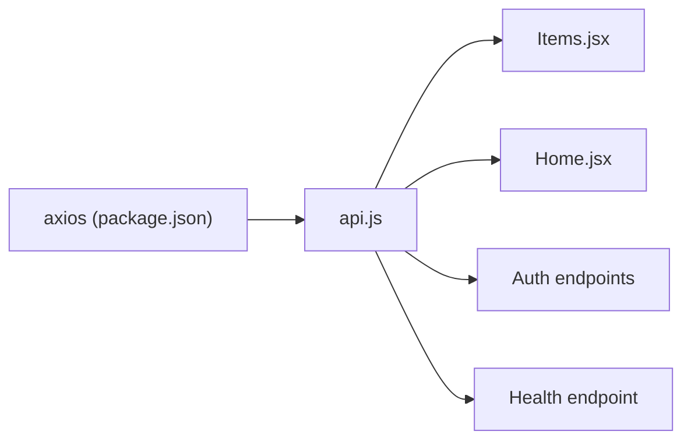

# API Integration Layer

<cite>
**Referenced Files in This Document**
- [api.js](file://frontend/src/services/api.js)
- [Items.jsx](file://frontend/src/pages/Items.jsx)
- [Home.jsx](file://frontend/src/pages/Home.jsx)
- [Navbar.jsx](file://frontend/src/components/Navbar.jsx)
- [App.jsx](file://frontend/src/App.jsx)
- [main.jsx](file://frontend/src/main.jsx)
- [vite.config.js](file://frontend/vite.config.js)
- [package.json](file://frontend/package.json)
- [auth.py](file://backend/routers/auth.py)
- [items.py](file://backend/routers/items.py)
- [main.py](file://backend/main.py)
- [README.md](file://README.md)
</cite>

## Table of Contents
1. [Introduction](#introduction)
2. [Project Structure](#project-structure)
3. [Core Components](#core-components)
4. [Architecture Overview](#architecture-overview)
5. [Detailed Component Analysis](#detailed-component-analysis)
6. [Dependency Analysis](#dependency-analysis)
7. [Performance Considerations](#performance-considerations)
8. [Troubleshooting Guide](#troubleshooting-guide)
9. [Conclusion](#conclusion)
10. [Appendices](#appendices)

## Introduction
This document describes the API integration layer implemented with Axios in the frontend React application. It covers centralized service configuration, request and response handling, authentication via an Axios interceptor, HTTP method usage, and frontend consumption patterns. It also outlines best practices for error handling, loading states, and retry strategies, and explains how the development proxy integrates with the backend.

## Project Structure
The API integration layer lives in the frontend under a dedicated service module and is consumed by page components. The backend exposes REST endpoints that the frontend calls through a configured Axios instance.

**Diagram sources**
- [main.jsx:1-11](file://frontend/src/main.jsx#L1-L11)
- [App.jsx:1-19](file://frontend/src/App.jsx#L1-L19)
- [Navbar.jsx:1-19](file://frontend/src/components/Navbar.jsx#L1-L19)
- [Home.jsx:1-63](file://frontend/src/pages/Home.jsx#L1-L63)
- [Items.jsx:1-125](file://frontend/src/pages/Items.jsx#L1-L125)
- [api.js:1-29](file://frontend/src/services/api.js#L1-L29)
- [main.py:1-44](file://backend/main.py#L1-L44)
- [items.py:1-72](file://backend/routers/items.py#L1-L72)
- [auth.py:1-39](file://backend/routers/auth.py#L1-L39)

**Section sources**
- [README.md:111-123](file://README.md#L111-L123)
- [vite.config.js:1-23](file://frontend/vite.config.js#L1-L23)
- [package.json:1-24](file://frontend/package.json#L1-L24)

## Core Components
- Centralized Axios instance with base URL and JSON headers
- Request interceptor attaching Authorization header when a token exists
- Exported convenience functions for items, auth, and health checks
- Frontend pages consuming the service for CRUD and health operations

Key implementation references:
- Axios instance creation and defaults: [api.js:3-6](file://frontend/src/services/api.js#L3-L6)
- Request interceptor for Authorization: [api.js:9-13](file://frontend/src/services/api.js#L9-L13)
- Convenience methods: [api.js:16-26](file://frontend/src/services/api.js#L16-L26)

**Section sources**
- [api.js:1-29](file://frontend/src/services/api.js#L1-L29)

## Architecture Overview
The frontend uses a single Axios instance to communicate with the backend. During development, Vite proxies API routes to the backend server. Production builds rely on the environment variable to point to the deployed backend.

**Diagram sources**
- [api.js:9-13](file://frontend/src/services/api.js#L9-L13)
- [vite.config.js:9-16](file://frontend/vite.config.js#L9-L16)
- [items.py:36-39](file://backend/routers/items.py#L36-L39)

## Detailed Component Analysis

### Axios Service Layer
The service layer centralizes HTTP configuration and exposes typed functions for each endpoint. It sets the base URL from an environment variable and attaches an Authorization header when a token is present in local storage.

- Instance configuration: [api.js:3-6](file://frontend/src/services/api.js#L3-L6)
- Token injection: [api.js:9-13](file://frontend/src/services/api.js#L9-L13)
- Methods:
  - Items: [api.js:16-19](file://frontend/src/services/api.js#L16-L19)
  - Auth: [api.js:22-23](file://frontend/src/services/api.js#L22-L23)
  - Health: [api.js:26](file://frontend/src/services/api.js#L26)

**Diagram sources**
- [api.js:9-13](file://frontend/src/services/api.js#L9-L13)

**Section sources**
- [api.js:1-29](file://frontend/src/services/api.js#L1-L29)

### Items Page Integration
The Items page demonstrates:
- Loading and error states
- Fetching data on mount
- Creating and deleting items
- Handling user feedback messages

- Fetch lifecycle: [Items.jsx:13-23](file://frontend/src/pages/Items.jsx#L13-L23)
- Create flow: [Items.jsx:32-46](file://frontend/src/pages/Items.jsx#L32-L46)
- Delete flow: [Items.jsx:48-56](file://frontend/src/pages/Items.jsx#L48-L56)
- Rendering states: [Items.jsx:98-120](file://frontend/src/pages/Items.jsx#L98-L120)

**Diagram sources**
- [Items.jsx:13-23](file://frontend/src/pages/Items.jsx#L13-L23)
- [Items.jsx:32-46](file://frontend/src/pages/Items.jsx#L32-L46)
- [api.js:16-19](file://frontend/src/services/api.js#L16-L19)
- [items.py:52-59](file://backend/routers/items.py#L52-L59)

**Section sources**
- [Items.jsx:1-125](file://frontend/src/pages/Items.jsx#L1-L125)

### Home Page Health Check
The Home page performs a health check to indicate API availability.

- Health check invocation: [Home.jsx:17-21](file://frontend/src/pages/Home.jsx#L17-L21)
- Endpoint: [api.js:26](file://frontend/src/services/api.js#L26)
- Backend route: [main.py:41-43](file://backend/main.py#L41-L43)

**Diagram sources**
- [Home.jsx:17-21](file://frontend/src/pages/Home.jsx#L17-L21)
- [api.js:26](file://frontend/src/services/api.js#L26)
- [main.py:41-43](file://backend/main.py#L41-L43)

**Section sources**
- [Home.jsx:1-63](file://frontend/src/pages/Home.jsx#L1-L63)

### Authentication Flow (Demo)
The authentication endpoints are exposed by the backend and called via the service layer. The demo login returns a bearer token stub and a user profile.

- Login endpoint: [auth.py:18-32](file://backend/routers/auth.py#L18-L32)
- Profile endpoint: [auth.py:35-38](file://backend/routers/auth.py#L35-L38)
- Service calls: [api.js:22-23](file://frontend/src/services/api.js#L22-L23)

**Diagram sources**
- [auth.py:18-32](file://backend/routers/auth.py#L18-L32)
- [auth.py:35-38](file://backend/routers/auth.py#L35-L38)
- [api.js:22-23](file://frontend/src/services/api.js#L22-L23)

**Section sources**
- [auth.py:1-39](file://backend/routers/auth.py#L1-L39)
- [api.js:21-23](file://frontend/src/services/api.js#L21-L23)

## Dependency Analysis
- Axios dependency declared in package.json: [package.json:15](file://frontend/package.json#L15)
- Axios runtime usage in service: [api.js:1](file://frontend/src/services/api.js#L1)
- Frontend components depend on service exports: [Items.jsx:2](file://frontend/src/pages/Items.jsx#L2), [Home.jsx:2](file://frontend/src/pages/Home.jsx#L2)
- Backend endpoints consumed by service methods: [api.js:16-26](file://frontend/src/services/api.js#L16-L26)

**Diagram sources**
- [package.json:15](file://frontend/package.json#L15)
- [api.js:1-29](file://frontend/src/services/api.js#L1-L29)
- [Items.jsx:2](file://frontend/src/pages/Items.jsx#L2)
- [Home.jsx:2](file://frontend/src/pages/Home.jsx#L2)

**Section sources**
- [package.json:1-24](file://frontend/package.json#L1-L24)
- [api.js:1-29](file://frontend/src/services/api.js#L1-L29)

## Performance Considerations
- Prefer centralized Axios instances to minimize overhead and ensure consistent configuration.
- Use environment variables for base URLs to avoid hardcoding and enable easy switching between environments.
- Avoid unnecessary re-renders by batching UI updates after successful responses.
- Consider adding request/response timeouts and retry policies at the service layer for resilience.

## Troubleshooting Guide
Common issues and remedies:
- Backend not reachable in development:
  - Verify Vite proxy configuration and backend port: [vite.config.js:7-16](file://frontend/vite.config.js#L7-L16)
  - Confirm backend is running and exposing /health: [main.py:41-43](file://backend/main.py#L41-L43)
  - Test health from the Home page: [Home.jsx:17-21](file://frontend/src/pages/Home.jsx#L17-L21)
- Missing Authorization header:
  - Ensure token is stored in localStorage and interceptor is attached: [api.js:9-13](file://frontend/src/services/api.js#L9-L13)
- CORS errors:
  - Confirm ALLOWED_ORIGINS includes frontend origin: [main.py:17-28](file://backend/main.py#L17-L28)
- Environment variables:
  - Set VITE_API_URL for production builds: [README.md:92](file://README.md#L92)

**Section sources**
- [vite.config.js:7-16](file://frontend/vite.config.js#L7-L16)
- [main.py:17-28](file://backend/main.py#L17-L28)
- [Home.jsx:17-21](file://frontend/src/pages/Home.jsx#L17-L21)
- [api.js:9-13](file://frontend/src/services/api.js#L9-L13)
- [README.md:92](file://README.md#L92)

## Conclusion
The API integration layer uses a clean, centralized Axios service with a request interceptor for authentication and straightforward HTTP method wrappers. Pages consume these services to manage loading and error states, and the development proxy simplifies cross-origin requests during local development. Extending the layer with retry logic, centralized error handling, and response parsing would further improve robustness and maintainability.

## Appendices

### API Endpoints Reference
- GET /health: Health check
- GET /api/items/: List items
- GET /api/items/{id}: Get item by ID
- POST /api/items/: Create item
- DELETE /api/items/{id}: Delete item
- POST /api/auth/login: Login
- GET /api/auth/me: Get current user

**Section sources**
- [README.md:111-123](file://README.md#L111-L123)
- [api.js:16-26](file://frontend/src/services/api.js#L16-L26)
- [items.py:36-71](file://backend/routers/items.py#L36-L71)
- [auth.py:18-38](file://backend/routers/auth.py#L18-L38)