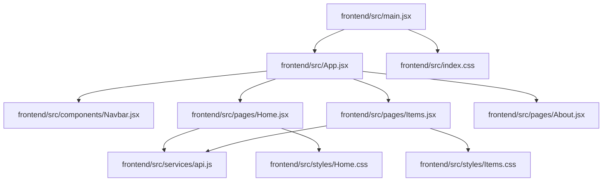
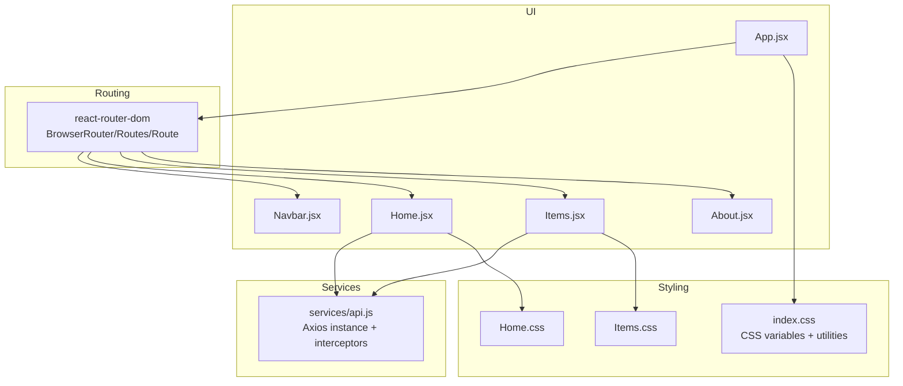
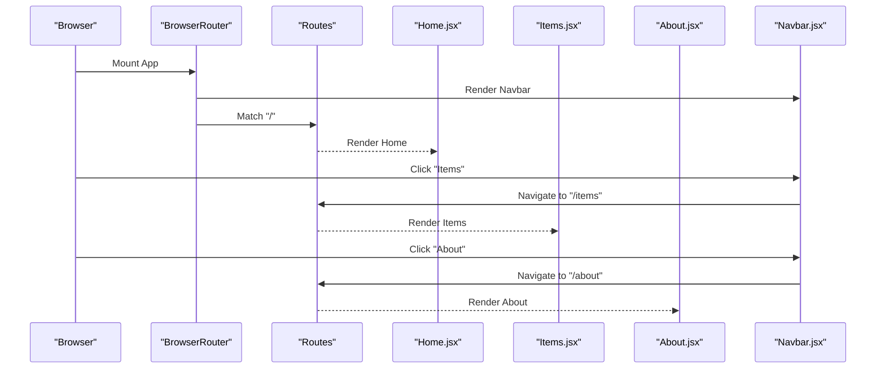
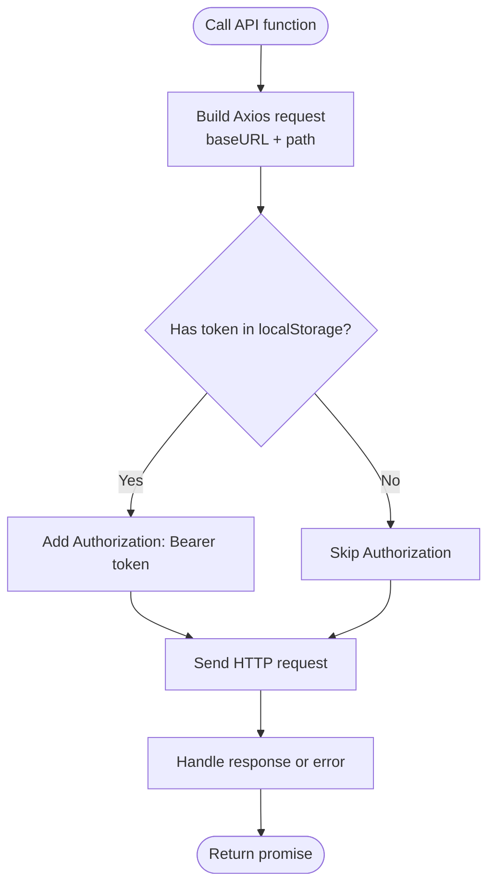
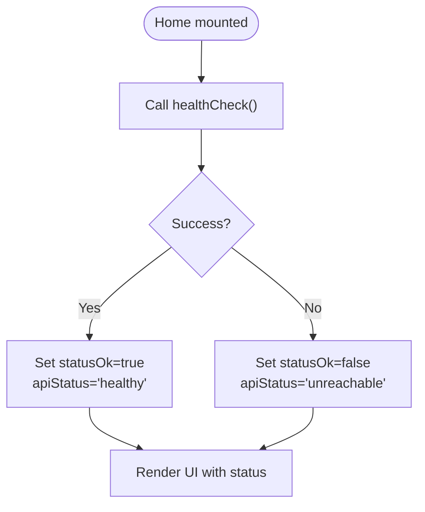
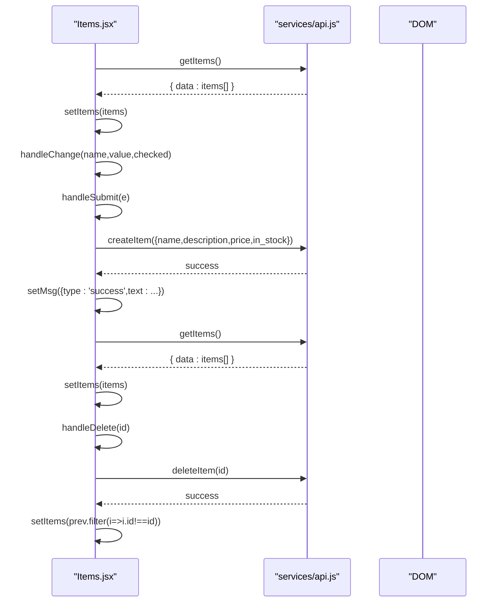
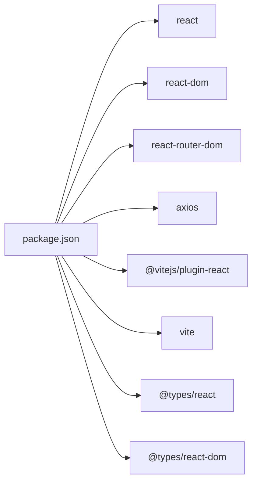

# Frontend System

<cite>
**Referenced Files in This Document**
- [main.jsx](file://frontend/src/main.jsx)
- [App.jsx](file://frontend/src/App.jsx)
- [Navbar.jsx](file://frontend/src/components/Navbar.jsx)
- [Home.jsx](file://frontend/src/pages/Home.jsx)
- [Items.jsx](file://frontend/src/pages/Items.jsx)
- [About.jsx](file://frontend/src/pages/About.jsx)
- [api.js](file://frontend/src/services/api.js)
- [index.css](file://frontend/src/index.css)
- [Home.css](file://frontend/src/styles/Home.css)
- [Items.css](file://frontend/src/styles/Items.css)
- [vite.config.js](file://frontend/vite.config.js)
- [package.json](file://frontend/package.json)
- [README.md](file://README.md)
</cite>

## Table of Contents
1. [Introduction](#introduction)
2. [Project Structure](#project-structure)
3. [Core Components](#core-components)
4. [Architecture Overview](#architecture-overview)
5. [Detailed Component Analysis](#detailed-component-analysis)
6. [Dependency Analysis](#dependency-analysis)
7. [Performance Considerations](#performance-considerations)
8. [Troubleshooting Guide](#troubleshooting-guide)
9. [Conclusion](#conclusion)
10. [Appendices](#appendices)

## Introduction
This document describes the frontend system for ishwarambare-app’s React implementation. It covers the component architecture, React Router configuration, state management patterns, navigation via the Navbar, API integration using Axios, page components (Home, Items, About), styling architecture and responsive design, and build configuration with Vite. Practical examples of component usage, state management, and API integration patterns are included to help developers understand and extend the system.

## Project Structure
The frontend is organized around a small, focused React application with clear separation of concerns:
- Entry point initializes the app and mounts it to the DOM.
- App wraps routes and renders the shared Navbar and page routes.
- Pages implement the UI and state for each route.
- Services encapsulate HTTP requests and interceptors.
- Styles define global and page-specific CSS with responsive grids and dark theme tokens.
- Vite handles development server, proxying, and production builds.

**Diagram sources**
- [main.jsx:1-11](file://frontend/src/main.jsx#L1-L11)
- [App.jsx:1-19](file://frontend/src/App.jsx#L1-L19)
- [Navbar.jsx:1-19](file://frontend/src/components/Navbar.jsx#L1-L19)
- [Home.jsx:1-63](file://frontend/src/pages/Home.jsx#L1-L63)
- [Items.jsx:1-125](file://frontend/src/pages/Items.jsx#L1-L125)
- [About.jsx:1-58](file://frontend/src/pages/About.jsx#L1-L58)
- [api.js:1-29](file://frontend/src/services/api.js#L1-L29)
- [index.css:1-142](file://frontend/src/index.css#L1-L142)
- [Home.css:1-66](file://frontend/src/styles/Home.css#L1-L66)
- [Items.css:1-30](file://frontend/src/styles/Items.css#L1-L30)

**Section sources**
- [main.jsx:1-11](file://frontend/src/main.jsx#L1-L11)
- [App.jsx:1-19](file://frontend/src/App.jsx#L1-L19)
- [package.json:1-24](file://frontend/package.json#L1-L24)

## Core Components
- App: Declares routing with BrowserRouter, renders Navbar, and defines routes for Home, Items, and About.
- Navbar: Provides navigation links using NavLink for active state styling.
- Pages:
  - Home: Displays hero content, a features grid, and an API health status indicator.
  - Items: Manages CRUD operations for items, form state, loading/error states, and deletion.
  - About: Lists stack components and project structure.
- Services: Axios instance with base URL and request interceptor for Authorization header; exports convenience functions for items and auth endpoints plus health checks.
- Styles: Global CSS variables and reusable components (buttons, cards, badges, forms, alerts, spinner, grid), with page-specific overrides.

**Section sources**
- [App.jsx:1-19](file://frontend/src/App.jsx#L1-L19)
- [Navbar.jsx:1-19](file://frontend/src/components/Navbar.jsx#L1-L19)
- [Home.jsx:1-63](file://frontend/src/pages/Home.jsx#L1-L63)
- [Items.jsx:1-125](file://frontend/src/pages/Items.jsx#L1-L125)
- [About.jsx:1-58](file://frontend/src/pages/About.jsx#L1-L58)
- [api.js:1-29](file://frontend/src/services/api.js#L1-L29)
- [index.css:1-142](file://frontend/src/index.css#L1-L142)

## Architecture Overview
The frontend follows a straightforward layered architecture:
- UI Layer: React components (App, Navbar, Pages).
- Routing Layer: React Router for declarative navigation.
- Service Layer: Axios client with interceptors and exported functions for API calls.
- State Management: React hooks (useState, useEffect) for local component state.
- Styling Layer: CSS Modules via global CSS with CSS variables and responsive utilities.

**Diagram sources**
- [App.jsx:1-19](file://frontend/src/App.jsx#L1-L19)
- [Navbar.jsx:1-19](file://frontend/src/components/Navbar.jsx#L1-L19)
- [Home.jsx:1-63](file://frontend/src/pages/Home.jsx#L1-L63)
- [Items.jsx:1-125](file://frontend/src/pages/Items.jsx#L1-L125)
- [About.jsx:1-58](file://frontend/src/pages/About.jsx#L1-L58)
- [api.js:1-29](file://frontend/src/services/api.js#L1-L29)
- [index.css:1-142](file://frontend/src/index.css#L1-L142)
- [Home.css:1-66](file://frontend/src/styles/Home.css#L1-L66)
- [Items.css:1-30](file://frontend/src/styles/Items.css#L1-L30)

## Detailed Component Analysis

### Navigation and Routing
- App configures BrowserRouter and registers routes for "/", "/items", and "/about".
- Navbar uses NavLink to render brand and navigation links; active link styling is handled automatically by NavLink.
- Home and About pages include internal navigation to Items and About respectively.

**Diagram sources**
- [App.jsx:1-19](file://frontend/src/App.jsx#L1-L19)
- [Navbar.jsx:1-19](file://frontend/src/components/Navbar.jsx#L1-L19)
- [Home.jsx:1-63](file://frontend/src/pages/Home.jsx#L1-L63)
- [Items.jsx:1-125](file://frontend/src/pages/Items.jsx#L1-L125)
- [About.jsx:1-58](file://frontend/src/pages/About.jsx#L1-L58)

**Section sources**
- [App.jsx:1-19](file://frontend/src/App.jsx#L1-L19)
- [Navbar.jsx:1-19](file://frontend/src/components/Navbar.jsx#L1-L19)

### API Integration Layer (Axios)
- Axios instance configured with a base URL derived from VITE_API_URL with a fallback to localhost:8000.
- Request interceptor attaches Authorization header if a token exists in localStorage.
- Exports functions for:
  - Items: getItems, getItem, createItem, deleteItem
  - Auth: login, getMe
  - Health: healthCheck

**Diagram sources**
- [api.js:1-29](file://frontend/src/services/api.js#L1-L29)

**Section sources**
- [api.js:1-29](file://frontend/src/services/api.js#L1-L29)

### Home Page
- Purpose: Hero section, feature highlights, and live API health status.
- State:
  - apiStatus: string indicating health check outcome.
  - statusOk: boolean|null reflecting health status.
- Behavior:
  - On mount, performs a health check via healthCheck().
  - Updates statusOk and displays a colored status indicator.
  - Provides navigation to Items and About.

**Diagram sources**
- [Home.jsx:13-21](file://frontend/src/pages/Home.jsx#L13-L21)

**Section sources**
- [Home.jsx:1-63](file://frontend/src/pages/Home.jsx#L1-L63)
- [Home.css:1-66](file://frontend/src/styles/Home.css#L1-L66)

### Items Page
- Purpose: CRUD interface for items with a form, list display, and delete actions.
- State:
  - items: array of item objects.
  - loading: boolean for initial fetch.
  - error: string|null for error messages.
  - form: object for new item creation (name, description, price, in_stock).
  - saving: boolean while submitting.
  - msg: object|null for feedback (success/error).
- Behavior:
  - Fetches items on mount.
  - Handles form input changes and submission.
  - Submits createItem with parsed numeric price.
  - Deletes items and refreshes the list.
  - Displays loading spinner, error alerts, and success/error messages.

**Diagram sources**
- [Items.jsx:1-125](file://frontend/src/pages/Items.jsx#L1-L125)
- [api.js:16-19](file://frontend/src/services/api.js#L16-L19)

**Section sources**
- [Items.jsx:1-125](file://frontend/src/pages/Items.jsx#L1-L125)
- [Items.css:1-30](file://frontend/src/styles/Items.css#L1-L30)

### About Page
- Purpose: Present technology stack and project structure.
- Content:
  - Stack cards with role, color, and description.
  - Project structure in a preformatted block.

**Section sources**
- [About.jsx:1-58](file://frontend/src/pages/About.jsx#L1-L58)

### Styling Architecture and Responsive Design
- Global CSS variables define a cohesive dark theme with spacing, radius, transitions, and color tokens.
- Utilities:
  - Buttons: primary, outline, danger variants with hover effects and disabled states.
  - Cards: surface background, borders, hover shadows.
  - Badges: green/red variants for stock status.
  - Forms: focus states, labels, and controls.
  - Alerts: success/error variants.
  - Spinner: animated loader.
  - Grid: responsive grid utilities with repeat and minmax.
- Page-specific styles:
  - Home: hero glow, gradient text, API status indicator with animation.
  - Items: form layout, responsive two-column row on larger screens, badge and price styling.

**Section sources**
- [index.css:1-142](file://frontend/src/index.css#L1-L142)
- [Home.css:1-66](file://frontend/src/styles/Home.css#L1-L66)
- [Items.css:1-30](file://frontend/src/styles/Items.css#L1-L30)

### Component Reusability Patterns
- Shared utilities: buttons, cards, badges, forms, alerts, spinner, and grid classes enable consistent UI across pages.
- CSS variables and utility classes promote reuse and easy theming.
- Page components encapsulate their own state and rendering logic while relying on shared styles.

**Section sources**
- [index.css:69-142](file://frontend/src/index.css#L69-L142)
- [Home.css:1-66](file://frontend/src/styles/Home.css#L1-L66)
- [Items.css:1-30](file://frontend/src/styles/Items.css#L1-L30)

## Dependency Analysis
- Runtime dependencies:
  - react, react-dom, react-router-dom, axios.
- Dev dependencies:
  - @vitejs/plugin-react, vite, @types/react, @types/react-dom.
- Build and dev scripts:
  - dev, build, preview.

**Diagram sources**
- [package.json:1-24](file://frontend/package.json#L1-L24)

**Section sources**
- [package.json:1-24](file://frontend/package.json#L1-L24)

## Performance Considerations
- Axios instance reuse reduces overhead and centralizes configuration.
- Local storage token injection avoids repeated manual header setting.
- Minimal state updates and conditional rendering reduce unnecessary re-renders.
- CSS variables and utility classes keep styles efficient and maintainable.
- Vite build disables source maps by default to reduce bundle size; enable only when needed.

[No sources needed since this section provides general guidance]

## Troubleshooting Guide
- API connectivity:
  - Verify VITE_API_URL environment variable is set appropriately for production vs. development.
  - Confirm the backend is running and accessible at the configured base URL.
  - Check that the Authorization interceptor is attaching tokens when present.
- Health check failures:
  - The Home page indicates API health; if failing, confirm backend health endpoint availability.
- Items page errors:
  - Ensure required fields (name, price) are provided before submission.
  - Confirm network connectivity and CORS configuration on the backend.
- Development proxy:
  - Vite proxies /api to the backend during development; ensure the backend is running on the expected port.
- Environment variables:
  - For production deployments, configure VITE_API_URL and other environment variables as documented.

**Section sources**
- [api.js:3-6](file://frontend/src/services/api.js#L3-L6)
- [api.js:9-13](file://frontend/src/services/api.js#L9-L13)
- [Home.jsx:17-21](file://frontend/src/pages/Home.jsx#L17-L21)
- [Items.jsx:32-46](file://frontend/src/pages/Items.jsx#L32-L46)
- [vite.config.js:9-16](file://frontend/vite.config.js#L9-L16)
- [README.md:88-92](file://README.md#L88-L92)

## Conclusion
The frontend system is a compact, well-structured React application that integrates cleanly with the FastAPI backend via Axios. It uses React Router for navigation, React hooks for state management, and a consistent CSS architecture with global variables and reusable utilities. The Vite configuration enables a smooth development experience with proxying and efficient production builds. The provided patterns for API integration, state handling, and styling offer a solid foundation for extending functionality.

[No sources needed since this section summarizes without analyzing specific files]

## Appendices

### Build Configuration with Vite
- Development server runs on port 5173 with a proxy for /api to the backend.
- Production build outputs to dist with source maps disabled by default.
- Scripts:
  - dev: start Vite dev server.
  - build: produce production bundle.
  - preview: serve built assets locally.

**Section sources**
- [vite.config.js:1-23](file://frontend/vite.config.js#L1-L23)
- [package.json:6-10](file://frontend/package.json#L6-L10)

### Environment Variable Management
- VITE_API_URL drives the Axios base URL; defaults to localhost:8000 if unset.
- For production, set VITE_API_URL to the deployed backend URL.
- During development, copy .env.example to .env.local and adjust as needed.

**Section sources**
- [api.js:3-6](file://frontend/src/services/api.js#L3-L6)
- [README.md:66-71](file://README.md#L66-L71)

### Practical Usage Examples
- Navigating between pages:
  - Use NavLink in Navbar for internal navigation.
  - Use Link in Home to navigate to Items and About.
- Performing CRUD:
  - Fetch items on mount in Items.
  - Submit form data to createItem; refresh list afterward.
  - Confirm deletions and update state accordingly.
- Handling API responses:
  - Wrap API calls in try/catch blocks; set loading/error/msg states.
  - Use Axios interceptors to attach tokens automatically.

**Section sources**
- [Navbar.jsx:10-14](file://frontend/src/components/Navbar.jsx#L10-L14)
- [Home.jsx:36-37](file://frontend/src/pages/Home.jsx#L36-L37)
- [Items.jsx:13-25](file://frontend/src/pages/Items.jsx#L13-L25)
- [Items.jsx:32-46](file://frontend/src/pages/Items.jsx#L32-L46)
- [Items.jsx:48-56](file://frontend/src/pages/Items.jsx#L48-L56)
- [api.js:9-13](file://frontend/src/services/api.js#L9-L13)