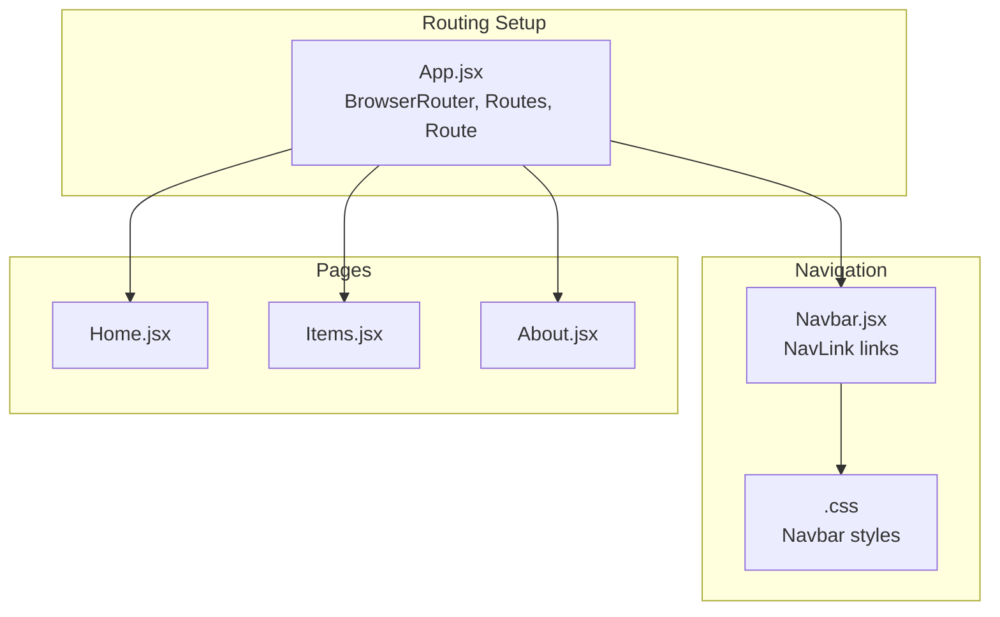
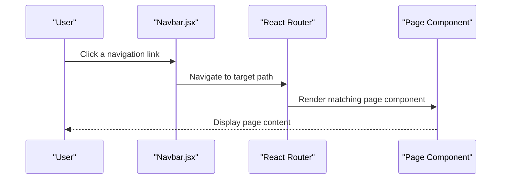
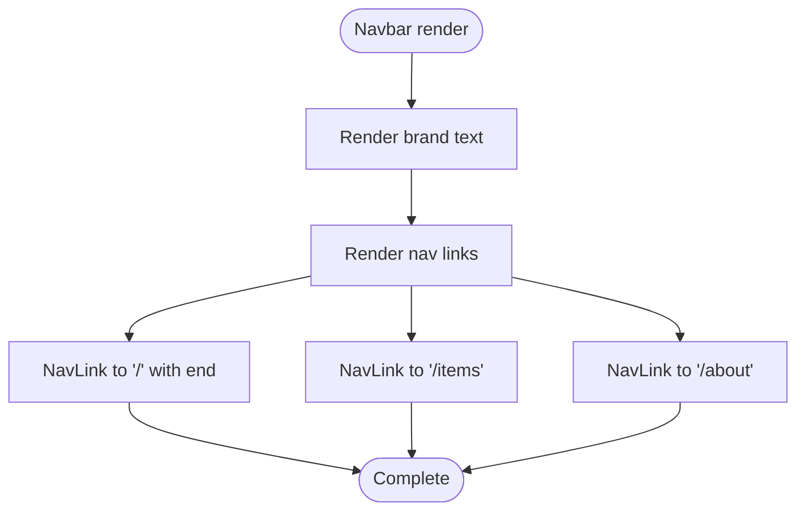
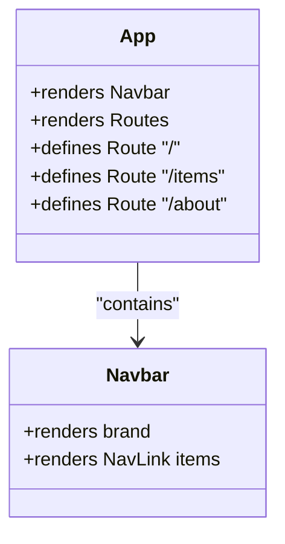
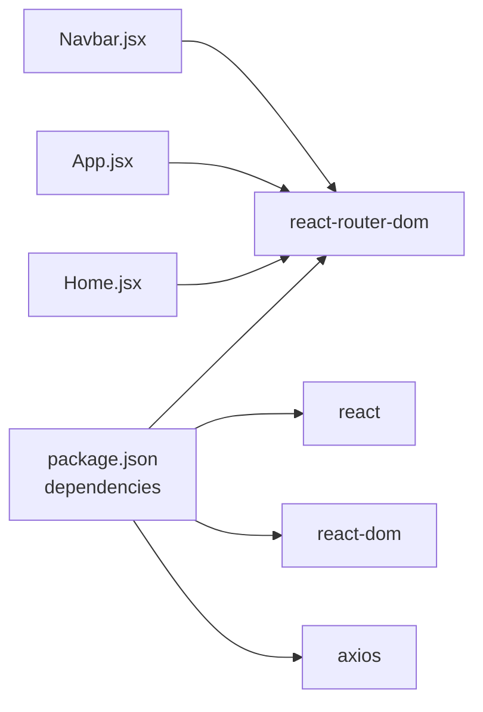

# Navigation System

<cite>
**Referenced Files in This Document**
- [Navbar.jsx](file://frontend/src/components/Navbar.jsx)
- [App.jsx](file://frontend/src/App.jsx)
- [index.css](file://frontend/src/index.css)
- [Home.jsx](file://frontend/src/pages/Home.jsx)
- [Items.jsx](file://frontend/src/pages/Items.jsx)
- [About.jsx](file://frontend/src/pages/About.jsx)
- [package.json](file://frontend/package.json)
- [vite.config.js](file://frontend/vite.config.js)
</cite>

## Table of Contents
1. [Introduction](#introduction)
2. [Project Structure](#project-structure)
3. [Core Components](#core-components)
4. [Architecture Overview](#architecture-overview)
5. [Detailed Component Analysis](#detailed-component-analysis)
6. [Dependency Analysis](#dependency-analysis)
7. [Performance Considerations](#performance-considerations)
8. [Accessibility and Mobile Navigation](#accessibility-and-mobile-navigation)
9. [Customization Examples](#customization-examples)
10. [Troubleshooting Guide](#troubleshooting-guide)
11. [Conclusion](#conclusion)

## Introduction
This document explains the navigation system of the frontend application, focusing on the Navbar component, React Router integration, and active link styling. It also covers the navigation structure, menu items, routing behavior, customization options (dropdowns, responsive patterns), accessibility considerations, and mobile navigation behavior. The goal is to help developers understand how users move between sections and how to extend the navigation system safely and effectively.

## Project Structure
The navigation system spans a small set of focused files:
- A single Navbar component that renders links using React Router’s NavLink.
- An App container that sets up routing with BrowserRouter, Routes, and Route definitions.
- A global stylesheet that defines the navbar layout and active link styling.
- Page components for Home, Items, and About that are navigable via the Navbar.
- Optional usage of Link inside page components for internal navigation.

**Diagram sources**
- [App.jsx:1-18](file://frontend/src/App.jsx#L1-L18)
- [Navbar.jsx:1-18](file://frontend/src/components/Navbar.jsx#L1-L18)
- [index.css:54-67](file://frontend/src/index.css#L54-L67)

**Section sources**
- [App.jsx:1-18](file://frontend/src/App.jsx#L1-L18)
- [Navbar.jsx:1-18](file://frontend/src/components/Navbar.jsx#L1-L18)
- [index.css:54-67](file://frontend/src/index.css#L54-L67)

## Core Components
- Navbar component: Renders a sticky, blurred navigation bar with brand identity and three primary links: Home, Items, and About. It uses NavLink to integrate with React Router and automatically applies an active class to the current route.
- App container: Wraps the app in BrowserRouter and mounts the Navbar and Routes. Each Route maps a path to a page component.
- Global styles: Define navbar layout, spacing, hover effects, and the active state for links.

Key behaviors:
- Active link styling: The CSS selector targets the active class applied by NavLink to visually indicate the current page.
- Sticky positioning: The navbar remains visible while scrolling.
- Responsive layout: Flexbox ensures brand and links align properly.

**Section sources**
- [Navbar.jsx:1-18](file://frontend/src/components/Navbar.jsx#L1-L18)
- [App.jsx:1-18](file://frontend/src/App.jsx#L1-L18)
- [index.css:54-67](file://frontend/src/index.css#L54-L67)

## Architecture Overview
The navigation system follows a straightforward pattern:
- App sets up routing context.
- Navbar provides declarative links using NavLink.
- React Router renders the appropriate page component based on the current URL.
- Styles apply hover and active states for visual feedback.

**Diagram sources**
- [Navbar.jsx:11-13](file://frontend/src/components/Navbar.jsx#L11-L13)
- [App.jsx:11-15](file://frontend/src/App.jsx#L11-L15)

## Detailed Component Analysis

### Navbar Component
Responsibilities:
- Render the site brand.
- Provide navigation links to Home, Items, and About.
- Integrate with React Router via NavLink for declarative routing and active state handling.

Implementation highlights:
- Uses NavLink for each menu item.
- Applies the end prop on the Home link to ensure exact matching for the root path.
- Wraps links in a list with a dedicated class for styling.

**Diagram sources**
- [Navbar.jsx:3-18](file://frontend/src/components/Navbar.jsx#L3-L18)

**Section sources**
- [Navbar.jsx:1-18](file://frontend/src/components/Navbar.jsx#L1-L18)

### App Container and Routing
Responsibilities:
- Provide routing context with BrowserRouter.
- Mount the Navbar at the top of the app.
- Define routes for Home, Items, and About.

Behavior:
- Routes are mounted under a single Routes block.
- Each Route associates a path with a page component.

**Diagram sources**
- [App.jsx:7-18](file://frontend/src/App.jsx#L7-L18)

**Section sources**
- [App.jsx:1-18](file://frontend/src/App.jsx#L1-L18)

### Active Link Styling
Mechanism:
- NavLink applies an active class to the rendered anchor element when the current URL matches the link’s destination.
- The global CSS targets this active class to change link color.

Implications:
- No manual state management is required for active states.
- The end prop on the Home link ensures that only the exact root path is considered active, preventing unintended activation on nested paths.

**Section sources**
- [index.css:66-67](file://frontend/src/index.css#L66-L67)
- [Navbar.jsx:11](file://frontend/src/components/Navbar.jsx#L11)

### Internal Navigation Inside Pages
While the Navbar drives top-level navigation, individual pages may include additional internal links using Link. For example, Home.jsx includes links to Items and About for quick navigation from the landing page.

Benefits:
- Reduces reliance on external navigation when moving within the app.
- Maintains consistent routing behavior.

**Section sources**
- [Home.jsx:36-37](file://frontend/src/pages/Home.jsx#L36-L37)

## Dependency Analysis
External libraries and their roles:
- react-router-dom: Provides BrowserRouter, Routes, Route, NavLink, and Link for declarative routing and navigation.
- react and react-dom: Underpin the React application rendering.
- axios: Used by page components for API interactions (not directly part of navigation but relevant to page behavior).

**Diagram sources**
- [package.json:11-16](file://frontend/package.json#L11-L16)
- [Navbar.jsx:1](file://frontend/src/components/Navbar.jsx#L1)
- [App.jsx:1](file://frontend/src/App.jsx#L1)
- [Home.jsx:3](file://frontend/src/pages/Home.jsx#L3)

**Section sources**
- [package.json:11-16](file://frontend/package.json#L11-L16)

## Performance Considerations
- Minimal re-renders: The Navbar uses functional components with no local state, keeping renders lightweight.
- Efficient routing: React Router updates only the changed parts of the DOM when navigating between pages.
- CSS-only active state: Using the active class avoids JavaScript-based checks, reducing overhead.
- Sticky navbar: While visually appealing, sticky positioning can impact scroll performance on very low-end devices. Consider viewport-aware lazy loading for heavy page content.

## Accessibility and Mobile Navigation
Accessibility considerations:
- Semantic HTML: nav and ul/li structure improves screen reader support.
- Focus management: Ensure keyboard navigation works seamlessly across links.
- Contrast and readability: The active link color contrast should meet WCAG guidelines.
- ARIA attributes: Consider aria-current on the active link for explicit state indication.

Mobile navigation behavior:
- Current navbar uses flexbox and does not include a mobile hamburger menu.
- On small screens, the brand and links remain side-by-side, which may cause horizontal scrolling if the viewport is narrow.
- To improve mobile UX, consider adding a responsive breakpoint to collapse links into a toggleable menu.

Responsive patterns:
- The project already includes a media query in Items.css for small screens. A similar approach can be applied to the navbar by:
  - Hiding the desktop links at a specific breakpoint.
  - Replacing them with a button that toggles a collapsible menu.
  - Ensuring the toggle button itself is accessible (e.g., aria-expanded, role="button").

Sticky behavior:
- The navbar is sticky, which is helpful for navigation but can overlap content on small screens. Add safe area padding or adjust z-index carefully.

**Section sources**
- [index.css:54-67](file://frontend/src/index.css#L54-L67)
- [Items.css:27-30](file://frontend/src/styles/Items.css#L27-L30)

## Customization Examples
Below are practical customization ideas mapped to the existing codebase:

- Adding dropdown menus:
  - Replace static li elements with a container that toggles a submenu on click or hover.
  - Keep NavLink semantics inside dropdown items so active states remain intact.
  - Example reference: [Navbar.jsx:10-14](file://frontend/src/components/Navbar.jsx#L10-L14)

- Implementing responsive navigation:
  - Add a media query to switch from a horizontal layout to a vertical stack at a breakpoint.
  - Introduce a toggle button to show/hide the menu on small screens.
  - Example reference: [Items.css:27-30](file://frontend/src/styles/Items.css#L27-L30)

- Enhancing active link styling:
  - Modify the active class selector to include underline, background, or icons.
  - Example reference: [index.css:66-67](file://frontend/src/index.css#L66-L67)

- Extending the navigation structure:
  - Add new routes in App.jsx and corresponding NavLink entries in Navbar.jsx.
  - Example reference: [App.jsx:11-15](file://frontend/src/App.jsx#L11-L15)

- Internal navigation within pages:
  - Use Link for quick transitions between sections of the same page.
  - Example reference: [Home.jsx:36-37](file://frontend/src/pages/Home.jsx#L36-L37)

## Troubleshooting Guide
Common issues and resolutions:
- Active link not highlighting:
  - Verify the active class selector matches the CSS rule and that the end prop is used appropriately for exact matches.
  - Reference: [index.css:66-67](file://frontend/src/index.css#L66-L67), [Navbar.jsx:11](file://frontend/src/components/Navbar.jsx#L11)

- Links not working:
  - Confirm BrowserRouter is wrapping the app and Routes are defined for each path.
  - Reference: [App.jsx:8-17](file://frontend/src/App.jsx#L8-L17)

- Styling conflicts:
  - Ensure the navbar’s CSS selectors are not overridden by other styles.
  - Reference: [index.css:54-67](file://frontend/src/index.css#L54-L67)

- Mobile layout problems:
  - Add a media query to adjust the navbar layout for smaller screens.
  - Reference: [Items.css:27-30](file://frontend/src/styles/Items.css#L27-L30)

- Development proxy and routing:
  - Vite proxy is configured for API calls; ensure frontend routing does not conflict with backend routes.
  - Reference: [vite.config.js:9-16](file://frontend/vite.config.js#L9-L16)

**Section sources**
- [index.css:54-67](file://frontend/src/index.css#L54-L67)
- [Navbar.jsx:11](file://frontend/src/components/Navbar.jsx#L11)
- [App.jsx:8-17](file://frontend/src/App.jsx#L8-L17)
- [Items.css:27-30](file://frontend/src/styles/Items.css#L27-L30)
- [vite.config.js:9-16](file://frontend/vite.config.js#L9-L16)

## Conclusion
The navigation system is intentionally minimal and effective:
- A single Navbar component provides clean, declarative navigation using NavLink.
- React Router handles routing with clear path-to-component mappings.
- Global CSS manages active states and responsive layout.
To extend the system, add new routes in App.jsx, update Navbar.jsx, and refine styles. For advanced needs like dropdowns and mobile menus, introduce responsive breakpoints and toggleable layouts while preserving accessibility and active state behavior.