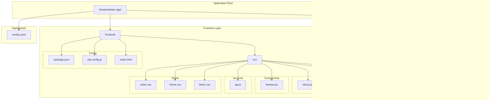
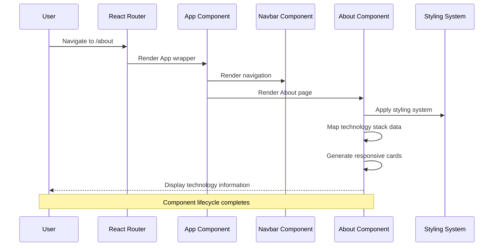
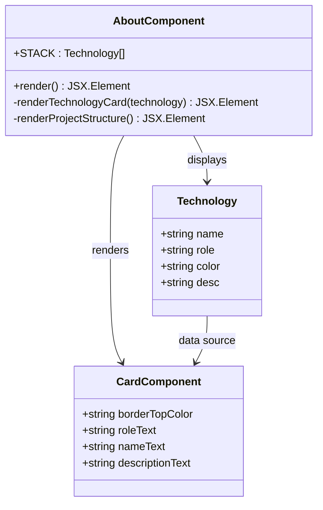
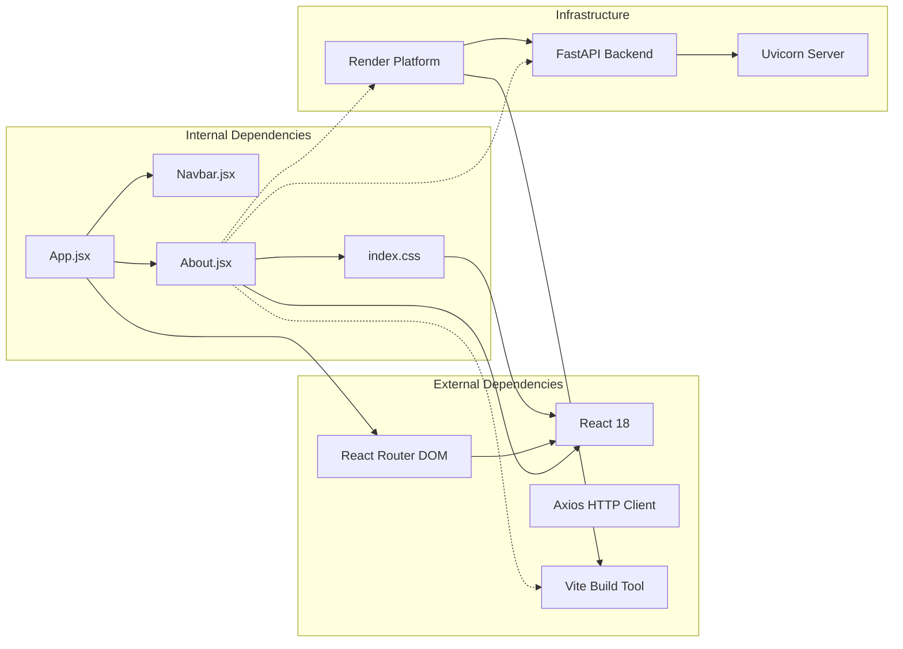

# About Page

<cite>
**Referenced Files in This Document**
- [About.jsx](file://frontend/src/pages/About.jsx)
- [App.jsx](file://frontend/src/App.jsx)
- [Navbar.jsx](file://frontend/src/components/Navbar.jsx)
- [index.css](file://frontend/src/index.css)
- [README.md](file://README.md)
- [render.yaml](file://render.yaml)
- [package.json](file://frontend/package.json)
- [vite.config.js](file://frontend/vite.config.js)
</cite>

## Table of Contents
1. [Introduction](#introduction)
2. [Project Structure](#project-structure)
3. [Core Components](#core-components)
4. [Architecture Overview](#architecture-overview)
5. [Detailed Component Analysis](#detailed-component-analysis)
6. [Dependency Analysis](#dependency-analysis)
7. [Performance Considerations](#performance-considerations)
8. [Troubleshooting Guide](#troubleshooting-guide)
9. [Conclusion](#conclusion)

## Introduction
The About page component serves as the primary informational hub for the ishwarambare-app project. It provides comprehensive documentation about the technology stack, project structure, and deployment information in a visually appealing and accessible format. This component transforms technical documentation into an engaging user experience while maintaining professional standards suitable for both developers and stakeholders.

The About page plays a crucial role in establishing project context by presenting:
- Technology stack details with color-coded categorization
- Feature descriptions and capabilities
- Deployment information and infrastructure details
- Project structure visualization
- Interactive navigation elements

## Project Structure
The ishwarambare-app follows a clean separation-of-concerns architecture with distinct frontend and backend directories. The About page integrates seamlessly with the existing routing system and styling framework.

**Diagram sources**
- [README.md:5-25](file://README.md#L5-L25)
- [About.jsx:11-57](file://frontend/src/pages/About.jsx#L11-L57)
- [App.jsx:1-19](file://frontend/src/App.jsx#L1-L19)

**Section sources**
- [README.md:5-25](file://README.md#L5-L25)
- [About.jsx:11-57](file://frontend/src/pages/About.jsx#L11-L57)

## Core Components
The About page component is built around several key architectural elements that work together to deliver comprehensive project information:

### Technology Stack Display System
The component utilizes a structured data approach to present technology stack information through a dedicated data structure containing name, role, color, and description for each technology.

### Responsive Grid Layout
The page employs a responsive grid system that adapts to different screen sizes while maintaining visual consistency across devices.

### Dark Theme Integration
The component seamlessly integrates with the application's dark theme design system, utilizing CSS custom properties for consistent styling.

### Navigation Integration
The About page participates in the global navigation system, providing contextual links and maintaining visual continuity with other application pages.

**Section sources**
- [About.jsx:1-9](file://frontend/src/pages/About.jsx#L1-L9)
- [About.jsx:21-29](file://frontend/src/pages/About.jsx#L21-L29)
- [index.css:4-31](file://frontend/src/index.css#L4-L31)

## Architecture Overview
The About page operates within a well-defined architectural pattern that emphasizes separation of concerns and maintainable code organization.

**Diagram sources**
- [App.jsx:7-18](file://frontend/src/App.jsx#L7-L18)
- [Navbar.jsx:3-18](file://frontend/src/components/Navbar.jsx#L3-L18)
- [About.jsx:11-57](file://frontend/src/pages/About.jsx#L11-L57)

The architectural flow demonstrates how the About page integrates with the broader application ecosystem, participating in the routing system while maintaining its focus on information presentation.

**Section sources**
- [App.jsx:1-19](file://frontend/src/App.jsx#L1-L19)
- [Navbar.jsx:1-19](file://frontend/src/components/Navbar.jsx#L1-L19)
- [About.jsx:11-57](file://frontend/src/pages/About.jsx#L11-L57)

## Detailed Component Analysis

### Technology Stack Display Implementation
The About page implements a sophisticated technology stack visualization system that transforms raw data into engaging, color-coded cards.

**Diagram sources**
- [About.jsx:1-9](file://frontend/src/pages/About.jsx#L1-L9)
- [About.jsx:21-29](file://frontend/src/pages/About.jsx#L21-L29)

The technology stack implementation uses a functional approach with the following characteristics:
- Static data structure for maintainability
- Dynamic card generation using array mapping
- Color-coded visual hierarchy
- Responsive grid layout
- Consistent typography system

### Content Structure Organization
The About page follows a logical content hierarchy that guides users through different aspects of the project information:

#### Primary Information Blocks
1. **Hero Section**: Project introduction and context
2. **Technology Stack Grid**: Interactive technology cards
3. **Project Structure**: Visual directory structure
4. **Deployment Information**: Infrastructure and hosting details

#### Styling Approach
The component leverages the application's comprehensive CSS system:
- CSS custom properties for theme consistency
- Responsive grid system for layout adaptation
- Card-based design for information grouping
- Typography hierarchy for readability

### Interactive Elements
While primarily informational, the About page incorporates subtle interactive elements:

#### Navigation Integration
The page participates in the global navigation system, allowing seamless transitions between sections without page reloads.

#### Visual Feedback
Hover states and transitions provide responsive feedback for interactive elements within the component.

**Section sources**
- [About.jsx:11-57](file://frontend/src/pages/About.jsx#L11-L57)
- [index.css:91-142](file://frontend/src/index.css#L91-L142)

## Dependency Analysis
The About page component maintains minimal external dependencies while integrating effectively with the application's ecosystem.

**Diagram sources**
- [package.json:11-22](file://frontend/package.json#L11-L22)
- [render.yaml:4-43](file://render.yaml#L4-L43)

### Internal Component Dependencies
The About page relies on:
- Global styling system through CSS custom properties
- Navigation components for contextual linking
- Routing system for seamless navigation

### External Library Dependencies
The component leverages:
- React 18 for component rendering
- React Router DOM for navigation
- Axios for HTTP communication (indirect usage)
- Vite for development and build processes

### Infrastructure Dependencies
The page integrates with:
- Render platform for cloud deployment
- FastAPI backend services
- Uvicorn ASGI server
- Custom domain configuration

**Section sources**
- [package.json:11-22](file://frontend/package.json#L11-L22)
- [render.yaml:4-43](file://render.yaml#L4-L43)
- [About.jsx:11-57](file://frontend/src/pages/About.jsx#L11-L57)

## Performance Considerations
The About page is designed with performance optimization in mind, particularly given its informational nature and static content requirements.

### Rendering Performance
- **Static Content**: The component renders static content that doesn't require frequent updates
- **Minimal Re-renders**: No state changes or props updates are needed after initial render
- **Efficient Grid Layout**: CSS Grid provides optimal layout performance
- **Lazy Loading**: Not applicable as content is essential for page understanding

### Bundle Size Impact
- **Minimal Dependencies**: Only requires React and basic styling
- **No Heavy Libraries**: Avoids unnecessary third-party dependencies
- **CSS-in-JS**: Uses global CSS for better performance than styled-components

### Memory Management
- **No Event Listeners**: Static content eliminates memory overhead from event handlers
- **Simple Lifecycle**: Component mounts once and remains static
- **Efficient Data Structures**: Lightweight array mapping for technology cards

### Network Performance
- **Local Content**: All information is locally available without network requests
- **Optimized Images**: Uses CSS-based visual elements instead of images
- **Minimal Assets**: No external resources required for core functionality

## Troubleshooting Guide

### Common Issues and Solutions

#### Styling Problems
**Issue**: Cards not displaying with proper colors or layout
**Solution**: Verify CSS custom properties are defined and accessible
- Check that `--clr-muted` and other variables are defined in the root
- Ensure the grid classes are properly loaded
- Verify color values are valid CSS color formats

#### Navigation Issues
**Issue**: About link not working in navigation
**Solution**: Confirm route configuration includes the About route
- Verify the route path matches the navigation link
- Check that the component is properly exported
- Ensure the route is included in the main App routes

#### Content Display Problems
**Issue**: Technology stack not rendering correctly
**Solution**: Validate the data structure and mapping logic
- Check that the STACK array contains valid objects
- Verify each object has the required properties (name, role, color, desc)
- Ensure the array mapping function is correctly implemented

#### Responsive Design Issues
**Issue**: Layout breaks on different screen sizes
**Solution**: Review CSS media queries and grid configurations
- Check that grid classes adapt to different screen sizes
- Verify container widths and spacing adjustments
- Test on various device breakpoints

### Debugging Strategies
1. **Console Logging**: Add temporary console logs to verify data flow
2. **Component Inspection**: Use browser developer tools to inspect rendered elements
3. **CSS Validation**: Verify CSS custom properties are being applied correctly
4. **Network Monitoring**: Check for any failed resource loads

**Section sources**
- [About.jsx:1-58](file://frontend/src/pages/About.jsx#L1-L58)
- [index.css:4-31](file://frontend/src/index.css#L4-L31)
- [App.jsx:11-14](file://frontend/src/App.jsx#L11-L14)

## Conclusion
The About page component successfully fulfills its role as the primary informational hub for the ishwarambare-app project. Through its thoughtful design and implementation, it provides comprehensive project documentation in an engaging, accessible format that serves both technical and non-technical audiences.

### Key Achievements
- **Comprehensive Documentation**: Effectively communicates technology stack, project structure, and deployment information
- **Visual Appeal**: Utilizes modern design principles with dark theme integration and responsive layouts
- **Technical Excellence**: Implements clean, maintainable code with proper separation of concerns
- **User Experience**: Provides intuitive navigation and clear information hierarchy

### Design Philosophy
The component embodies a design philosophy focused on:
- **Clarity**: Clear presentation of complex technical information
- **Consistency**: Seamless integration with the application's design system
- **Accessibility**: Thoughtful color choices and typography for readability
- **Maintainability**: Clean code structure that facilitates future enhancements

### Future Enhancement Opportunities
Potential areas for improvement include:
- **Interactive Features**: Adding expandable sections for detailed technology information
- **Dynamic Content**: Integrating live deployment status or recent updates
- **Export Capabilities**: Allowing users to export project information
- **Multilingual Support**: Extending reach to international audiences

The About page stands as a model example of effective technical documentation presentation, transforming potentially dry technical information into an engaging user experience that enhances project understanding and adoption.