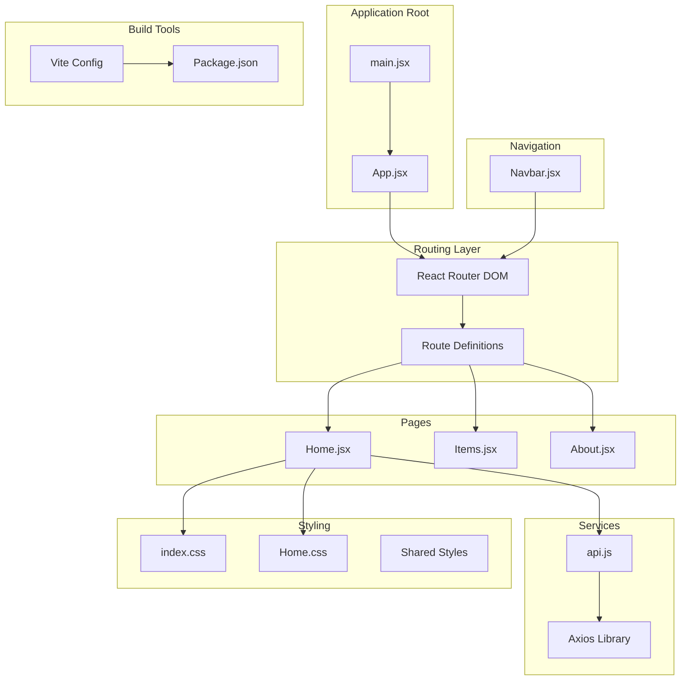
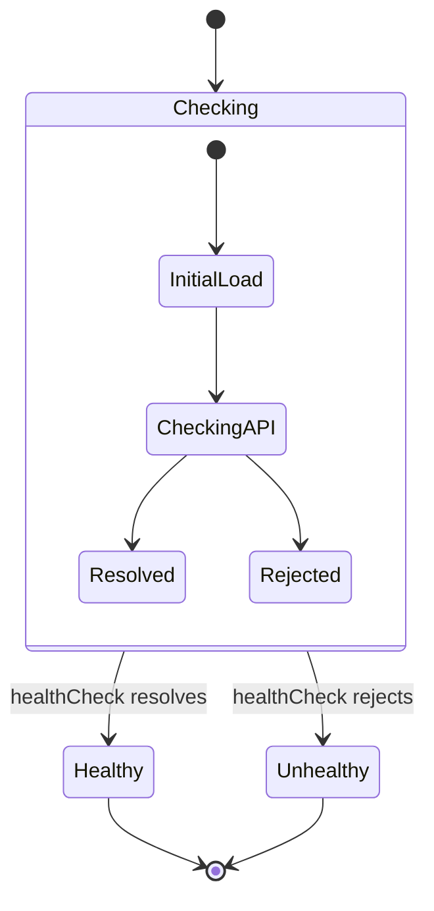
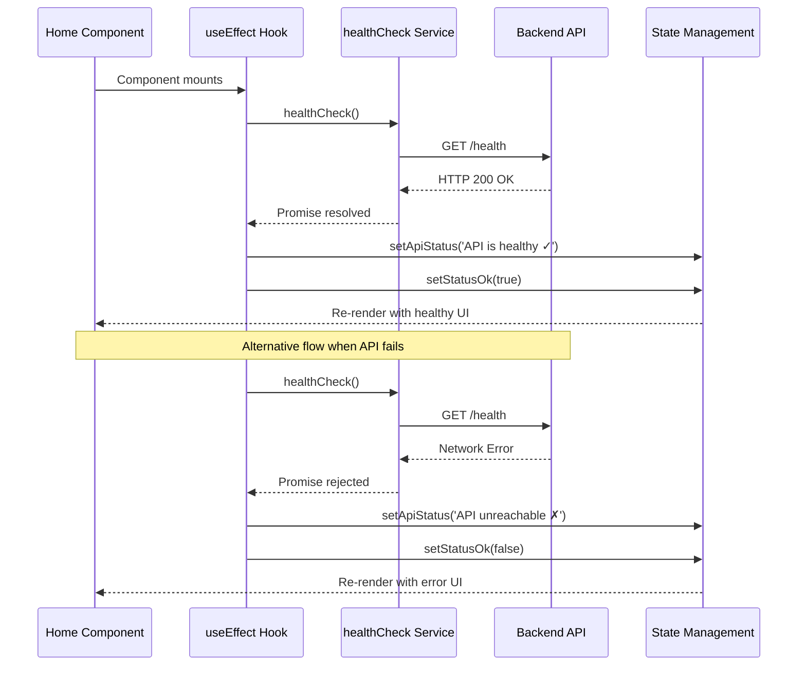
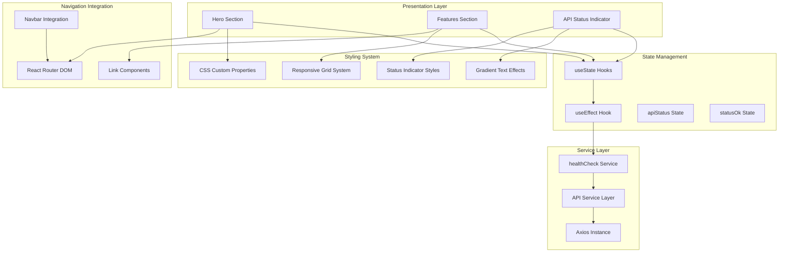
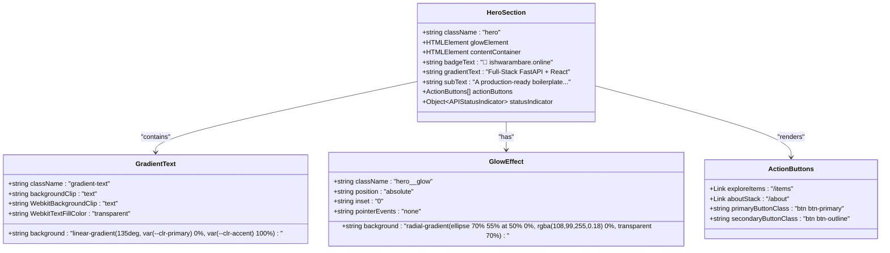
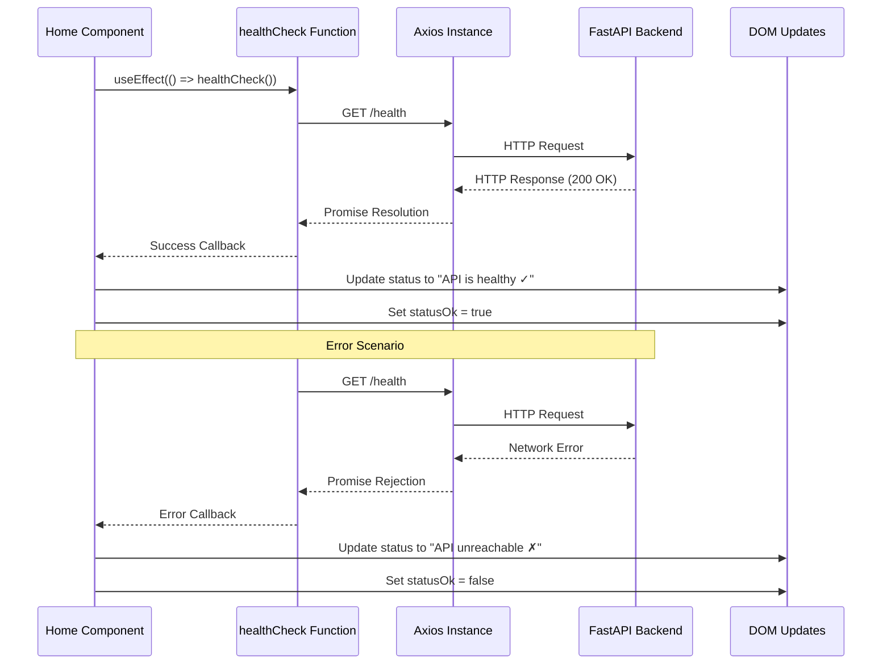
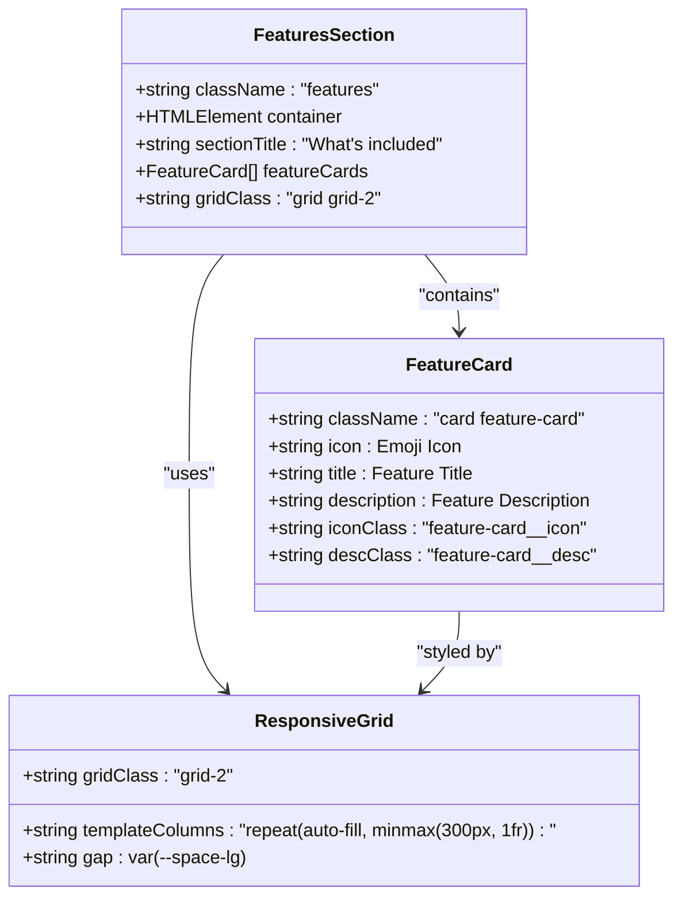
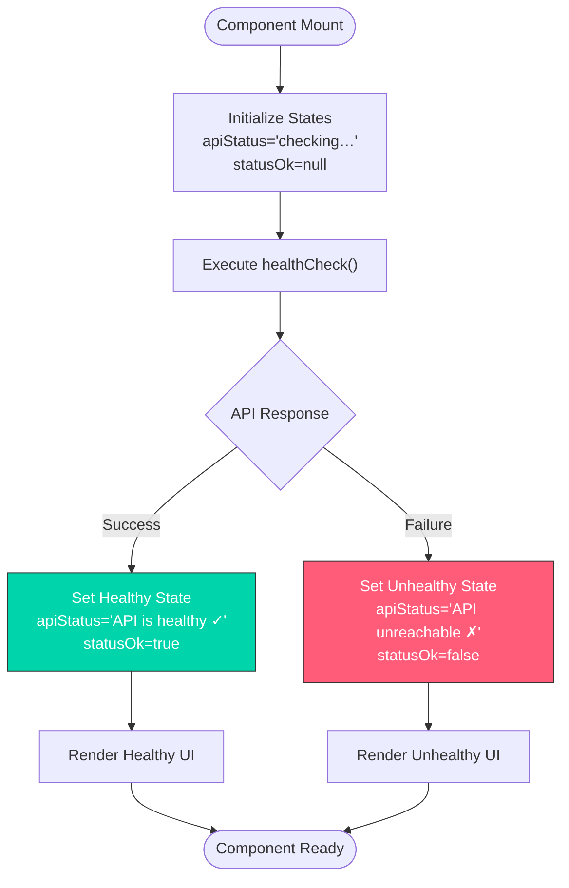

# Home Page

<cite>
**Referenced Files in This Document**
- [Home.jsx](file://frontend/src/pages/Home.jsx)
- [api.js](file://frontend/src/services/api.js)
- [Home.css](file://frontend/src/styles/Home.css)
- [App.jsx](file://frontend/src/App.jsx)
- [Navbar.jsx](file://frontend/src/components/Navbar.jsx)
- [index.css](file://frontend/src/index.css)
- [package.json](file://frontend/package.json)
- [vite.config.js](file://frontend/vite.config.js)
</cite>

## Table of Contents
1. [Introduction](#introduction)
2. [Project Structure](#project-structure)
3. [Core Components](#core-components)
4. [Architecture Overview](#architecture-overview)
5. [Detailed Component Analysis](#detailed-component-analysis)
6. [Dependency Analysis](#dependency-analysis)
7. [Performance Considerations](#performance-considerations)
8. [Troubleshooting Guide](#troubleshooting-guide)
9. [Conclusion](#conclusion)

## Introduction

The Home page component serves as the primary landing page for the ishwarambare.online application, showcasing a modern full-stack React + FastAPI boilerplate. This component implements a visually appealing hero section with gradient text effects, interactive call-to-action buttons, real-time API health monitoring, and a responsive features section with card-based layout.

The implementation demonstrates best practices in React component architecture, including proper state management, conditional rendering based on API status, and seamless integration with React Router for navigation. The component leverages a comprehensive styling system with CSS custom properties and responsive design patterns.

## Project Structure

The Home page component is part of a well-organized React application structure that separates concerns across distinct modules:



**Diagram sources**
- [App.jsx:1-19](file://frontend/src/App.jsx#L1-L19)
- [main.jsx:1-11](file://frontend/src/main.jsx#L1-L11)
- [Home.jsx:1-63](file://frontend/src/pages/Home.jsx#L1-L63)

**Section sources**
- [App.jsx:1-19](file://frontend/src/App.jsx#L1-L19)
- [main.jsx:1-11](file://frontend/src/main.jsx#L1-L11)
- [package.json:1-24](file://frontend/package.json#L1-L24)

## Core Components

The Home page component consists of several interconnected parts that work together to deliver a cohesive user experience:

### State Management Architecture

The component utilizes React's useState hook to manage two critical pieces of state:



**Diagram sources**
- [Home.jsx:13-21](file://frontend/src/pages/Home.jsx#L13-L21)

### API Health Monitoring System

The component implements a sophisticated health checking mechanism that monitors backend API availability in real-time:



**Diagram sources**
- [Home.jsx:17-21](file://frontend/src/pages/Home.jsx#L17-L21)
- [api.js:25-26](file://frontend/src/services/api.js#L25-L26)

**Section sources**
- [Home.jsx:13-21](file://frontend/src/pages/Home.jsx#L13-L21)
- [api.js:25-26](file://frontend/src/services/api.js#L25-L26)

## Architecture Overview

The Home page component follows a clean architectural pattern that separates concerns and promotes maintainability:



**Diagram sources**
- [Home.jsx:1-63](file://frontend/src/pages/Home.jsx#L1-L63)
- [api.js:1-29](file://frontend/src/services/api.js#L1-L29)
- [index.css:1-142](file://frontend/src/index.css#L1-L142)

## Detailed Component Analysis

### Hero Section Implementation

The hero section represents the centerpiece of the Home page, featuring sophisticated visual effects and interactive elements:

#### Gradient Text Effects

The hero section implements advanced gradient text effects using CSS masking techniques:



**Diagram sources**
- [Home.jsx:26-43](file://frontend/src/pages/Home.jsx#L26-L43)
- [Home.css:23-27](file://frontend/src/styles/Home.css#L23-L27)
- [Home.css:9-13](file://frontend/src/styles/Home.css#L9-L13)

#### Call-to-Action Button System

The hero section features a dual-button navigation system that integrates seamlessly with React Router:

| Button Type | Route | Purpose | Styling |
|-------------|-------|---------|---------|
| Primary Button | `/items` | Direct users to the items catalog | Blue gradient button with hover effects |
| Secondary Button | `/about` | Provide technical stack information | Outlined button with primary color accent |

**Section sources**
- [Home.jsx:26-43](file://frontend/src/pages/Home.jsx#L26-L43)
- [Home.css:32-35](file://frontend/src/styles/Home.css#L32-L35)

### API Health Checking Functionality

The component implements a robust API health monitoring system that provides real-time feedback on backend connectivity:

#### Health Check Service Integration

The health check functionality leverages a dedicated service layer that encapsulates HTTP communication:



**Diagram sources**
- [Home.jsx:17-21](file://frontend/src/pages/Home.jsx#L17-L21)
- [api.js:25-26](file://frontend/src/services/api.js#L25-L26)

#### Status Indicator Display System

The API status indicator provides immediate visual feedback through a combination of color coding and animation:

| Status | CSS Class | Color | Animation | Meaning |
|--------|-----------|-------|-----------|---------|
| Checking | Default | Gray | Pulsing | Initial loading state |
| Healthy | `api-status--ok` | Green | Static | API is responding |
| Unhealthy | `api-status--err` | Red | Static | API is unreachable |

**Section sources**
- [Home.jsx:39-41](file://frontend/src/pages/Home.jsx#L39-L41)
- [Home.css:37-55](file://frontend/src/styles/Home.css#L37-L55)

### Features Section Implementation

The features section showcases the application's capabilities using a responsive card-based layout system:

#### Card-Based Layout Architecture

The features section implements a flexible grid system that adapts to different screen sizes:



**Diagram sources**
- [Home.jsx:45-59](file://frontend/src/pages/Home.jsx#L45-L59)
- [Home.css:138-142](file://frontend/src/index.css#L138-L142)

#### Feature Data Structure

The component defines feature data as a structured array of objects, enabling easy maintenance and extension:

| Feature | Icon | Title | Description |
|---------|------|-------|-------------|
| FastAPI Backend | ⚡ | High-performance async REST API | Built with Python & FastAPI |
| React Frontend | ⚛️ | Dynamic, responsive UI | Powered by React 18 & Vite |
| Fully Connected | 🔗 | Axios-powered service layer | JWT-ready auth interceptor |
| Deployed on Render | ☁️ | CI/CD via Render | Auto-deploys on every git push |

**Section sources**
- [Home.jsx:6-11](file://frontend/src/pages/Home.jsx#L6-L11)
- [Home.jsx:49-56](file://frontend/src/pages/Home.jsx#L49-L56)

### State Management Patterns

The component demonstrates effective state management using React hooks:

#### Dual-State Architecture

The component manages two related states that work together to provide comprehensive status information:



**Diagram sources**
- [Home.jsx:13-21](file://frontend/src/pages/Home.jsx#L13-L21)

**Section sources**
- [Home.jsx:13-21](file://frontend/src/pages/Home.jsx#L13-L21)

## Dependency Analysis

The Home page component has well-defined dependencies that contribute to its modularity and maintainability:

```mermaid
graph LR
subgraph "External Dependencies"
React[React ^18.3.1]
Router[React Router DOM ^6.27.0]
Axios[Axios ^1.7.9]
end
subgraph "Internal Dependencies"
Home[Home.jsx]
API[api.js]
HomeCSS[Home.css]
IndexCSS[index.css]
Navbar[Navbar.jsx]
App[App.jsx]
end
subgraph "Build Dependencies"
Vite[Vite ^6.0.3]
PluginReact[@vitejs/plugin-react ^4.3.3]
end
Home --> React
Home --> Router
Home --> API
Home --> HomeCSS
Home --> IndexCSS
API --> Axios
App --> Router
App --> Navbar
App --> Home
Vite --> PluginReact
Vite --> PackageJSON[package.json]
```

**Diagram sources**
- [package.json:11-22](file://frontend/package.json#L11-L22)
- [Home.jsx:1-4](file://frontend/src/pages/Home.jsx#L1-L4)
- [api.js:1](file://frontend/src/services/api.js#L1)

### Integration Points

The component integrates with several key systems:

| Integration Point | Purpose | Implementation |
|------------------|---------|----------------|
| React Router | Navigation | Link components for internal navigation |
| Axios | HTTP Communication | Base API service with interceptors |
| CSS Custom Properties | Theming | Consistent color scheme and spacing |
| Vite | Build Tool | Development server with proxy configuration |

**Section sources**
- [package.json:11-22](file://frontend/package.json#L11-L22)
- [Home.jsx:1-4](file://frontend/src/pages/Home.jsx#L1-L4)
- [vite.config.js:7-16](file://frontend/vite.config.js#L7-L16)

## Performance Considerations

The Home page component is designed with several performance optimizations:

### Optimized Rendering Strategies

1. **Conditional Rendering**: The component only renders the API status indicator when needed, reducing unnecessary DOM updates
2. **Efficient State Updates**: Uses separate state variables for status text and boolean indicators to minimize re-renders
3. **CSS Animations**: Leverages hardware-accelerated CSS animations for smooth transitions

### Memory Management

1. **Single Effect Hook**: Consolidates health checking logic in one useEffect to prevent memory leaks
2. **Minimal State Scope**: Limits state to only what's necessary for the component's functionality
3. **Reusable Styles**: Utilizes shared CSS variables to reduce stylesheet size

### Network Optimization

1. **Single Health Check**: Performs one-time health check on mount rather than continuous polling
2. **Axios Interceptors**: Centralizes authentication logic to avoid redundant header setting
3. **Development Proxy**: Configured Vite proxy reduces CORS overhead during development

## Troubleshooting Guide

Common issues and their solutions when working with the Home page component:

### API Health Check Issues

**Problem**: API status always shows as unhealthy
**Solution**: Verify backend is running and accessible at the configured URL

**Problem**: Health check fails intermittently
**Solution**: Check network connectivity and CORS configuration in the backend

### Styling Issues

**Problem**: Gradient text not displaying correctly
**Solution**: Ensure CSS custom properties are properly defined in the root element

**Problem**: Responsive grid not working on mobile devices
**Solution**: Verify CSS media queries and viewport meta tag are properly configured

### Navigation Problems

**Problem**: Links not working correctly
**Solution**: Check React Router configuration and ensure routes are properly defined

**Section sources**
- [Home.jsx:17-21](file://frontend/src/pages/Home.jsx#L17-L21)
- [Home.css:23-27](file://frontend/src/styles/Home.css#L23-L27)
- [App.jsx:7-18](file://frontend/src/App.jsx#L7-L18)

## Conclusion

The Home page component exemplifies modern React development practices through its clean architecture, comprehensive state management, and thoughtful integration of external libraries. The component successfully balances visual appeal with functional robustness, providing users with immediate feedback on system health while maintaining excellent performance characteristics.

Key strengths of the implementation include:

- **Modular Design**: Clear separation of concerns between presentation, state management, and service layers
- **Responsive Architecture**: Flexible grid system that adapts to various screen sizes
- **Real-time Feedback**: Immediate API health monitoring with visual indicators
- **Performance Optimization**: Efficient rendering strategies and minimal state updates
- **Developer Experience**: Well-structured code with clear integration points

The component serves as an excellent foundation for building production-ready applications, demonstrating best practices in React component development, API integration, and user interface design.