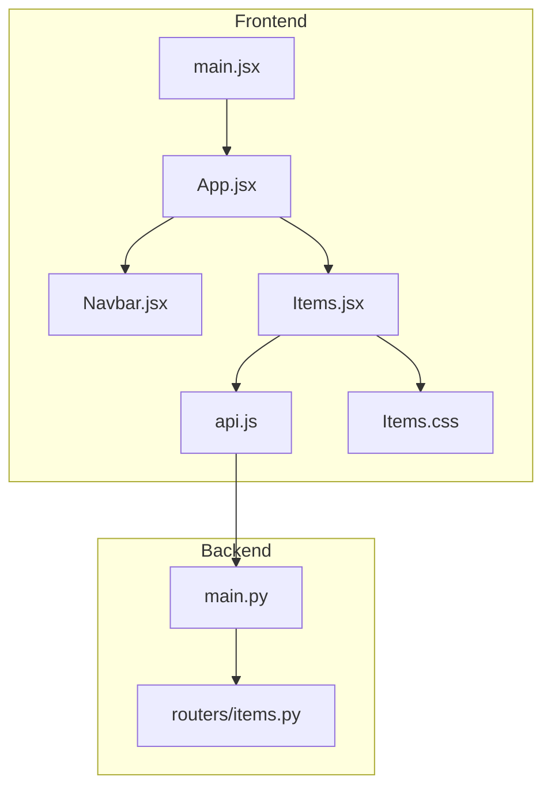
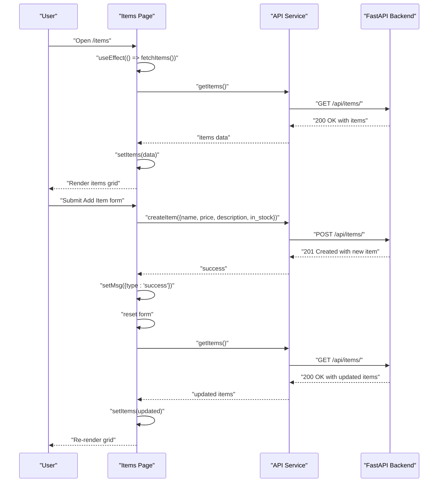
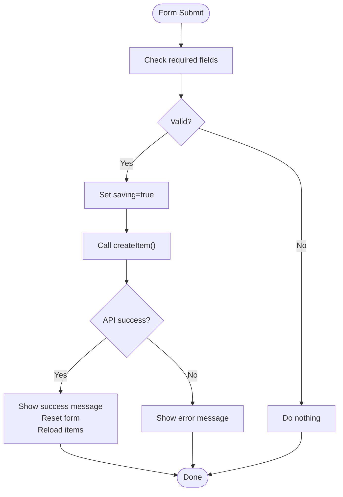
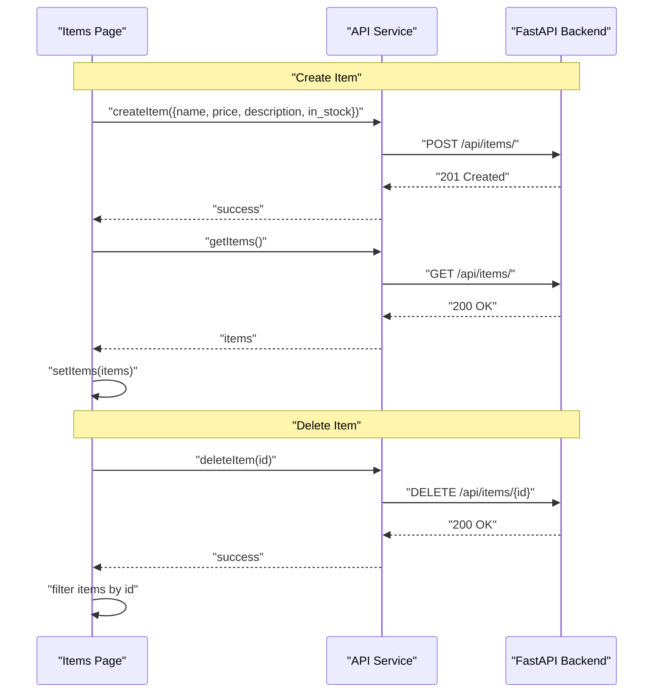
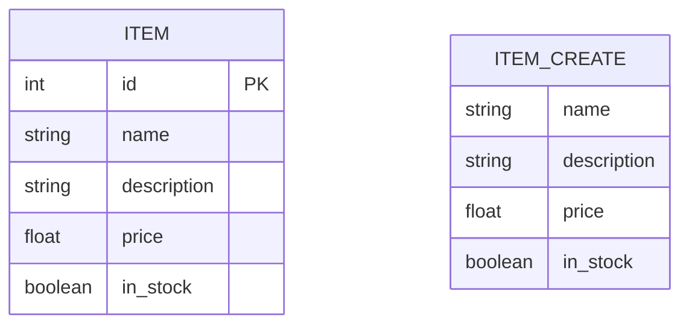
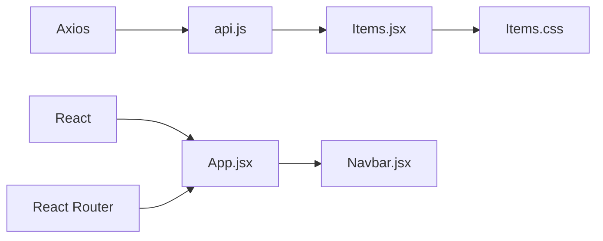

# Items Management Page

<cite>
**Referenced Files in This Document**
- [Items.jsx](file://frontend/src/pages/Items.jsx)
- [api.js](file://frontend/src/services/api.js)
- [items.py](file://backend/routers/items.py)
- [App.jsx](file://frontend/src/App.jsx)
- [Items.css](file://frontend/src/styles/Items.css)
- [main.jsx](file://frontend/src/main.jsx)
- [package.json](file://frontend/package.json)
- [vite.config.js](file://frontend/vite.config.js)
- [README.md](file://README.md)
- [Navbar.jsx](file://frontend/src/components/Navbar.jsx)
</cite>

## Table of Contents
1. [Introduction](#introduction)
2. [Project Structure](#project-structure)
3. [Core Components](#core-components)
4. [Architecture Overview](#architecture-overview)
5. [Detailed Component Analysis](#detailed-component-analysis)
6. [Dependency Analysis](#dependency-analysis)
7. [Performance Considerations](#performance-considerations)
8. [Troubleshooting Guide](#troubleshooting-guide)
9. [Conclusion](#conclusion)

## Introduction
This document provides comprehensive documentation for the Items Management Page component. It explains the state management implementation using React hooks, CRUD operations for items, lifecycle management with useEffect, form validation and error handling, conditional rendering patterns, and the integration with the API service layer. The component fetches live data from a FastAPI backend and presents a responsive UI for managing items.

## Project Structure
The Items page is part of a full-stack application with a React frontend and a FastAPI backend. The frontend uses Vite for development and Axios for HTTP requests. The backend exposes REST endpoints for items and authentication.

**Diagram sources**
- [main.jsx:1-11](file://frontend/src/main.jsx#L1-L11)
- [App.jsx:1-19](file://frontend/src/App.jsx#L1-L19)
- [Navbar.jsx:1-19](file://frontend/src/components/Navbar.jsx#L1-L19)
- [Items.jsx:1-125](file://frontend/src/pages/Items.jsx#L1-L125)
- [api.js:1-29](file://frontend/src/services/api.js#L1-L29)
- [items.py:1-72](file://backend/routers/items.py#L1-L72)

**Section sources**
- [README.md:1-129](file://README.md#L1-L129)
- [package.json:1-24](file://frontend/package.json#L1-L24)
- [vite.config.js:1-23](file://frontend/vite.config.js#L1-L23)

## Core Components
- Items page component: Manages state for items, loading, errors, form fields, saving status, and user feedback. Implements CRUD operations and lifecycle management.
- API service module: Provides HTTP client with base URL configuration, JWT token injection, and convenience functions for items and auth endpoints.
- Backend items router: Defines FastAPI routes for listing, retrieving, creating, and deleting items with Pydantic models for validation.

Key responsibilities:
- State management: useState hooks for items array, loading, error, form, saving, and message.
- Lifecycle: useEffect triggers initial data fetch on mount.
- Forms: Controlled components with handleChange and handleSubmit handlers.
- CRUD: Fetch, create, and delete operations integrated with the API service.
- Rendering: Conditional rendering for loading, error, empty, and success/error messages.

**Section sources**
- [Items.jsx:1-125](file://frontend/src/pages/Items.jsx#L1-L125)
- [api.js:1-29](file://frontend/src/services/api.js#L1-L29)
- [items.py:1-72](file://backend/routers/items.py#L1-L72)

## Architecture Overview
The Items page follows a unidirectional data flow:
- On mount, useEffect triggers fetchItems which calls the API service to retrieve items.
- The API service uses Axios with a configurable base URL and attaches a JWT token if present.
- The backend FastAPI router handles requests, validates payloads, and manages an in-memory database.
- UI updates occur via React state changes, reflecting loading, success, and error conditions.

**Diagram sources**
- [Items.jsx:13-46](file://frontend/src/pages/Items.jsx#L13-L46)
- [api.js:16-19](file://frontend/src/services/api.js#L16-L19)
- [items.py:36-59](file://backend/routers/items.py#L36-L59)

## Detailed Component Analysis

### State Management and Lifecycle
- State declarations:
  - items: Array of item objects.
  - loading: Boolean indicating data fetch status.
  - error: String or null for error messages.
  - form: Object containing form field values.
  - saving: Boolean controlling submit button state.
  - msg: Object with type and text for user feedback.
- Lifecycle hook:
  - useEffect(() => fetchItems(), []) initializes data loading on component mount.

Implementation highlights:
- fetchItems encapsulates the async data retrieval with try/catch/finally to manage loading and error states.
- Conditional rendering branches for loading spinner, error alert, and items grid.

**Section sources**
- [Items.jsx:5-25](file://frontend/src/pages/Items.jsx#L5-L25)
- [Items.jsx:98-120](file://frontend/src/pages/Items.jsx#L98-L120)

### Form Handling and Validation
- Controlled form:
  - handleChange updates form state based on input type (text or checkbox).
  - handleSubmit prevents default, validates required fields, sets saving flag, and calls createItem.
- Validation:
  - Required fields: name and price.
  - Price conversion: parseFloat ensures numeric value for backend.
- Feedback:
  - Success and error messages displayed conditionally.
  - Form reset after successful creation.

**Diagram sources**
- [Items.jsx:32-46](file://frontend/src/pages/Items.jsx#L32-L46)

**Section sources**
- [Items.jsx:27-46](file://frontend/src/pages/Items.jsx#L27-L46)

### CRUD Operations
- Read:
  - fetchItems retrieves items via getItems and updates state.
- Create:
  - handleSubmit calls createItem with normalized form data and refreshes the list.
- Delete:
  - handleDelete confirms action, calls deleteItem, and updates local items array.

**Diagram sources**
- [Items.jsx:13-56](file://frontend/src/pages/Items.jsx#L13-L56)
- [api.js:16-19](file://frontend/src/services/api.js#L16-L19)
- [items.py:52-71](file://backend/routers/items.py#L52-L71)

**Section sources**
- [Items.jsx:13-56](file://frontend/src/pages/Items.jsx#L13-L56)
- [api.js:16-19](file://frontend/src/services/api.js#L16-L19)
- [items.py:36-71](file://backend/routers/items.py#L36-L71)

### Conditional Rendering Patterns
- Loading state: Spinner displayed while loading is true.
- Error state: Alert message shown when error is set.
- Empty state: Implicitly handled by rendering grid with zero items.
- Success/Error messages: Alert divs rendered conditionally based on msg type.

UI patterns:
- Responsive grid layout for items.
- Badge indicators for stock status.
- Disabled submit button during save operation.

**Section sources**
- [Items.jsx:58-124](file://frontend/src/pages/Items.jsx#L58-L124)
- [Items.css:1-30](file://frontend/src/styles/Items.css#L1-L30)

### API Service Layer Integration
- Axios client configured with base URL from environment variable and JSON headers.
- Request interceptor injects Authorization header if a token exists in localStorage.
- Exposed functions: getItems, getItem, createItem, deleteItem, login, getMe, healthCheck.

Environment configuration:
- Vite proxy configuration forwards /api requests to the backend during development.
- Production base URL controlled by VITE_API_URL environment variable.

**Section sources**
- [api.js:1-29](file://frontend/src/services/api.js#L1-L29)
- [vite.config.js:7-16](file://frontend/vite.config.js#L7-L16)
- [README.md:78-93](file://README.md#L78-L93)

### Backend Data Model and Endpoints
- Pydantic models define Item and ItemCreate schemas with fields id, name, description, price, and in_stock.
- Endpoints:
  - GET /api/items/: returns all items.
  - GET /api/items/{id}: returns a single item or raises 404.
  - POST /api/items/: creates a new item and increments the next id.
  - DELETE /api/items/{id}: deletes an item by id or raises 404.

**Diagram sources**
- [items.py:9-22](file://backend/routers/items.py#L9-L22)

**Section sources**
- [items.py:1-72](file://backend/routers/items.py#L1-L72)

## Dependency Analysis
- Runtime dependencies:
  - React and React DOM for UI rendering.
  - React Router for routing and navigation.
  - Axios for HTTP requests.
- Build-time dependencies:
  - Vite for bundling and development server.
  - React plugin for Vite.
- Environment:
  - VITE_API_URL controls the backend base URL.
  - Development proxy for /api routes.

**Diagram sources**
- [package.json:11-22](file://frontend/package.json#L11-L22)
- [App.jsx:1-19](file://frontend/src/App.jsx#L1-L19)
- [api.js:1-29](file://frontend/src/services/api.js#L1-L29)
- [Items.jsx:1-125](file://frontend/src/pages/Items.jsx#L1-L125)
- [Navbar.jsx:1-19](file://frontend/src/components/Navbar.jsx#L1-L19)

**Section sources**
- [package.json:1-24](file://frontend/package.json#L1-L24)
- [vite.config.js:1-23](file://frontend/vite.config.js#L1-L23)

## Performance Considerations
- Network efficiency:
  - Single GET request on mount; subsequent reloads triggered after create/delete.
- UI responsiveness:
  - Loading spinner prevents redundant submissions.
  - Disabled submit button during save reduces concurrent requests.
- Data consistency:
  - After successful create, items are re-fetched to reflect backend state.
- Memory:
  - In-memory items array grows with each create; consider pagination or backend filtering for large datasets.

## Troubleshooting Guide
Common issues and resolutions:
- Backend not running:
  - Symptom: Error message indicates backend is unreachable.
  - Resolution: Start the FastAPI server locally or verify production base URL.
- Authentication failures:
  - Symptom: Requests fail with unauthorized responses.
  - Resolution: Ensure a valid token is stored in localStorage; verify interceptor logic.
- CORS errors:
  - Symptom: Cross-origin request blocked.
  - Resolution: Configure ALLOWED_ORIGINS in backend environment; verify proxy settings in development.
- Form validation:
  - Symptom: Submit button does nothing.
  - Resolution: Ensure required fields (name, price) are filled; confirm numeric price input.
- API URL misconfiguration:
  - Symptom: Requests go to wrong host.
  - Resolution: Set VITE_API_URL appropriately for development or production.

**Section sources**
- [Items.jsx:18-22](file://frontend/src/pages/Items.jsx#L18-L22)
- [api.js:8-13](file://frontend/src/services/api.js#L8-L13)
- [README.md:78-93](file://README.md#L78-L93)
- [vite.config.js:7-16](file://frontend/vite.config.js#L7-L16)

## Conclusion
The Items Management Page demonstrates robust state management, lifecycle handling, and seamless integration with a FastAPI backend. It provides a clean UI with responsive design, comprehensive user feedback, and straightforward CRUD operations. The component’s structure supports easy extension for additional features such as editing, filtering, and pagination.