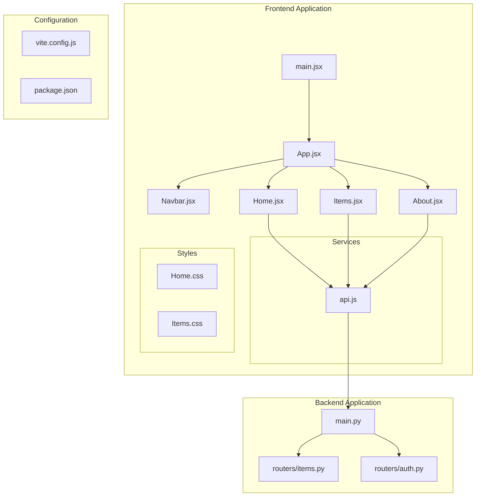
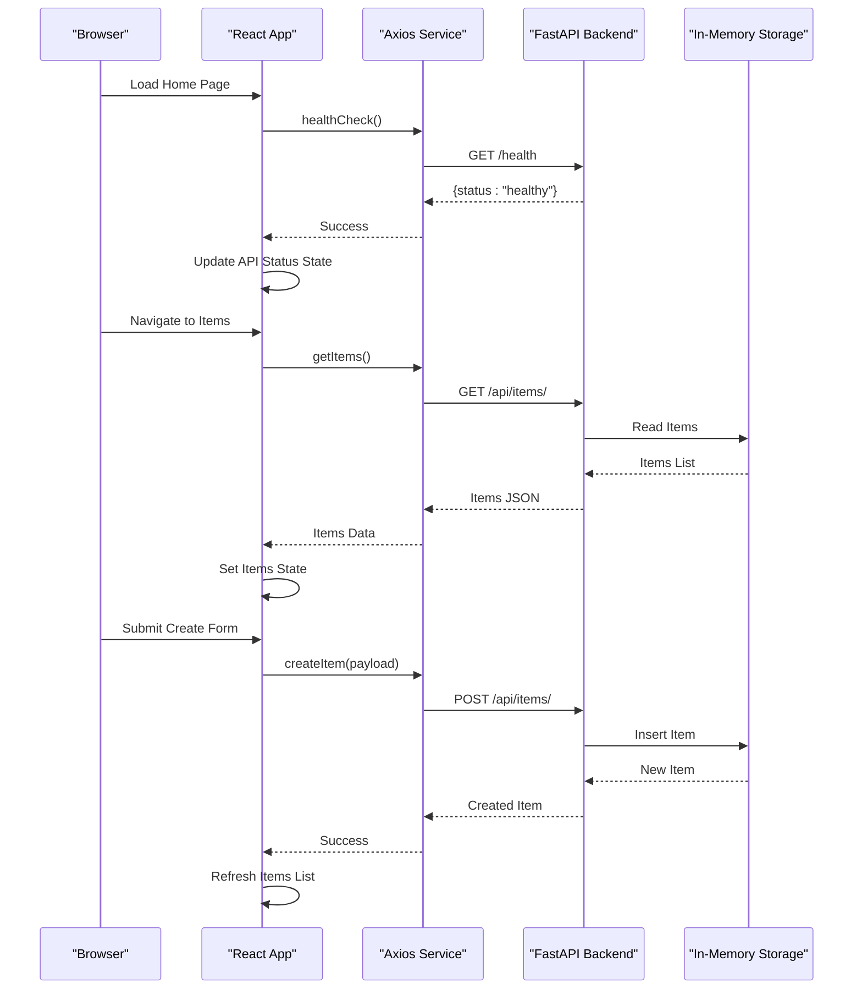
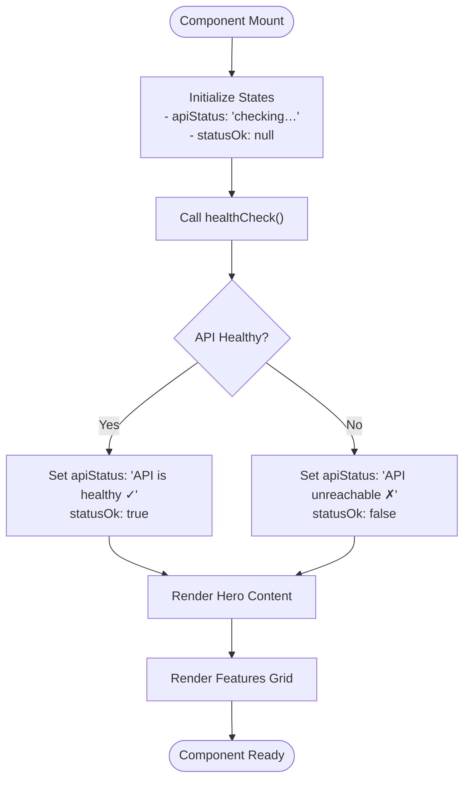
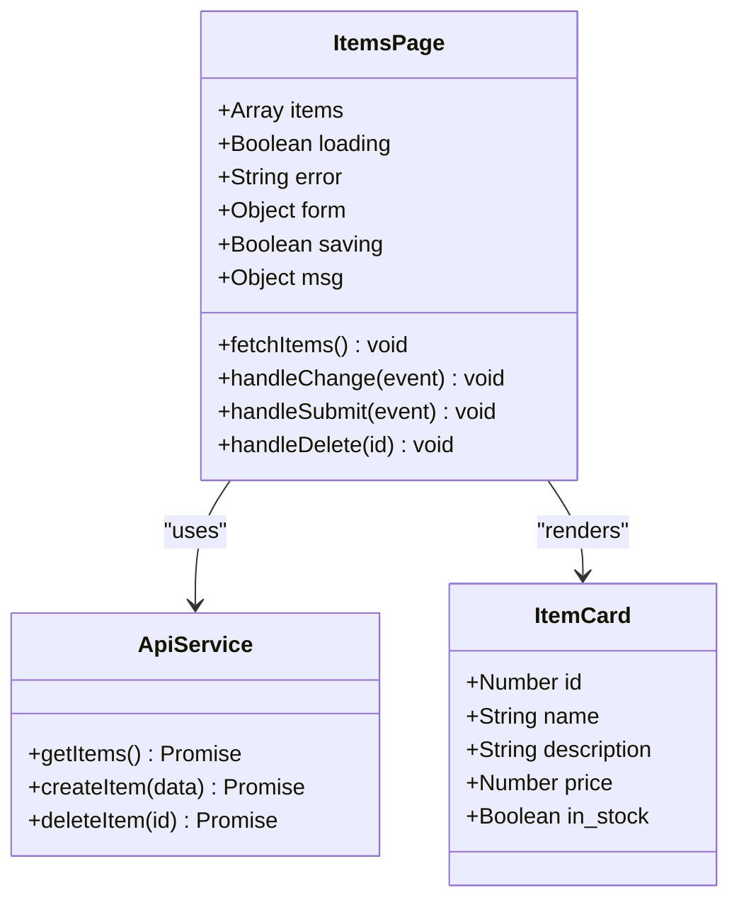
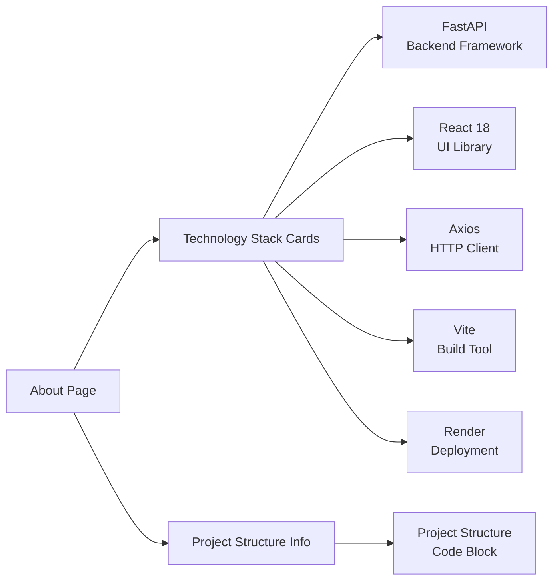
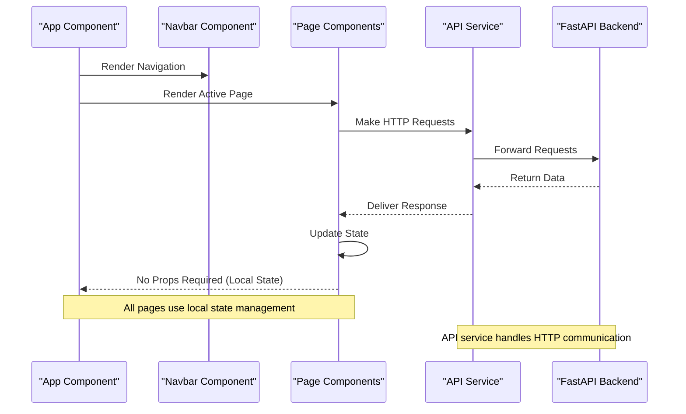
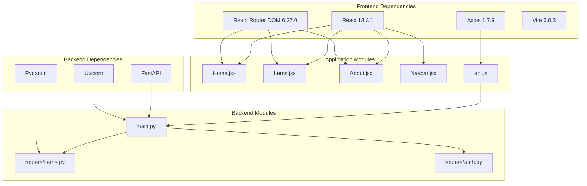

# Page Components

<cite>
**Referenced Files in This Document**
- [Home.jsx](file://frontend/src/pages/Home.jsx)
- [Items.jsx](file://frontend/src/pages/Items.jsx)
- [About.jsx](file://frontend/src/pages/About.jsx)
- [api.js](file://frontend/src/services/api.js)
- [Navbar.jsx](file://frontend/src/components/Navbar.jsx)
- [App.jsx](file://frontend/src/App.jsx)
- [Home.css](file://frontend/src/styles/Home.css)
- [Items.css](file://frontend/src/styles/Items.css)
- [main.jsx](file://frontend/src/main.jsx)
- [vite.config.js](file://frontend/vite.config.js)
- [package.json](file://frontend/package.json)
- [main.py](file://backend/main.py)
- [items.py](file://backend/routers/items.py)
</cite>

## Table of Contents
1. [Introduction](#introduction)
2. [Project Structure](#project-structure)
3. [Core Components](#core-components)
4. [Architecture Overview](#architecture-overview)
5. [Detailed Component Analysis](#detailed-component-analysis)
6. [Dependency Analysis](#dependency-analysis)
7. [Performance Considerations](#performance-considerations)
8. [Troubleshooting Guide](#troubleshooting-guide)
9. [Conclusion](#conclusion)

## Introduction
This document provides comprehensive documentation for all page components in the ishwarambare-app full-stack application. The application consists of three main pages: Home, Items, and About, each serving distinct purposes in showcasing the technology stack and demonstrating CRUD operations. The Home page features a hero section with API health monitoring, the Items page implements full CRUD functionality with state management and form handling, and the About page displays project information and technology stack details.

The application follows a modern React 18 architecture with Vite for development, FastAPI for the backend, and Axios for HTTP communication. The frontend components are organized in a clear structure with dedicated pages, components, services, and styles directories.

## Project Structure
The project follows a well-organized structure that separates concerns effectively:

**Diagram sources**
- [main.jsx:1-11](file://frontend/src/main.jsx#L1-L11)
- [App.jsx:1-19](file://frontend/src/App.jsx#L1-L19)
- [api.js:1-29](file://frontend/src/services/api.js#L1-L29)
- [main.py:1-44](file://backend/main.py#L1-L44)

The frontend uses React Router for navigation with three main routes: home page, items management page, and about page. The backend provides RESTful APIs for items and authentication with comprehensive CORS configuration for development and production environments.

**Section sources**
- [main.jsx:1-11](file://frontend/src/main.jsx#L1-L11)
- [App.jsx:1-19](file://frontend/src/App.jsx#L1-L19)
- [package.json:1-24](file://frontend/package.json#L1-L24)

## Core Components
This section covers the three primary page components and their key characteristics:

### Home Page Component
The Home page serves as the application's landing page with two main sections: hero content and feature showcase. It implements API health monitoring to demonstrate connectivity to the backend service.

Key features:
- Hero section with gradient text and animated glow effect
- API health status indicator with real-time status updates
- Feature cards highlighting the technology stack
- Responsive design with mobile-first approach
- Navigation links to Items and About pages

### Items Page Component
The Items page provides a complete CRUD interface for managing inventory items with comprehensive state management and error handling.

Key features:
- Real-time data fetching from FastAPI backend
- Form-based item creation with validation
- Interactive item grid with stock status indicators
- Delete functionality with confirmation dialogs
- Loading states and error messaging
- Responsive card-based layout

### About Page Component
The About page presents comprehensive information about the technology stack and project structure in an organized, visually appealing format.

Key features:
- Technology stack cards with color-coded branding
- Project structure visualization with code formatting
- Responsive grid layout for different screen sizes
- Detailed descriptions of each technology component

**Section sources**
- [Home.jsx:1-63](file://frontend/src/pages/Home.jsx#L1-L63)
- [Items.jsx:1-125](file://frontend/src/pages/Items.jsx#L1-L125)
- [About.jsx:1-58](file://frontend/src/pages/About.jsx#L1-L58)

## Architecture Overview
The application follows a clear client-server architecture with React frontend and FastAPI backend:

**Diagram sources**
- [Home.jsx:17-21](file://frontend/src/pages/Home.jsx#L17-L21)
- [Items.jsx:13-25](file://frontend/src/pages/Items.jsx#L13-L25)
- [api.js:15-26](file://frontend/src/services/api.js#L15-L26)
- [main.py:41-43](file://backend/main.py#L41-L43)

The architecture demonstrates clean separation of concerns with the frontend handling presentation logic, the API service managing HTTP requests, and the backend providing RESTful endpoints with proper error handling.

**Section sources**
- [App.jsx:7-18](file://frontend/src/App.jsx#L7-L18)
- [api.js:1-29](file://frontend/src/services/api.js#L1-L29)
- [main.py:1-44](file://backend/main.py#L1-L44)

## Detailed Component Analysis

### Home Page Implementation
The Home page component implements a sophisticated hero section with integrated API health monitoring:

**Diagram sources**
- [Home.jsx:13-21](file://frontend/src/pages/Home.jsx#L13-L21)
- [Home.jsx:23-61](file://frontend/src/pages/Home.jsx#L23-L61)

Key implementation patterns:
- **State Management**: Uses React hooks for local state management with useState for API status tracking
- **Side Effects**: Implements useEffect for lifecycle management and automatic health checking on mount
- **Conditional Rendering**: Dynamically applies CSS classes based on API status for visual feedback
- **Component Composition**: Integrates with styled components through CSS classes and external styling

The hero section features:
- Animated gradient text for visual appeal
- Glowing background effect using CSS radial gradients
- Responsive button layout with navigation links
- Real-time API status indicator with color-coded feedback
- Feature showcase grid with iconography

**Section sources**
- [Home.jsx:1-63](file://frontend/src/pages/Home.jsx#L1-L63)
- [Home.css:1-66](file://frontend/src/styles/Home.css#L1-L66)

### Items Page Functionality
The Items page implements a comprehensive CRUD interface with robust state management and error handling:

**Diagram sources**
- [Items.jsx:5-56](file://frontend/src/pages/Items.jsx#L5-L56)
- [api.js:15-26](file://frontend/src/services/api.js#L15-L26)

State management patterns implemented:
- **Loading States**: Comprehensive loading indicators during data fetching operations
- **Form State**: Controlled form components with proper input handling
- **Error Handling**: Structured error messages with user-friendly feedback
- **Success Messaging**: Confirmation alerts for successful operations
- **Local State Updates**: Optimistic UI updates with subsequent backend synchronization

CRUD operations implementation:
- **Create**: Form-based item creation with validation and immediate UI feedback
- **Read**: Automatic data fetching on component mount with retry capability
- **Update**: Immediate UI updates with optimistic concurrency handling
- **Delete**: Confirmation dialog with atomic state updates

**Section sources**
- [Items.jsx:1-125](file://frontend/src/pages/Items.jsx#L1-L125)
- [api.js:15-26](file://frontend/src/services/api.js#L15-L26)

### About Page Content
The About page provides structured information about the technology stack and project architecture:

**Diagram sources**
- [About.jsx:11-57](file://frontend/src/pages/About.jsx#L11-L57)

Content organization:
- **Technology Stack**: Color-coded cards with role descriptions and brief explanations
- **Project Structure**: Pre-formatted code block displaying the complete project hierarchy
- **Responsive Design**: Three-column grid layout that adapts to different screen sizes

**Section sources**
- [About.jsx:1-58](file://frontend/src/pages/About.jsx#L1-L58)

### Component Props and Data Flow
The application demonstrates several key patterns for component communication and data flow:

**Diagram sources**
- [App.jsx:7-18](file://frontend/src/App.jsx#L7-L18)
- [Navbar.jsx:1-19](file://frontend/src/components/Navbar.jsx#L1-L19)
- [api.js:1-29](file://frontend/src/services/api.js#L1-L29)

Props patterns observed:
- **Navigation Props**: Navbar receives routing configuration through NavLink components
- **No Direct Props**: Page components manage their own state without parent-child prop passing
- **Event Handlers**: Form components receive event handlers as props for controlled input management

**Section sources**
- [Navbar.jsx:1-19](file://frontend/src/components/Navbar.jsx#L1-L19)
- [App.jsx:1-19](file://frontend/src/App.jsx#L1-L19)

## Dependency Analysis
The application has a clean dependency structure with minimal coupling between components:

**Diagram sources**
- [package.json:11-22](file://frontend/package.json#L11-L22)
- [api.js:1-29](file://frontend/src/services/api.js#L1-L29)
- [main.py:1-44](file://backend/main.py#L1-L44)

Development and build dependencies:
- **Vite Configuration**: Development server with proxy configuration for seamless API integration
- **React Development Tools**: Strict mode enabled for better error detection
- **TypeScript Definitions**: Full type support for enhanced development experience

**Section sources**
- [vite.config.js:1-23](file://frontend/vite.config.js#L1-L23)
- [package.json:1-24](file://frontend/package.json#L1-L24)

## Performance Considerations
Several performance optimizations are implemented throughout the application:

### Frontend Performance
- **Lazy Loading**: React components are loaded on-demand based on routing
- **Efficient State Updates**: Local state management minimizes unnecessary re-renders
- **CSS-in-JS Patterns**: Modular CSS files reduce bundle size and enable selective loading
- **Optimistic UI**: Immediate user feedback during asynchronous operations

### Backend Performance
- **CORS Optimization**: Configured origins minimize security overhead
- **Memory-Based Storage**: In-memory database provides fast read/write operations
- **Response Validation**: Pydantic models ensure efficient data serialization

### Network Performance
- **Proxy Configuration**: Development proxy eliminates CORS issues during local development
- **Axios Interceptors**: Centralized request/response handling reduces code duplication
- **Environment Variables**: Configurable base URLs for different deployment environments

## Troubleshooting Guide

### Common Issues and Solutions

**API Connectivity Problems**
- **Symptoms**: API status shows as unreachable, items page displays error messages
- **Causes**: Backend server not running, incorrect API URL configuration
- **Solutions**: Verify backend is running on port 8000, check VITE_API_URL environment variable

**Form Validation Errors**
- **Symptoms**: Create form submission fails with validation errors
- **Causes**: Missing required fields (name, price), invalid numeric values
- **Solutions**: Ensure name field is populated, enter valid numeric price values

**State Management Issues**
- **Symptoms**: UI not updating after CRUD operations, stale data display
- **Causes**: Asynchronous state updates not properly handled
- **Solutions**: Use useEffect for initial data loading, implement proper error boundaries

**Navigation Problems**
- **Symptoms**: Links not working, navigation not updating
- **Causes**: Incorrect route configuration, missing router setup
- **Solutions**: Verify React Router configuration, ensure proper route definitions

**Styling Issues**
- **Symptoms**: Components not displaying correctly, missing styles
- **Causes**: CSS files not imported, incorrect class names
- **Solutions**: Verify CSS imports in component files, check class name consistency

**Section sources**
- [Home.jsx:17-21](file://frontend/src/pages/Home.jsx#L17-L21)
- [Items.jsx:13-25](file://frontend/src/pages/Items.jsx#L13-L25)
- [api.js:3-6](file://frontend/src/services/api.js#L3-L6)

## Conclusion
The ishwarambare-app demonstrates a well-structured, production-ready full-stack application with three distinct page components that effectively showcase modern web development practices. Each page serves a specific purpose while maintaining consistency in design patterns and state management approaches.

The Home page successfully integrates API health monitoring with an engaging hero section, the Items page provides a comprehensive CRUD interface with robust error handling, and the About page offers clear project information and technology stack documentation. The application's architecture promotes scalability, maintainability, and developer experience through clear separation of concerns, proper state management, and efficient data flow patterns.

The implementation showcases best practices in React development including proper use of hooks, controlled components, conditional rendering, and comprehensive error handling. The integration with FastAPI backend demonstrates effective client-server communication with proper CORS configuration and HTTP request handling.

This documentation provides a foundation for extending the application, adding new features, or adapting the patterns for other projects while maintaining the established architectural principles and development standards.