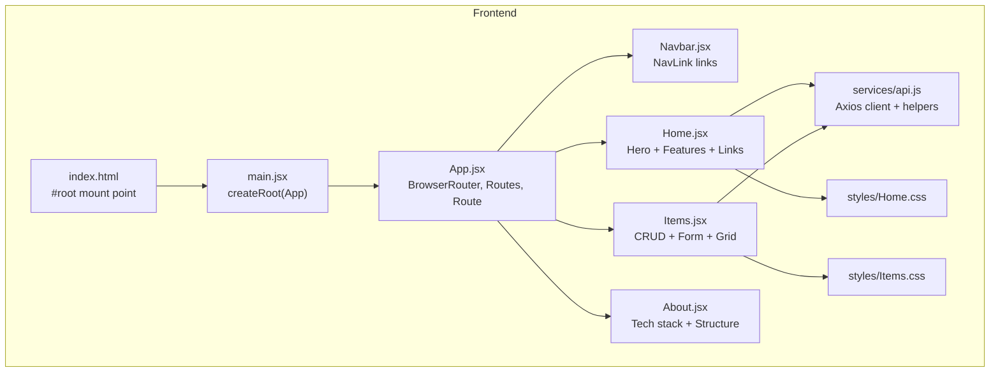
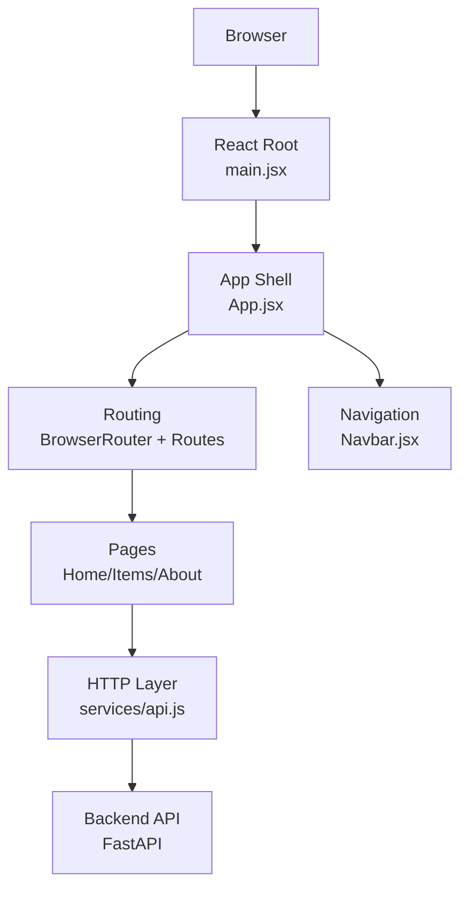
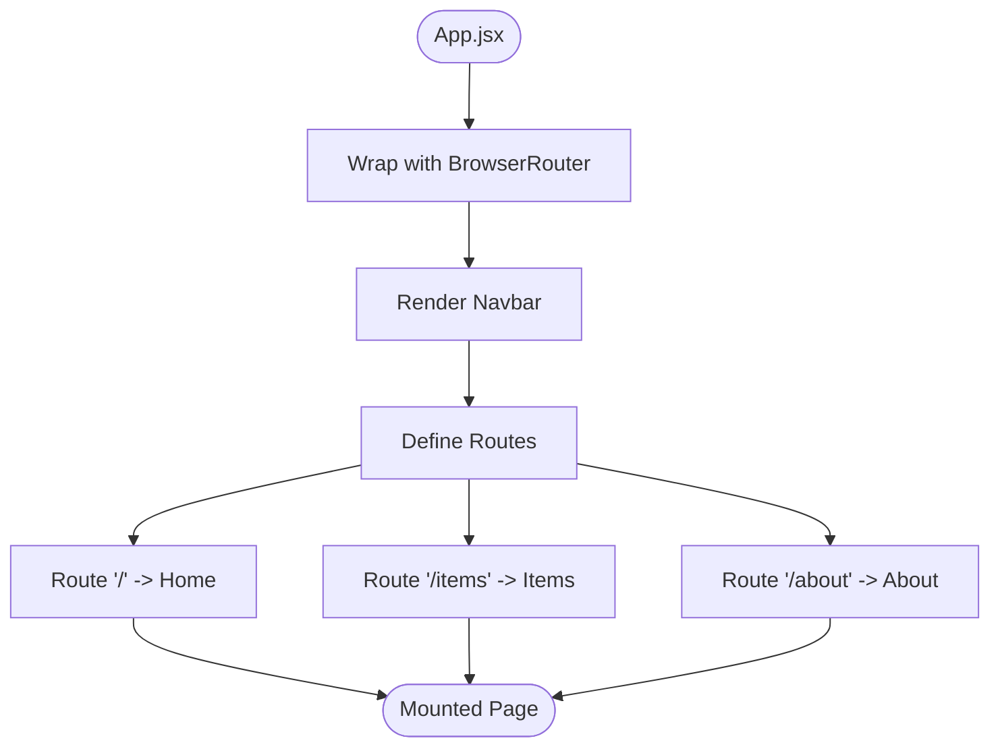
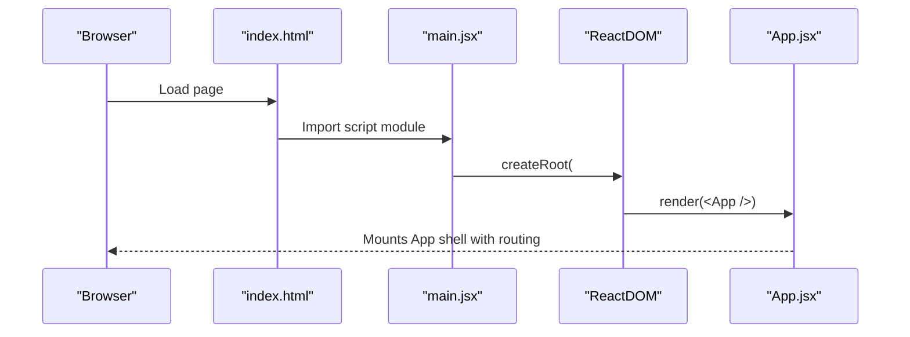
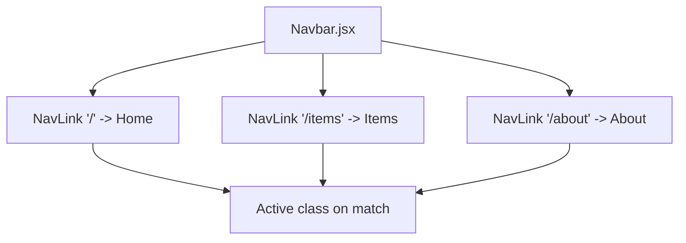
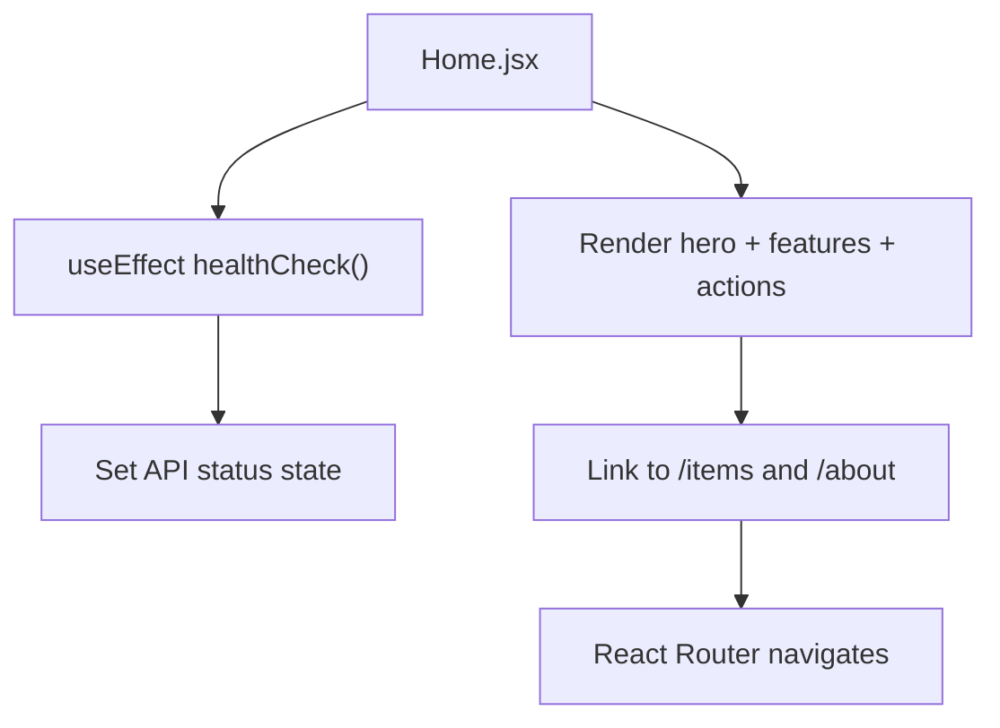
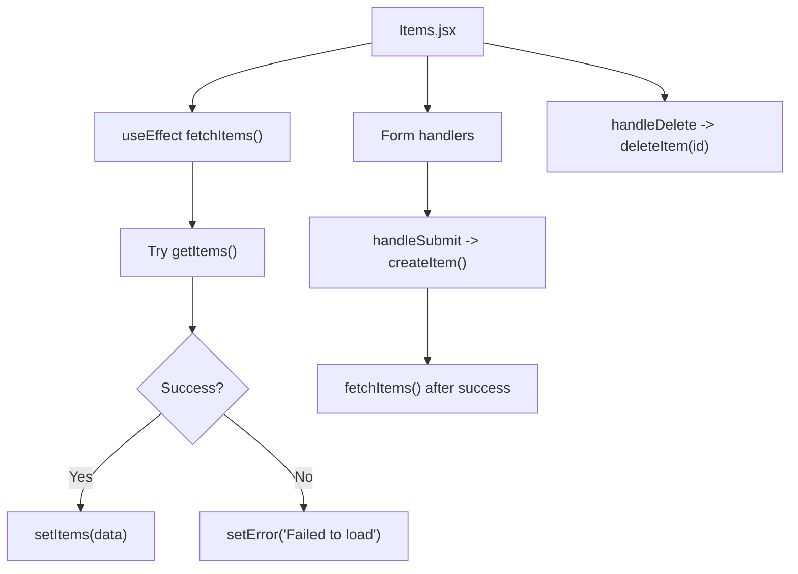
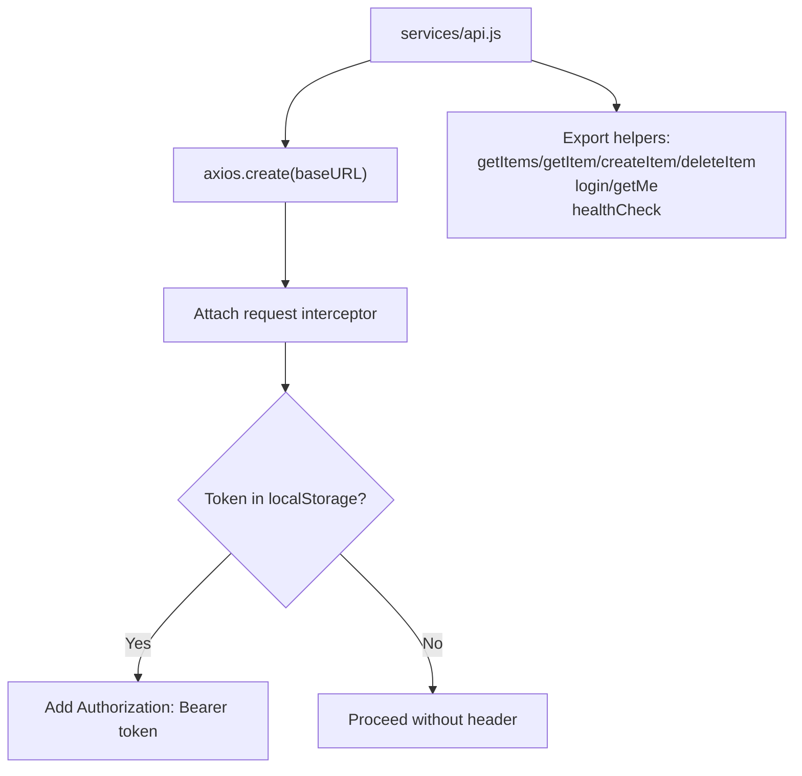
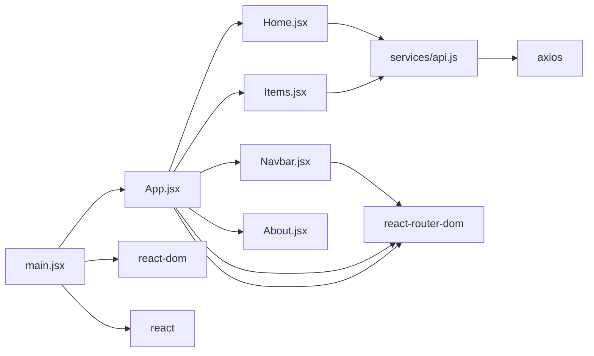

# React Application Architecture

<cite>
**Referenced Files in This Document**
- [main.jsx](file://frontend/src/main.jsx)
- [App.jsx](file://frontend/src/App.jsx)
- [Navbar.jsx](file://frontend/src/components/Navbar.jsx)
- [Home.jsx](file://frontend/src/pages/Home.jsx)
- [Items.jsx](file://frontend/src/pages/Items.jsx)
- [About.jsx](file://frontend/src/pages/About.jsx)
- [api.js](file://frontend/src/services/api.js)
- [index.html](file://frontend/index.html)
- [package.json](file://frontend/package.json)
- [vite.config.js](file://frontend/vite.config.js)
- [Home.css](file://frontend/src/styles/Home.css)
- [Items.css](file://frontend/src/styles/Items.css)
- [README.md](file://README.md)
</cite>

## Table of Contents
1. [Introduction](#introduction)
2. [Project Structure](#project-structure)
3. [Core Components](#core-components)
4. [Architecture Overview](#architecture-overview)
5. [Detailed Component Analysis](#detailed-component-analysis)
6. [Dependency Analysis](#dependency-analysis)
7. [Performance Considerations](#performance-considerations)
8. [Troubleshooting Guide](#troubleshooting-guide)
9. [Conclusion](#conclusion)
10. [Appendices](#appendices)

## Introduction
This document explains the React application architecture for ishwarambare-app, focusing on the main App component structure, React Router configuration, component hierarchy, and how pages are mounted. It also covers the main.jsx entry point, React root rendering, routing configuration for home, items, and about pages, and practical examples for extending routes, route parameters, and nested routing patterns. The relationship between App.jsx and the overall application structure is clarified, along with integration points to the backend via an Axios service layer.

## Project Structure
The frontend is organized into a clear feature-based structure:
- Entry point and root rendering: main.jsx
- Root application shell: App.jsx
- Navigation: components/Navbar.jsx
- Pages: pages/Home.jsx, pages/Items.jsx, pages/About.jsx
- Services: services/api.js (Axios client and API helpers)
- Styles: styles/Home.css, styles/Items.css
- Build and dev server: vite.config.js
- Dependencies and scripts: package.json
- HTML shell: index.html

**Diagram sources**
- [index.html:14](file://frontend/index.html#L14)
- [main.jsx:6-10](file://frontend/src/main.jsx#L6-L10)
- [App.jsx:1-18](file://frontend/src/App.jsx#L1-L18)
- [Navbar.jsx:1-18](file://frontend/src/components/Navbar.jsx#L1-L18)
- [Home.jsx:1-63](file://frontend/src/pages/Home.jsx#L1-L63)
- [Items.jsx:1-125](file://frontend/src/pages/Items.jsx#L1-L125)
- [About.jsx:1-58](file://frontend/src/pages/About.jsx#L1-L58)
- [api.js:1-29](file://frontend/src/services/api.js#L1-L29)
- [Home.css:1-66](file://frontend/src/styles/Home.css#L1-L66)
- [Items.css:1-30](file://frontend/src/styles/Items.css#L1-L30)

**Section sources**
- [README.md:5-25](file://README.md#L5-L25)
- [package.json:1-24](file://frontend/package.json#L1-L24)

## Core Components
- main.jsx: Creates the React root and renders the App component inside StrictMode.
- App.jsx: Wraps the app with BrowserRouter, mounts Navbar, and defines Routes with Route declarations for home, items, and about.
- Navbar.jsx: Provides navigation links using NavLink to the defined routes.
- Pages: Home.jsx, Items.jsx, About.jsx implement page-level logic and UI.
- services/api.js: Axios client configured with base URL and request interceptor for Authorization tokens, plus helper functions for items and auth endpoints.
- Styles: Home.css and Items.css provide layout and responsive design for respective pages.

Key responsibilities:
- main.jsx: Bootstraps the app and mounts the root.
- App.jsx: Centralizes routing and composes shared UI (Navbar).
- Navbar.jsx: Provides consistent navigation across pages.
- Pages: Encapsulate page-specific state, effects, and UI.
- api.js: Abstracts HTTP requests and centralizes auth token handling.

**Section sources**
- [main.jsx:1-11](file://frontend/src/main.jsx#L1-L11)
- [App.jsx:1-18](file://frontend/src/App.jsx#L1-L18)
- [Navbar.jsx:1-18](file://frontend/src/components/Navbar.jsx#L1-L18)
- [Home.jsx:1-63](file://frontend/src/pages/Home.jsx#L1-L63)
- [Items.jsx:1-125](file://frontend/src/pages/Items.jsx#L1-L125)
- [About.jsx:1-58](file://frontend/src/pages/About.jsx#L1-L58)
- [api.js:1-29](file://frontend/src/services/api.js#L1-L29)
- [Home.css:1-66](file://frontend/src/styles/Home.css#L1-L66)
- [Items.css:1-30](file://frontend/src/styles/Items.css#L1-L30)

## Architecture Overview
The application follows a straightforward, feature-based React architecture with centralized routing and a shared service layer.

**Diagram sources**
- [main.jsx:6-10](file://frontend/src/main.jsx#L6-L10)
- [App.jsx:1-18](file://frontend/src/App.jsx#L1-L18)
- [Navbar.jsx:1-18](file://frontend/src/components/Navbar.jsx#L1-L18)
- [Home.jsx:1-63](file://frontend/src/pages/Home.jsx#L1-L63)
- [Items.jsx:1-125](file://frontend/src/pages/Items.jsx#L1-L125)
- [About.jsx:1-58](file://frontend/src/pages/About.jsx#L1-L58)
- [api.js:1-29](file://frontend/src/services/api.js#L1-L29)

## Detailed Component Analysis

### App.jsx Routing and Composition
- BrowserRouter wraps the entire app to enable client-side routing.
- Navbar is rendered at the top for global navigation.
- Routes defines three top-level routes:
  - "/" -> Home
  - "/items" -> Items
  - "/about" -> About
- Route elements are functional components representing pages.

**Diagram sources**
- [App.jsx:1-18](file://frontend/src/App.jsx#L1-L18)

**Section sources**
- [App.jsx:1-18](file://frontend/src/App.jsx#L1-L18)

### main.jsx Entry Point and React Root Rendering
- Imports React, ReactDOM, and the App component.
- Creates a root using createRoot on the DOM element with id "root".
- Renders the App inside React.StrictMode.

**Diagram sources**
- [index.html:14](file://frontend/index.html#L14)
- [main.jsx:6-10](file://frontend/src/main.jsx#L6-L10)

**Section sources**
- [main.jsx:1-11](file://frontend/src/main.jsx#L1-L11)
- [index.html:14](file://frontend/index.html#L14)

### Navbar.jsx Navigation Links
- Uses NavLink to create active-aware links to "/", "/items", and "/about".
- The end prop on the Home link ensures exact matching for the root path.

**Diagram sources**
- [Navbar.jsx:1-18](file://frontend/src/components/Navbar.jsx#L1-L18)

**Section sources**
- [Navbar.jsx:1-18](file://frontend/src/components/Navbar.jsx#L1-L18)

### Home.jsx: Page Content and API Status
- Implements a hero section, feature cards, and two action links to navigate to Items and About.
- Performs a health check via the API service and displays status feedback.
- Uses Link from react-router-dom for internal navigation.

**Diagram sources**
- [Home.jsx:13-21](file://frontend/src/pages/Home.jsx#L13-L21)
- [Home.jsx:36-37](file://frontend/src/pages/Home.jsx#L36-L37)
- [api.js:26](file://frontend/src/services/api.js#L26)

**Section sources**
- [Home.jsx:1-63](file://frontend/src/pages/Home.jsx#L1-L63)
- [api.js:26](file://frontend/src/services/api.js#L26)

### Items.jsx: CRUD Operations and Form
- Manages items state, loading, error, and form state.
- Fetches items on mount, handles create and delete operations via API helpers.
- Provides a form to add new items and displays a grid of existing items.

**Diagram sources**
- [Items.jsx:13-25](file://frontend/src/pages/Items.jsx#L13-L25)
- [Items.jsx:32-46](file://frontend/src/pages/Items.jsx#L32-L46)
- [Items.jsx:48-56](file://frontend/src/pages/Items.jsx#L48-L56)
- [api.js:16-19](file://frontend/src/services/api.js#L16-L19)

**Section sources**
- [Items.jsx:1-125](file://frontend/src/pages/Items.jsx#L1-L125)
- [api.js:16-19](file://frontend/src/services/api.js#L16-L19)

### About.jsx: Tech Stack and Project Structure
- Displays a grid of technologies and roles.
- Includes a formatted project structure listing backend and frontend directories.

**Section sources**
- [About.jsx:1-58](file://frontend/src/pages/About.jsx#L1-L58)

### API Service Layer (services/api.js)
- Creates an Axios instance with a configurable base URL.
- Attaches a request interceptor to include an Authorization header if a token exists in localStorage.
- Exposes helpers for items and auth endpoints, plus a health check.

**Diagram sources**
- [api.js:3-6](file://frontend/src/services/api.js#L3-L6)
- [api.js:9-13](file://frontend/src/services/api.js#L9-L13)
- [api.js:16-26](file://frontend/src/services/api.js#L16-L26)

**Section sources**
- [api.js:1-29](file://frontend/src/services/api.js#L1-L29)

### Styling and Responsive Design
- Home.css: Defines hero, gradient text, API status indicator, and feature card styles.
- Items.css: Defines form layout, responsive grid, and item card styles.

**Section sources**
- [Home.css:1-66](file://frontend/src/styles/Home.css#L1-L66)
- [Items.css:1-30](file://frontend/src/styles/Items.css#L1-L30)

## Dependency Analysis
- main.jsx depends on App.jsx and ReactDOM.
- App.jsx depends on react-router-dom (BrowserRouter, Routes, Route) and page components.
- Navbar.jsx depends on react-router-dom (NavLink).
- Pages depend on services/api.js for HTTP operations.
- package.json lists runtime dependencies: react, react-dom, react-router-dom, axios.

**Diagram sources**
- [main.jsx:1-3](file://frontend/src/main.jsx#L1-L3)
- [App.jsx:1-5](file://frontend/src/App.jsx#L1-L5)
- [Navbar.jsx:1](file://frontend/src/components/Navbar.jsx#L1)
- [Home.jsx:2](file://frontend/src/pages/Home.jsx#L2)
- [Items.jsx:2](file://frontend/src/pages/Items.jsx#L2)
- [api.js:1](file://frontend/src/services/api.js#L1)
- [package.json:11-15](file://frontend/package.json#L11-L15)

**Section sources**
- [package.json:11-15](file://frontend/package.json#L11-L15)

## Performance Considerations
- Minimal re-renders: Pages use local state and effects; keep state scoped to components to reduce unnecessary propagation.
- Efficient routing: Top-level routes avoid deep nesting; consider lazy-loading for larger apps.
- Network efficiency: Axios client reuse reduces overhead; consider caching strategies for frequently accessed data.
- Build optimization: Vite configuration disables source maps in production builds; ensure environment variables are set appropriately for production.

[No sources needed since this section provides general guidance]

## Troubleshooting Guide
- Backend connectivity:
  - Health checks: The Home page performs a health check against the API; verify the backend is running and reachable.
  - Proxy configuration: During development, Vite proxies /api to the backend; ensure the backend is running on the expected port.
- Authentication:
  - Tokens: The API service attaches an Authorization header if a token exists in localStorage; confirm token presence and validity.
- Routing:
  - Exact matching: The Navbar uses end for the Home link to ensure correct active state on the root path.
  - Route order: React Router matches the first matching route; ensure more specific routes appear before general ones if nesting.

**Section sources**
- [Home.jsx:17-21](file://frontend/src/pages/Home.jsx#L17-L21)
- [api.js:9-13](file://frontend/src/services/api.js#L9-L13)
- [vite.config.js:9-16](file://frontend/vite.config.js#L9-L16)
- [Navbar.jsx:11](file://frontend/src/components/Navbar.jsx#L11)

## Conclusion
The ishwarambare-app frontend follows a clean, modular React architecture with centralized routing via react-router-dom, a shared service layer for HTTP operations, and a simple entry point that mounts the root. The App component orchestrates navigation and page mounting, while individual pages encapsulate their own state and UI. The Axios service layer centralizes base URL configuration and token handling, enabling seamless integration with the backend. Extending the application involves adding new routes in App.jsx, creating new page components, and integrating API helpers as needed.

[No sources needed since this section summarizes without analyzing specific files]

## Appendices

### Adding New Routes
To add a new route:
1. Define a new page component under pages/.
2. Import the component in App.jsx.
3. Add a new Route under Routes with the desired path and element.

Example steps (conceptual):
- Create a new page component file under pages/.
- Import it in App.jsx.
- Add a Route declaration for the new path.

**Section sources**
- [App.jsx:11-15](file://frontend/src/App.jsx#L11-L15)

### Route Parameters and Nested Routing
- Route parameters: Use path segments like "/items/:id" and read params via the router’s hook in the destination component.
- Nested routing: Create a parent route and define child routes within the parent component’s Routes subtree.

Note: The current routing configuration uses top-level routes. Implementing nested routing would involve restructuring App.jsx to include a parent route and nested Routes within a component.

**Section sources**
- [App.jsx:11-15](file://frontend/src/App.jsx#L11-L15)

### Relationship Between App.jsx and Application Structure
- App.jsx is the root shell that:
  - Provides routing context via BrowserRouter.
  - Composes shared UI (Navbar).
  - Declares top-level routes that mount page components.
- It centralizes navigation and page mounting, making it the primary integration point for new pages and routes.

**Section sources**
- [App.jsx:1-18](file://frontend/src/App.jsx#L1-L18)