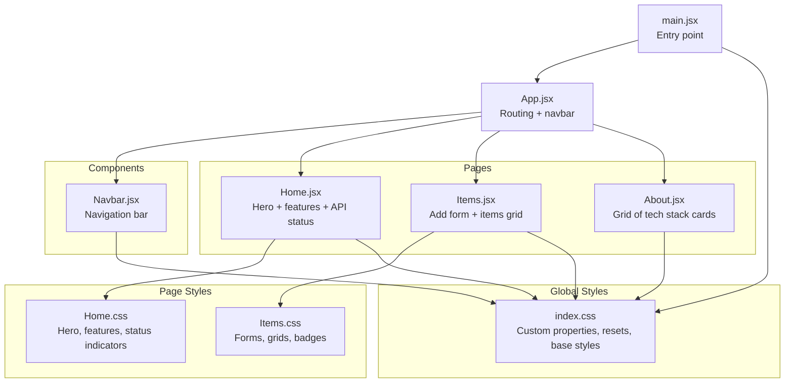
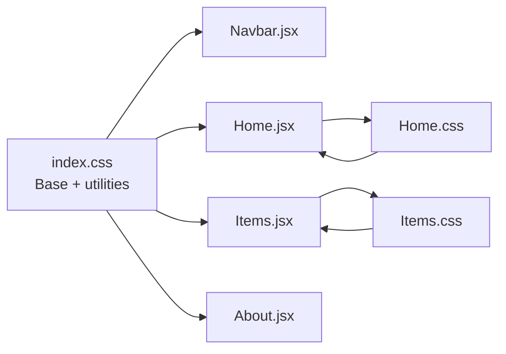
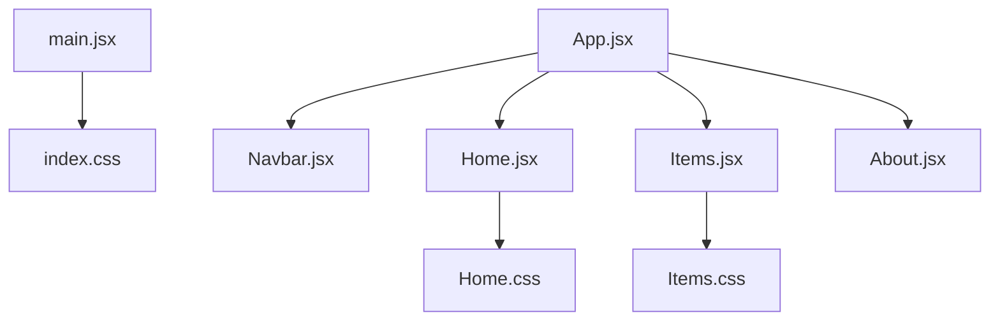

# Styling and UI Components

<cite>
**Referenced Files in This Document**
- [index.css](file://frontend/src/index.css)
- [Home.css](file://frontend/src/styles/Home.css)
- [Items.css](file://frontend/src/styles/Items.css)
- [Navbar.jsx](file://frontend/src/components/Navbar.jsx)
- [Home.jsx](file://frontend/src/pages/Home.jsx)
- [Items.jsx](file://frontend/src/pages/Items.jsx)
- [About.jsx](file://frontend/src/pages/About.jsx)
- [App.jsx](file://frontend/src/App.jsx)
- [main.jsx](file://frontend/src/main.jsx)
- [api.js](file://frontend/src/services/api.js)
- [package.json](file://frontend/package.json)
- [vite.config.js](file://frontend/vite.config.js)
</cite>

## Table of Contents
1. [Introduction](#introduction)
2. [Project Structure](#project-structure)
3. [Core Components](#core-components)
4. [Architecture Overview](#architecture-overview)
5. [Detailed Component Analysis](#detailed-component-analysis)
6. [Dependency Analysis](#dependency-analysis)
7. [Performance Considerations](#performance-considerations)
8. [Troubleshooting Guide](#troubleshooting-guide)
9. [Conclusion](#conclusion)

## Introduction
This document explains the styling architecture and UI components of the frontend application. It covers global styles, component-specific styling, CSS organization, responsive design, and design system consistency. It also details the styling for the Home and Items pages, including layout, typography, interactive elements, and accessibility-focused patterns.

## Project Structure
The frontend uses a straightforward CSS-in-classes approach with global styles and modular component-specific stylesheets. Global styles are defined in a single stylesheet and imported at the application root. Component pages import their own styles to scope styling to specific views.

**Diagram sources**
- [main.jsx:1-11](file://frontend/src/main.jsx#L1-L11)
- [App.jsx:1-19](file://frontend/src/App.jsx#L1-L19)
- [Navbar.jsx:1-19](file://frontend/src/components/Navbar.jsx#L1-L19)
- [Home.jsx:1-63](file://frontend/src/pages/Home.jsx#L1-L63)
- [Items.jsx:1-125](file://frontend/src/pages/Items.jsx#L1-L125)
- [About.jsx:1-58](file://frontend/src/pages/About.jsx#L1-L58)
- [index.css:1-142](file://frontend/src/index.css#L1-L142)
- [Home.css:1-66](file://frontend/src/styles/Home.css#L1-L66)
- [Items.css:1-30](file://frontend/src/styles/Items.css#L1-L30)

**Section sources**
- [main.jsx:1-11](file://frontend/src/main.jsx#L1-L11)
- [App.jsx:1-19](file://frontend/src/App.jsx#L1-L19)
- [index.css:1-142](file://frontend/src/index.css#L1-L142)

## Core Components
- Global design system: Centralized custom properties for colors, spacing, radius, and transitions.
- Base styles: Reset, typography baseline, container layout, and reusable component classes (buttons, cards, forms, alerts, spinner).
- Page-specific styles: Scoped styles for Home and Items pages to implement layout and visual patterns.

Key design system elements:
- Custom properties: Colors, spacing units, border radii, and transitions are defined once and reused across components.
- Reusable utilities: Buttons, cards, badges/tags, form controls, alerts, and spinner are defined globally for consistency.
- Container pattern: A centered container with max-width and horizontal padding ensures consistent page width.

**Section sources**
- [index.css:4-31](file://frontend/src/index.css#L4-L31)
- [index.css:35-42](file://frontend/src/index.css#L35-L42)
- [index.css:51-142](file://frontend/src/index.css#L51-L142)

## Architecture Overview
The styling architecture follows a layered approach:
- Global base and utilities live in the root stylesheet and are available everywhere.
- Page-level styles import global utilities and add page-specific layout and visuals.
- Components (like Navbar) rely on global classes to maintain consistent look-and-feel.

**Diagram sources**
- [index.css:1-142](file://frontend/src/index.css#L1-L142)
- [Home.jsx:1-63](file://frontend/src/pages/Home.jsx#L1-L63)
- [Items.jsx:1-125](file://frontend/src/pages/Items.jsx#L1-L125)
- [Home.css:1-66](file://frontend/src/styles/Home.css#L1-L66)
- [Items.css:1-30](file://frontend/src/styles/Items.css#L1-L30)

## Detailed Component Analysis

### Global Styles and Design System
- Custom properties define a cohesive dark theme with primary, accent, and neutral colors, spacing scale, border radii, and transition timing.
- Base typography uses clamp for fluid headings and consistent line heights.
- Utility classes provide buttons, cards, badges, form controls, alerts, and a spinner with hover and focus states.
- Container utility centers content and constrains width for readability.

Responsive and interactive patterns:
- Buttons include hover, active, and disabled states with transitions.
- Cards elevate on hover with border and shadow changes.
- Links and nav links adjust color on hover and active states.
- Alerts and badges use color variants for success/error states.

Accessibility considerations:
- Focus states for form controls include visible focus rings.
- Sufficient color contrast maintained via theme variables.
- Interactive states clearly indicate hover and active feedback.

**Section sources**
- [index.css:4-31](file://frontend/src/index.css#L4-L31)
- [index.css:35-42](file://frontend/src/index.css#L35-L42)
- [index.css:54-142](file://frontend/src/index.css#L54-L142)

### Home Page Styling
- Hero section: Centered content with gradient text, glow effect, and action buttons.
- API status indicator: Animated dot with OK/ERR states and dynamic messaging.
- Features section: Responsive grid of cards with icons and descriptions.

Responsive behavior:
- Hero actions wrap on small screens.
- Feature grid adapts to available space.

Interactive elements:
- Gradient text for visual emphasis.
- Button states for primary and outline variants.
- Hover effects on cards and links.

**Section sources**
- [Home.css:1-66](file://frontend/src/styles/Home.css#L1-L66)
- [Home.jsx:23-62](file://frontend/src/pages/Home.jsx#L23-L62)

### Items Page Styling
- Form layout: Two-column grid on larger screens, single column on small screens.
- Item cards: Header with name and stock badge, description, and footer with price and delete button.
- Alerts and spinner: Used conditionally for feedback and loading states.

Responsive behavior:
- Single-column form layout below a 600px breakpoint.
- Grid-based item cards adapt to screen width.

Interactive elements:
- Checkbox accent color aligned with the design system.
- Delete button uses danger variant.
- Loading spinner indicates async operations.

**Section sources**
- [Items.css:1-30](file://frontend/src/styles/Items.css#L1-L30)
- [Items.jsx:58-124](file://frontend/src/pages/Items.jsx#L58-L124)

### Navigation Bar
- Sticky navbar with backdrop blur and border.
- Brand text with primary accent.
- Navigation links with hover and active states.

Integration with global styles:
- Uses container, navbar, navbar__brand, navbar__links, and link hover classes.

**Section sources**
- [Navbar.jsx:1-19](file://frontend/src/components/Navbar.jsx#L1-L19)
- [index.css:54-68](file://frontend/src/index.css#L54-L68)

### About Page Styling
- Uses global card and grid utilities.
- Inline styles demonstrate direct use of custom properties for dynamic colors and typography.

**Section sources**
- [About.jsx:11-58](file://frontend/src/pages/About.jsx#L11-L58)

## Dependency Analysis
- Application bootstrap imports the global stylesheet and renders the routing tree.
- Pages import their respective styles to scope layout and visuals.
- Components rely on global classes for consistent styling.

**Diagram sources**
- [main.jsx:1-11](file://frontend/src/main.jsx#L1-L11)
- [App.jsx:1-19](file://frontend/src/App.jsx#L1-L19)
- [Navbar.jsx:1-19](file://frontend/src/components/Navbar.jsx#L1-L19)
- [Home.jsx:1-63](file://frontend/src/pages/Home.jsx#L1-L63)
- [Items.jsx:1-125](file://frontend/src/pages/Items.jsx#L1-L125)
- [About.jsx:1-58](file://frontend/src/pages/About.jsx#L1-L58)
- [index.css:1-142](file://frontend/src/index.css#L1-L142)
- [Home.css:1-66](file://frontend/src/styles/Home.css#L1-L66)
- [Items.css:1-30](file://frontend/src/styles/Items.css#L1-L30)

**Section sources**
- [main.jsx:1-11](file://frontend/src/main.jsx#L1-L11)
- [App.jsx:1-19](file://frontend/src/App.jsx#L1-L19)

## Performance Considerations
- Global styles are loaded once at the root, minimizing duplication and reducing CSS payload.
- Component-specific styles are scoped to their pages, avoiding unnecessary cascade and keeping styles modular.
- CSS custom properties enable efficient theme updates without duplicating declarations.
- Minimal animations (spinner, pulse) keep the bundle lightweight while providing feedback.

[No sources needed since this section provides general guidance]

## Troubleshooting Guide
Common styling issues and resolutions:
- Missing styles on a page: Ensure the page imports its stylesheet.
  - Example: Home and Items pages import their stylesheets.
- Inconsistent colors or spacing: Verify usage of custom properties.
  - Example: Use spacing variables for gutters and paddings.
- Hover/focus states not visible: Confirm focus styles and hover selectors are defined in global styles.
- Responsive layout breaks: Check media queries and grid templates in page styles.
- Accessibility concerns: Ensure sufficient color contrast and visible focus states.

**Section sources**
- [Home.jsx:4](file://frontend/src/pages/Home.jsx#L4)
- [Items.jsx:3](file://frontend/src/pages/Items.jsx#L3)
- [index.css:54-142](file://frontend/src/index.css#L54-L142)
- [Items.css:27-30](file://frontend/src/styles/Items.css#L27-L30)

## Conclusion
The styling architecture employs a clean separation of concerns: a robust global design system with custom properties and reusable utilities, complemented by page-scoped styles for layout and visual identity. The approach ensures consistency, scalability, and accessibility across components and pages, with responsive patterns and interactive feedback integrated throughout.