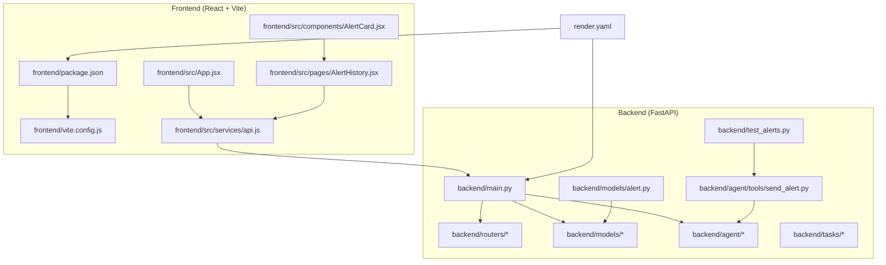
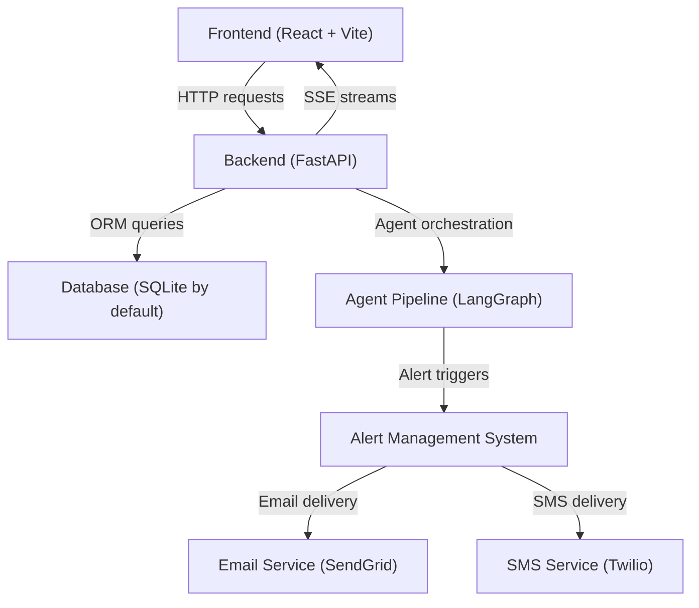

# Getting Started

<cite>
**Referenced Files in This Document**
- [README.md](file://README.md)
- [backend/main.py](file://backend/main.py)
- [backend/models/database.py](file://backend/models/database.py)
- [backend/models/alert.py](file://backend/models/alert.py)
- [backend/routers/alerts.py](file://backend/routers/alerts.py)
- [backend/agent/graph.py](file://backend/agent/graph.py)
- [backend/agent/tools/send_alert.py](file://backend/agent/tools/send_alert.py)
- [backend/test_alerts.py](file://backend/test_alerts.py)
- [backend/agent/run_agent.py](file://backend/agent/run_agent.py)
- [frontend/package.json](file://frontend/package.json)
- [frontend/vite.config.js](file://frontend/vite.config.js)
- [frontend/src/services/api.js](file://frontend/src/services/api.js)
- [frontend/src/App.jsx](file://frontend/src/App.jsx)
- [frontend/src/pages/AlertHistory.jsx](file://frontend/src/pages/AlertHistory.jsx)
- [frontend/src/components/AlertCard.jsx](file://frontend/src/components/AlertCard.jsx)
- [render.yaml](file://render.yaml)
</cite>

## Update Summary
**Changes Made**
- Enhanced alert management system documentation with detailed workflow instructions
- Added comprehensive environment variable configuration guidance for alert channels
- Improved proxy setup notes for development environment
- Expanded troubleshooting section with alert-specific configurations
- Added practical examples for testing alert functionality

## Table of Contents
1. [Introduction](#introduction)
2. [Project Structure](#project-structure)
3. [Prerequisites](#prerequisites)
4. [Core Components](#core-components)
5. [Architecture Overview](#architecture-overview)
6. [Local Development Setup](#local-development-setup)
7. [Alert Management System](#alert-management-system)
8. [Accessing Services](#accessing-services)
9. [Troubleshooting Guide](#troubleshooting-guide)
10. [IDE-Based Development Workflows](#ide-based-development-workflows)
11. [Conclusion](#conclusion)

## Introduction
This guide helps you set up ishwarambare-app for local development and become productive quickly. The project is a full-stack application built with FastAPI (Python) for the backend and React + Vite for the frontend. It includes a portfolio agent powered by LangGraph, real-time streaming via Server-Sent Events (SSE), and a comprehensive alert management system with email and SMS notifications.

## Project Structure
The repository is organized into two primary areas with enhanced alert management capabilities:
- backend/: FastAPI application with routers, models, agent, Celery tasks, and alert management
- frontend/: React application with routing, components, pages, and API services
- render.yaml: Deployment blueprint for Render

**Diagram sources**
- [backend/main.py:1-59](file://backend/main.py#L1-L59)
- [backend/models/alert.py:1-77](file://backend/models/alert.py#L1-L77)
- [backend/agent/tools/send_alert.py:1-233](file://backend/agent/tools/send_alert.py#L1-L233)
- [frontend/package.json:1-28](file://frontend/package.json#L1-L28)
- [frontend/vite.config.js:1-23](file://frontend/vite.config.js#L1-L23)
- [frontend/src/services/api.js:1-35](file://frontend/src/services/api.js#L1-L35)
- [frontend/src/pages/AlertHistory.jsx:1-163](file://frontend/src/pages/AlertHistory.jsx#L1-L163)
- [frontend/src/components/AlertCard.jsx:1-89](file://frontend/src/components/AlertCard.jsx#L1-L89)
- [render.yaml:1-48](file://render.yaml#L1-L48)

**Section sources**
- [README.md:5-25](file://README.md#L5-L25)
- [README.md:29-75](file://README.md#L29-L75)

## Prerequisites
- Python 3.14+ for the backend
- Node.js 18+ for the frontend
- Git for cloning and pushing to GitHub (for deployment)
- Optional: Docker for containerized runs (not required)
- For alert functionality: SendGrid API key and Twilio credentials (optional for development)

These versions ensure compatibility with the latest FastAPI, React, and related toolchains used in the project.

**Section sources**
- [README.md:31-34](file://README.md#L31-L34)

## Core Components
- Backend API server: FastAPI app with CORS middleware, router registration, and startup table creation
- Database layer: SQLAlchemy engine configured for SQLite by default; can be switched to PostgreSQL
- Agent pipeline: LangGraph-based workflow orchestrating news fetching, price retrieval, risk calculation, and alert dispatching
- Alert management system: Comprehensive alert storage, delivery channels (Email/SMS), and monitoring capabilities
- Frontend client: React SPA with routing, charting, and SSE support for live agent updates

Key implementation highlights:
- Backend entrypoint defines routers under /api/* and exposes health and root endpoints
- Database initialization occurs on startup and supports SQLite or PostgreSQL via environment variable
- Agent graph defines a deterministic pipeline with conditional branching and SSE-ready streaming
- Alert system stores detailed reasoning logs and delivery status for audit trails
- Frontend proxies API calls to the backend during development and reads base URL from environment variables

**Section sources**
- [backend/main.py:12-59](file://backend/main.py#L12-L59)
- [backend/models/database.py:10-42](file://backend/models/database.py#L10-L42)
- [backend/models/alert.py:14-77](file://backend/models/alert.py#L14-L77)
- [backend/agent/graph.py:1-243](file://backend/agent/graph.py#L1-L243)
- [frontend/src/services/api.js:1-35](file://frontend/src/services/api.js#L1-L35)

## Architecture Overview
The system consists of a FastAPI backend serving REST endpoints and optional SSE streams, with integrated alert management, and a React frontend that consumes the API and displays portfolio analytics and agent insights.

**Diagram sources**
- [backend/main.py:38-44](file://backend/main.py#L38-L44)
- [backend/models/database.py:15-42](file://backend/models/database.py#L15-L42)
- [backend/models/alert.py:14-77](file://backend/models/alert.py#L14-L77)
- [backend/agent/graph.py:162-204](file://backend/agent/graph.py#L162-L204)
- [backend/agent/tools/send_alert.py:159-233](file://backend/agent/tools/send_alert.py#L159-L233)
- [frontend/vite.config.js:7-17](file://frontend/vite.config.js#L7-L17)

## Local Development Setup
Follow these steps to run the backend and frontend locally with full alert management capabilities.

### Backend (FastAPI)
1. Navigate to the backend directory.
2. Create and activate a Python virtual environment appropriate for your OS.
3. Install Python dependencies from the requirements file.
4. Duplicate the environment example file to create your .env and configure variables as needed.
5. Start the FastAPI development server on port 8000.

After starting the backend, you can access the interactive API documentation at http://localhost:8000/docs.

**Section sources**
- [README.md:35-56](file://README.md#L35-L56)
- [backend/main.py:19-30](file://backend/main.py#L19-L30)

### Frontend (React + Vite)
1. Navigate to the frontend directory.
2. Install JavaScript dependencies using your package manager.
3. Duplicate the environment example file to create your .env.local and set the API base URL if needed.
4. Start the Vite development server.

The frontend runs at http://localhost:5173 and proxies API calls under /api to the backend.

**Section sources**
- [README.md:58-74](file://README.md#L58-L74)
- [frontend/vite.config.js:7-17](file://frontend/vite.config.js#L7-L17)
- [frontend/src/services/api.js:3](file://frontend/src/services/api.js#L3)

## Alert Management System
The alert management system provides comprehensive risk monitoring and notification capabilities:

### Alert Data Model
The Alert model stores detailed risk assessment information and delivery status:
- Risk metrics: risk_score, risk_level, Sharpe ratio, Sortino ratio, volatility, drawdown
- Delivery information: email_sent, sms_sent, recipient addresses
- Audit trail: reasoning_log, errors_log with full agent execution history
- Timestamps: created_at for tracking

### Alert Delivery Channels
- **Email (SendGrid)**: Rich HTML emails with portfolio metrics and market news
- **SMS (Twilio)**: Concise SMS notifications for high-risk scenarios
- **Mock Mode**: Console logging when credentials are unavailable

### Alert Triggers
Alerts are triggered when risk_score exceeds 0.70, with different delivery strategies:
- HIGH risk: Email + SMS notifications
- MEDIUM risk: Email only
- LOW risk: No alert (automated decision)

### Frontend Alert Interface
The frontend provides comprehensive alert monitoring:
- AlertHistory page with filtering and statistics
- AlertCard components with risk indicators and delivery status
- Expandable reasoning logs for debugging
- Real-time alert updates via SSE

**Section sources**
- [backend/models/alert.py:14-77](file://backend/models/alert.py#L14-L77)
- [backend/agent/tools/send_alert.py:159-233](file://backend/agent/tools/send_alert.py#L159-L233)
- [backend/agent/graph.py:36-156](file://backend/agent/graph.py#L36-L156)
- [frontend/src/pages/AlertHistory.jsx:12-163](file://frontend/src/pages/AlertHistory.jsx#L12-L163)
- [frontend/src/components/AlertCard.jsx:10-89](file://frontend/src/components/AlertCard.jsx#L10-L89)

## Accessing Services
- Backend API docs: http://localhost:8000/docs
- Frontend app: http://localhost:5173
- API calls from the frontend are proxied to http://localhost:8000 during development
- Alert history: Accessible via the AlertHistory page in the frontend

The frontend's routing and pages integrate with the backend's API endpoints exposed under /api/*, including dedicated alert management endpoints.

**Section sources**
- [README.md:56](file://README.md#L56)
- [README.md:73-74](file://README.md#L73-L74)
- [frontend/src/App.jsx:8-20](file://frontend/src/App.jsx#L8-L20)

## Troubleshooting Guide
Common setup issues and resolutions:

### Port conflicts
- If port 8000 or 5173 is in use, adjust the ports in the backend and/or Vite configuration accordingly.
- Backend port is configurable in the development command.
- Vite port is defined in the frontend configuration.

### CORS and origin mismatches
- The backend allows all origins for SSE compatibility but respects the ALLOWED_ORIGINS environment variable.
- Ensure the frontend origin matches the allowed origins during development.

### Database connectivity
- SQLite is used by default; no additional setup is required.
- To use PostgreSQL, set the DATABASE_URL environment variable to a PostgreSQL connection string.

### Environment variables
- Backend: create .env from the example and set ALLOWED_ORIGINS and SECRET_KEY as needed.
- Frontend: create .env.local from the example and set VITE_API_URL to the backend URL if different from the default.

### Proxy settings
- Vite proxies /api to the backend during development.
- If you encounter proxy issues, verify the proxy target and changeOrigin settings in the Vite configuration.

### Alert system configuration
- **SendGrid**: Set SENDGRID_API_KEY and SENDGRID_FROM_EMAIL in .env for email alerts
- **Twilio**: Set TWILIO_ACCOUNT_SID, TWILIO_AUTH_TOKEN, and TWILIO_FROM_NUMBER for SMS alerts
- **Testing**: Use backend/test_alerts.py to verify email and SMS delivery
- **Mock mode**: When credentials are missing, alerts log to console instead of being delivered

### Authentication
- The demo login endpoint accepts a username and password pair.
- Replace the demo login with a proper JWT-based authentication system before production.

### Agent pipeline
- The agent graph compiles on import and supports synchronous invocation and SSE-ready streaming.
- Ensure the agent tools are available and the agent endpoints are reachable via the backend.

### Alert management
- **Alert storage**: Alerts are persisted in the database with full reasoning logs
- **Alert history**: Access via /api/alerts endpoints with filtering and pagination
- **Statistics**: Use /api/alerts/stats for aggregated alert metrics
- **Debugging**: Expand alert cards to view detailed reasoning logs and error traces

**Section sources**
- [backend/main.py:19-30](file://backend/main.py#L19-L30)
- [backend/models/database.py:15-18](file://backend/models/database.py#L15-L18)
- [frontend/vite.config.js:9-16](file://frontend/vite.config.js#L9-L16)
- [frontend/src/services/api.js:3](file://frontend/src/services/api.js#L3)
- [backend/agent/tools/send_alert.py:24-36](file://backend/agent/tools/send_alert.py#L24-L36)
- [backend/test_alerts.py:16-95](file://backend/test_alerts.py#L16-L95)
- [backend/routers/alerts.py:22-84](file://backend/routers/alerts.py#L22-L84)

## IDE-Based Development Workflows
- Backend
  - Use your IDE's integrated terminal to navigate to the backend directory and run the development server.
  - Set environment variables in your IDE's run configuration or use a .env file loaded by your IDE.
  - Enable hot reload and breakpoints for efficient debugging.
  - Test alert functionality using backend/test_alerts.py for email/SMS verification.

- Frontend
  - Use your IDE's integrated terminal to navigate to the frontend directory and run the development server.
  - Configure environment variables in .env.local or your IDE's run configuration.
  - Leverage the proxy settings so API calls route to the backend seamlessly.
  - Monitor alert history and reasoning logs through the frontend interface.

- Shared
  - Keep both servers running concurrently.
  - Use the backend's interactive docs to test endpoints and the frontend to verify UI integrations.
  - Test alert delivery by triggering high-risk scenarios in the agent.

## Conclusion
You now have the essentials to run ishwarambare-app locally, understand the architecture, and troubleshoot common issues. The enhanced alert management system provides comprehensive risk monitoring with email and SMS notifications, while the frontend offers intuitive interfaces for alert viewing and debugging. Explore the backend routers, agent pipeline, and alert management components to deepen your understanding, and extend the frontend pages and services to meet your feature requirements.