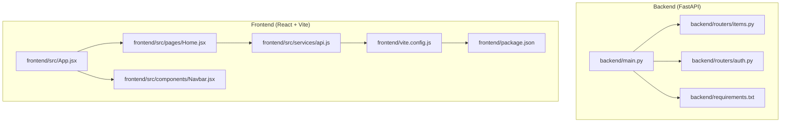
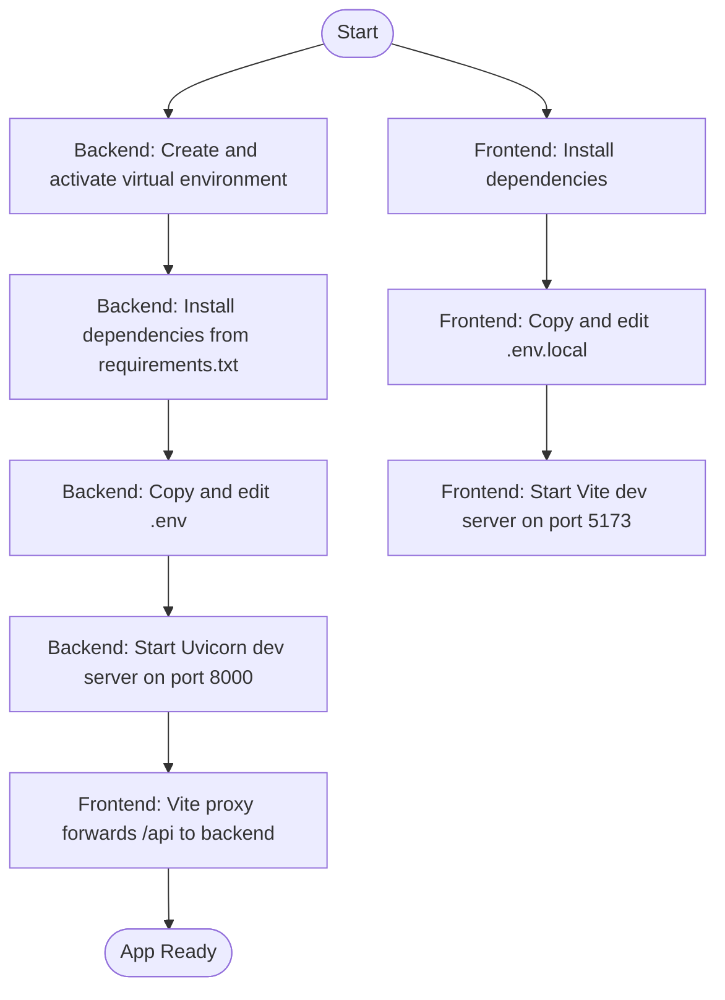

# Getting Started

<cite>
**Referenced Files in This Document**
- [README.md](file://README.md)
- [backend/main.py](file://backend/main.py)
- [backend/routers/items.py](file://backend/routers/items.py)
- [backend/routers/auth.py](file://backend/routers/auth.py)
- [backend/requirements.txt](file://backend/requirements.txt)
- [frontend/package.json](file://frontend/package.json)
- [frontend/vite.config.js](file://frontend/vite.config.js)
- [frontend/src/services/api.js](file://frontend/src/services/api.js)
- [frontend/src/App.jsx](file://frontend/src/App.jsx)
- [frontend/src/pages/Home.jsx](file://frontend/src/pages/Home.jsx)
- [frontend/src/components/Navbar.jsx](file://frontend/src/components/Navbar.jsx)
- [render.yaml](file://render.yaml)
</cite>

## Table of Contents
1. [Introduction](#introduction)
2. [Project Structure](#project-structure)
3. [Prerequisites](#prerequisites)
4. [Local Development Setup](#local-development-setup)
5. [Development Workflow](#development-workflow)
6. [API Documentation Access](#api-documentation-access)
7. [Environment Variables and Configuration](#environment-variables-and-configuration)
8. [CORS and Proxy Configuration](#cors-and-proxy-configuration)
9. [Running the Application Locally](#running-the-application-locally)
10. [Troubleshooting Guide](#troubleshooting-guide)
11. [Deployment Overview](#deployment-overview)
12. [Conclusion](#conclusion)

## Introduction
This guide helps you set up and run ishwarambare-app locally, a full-stack application featuring a FastAPI backend and a React + Vite frontend. It covers prerequisites, environment setup, dependency installation, configuration, and running both servers. You will also learn how to access the interactive API documentation and resolve common setup issues.

## Project Structure
The repository is organized into two primary directories:
- backend: FastAPI application with routers for items and authentication, plus a development server entrypoint and dependency requirements.
- frontend: React application bootstrapped with Vite, including routing, a service layer for API calls, and page components.

**Diagram sources**
- [backend/main.py:1-44](file://backend/main.py#L1-L44)
- [backend/routers/items.py:1-72](file://backend/routers/items.py#L1-L72)
- [backend/routers/auth.py:1-39](file://backend/routers/auth.py#L1-L39)
- [backend/requirements.txt:1-20](file://backend/requirements.txt#L1-L20)
- [frontend/package.json:1-24](file://frontend/package.json#L1-L24)
- [frontend/vite.config.js:1-23](file://frontend/vite.config.js#L1-L23)
- [frontend/src/App.jsx:1-19](file://frontend/src/App.jsx#L1-L19)
- [frontend/src/pages/Home.jsx:1-63](file://frontend/src/pages/Home.jsx#L1-L63)
- [frontend/src/components/Navbar.jsx:1-19](file://frontend/src/components/Navbar.jsx#L1-L19)
- [frontend/src/services/api.js:1-29](file://frontend/src/services/api.js#L1-L29)

**Section sources**
- [README.md:5-25](file://README.md#L5-L25)

## Prerequisites
- Python 3.14+ for the backend
- Node.js 18+ for the frontend

These versions are required to match the project’s runtime expectations and toolchain compatibility.

**Section sources**
- [README.md:31-33](file://README.md#L31-L33)

## Local Development Setup
Follow these steps to prepare your environment for local development.

### Backend Setup
1. Navigate to the backend directory.
2. Create and activate a virtual environment appropriate for your OS.
3. Install Python dependencies from the requirements file.
4. Prepare environment variables by copying the example file and editing it.
5. Start the FastAPI development server with hot reload on port 8000.

Notes:
- The backend uses environment variables for CORS origins and other settings.
- The development server is configured to listen on port 8000.

**Section sources**
- [README.md:35-56](file://README.md#L35-L56)
- [backend/requirements.txt:1-20](file://backend/requirements.txt#L1-L20)
- [backend/main.py:17-28](file://backend/main.py#L17-L28)

### Frontend Setup
1. Navigate to the frontend directory.
2. Install JavaScript dependencies using the package manager.
3. Prepare environment variables by copying the example file and editing it.
4. Start the Vite development server.

Notes:
- The frontend proxies API requests to the backend during development.
- The development server runs on port 5173.

**Section sources**
- [README.md:58-74](file://README.md#L58-L74)
- [frontend/package.json:1-24](file://frontend/package.json#L1-L24)
- [frontend/vite.config.js:7-16](file://frontend/vite.config.js#L7-L16)

## Development Workflow
End-to-end workflow from environment setup to running the app locally:

**Diagram sources**
- [README.md:35-74](file://README.md#L35-L74)
- [backend/main.py:10-14](file://backend/main.py#L10-L14)
- [backend/main.py:17-28](file://backend/main.py#L17-L28)
- [frontend/vite.config.js:7-16](file://frontend/vite.config.js#L7-L16)

## API Documentation Access
While the backend server is running, open the following URL in your browser to view the interactive API documentation:
- http://localhost:8000/docs

This route is provided by the FastAPI application and displays OpenAPI/Swagger documentation for all registered endpoints.

**Section sources**
- [README.md:56-56](file://README.md#L56-L56)
- [backend/main.py:10-14](file://backend/main.py#L10-L14)

## Environment Variables and Configuration
### Backend Environment Variables
- ALLOWED_ORIGINS: Comma-separated list of origins permitted for CORS. Defaults to localhost and production domains.
- SECRET_KEY: Used by the backend for signing tokens or secrets. Generate securely for production.
- ENVIRONMENT: Indicates environment mode (e.g., production).

Notes:
- The backend loads environment variables at startup.
- The CORS middleware reads ALLOWED_ORIGINS dynamically from the environment.

**Section sources**
- [backend/main.py:17-20](file://backend/main.py#L17-L20)
- [backend/main.py:22-28](file://backend/main.py#L22-L28)
- [render.yaml:15-21](file://render.yaml#L15-L21)

### Frontend Environment Variables
- VITE_API_URL: Base URL for API calls during development. Defaults to the backend URL if unset.

Notes:
- The frontend service layer uses this variable to construct API base URLs.
- During development, Vite proxies API calls to the backend automatically.

**Section sources**
- [frontend/src/services/api.js:3-6](file://frontend/src/services/api.js#L3-L6)
- [frontend/vite.config.js:10-16](file://frontend/vite.config.js#L10-L16)
- [render.yaml:40-42](file://render.yaml#L40-L42)

## CORS and Proxy Configuration
### Backend CORS
- The backend enables CORS with configurable origins loaded from environment variables.
- Origins include the frontend development origin and production domains by default.

**Section sources**
- [backend/main.py:17-20](file://backend/main.py#L17-L20)
- [backend/main.py:22-28](file://backend/main.py#L22-L28)

### Frontend Proxy
- Vite is configured to proxy API requests prefixed with /api to the backend during development.
- This avoids cross-origin issues while developing locally.

**Section sources**
- [frontend/vite.config.js:7-16](file://frontend/vite.config.js#L7-L16)

## Running the Application Locally
### Backend
- Start the FastAPI development server with hot reload on port 8000.
- Access the interactive API docs at http://localhost:8000/docs.

**Section sources**
- [README.md:52-56](file://README.md#L52-L56)
- [backend/main.py:10-14](file://backend/main.py#L10-L14)

### Frontend
- Start the Vite development server on port 5173.
- API calls are proxied to the backend automatically.

**Section sources**
- [README.md:69-74](file://README.md#L69-L74)
- [frontend/vite.config.js:7-16](file://frontend/vite.config.js#L7-L16)

## Troubleshooting Guide
Common issues and resolutions:

- Port conflicts
  - Symptom: Port 8000 or 5173 already in use.
  - Resolution: Stop the conflicting process or adjust ports in backend and/or Vite configuration.

- CORS errors in the browser console
  - Symptom: Preflight or blocked requests due to origin mismatch.
  - Resolution: Ensure ALLOWED_ORIGINS includes the frontend origin (localhost:5173) and any production domains.

- API calls failing in development
  - Symptom: Network errors when fetching data.
  - Resolution: Confirm the backend is running on port 8000 and Vite proxy is enabled. Verify VITE_API_URL is not overriding the proxy.

- Missing environment files
  - Symptom: Runtime errors related to missing keys.
  - Resolution: Copy the example environment files and fill in required values.

- Python virtual environment activation
  - Symptom: Module not found or permission denied.
  - Resolution: Create a virtual environment with Python 3.14+ and activate it before installing dependencies.

**Section sources**
- [README.md:31-33](file://README.md#L31-L33)
- [README.md:49-50](file://README.md#L49-L50)
- [README.md:66-67](file://README.md#L66-L67)
- [backend/main.py:17-20](file://backend/main.py#L17-L20)
- [frontend/vite.config.js:7-16](file://frontend/vite.config.js#L7-L16)
- [frontend/src/services/api.js:3-6](file://frontend/src/services/api.js#L3-L6)

## Deployment Overview
The project is prepared for deployment on Render using a blueprint specification. The blueprint defines separate services for the backend and frontend, sets region and plans, and configures environment variables and health checks.

Key deployment details:
- Backend service: Python runtime, builds with pip install, starts with Uvicorn, health check at /health.
- Frontend service: Static site build and publish, SPA fallback rewrite, and environment variable for API URL.
- Custom domain setup is supported via Render’s dashboard and DNS configuration.

**Section sources**
- [render.yaml:4-48](file://render.yaml#L4-L48)

## Conclusion
You now have the essentials to develop and run ishwarambare-app locally. Follow the setup steps, configure environment variables, and use the development servers for both backend and frontend. Access the interactive API documentation at http://localhost:8000/docs, and refer to the troubleshooting section for common issues. When ready, deploy using the provided Render blueprint or manual environment variable configuration.