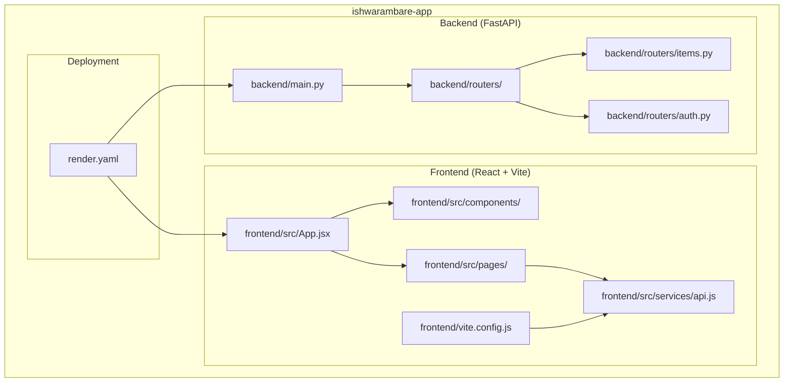
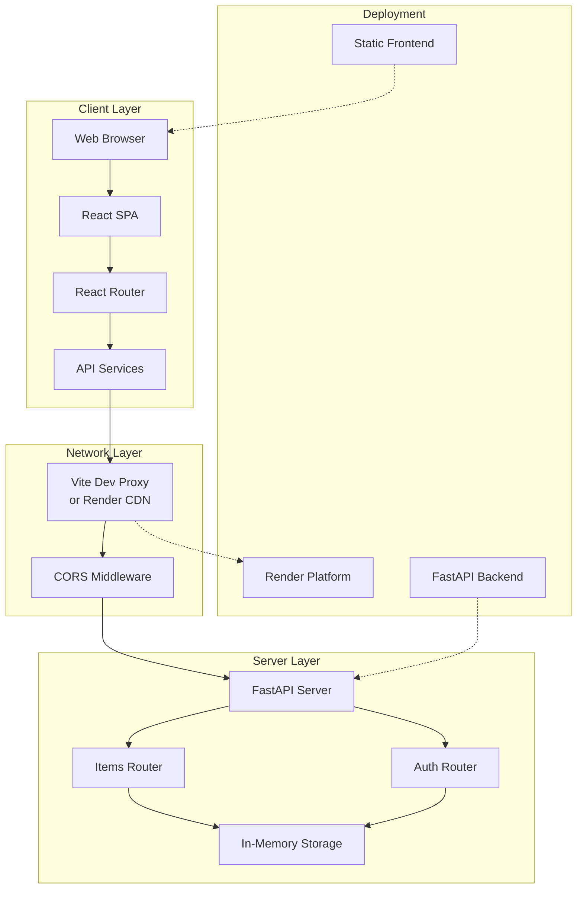
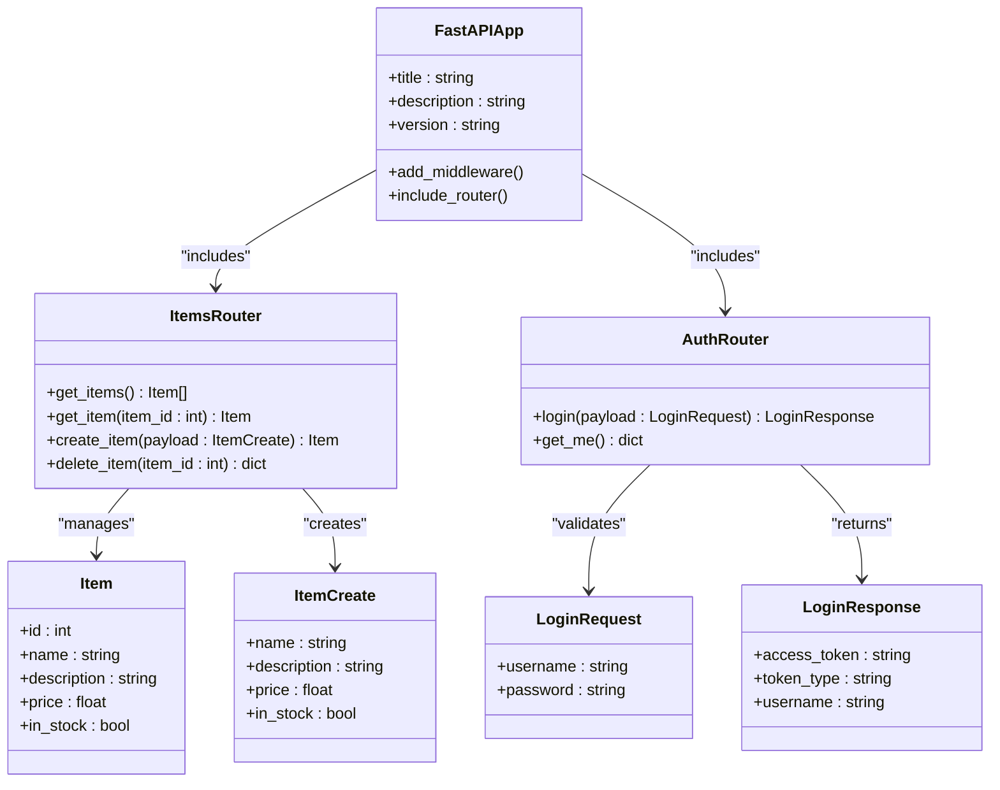
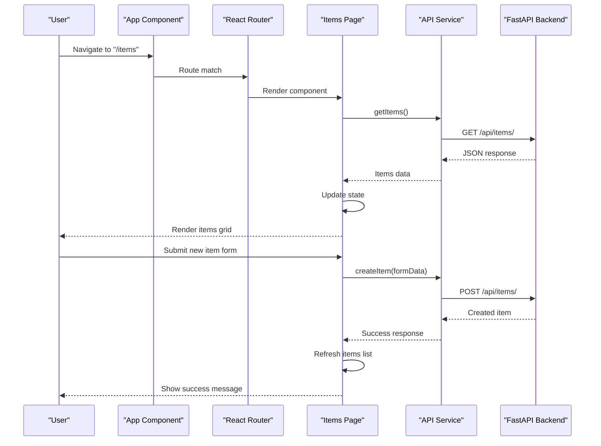
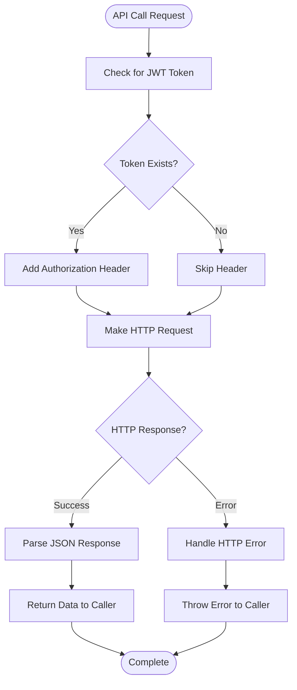
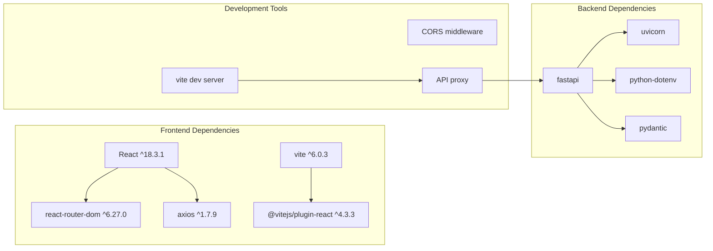

# Project Overview

<cite>
**Referenced Files in This Document**
- [README.md](file://README.md)
- [backend/main.py](file://backend/main.py)
- [backend/routers/items.py](file://backend/routers/items.py)
- [backend/routers/auth.py](file://backend/routers/auth.py)
- [frontend/src/App.jsx](file://frontend/src/App.jsx)
- [frontend/src/components/Navbar.jsx](file://frontend/src/components/Navbar.jsx)
- [frontend/src/pages/Home.jsx](file://frontend/src/pages/Home.jsx)
- [frontend/src/pages/Items.jsx](file://frontend/src/pages/Items.jsx)
- [frontend/src/services/api.js](file://frontend/src/services/api.js)
- [frontend/vite.config.js](file://frontend/vite.config.js)
- [frontend/package.json](file://frontend/package.json)
- [render.yaml](file://render.yaml)
</cite>

## Table of Contents
1. [Introduction](#introduction)
2. [Project Structure](#project-structure)
3. [Core Components](#core-components)
4. [Architecture Overview](#architecture-overview)
5. [Detailed Component Analysis](#detailed-component-analysis)
6. [Dependency Analysis](#dependency-analysis)
7. [Performance Considerations](#performance-considerations)
8. [Troubleshooting Guide](#troubleshooting-guide)
9. [Conclusion](#conclusion)

## Introduction
ishwarambare-app is a full-stack web application designed to demonstrate modern web development practices with a FastAPI backend and a React frontend. The project serves as an educational resource for learning full-stack development patterns, showcasing clean separation of concerns, responsive UI design, and cloud-native deployment on Render. The application provides a practical foundation for building scalable web applications using contemporary technologies.

The project emphasizes hands-on learning through a complete development workflow: local development with hot reloading, cross-origin resource sharing (CORS) configuration, API-driven data management, and automated deployment pipelines. It demonstrates how to structure a professional-grade full-stack application while maintaining simplicity for educational purposes.

**Section sources**
- [README.md:1-129](file://README.md#L1-L129)

## Project Structure
The project follows a clear dual-package structure with separate backend and frontend directories, each containing focused components and services. This organization promotes maintainability and enables independent scaling of frontend and backend services.

**Diagram sources**
- [backend/main.py:1-44](file://backend/main.py#L1-L44)
- [backend/routers/items.py:1-72](file://backend/routers/items.py#L1-L72)
- [backend/routers/auth.py:1-39](file://backend/routers/auth.py#L1-L39)
- [frontend/src/App.jsx:1-19](file://frontend/src/App.jsx#L1-L19)
- [frontend/src/services/api.js:1-29](file://frontend/src/services/api.js#L1-L29)
- [render.yaml:1-48](file://render.yaml#L1-L48)

The structure provides clear separation between:
- Backend API services with modular router organization
- Frontend components with page-based routing
- Shared service layer for API communication
- Deployment configuration for cloud platforms

**Section sources**
- [README.md:5-25](file://README.md#L5-L25)
- [backend/main.py:1-44](file://backend/main.py#L1-L44)
- [frontend/src/App.jsx:1-19](file://frontend/src/App.jsx#L1-L19)

## Core Components
The application consists of four primary functional areas that work together to deliver a complete user experience:

### Backend Services
The FastAPI backend provides a robust foundation with two main service domains: item management and authentication. The backend implements proper HTTP semantics with structured responses, error handling, and CORS configuration for seamless frontend integration.

### Frontend Application
The React frontend delivers a responsive, interactive user interface with modern development practices. It includes comprehensive routing, state management, form handling, and real-time API integration. The frontend demonstrates professional UI patterns with loading states, error handling, and user feedback mechanisms.

### API Communication Layer
A centralized service layer handles all HTTP requests to the backend API. This abstraction provides consistent error handling, authentication token management, and request/response formatting across the entire application.

### Deployment Infrastructure
The project includes complete deployment automation through Render's blueprint system, enabling automatic builds and deployments for both backend and frontend services with custom domain support.

**Section sources**
- [backend/main.py:10-44](file://backend/main.py#L10-L44)
- [frontend/src/App.jsx:1-19](file://frontend/src/App.jsx#L1-L19)
- [frontend/src/services/api.js:1-29](file://frontend/src/services/api.js#L1-L29)
- [render.yaml:1-48](file://render.yaml#L1-L48)

## Architecture Overview
The application follows a client-server architecture pattern with clear separation between presentation, business logic, and data persistence layers. The system operates as a single-page application (SPA) served statically from a CDN-like infrastructure, with dynamic API requests to the backend service.

**Diagram sources**
- [frontend/vite.config.js:1-23](file://frontend/vite.config.js#L1-L23)
- [backend/main.py:16-28](file://backend/main.py#L16-L28)
- [backend/routers/items.py:24-31](file://backend/routers/items.py#L24-L31)
- [backend/routers/auth.py:18-32](file://backend/routers/auth.py#L18-L32)
- [render.yaml:4-43](file://render.yaml#L4-L43)

The architecture demonstrates several key patterns:
- **Separation of Concerns**: Clear boundaries between frontend, backend, and deployment layers
- **API-First Design**: Backend services designed around RESTful principles
- **Responsive Frontend**: Mobile-first design with adaptive layouts
- **Cloud-Native Deployment**: Containerized services with automated CI/CD

**Section sources**
- [README.md:78-108](file://README.md#L78-L108)
- [render.yaml:1-48](file://render.yaml#L1-L48)

## Detailed Component Analysis

### Backend API Services
The FastAPI backend implements a clean, modular architecture with dedicated routers for different functional domains. The application uses in-memory storage for demonstration purposes, making it easy to understand data flow without database complexity.

**Diagram sources**
- [backend/main.py:10-32](file://backend/main.py#L10-L32)
- [backend/routers/items.py:9-22](file://backend/routers/items.py#L9-L22)
- [backend/routers/auth.py:7-16](file://backend/routers/auth.py#L7-L16)

Key backend features include:
- **Structured Data Models**: Pydantic models for input validation and serialization
- **RESTful Endpoints**: Standard HTTP methods with appropriate status codes
- **Error Handling**: Comprehensive exception handling with meaningful error messages
- **CORS Configuration**: Flexible cross-origin policy for development and production

**Section sources**
- [backend/main.py:1-44](file://backend/main.py#L1-L44)
- [backend/routers/items.py:1-72](file://backend/routers/items.py#L1-L72)
- [backend/routers/auth.py:1-39](file://backend/routers/auth.py#L1-L39)

### Frontend Application Architecture
The React frontend implements modern SPA patterns with comprehensive routing, state management, and user interface components. The application demonstrates professional development practices including form validation, loading states, and error handling.

**Diagram sources**
- [frontend/src/App.jsx:1-19](file://frontend/src/App.jsx#L1-L19)
- [frontend/src/pages/Items.jsx:13-56](file://frontend/src/pages/Items.jsx#L13-L56)
- [frontend/src/services/api.js:15-23](file://frontend/src/services/api.js#L15-L23)
- [backend/routers/items.py:36-59](file://backend/routers/items.py#L36-L59)

The frontend architecture emphasizes:
- **Component-Based Design**: Reusable, modular components with clear responsibilities
- **State Management**: Centralized state with proper loading and error states
- **Form Handling**: Comprehensive validation and user feedback
- **Routing**: Clean navigation with route-based rendering

**Section sources**
- [frontend/src/App.jsx:1-19](file://frontend/src/App.jsx#L1-L19)
- [frontend/src/components/Navbar.jsx:1-19](file://frontend/src/components/Navbar.jsx#L1-L19)
- [frontend/src/pages/Items.jsx:1-125](file://frontend/src/pages/Items.jsx#L1-L125)
- [frontend/src/services/api.js:1-29](file://frontend/src/services/api.js#L1-L29)

### API Communication Layer
The centralized API service provides a unified interface for all backend communication, handling authentication tokens, error responses, and request formatting. This abstraction simplifies frontend development and ensures consistent behavior across all API interactions.

**Diagram sources**
- [frontend/src/services/api.js:8-13](file://frontend/src/services/api.js#L8-L13)
- [frontend/src/services/api.js:15-28](file://frontend/src/services/api.js#L15-L28)

**Section sources**
- [frontend/src/services/api.js:1-29](file://frontend/src/services/api.js#L1-L29)

### Deployment Infrastructure
The Render deployment configuration automates the entire CI/CD pipeline, enabling instant deployment on code pushes. The configuration supports both automatic blueprint deployment and manual environment variable configuration.

**Section sources**
- [render.yaml:1-48](file://render.yaml#L1-L48)
- [README.md:78-108](file://README.md#L78-L108)

## Dependency Analysis
The project maintains loose coupling between components while ensuring cohesive functionality through well-defined interfaces. Dependencies flow primarily from frontend to backend, with deployment configurations orchestrating the complete system.

**Diagram sources**
- [frontend/package.json:11-22](file://frontend/package.json#L11-L22)
- [backend/main.py:1-6](file://backend/main.py#L1-L6)

The dependency structure supports:
- **Frontend Development**: Modern toolchain with hot reloading and proxy configuration
- **Backend Development**: Lightweight framework with minimal external dependencies
- **Cross-Platform Compatibility**: Consistent behavior across development and production environments

**Section sources**
- [frontend/package.json:1-24](file://frontend/package.json#L1-L24)
- [backend/main.py:1-6](file://backend/main.py#L1-L6)

## Performance Considerations
The application is designed with performance optimization in mind, utilizing modern development practices and efficient resource management. Key performance characteristics include:

- **Static Asset Delivery**: Frontend assets are served efficiently through CDN-like infrastructure
- **API Response Optimization**: Structured responses with appropriate caching headers
- **Memory Efficiency**: In-memory storage for demonstration purposes reduces database overhead
- **Development Experience**: Hot module replacement and efficient build processes

## Troubleshooting Guide
Common issues and their solutions during development and deployment:

### Development Environment Issues
- **Backend not starting**: Verify Python 3.14+ installation and virtual environment activation
- **Frontend proxy errors**: Check Vite proxy configuration and backend port availability
- **CORS errors**: Verify ALLOWED_ORIGINS environment variable includes frontend origin

### Production Deployment Issues
- **Build failures**: Ensure all dependencies are properly installed in both backend and frontend
- **Domain configuration**: Verify DNS records and custom domain setup in Render dashboard
- **API connectivity**: Check environment variables and service health endpoints

**Section sources**
- [README.md:29-75](file://README.md#L29-L75)
- [README.md:78-129](file://README.md#L78-L129)

## Conclusion
ishwarambare-app represents a comprehensive example of modern full-stack web development, combining the power of FastAPI for backend services with the flexibility of React for frontend experiences. The project successfully demonstrates professional development practices including clean architecture, responsive design, automated deployment, and comprehensive testing approaches.

The application serves as an excellent educational resource for developers learning full-stack patterns, providing a solid foundation for building production-ready web applications. Its modular structure, clear documentation, and practical examples make it accessible to developers at various skill levels while maintaining professional standards.

Through hands-on exploration of this codebase, developers can gain valuable insights into contemporary web development workflows, from initial setup and local development through to cloud deployment and maintenance. The project's emphasis on best practices and modern tooling ensures that learners develop skills applicable to real-world development scenarios.