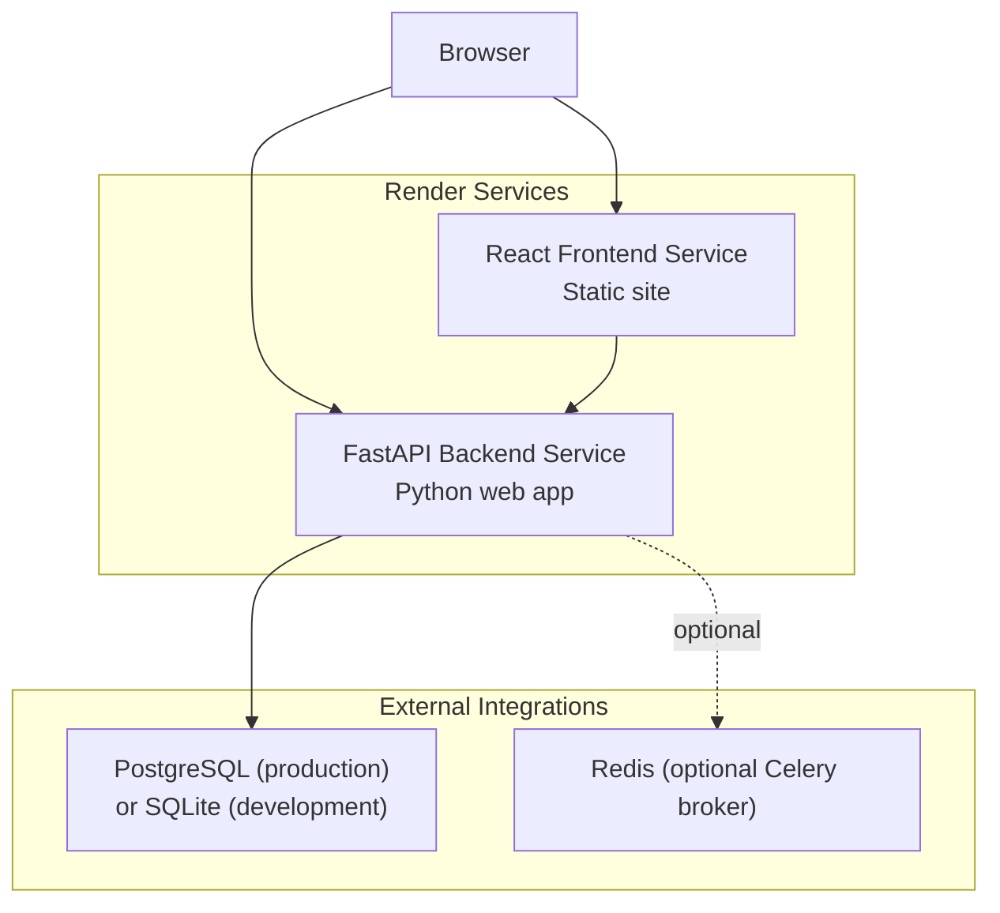
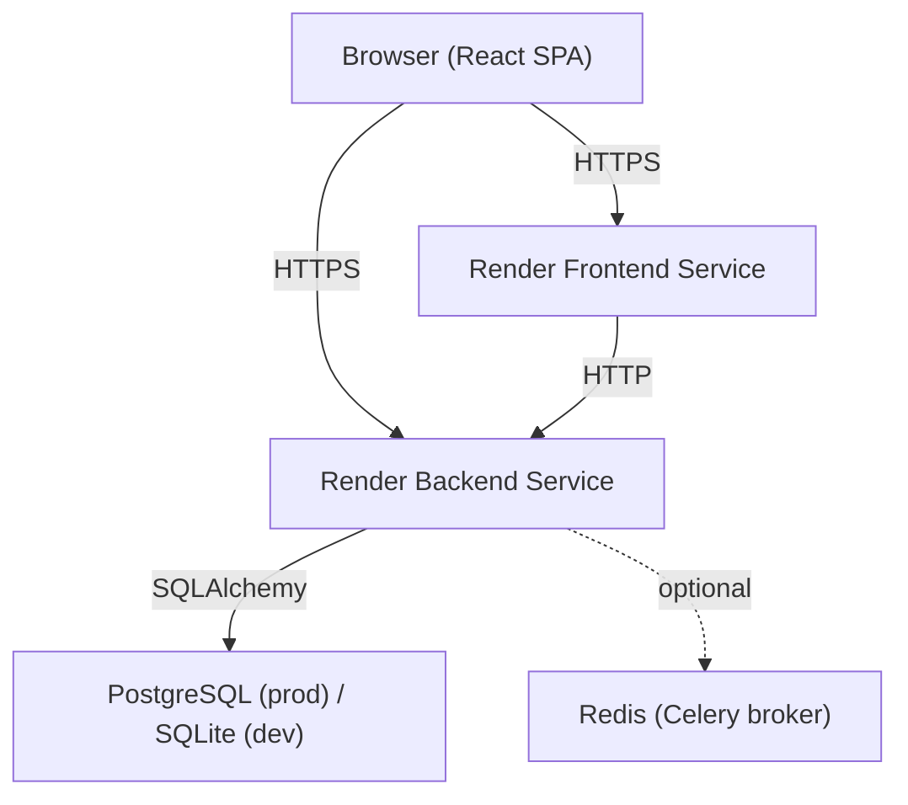
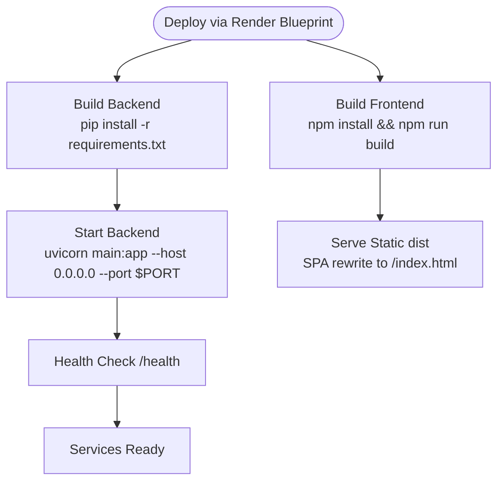
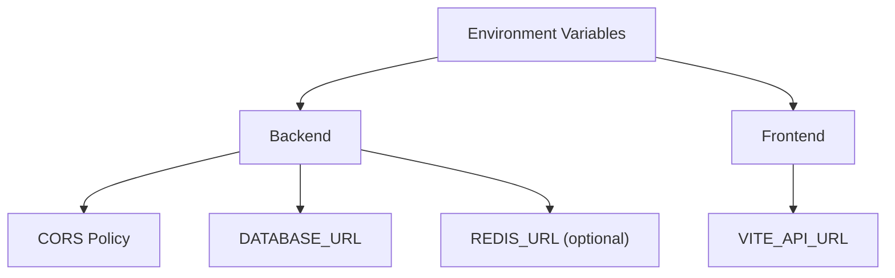
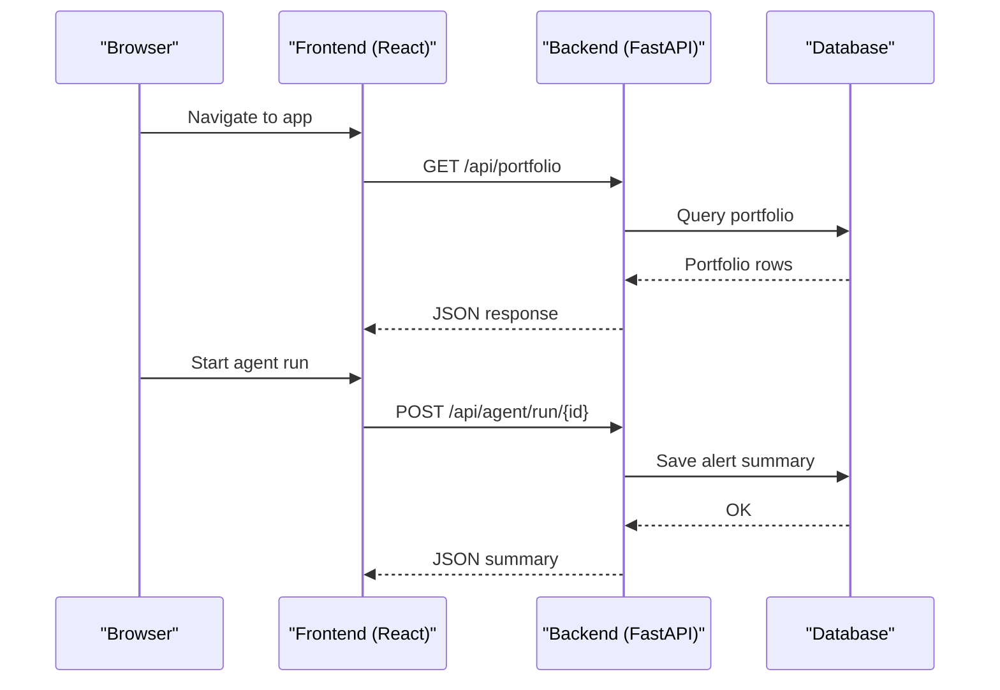
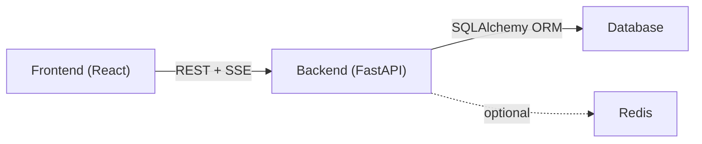
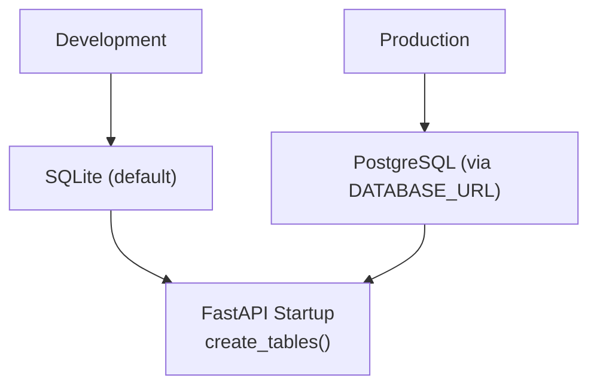
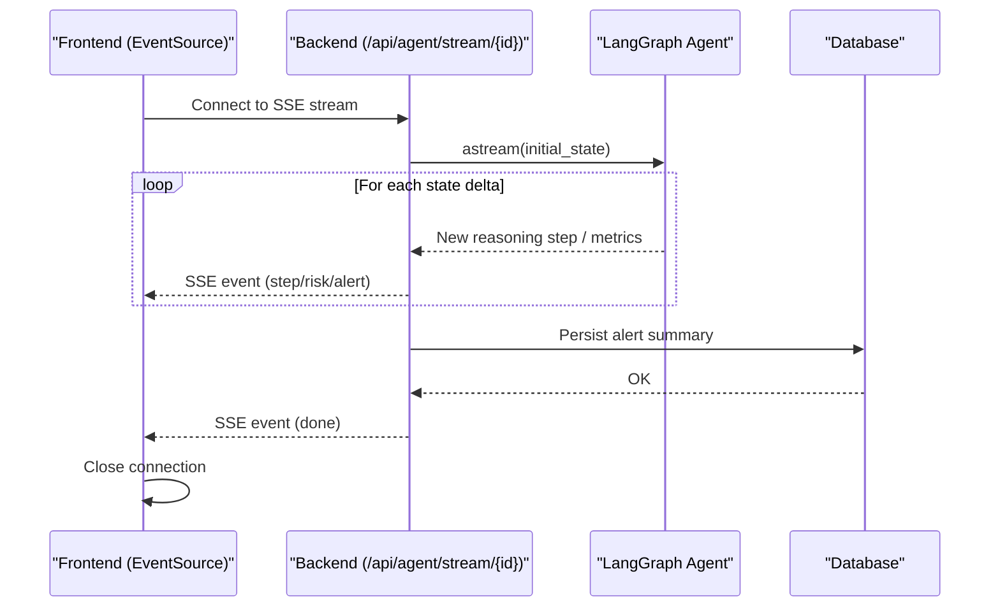
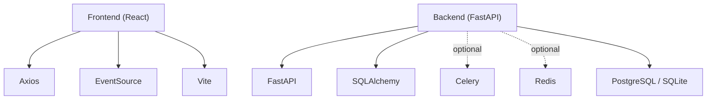

# Deployment Architecture

<cite>
**Referenced Files in This Document**
- [render.yaml](file://render.yaml)
- [backend/main.py](file://backend/main.py)
- [backend/routers/agent.py](file://backend/routers/agent.py)
- [backend/models/database.py](file://backend/models/database.py)
- [backend/routers/auth.py](file://backend/routers/auth.py)
- [backend/agent/graph.py](file://backend/agent/graph.py)
- [backend/tasks/celery_app.py](file://backend/tasks/celery_app.py)
- [backend/requirements.txt](file://backend/requirements.txt)
- [frontend/src/services/api.js](file://frontend/src/services/api.js)
- [frontend/src/services/sse.js](file://frontend/src/services/sse.js)
- [frontend/vite.config.js](file://frontend/vite.config.js)
- [frontend/package.json](file://frontend/package.json)
- [README.md](file://README.md)
</cite>

## Table of Contents
1. [Introduction](#introduction)
2. [Project Structure](#project-structure)
3. [Core Components](#core-components)
4. [Architecture Overview](#architecture-overview)
5. [Detailed Component Analysis](#detailed-component-analysis)
6. [Dependency Analysis](#dependency-analysis)
7. [Performance Considerations](#performance-considerations)
8. [Troubleshooting Guide](#troubleshooting-guide)
9. [Conclusion](#conclusion)
10. [Appendices](#appendices)

## Introduction
This document describes the production deployment architecture for the ishwarambare-app platform on the Render platform. It covers the Render blueprints for the frontend and backend services, environment variable management, service interconnection, separation of concerns between frontend and backend, database strategy for development and production, real-time streaming via Server-Sent Events (SSE), containerization and scaling considerations, load balancing, security controls (CORS, authentication, and data protection), CI/CD and domain/SSL configuration, and guidance for local development versus production deployment.

## Project Structure
The platform follows a clear separation of concerns:
- Frontend: React SPA built with Vite and served statically by Render.
- Backend: FastAPI application exposing REST endpoints and SSE streaming for agent execution monitoring.
- Shared concerns: Environment variables, CORS policy, and database configuration.

**Diagram sources**
- [render.yaml:4-48](file://render.yaml#L4-L48)
- [backend/models/database.py:15-20](file://backend/models/database.py#L15-L20)
- [backend/tasks/celery_app.py:29-40](file://backend/tasks/celery_app.py#L29-L40)

**Section sources**
- [README.md:1-25](file://README.md#L1-L25)
- [render.yaml:1-48](file://render.yaml#L1-L48)

## Core Components
- Render Blueprints: Separate services for frontend (static) and backend (web), each configured with region, plan, build/start commands, health checks, and environment variables.
- CORS Policy: Configured in the backend to support SSE and cross-origin requests from the deployed frontend domains.
- Database Strategy: SQLite by default for zero-config development; PostgreSQL supported via DATABASE_URL environment variable for production.
- Real-Time Streaming: SSE endpoint streams agent execution events to the React SPA.
- Authentication: Demo login endpoint included; intended to be extended with JWT and persistent user storage.
- Optional Background Tasks: Celery with Redis for scheduled portfolio analysis.

**Section sources**
- [render.yaml:4-48](file://render.yaml#L4-L48)
- [backend/main.py:18-30](file://backend/main.py#L18-L30)
- [backend/models/database.py:5-9](file://backend/models/database.py#L5-L9)
- [backend/routers/agent.py:39-168](file://backend/routers/agent.py#L39-L168)
- [backend/routers/auth.py:18-32](file://backend/routers/auth.py#L18-L32)
- [backend/tasks/celery_app.py:29-55](file://backend/tasks/celery_app.py#L29-L55)

## Architecture Overview
The deployment uses Render’s automatic blueprint to build and host both services. The frontend is a static React app that proxies API calls during development and points to the backend service in production. The backend exposes REST endpoints and an SSE stream for live agent monitoring. The database is configurable between SQLite and PostgreSQL.

**Diagram sources**
- [render.yaml:4-48](file://render.yaml#L4-L48)
- [backend/models/database.py:15-20](file://backend/models/database.py#L15-L20)
- [backend/tasks/celery_app.py:29-40](file://backend/tasks/celery_app.py#L29-L40)

## Detailed Component Analysis

### Render Platform Configuration (Blueprints)
- Backend service:
  - Runtime: Python
  - Region: Singapore (closest to India)
  - Plan: Free tier
  - Root directory: backend
  - Build command installs Python dependencies from requirements.txt
  - Start command launches Uvicorn on Render’s PORT
  - Health check path: /health
  - Environment variables:
    - ALLOWED_ORIGINS: restricts CORS to frontend domains
    - ENVIRONMENT: production
    - SECRET_KEY: generated securely by Render
- Frontend service:
  - Runtime: Static
  - Region: Singapore
  - Plan: Free tier
  - Root directory: frontend
  - Build command: npm install && npm run build
  - Static publish path: dist
  - Headers: Cache-Control: no-cache
  - Routes: rewrite all paths to /index.html for SPA fallback
  - Environment variable:
    - VITE_API_URL: points to the backend service URL on Render

**Diagram sources**
- [render.yaml:6-14](file://render.yaml#L6-L14)
- [render.yaml:24-39](file://render.yaml#L24-L39)
- [backend/requirements.txt:1-20](file://backend/requirements.txt#L1-L20)

**Section sources**
- [render.yaml:4-48](file://render.yaml#L4-L48)

### Environment Variable Management
- Backend:
  - ALLOWED_ORIGINS: controls CORS origins; defaults include localhost for development and production domains
  - ENVIRONMENT: indicates production
  - SECRET_KEY: generated by Render for secure signing
  - DATABASE_URL: SQLite by default; PostgreSQL URL for production
  - Optional REDIS_URL: for Celery scheduling
- Frontend:
  - VITE_API_URL: points to the backend service URL on Render

**Diagram sources**
- [backend/main.py:19-22](file://backend/main.py#L19-L22)
- [backend/models/database.py:15-18](file://backend/models/database.py#L15-L18)
- [backend/tasks/celery_app.py:29-29](file://backend/tasks/celery_app.py#L29-L29)
- [render.yaml:15-21](file://render.yaml#L15-L21)
- [render.yaml:40-42](file://render.yaml#L40-L42)

**Section sources**
- [backend/main.py:18-30](file://backend/main.py#L18-L30)
- [backend/models/database.py:5-9](file://backend/models/database.py#L5-L9)
- [backend/tasks/celery_app.py:9-11](file://backend/tasks/celery_app.py#L9-L11)
- [render.yaml:15-21](file://render.yaml#L15-L21)
- [render.yaml:40-42](file://render.yaml#L40-L42)

### Service Interconnection
- Frontend-to-backend communication:
  - During development, Vite proxies /api calls to the backend on localhost.
  - In production, the frontend sets VITE_API_URL to the backend service URL on Render.
- Backend-to-frontend:
  - CORS allows origins for SSE and cross-domain access.
  - The React SPA uses Axios for REST calls and EventSource for SSE.

**Diagram sources**
- [frontend/vite.config.js:9-16](file://frontend/vite.config.js#L9-L16)
- [frontend/src/services/api.js:3-9](file://frontend/src/services/api.js#L3-L9)
- [backend/routers/agent.py:186-232](file://backend/routers/agent.py#L186-L232)

**Section sources**
- [frontend/vite.config.js:7-17](file://frontend/vite.config.js#L7-L17)
- [frontend/src/services/api.js:3-9](file://frontend/src/services/api.js#L3-L9)
- [backend/routers/agent.py:39-168](file://backend/routers/agent.py#L39-L168)

### Separation of Concerns: Frontend and Backend
- Frontend responsibilities:
  - UI rendering and user interactions
  - REST API calls via Axios
  - SSE connection for live agent updates
- Backend responsibilities:
  - API routing and business logic
  - Database persistence
  - SSE streaming for agent execution
  - CORS configuration and health checks

**Diagram sources**
- [frontend/src/services/api.js:1-35](file://frontend/src/services/api.js#L1-L35)
- [frontend/src/services/sse.js:1-63](file://frontend/src/services/sse.js#L1-L63)
- [backend/routers/agent.py:39-168](file://backend/routers/agent.py#L39-L168)
- [backend/models/database.py:29-41](file://backend/models/database.py#L29-L41)

**Section sources**
- [frontend/src/services/api.js:1-35](file://frontend/src/services/api.js#L1-L35)
- [frontend/src/services/sse.js:1-63](file://frontend/src/services/sse.js#L1-L63)
- [backend/routers/agent.py:39-168](file://backend/routers/agent.py#L39-L168)

### Database Deployment Strategy
- Development:
  - SQLite: default DATABASE_URL uses a local file
  - Zero configuration for local runs
- Production:
  - PostgreSQL: set DATABASE_URL to a PostgreSQL connection string
  - Backend creates tables on startup and uses a dedicated dependency for sessions

**Diagram sources**
- [backend/models/database.py:5-9](file://backend/models/database.py#L5-L9)
- [backend/models/database.py:38-41](file://backend/models/database.py#L38-L41)

**Section sources**
- [backend/models/database.py:5-9](file://backend/models/database.py#L5-L9)
- [backend/models/database.py:38-41](file://backend/models/database.py#L38-L41)

### Real-Time Streaming Architecture (SSE)
- Endpoint: GET /api/agent/stream/{portfolio_id}
- Behavior:
  - Streams structured events (step, risk, alert, done, error)
  - Uses FastAPI StreamingResponse with text/event-stream
  - Frontend connects via EventSource and handles messages
- Backend streaming logic:
  - Iterates agent steps via aiter on the LangGraph graph
  - Emits deltas for new reasoning steps
  - Emits risk metrics and alert decisions when computed
  - Persists final results to the database after streaming completes

**Diagram sources**
- [backend/routers/agent.py:39-168](file://backend/routers/agent.py#L39-L168)
- [backend/agent/graph.py:162-199](file://backend/agent/graph.py#L162-L199)
- [frontend/src/services/sse.js:21-62](file://frontend/src/services/sse.js#L21-L62)

**Section sources**
- [backend/routers/agent.py:39-168](file://backend/routers/agent.py#L39-L168)
- [backend/agent/graph.py:1-200](file://backend/agent/graph.py#L1-L200)
- [frontend/src/services/sse.js:1-63](file://frontend/src/services/sse.js#L1-L63)

### Containerization, Scaling, and Load Balancing
- Containerization:
  - Backend: Python runtime with Uvicorn; Render builds and runs the service
  - Frontend: Static site build; Render serves prebuilt assets
- Scaling:
  - Render free tier limits apply; for higher scale, upgrade plans
  - Backend and frontend are separate services enabling independent scaling
- Load Balancing:
  - Render distributes traffic across instances of each service
  - Health checks ensure only healthy instances receive traffic

**Section sources**
- [render.yaml:6-14](file://render.yaml#L6-L14)
- [render.yaml:24-39](file://render.yaml#L24-L39)

### Security Measures
- CORS:
  - Middleware configured to allow all origins for SSE compatibility
  - ALLOWED_ORIGINS environment variable restricts origins in production
- Authentication:
  - Demo login endpoint included; intended to be replaced with JWT and database-backed authentication
- Data Protection:
  - DATABASE_URL supports PostgreSQL for managed cloud databases
  - Secrets like SECRET_KEY are generated by Render
- Additional Recommendations:
  - Enforce HTTPS-only cookies and CSRF protections
  - Use short-lived JWT tokens and refresh token rotation
  - Restrict CORS origins to exact domains in production

**Section sources**
- [backend/main.py:18-30](file://backend/main.py#L18-L30)
- [backend/routers/auth.py:18-32](file://backend/routers/auth.py#L18-L32)
- [render.yaml:15-21](file://render.yaml#L15-L21)

### CI/CD Pipeline, Domain, and SSL
- CI/CD:
  - Automatic deployment via Render Blueprint by connecting a GitHub repository
- Domain and SSL:
  - Configure custom domains in the Render dashboard for frontend service
  - DNS records (CNAME or A) point to Render-provided values
  - SSL certificates are provisioned automatically after DNS propagation

**Section sources**
- [README.md:78-108](file://README.md#L78-L108)
- [render.yaml:44-48](file://render.yaml#L44-L48)

### Local Development vs Production Configuration
- Local:
  - Backend: uvicorn with hot reload on port 8000
  - Frontend: Vite dev server on port 5173 with proxy to backend
  - Environment files (.env and .env.local) for secrets and URLs
- Production:
  - Backend: Render-managed Python web service with Uvicorn
  - Frontend: Render-managed static site with VITE_API_URL pointing to backend service
  - Environment variables managed in Render dashboards

**Section sources**
- [README.md:29-75](file://README.md#L29-L75)
- [frontend/vite.config.js:7-17](file://frontend/vite.config.js#L7-L17)
- [render.yaml:15-21](file://render.yaml#L15-L21)
- [render.yaml:40-42](file://render.yaml#L40-L42)

## Dependency Analysis
- Frontend depends on:
  - Axios for REST API calls
  - EventSource for SSE
  - Vite for development and build
- Backend depends on:
  - FastAPI for routing and ASGI server
  - SQLAlchemy for ORM and database connectivity
  - Optional Celery and Redis for scheduled tasks
- External integrations:
  - PostgreSQL (production)
  - Redis (optional Celery)

**Diagram sources**
- [frontend/package.json:11-25](file://frontend/package.json#L11-L25)
- [backend/requirements.txt:1-20](file://backend/requirements.txt#L1-L20)
- [backend/tasks/celery_app.py:32-40](file://backend/tasks/celery_app.py#L32-L40)
- [backend/models/database.py:12-22](file://backend/models/database.py#L12-L22)

**Section sources**
- [frontend/package.json:11-25](file://frontend/package.json#L11-L25)
- [backend/requirements.txt:1-20](file://backend/requirements.txt#L1-L20)
- [backend/tasks/celery_app.py:32-40](file://backend/tasks/celery_app.py#L32-L40)
- [backend/models/database.py:12-22](file://backend/models/database.py#L12-L22)

## Performance Considerations
- SSE streaming:
  - Minimal per-event overhead; ensure client-side buffering and error handling
  - Use small delays judiciously to improve readability without impacting latency
- Database:
  - Prefer PostgreSQL in production for concurrency and reliability
  - Use connection pooling and limit long-running queries
- Frontend:
  - Minimize re-renders and leverage memoization for charts and lists
  - Cache static assets and enable gzip compression via Render
- Background tasks:
  - Offload heavy work to Celery workers; monitor queue backlog
  - Scale Redis and Celery workers independently if needed

## Troubleshooting Guide
- CORS errors:
  - Verify ALLOWED_ORIGINS includes the frontend domain(s)
  - Confirm frontend VITE_API_URL points to the backend service URL
- SSE connection failures:
  - Check backend health endpoint and logs
  - Ensure headers for SSE are present and cache-control is disabled
- Database connectivity:
  - Confirm DATABASE_URL format and credentials
  - For SQLite, ensure file permissions; for PostgreSQL, verify network access
- Authentication:
  - Replace demo login with JWT and database-backed credentials
- Domain and SSL:
  - Confirm DNS records and custom domain configuration in Render dashboard
  - Allow time for SSL certificate provisioning

**Section sources**
- [backend/main.py:18-30](file://backend/main.py#L18-L30)
- [backend/routers/agent.py:160-168](file://backend/routers/agent.py#L160-L168)
- [backend/models/database.py:15-20](file://backend/models/database.py#L15-L20)
- [render.yaml:15-21](file://render.yaml#L15-L21)
- [README.md:96-108](file://README.md#L96-L108)

## Conclusion
The ishwarambare-app platform leverages Render’s blueprint-driven deployment to host a scalable, production-ready stack. The React frontend communicates with the FastAPI backend via REST and SSE, with a flexible database strategy supporting both development and production environments. Security, CI/CD, and domain/SSL management are handled through Render’s platform capabilities. For production growth, consider upgrading Render plans, adopting JWT authentication, and optimizing database and background task configurations.

## Appendices
- API endpoints overview:
  - GET /health (backend)
  - GET /api/agent/stream/{portfolio_id} (SSE)
  - POST /api/agent/run/{portfolio_id} (sync)
  - GET /api/agent/status (health)
  - POST /api/auth/login (demo)
- Environment variables to configure:
  - Backend: ALLOWED_ORIGINS, ENVIRONMENT, SECRET_KEY, DATABASE_URL, REDIS_URL
  - Frontend: VITE_API_URL

**Section sources**
- [backend/routers/agent.py:6-10](file://backend/routers/agent.py#L6-L10)
- [backend/routers/auth.py:18-32](file://backend/routers/auth.py#L18-L32)
- [README.md:111-123](file://README.md#L111-L123)
- [render.yaml:15-21](file://render.yaml#L15-L21)
- [render.yaml:40-42](file://render.yaml#L40-L42)