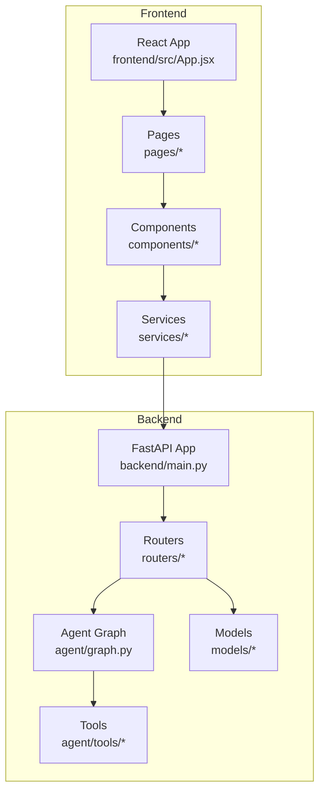
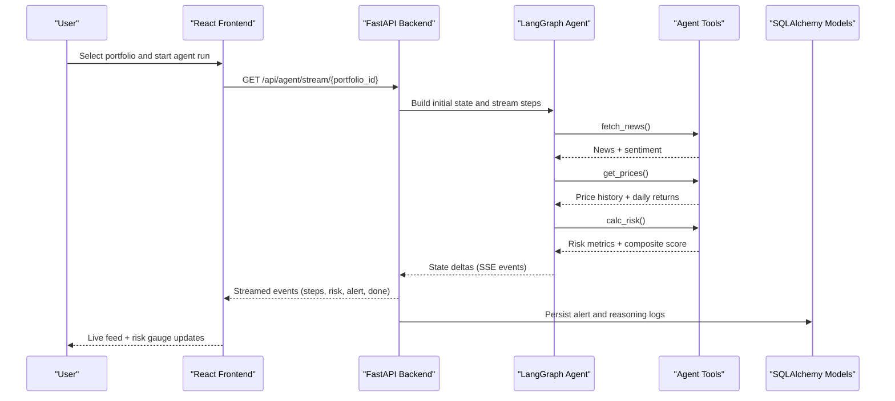
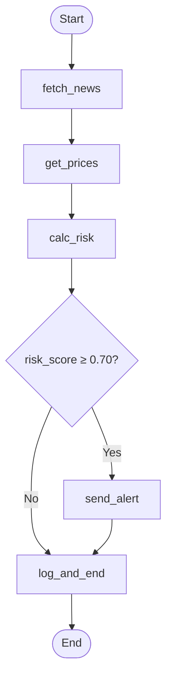
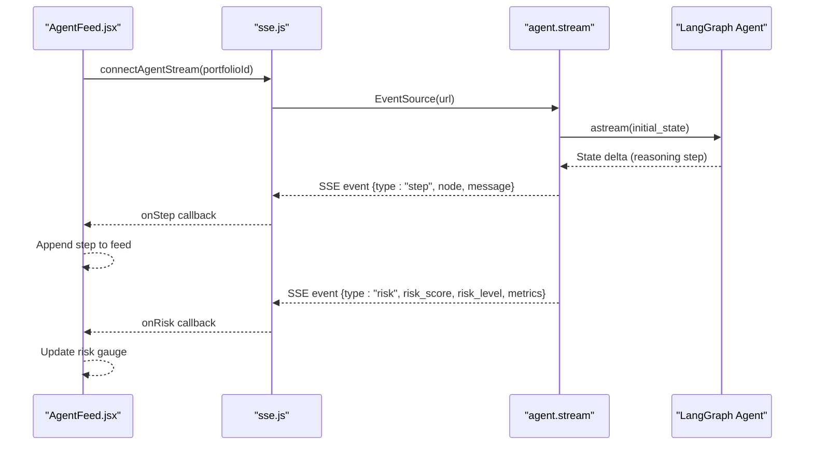
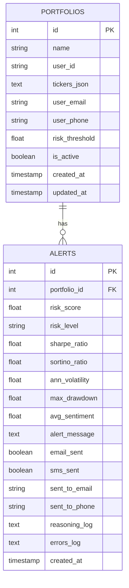
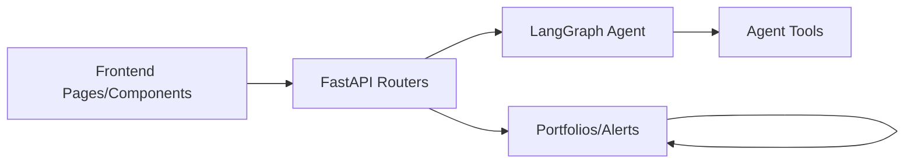

# Introduction and Purpose

<cite>
**Referenced Files in This Document**
- [README.md](file://README.md)
- [backend/main.py](file://backend/main.py)
- [backend/agent/graph.py](file://backend/agent/graph.py)
- [backend/agent/tools/calc_risk.py](file://backend/agent/tools/calc_risk.py)
- [backend/agent/tools/get_prices.py](file://backend/agent/tools/get_prices.py)
- [backend/routers/agent.py](file://backend/routers/agent.py)
- [backend/routers/portfolio.py](file://backend/routers/portfolio.py)
- [backend/models/portfolio.py](file://backend/models/portfolio.py)
- [backend/models/alert.py](file://backend/models/alert.py)
- [frontend/src/App.jsx](file://frontend/src/App.jsx)
- [frontend/src/pages/LiveAgent.jsx](file://frontend/src/pages/LiveAgent.jsx)
- [frontend/src/components/AgentFeed.jsx](file://frontend/src/components/AgentFeed.jsx)
- [frontend/src/components/RiskGauge.jsx](file://frontend/src/components/RiskGauge.jsx)
- [frontend/src/services/sse.js](file://frontend/src/services/sse.js)
</cite>

## Table of Contents
1. [Introduction](#introduction)
2. [Project Structure](#project-structure)
3. [Core Components](#core-components)
4. [Architecture Overview](#architecture-overview)
5. [Detailed Component Analysis](#detailed-component-analysis)
6. [Dependency Analysis](#dependency-analysis)
7. [Performance Considerations](#performance-considerations)
8. [Troubleshooting Guide](#troubleshooting-guide)
9. [Conclusion](#conclusion)

## Introduction

ishwarambare-app is a financial portfolio risk analysis platform designed to democratize sophisticated quantitative risk assessment through AI-powered automation. The platform’s mission is to make complex portfolio risk analysis accessible to everyone—from individual investors seeking clarity to financial advisors and portfolio managers who need powerful yet approachable tools for continuous monitoring and decision-making.

### The Core Problem It Solves

Traditional portfolio risk analysis often requires deep mathematical or programming expertise. Many investors struggle to interpret Sharpe ratios, Sortino ratios, volatility, and drawdown metrics without understanding the underlying computations. This platform bridges that gap by combining structured numerical computation with transparent, real-time AI-driven reasoning. Users can configure a portfolio, trigger an automated analysis, and receive a composite risk score along with actionable insights—all without writing code or performing complex calculations themselves.

### Unique Value Proposition

The platform uniquely combines:
- LangGraph AI agent workflows that orchestrate multi-step reasoning across data fetching, pricing analytics, and risk scoring
- Real-time streaming visualization that turns abstract financial metrics into intuitive, live feedback

This combination transforms risk analysis from a static report into a dynamic, observable process that is both technically robust and visually engaging.

### Target Audience

- Individual investors: Need simple, trustworthy tools to monitor their holdings and understand risk without needing advanced finance education
- Financial advisors: Require efficient, repeatable workflows to assess client portfolios and provide timely recommendations
- Portfolio managers: Demand scalable, automated risk monitoring with clear, real-time dashboards and alerting mechanisms

### Typical User Scenarios

- Portfolio setup: Create a portfolio with ticker weights, optionally linking contact preferences for alerts
- Risk monitoring: Trigger a live agent run and watch the reasoning feed unfold in real time while a risk gauge updates dynamically
- Decision-making support: Receive composite risk scores and ratio metrics to guide rebalancing, hedging, or exit decisions

### How It Fits Into the FinTech Ecosystem

Within the fintech landscape, ishwarambare-app sits at the intersection of:
- Quantitative risk analytics (Sharpe, Sortino, volatility, drawdown)
- AI agent orchestration (LangGraph)
- Real-time user experience (SSE streaming + visualizations)

It complements existing trading platforms by offering a dedicated, automated risk assessment layer that can be integrated into broader investment workflows.

### Technical Sophistication Meets User-Friendly Design

The platform balances technical depth with accessibility:
- Behind the scenes, precise financial computations are performed using NumPy and structured thresholds
- In front-end, users see a live feed of reasoning steps, a radial risk gauge, and summarized metrics—making complex analysis approachable and transparent

## Project Structure

The repository follows a clear separation of concerns:
- Backend: FastAPI application exposing REST endpoints and SSE streaming for agent runs
- Agent: LangGraph-based workflow orchestrating tools for news sentiment, price history, and risk calculation
- Models: SQLAlchemy ORM for portfolios and alerts
- Frontend: React application with real-time streaming and visualization components

**Diagram sources**
- [backend/main.py:12-59](file://backend/main.py#L12-L59)
- [backend/agent/graph.py:162-203](file://backend/agent/graph.py#L162-L203)
- [backend/routers/agent.py:39-242](file://backend/routers/agent.py#L39-L242)
- [backend/models/portfolio.py:16-63](file://backend/models/portfolio.py#L16-L63)
- [backend/models/alert.py:14-77](file://backend/models/alert.py#L14-L77)
- [frontend/src/App.jsx:8-20](file://frontend/src/App.jsx#L8-L20)

**Section sources**
- [README.md:5-25](file://README.md#L5-L25)
- [backend/main.py:12-59](file://backend/main.py#L12-L59)
- [frontend/src/App.jsx:8-20](file://frontend/src/App.jsx#L8-L20)

## Core Components

- Agent Graph: Defines the LangGraph workflow that orchestrates nodes for news fetching, price retrieval, risk calculation, conditional alerting, and logging
- Tools: Specialized functions for computing Sharpe/Sorino ratios, annualized volatility, max drawdown, and constructing a composite risk score
- Routers: Expose REST endpoints for portfolio management and agent runs, including SSE streaming for live updates
- Models: Persist portfolio configurations and alert outcomes with reasoning logs and error traces
- Frontend: Provides real-time visualization of agent reasoning and risk metrics via streaming and charts

These components collectively enable a seamless user experience where complex financial analysis is automated, observable, and actionable.

**Section sources**
- [backend/agent/graph.py:45-140](file://backend/agent/graph.py#L45-L140)
- [backend/agent/tools/calc_risk.py:149-255](file://backend/agent/tools/calc_risk.py#L149-L255)
- [backend/agent/tools/get_prices.py:84-139](file://backend/agent/tools/get_prices.py#L84-L139)
- [backend/routers/agent.py:39-242](file://backend/routers/agent.py#L39-L242)
- [backend/models/portfolio.py:16-63](file://backend/models/portfolio.py#L16-L63)
- [backend/models/alert.py:14-77](file://backend/models/alert.py#L14-L77)
- [frontend/src/components/AgentFeed.jsx:28-175](file://frontend/src/components/AgentFeed.jsx#L28-L175)
- [frontend/src/components/RiskGauge.jsx:20-101](file://frontend/src/components/RiskGauge.jsx#L20-L101)

## Architecture Overview

The platform’s architecture integrates a backend API with a LangGraph agent and a React frontend that streams updates in real time.

**Diagram sources**
- [backend/routers/agent.py:39-168](file://backend/routers/agent.py#L39-L168)
- [backend/agent/graph.py:162-203](file://backend/agent/graph.py#L162-L203)
- [backend/agent/tools/get_prices.py:84-139](file://backend/agent/tools/get_prices.py#L84-L139)
- [backend/agent/tools/calc_risk.py:149-255](file://backend/agent/tools/calc_risk.py#L149-L255)
- [backend/models/alert.py:14-77](file://backend/models/alert.py#L14-L77)

## Detailed Component Analysis

### Agent Workflow and Tools

The agent workflow is a linear pipeline with a conditional branch:
- fetch_news → get_prices → calc_risk
- Conditional edge: if composite risk score exceeds a threshold, route to send_alert; otherwise log_and_end

**Diagram sources**
- [backend/agent/graph.py:146-156](file://backend/agent/graph.py#L146-L156)
- [backend/agent/graph.py:174-197](file://backend/agent/graph.py#L174-L197)

Key tool behaviors:
- get_prices: Downloads 1-year price history for each ticker, computes daily returns, and falls back to synthetic data when necessary
- calc_risk: Computes Sharpe, Sortino, annualized volatility, and max drawdown; builds a composite risk score and determines risk level

**Section sources**
- [backend/agent/graph.py:45-140](file://backend/agent/graph.py#L45-L140)
- [backend/agent/tools/get_prices.py:84-139](file://backend/agent/tools/get_prices.py#L84-L139)
- [backend/agent/tools/calc_risk.py:149-255](file://backend/agent/tools/calc_risk.py#L149-L255)

### Real-Time Streaming and Visualization

The backend exposes an SSE endpoint that streams agent state updates to the frontend. The frontend renders:
- A live reasoning feed showing each step as it occurs
- A radial risk gauge reflecting the composite risk score and level
- Summary metrics (Sharpe, Sortino, annualized volatility, max drawdown)

**Diagram sources**
- [frontend/src/components/AgentFeed.jsx:28-175](file://frontend/src/components/AgentFeed.jsx#L28-L175)
- [frontend/src/services/sse.js:21-62](file://frontend/src/services/sse.js#L21-L62)
- [backend/routers/agent.py:39-168](file://backend/routers/agent.py#L39-L168)

**Section sources**
- [frontend/src/components/AgentFeed.jsx:28-175](file://frontend/src/components/AgentFeed.jsx#L28-L175)
- [frontend/src/components/RiskGauge.jsx:20-101](file://frontend/src/components/RiskGauge.jsx#L20-L101)
- [frontend/src/services/sse.js:21-62](file://frontend/src/services/sse.js#L21-L62)
- [backend/routers/agent.py:39-168](file://backend/routers/agent.py#L39-L168)

### Portfolio and Alert Persistence

Portfolios store ticker weights, user contact preferences, and risk thresholds. Alerts capture the final risk snapshot, delivered metrics, reasoning logs, and error traces.

**Diagram sources**
- [backend/models/portfolio.py:16-63](file://backend/models/portfolio.py#L16-L63)
- [backend/models/alert.py:14-77](file://backend/models/alert.py#L14-L77)

**Section sources**
- [backend/models/portfolio.py:16-63](file://backend/models/portfolio.py#L16-L63)
- [backend/models/alert.py:14-77](file://backend/models/alert.py#L14-L77)
- [backend/routers/portfolio.py:50-124](file://backend/routers/portfolio.py#L50-L124)

## Dependency Analysis

The system exhibits clear layering:
- Frontend depends on backend APIs and SSE streaming
- Backend depends on LangGraph for orchestration and SQLAlchemy for persistence
- Agent tools encapsulate financial computations and are invoked by the graph

**Diagram sources**
- [frontend/src/pages/LiveAgent.jsx:15-95](file://frontend/src/pages/LiveAgent.jsx#L15-L95)
- [backend/routers/agent.py:39-242](file://backend/routers/agent.py#L39-L242)
- [backend/agent/graph.py:162-203](file://backend/agent/graph.py#L162-L203)
- [backend/models/alert.py:14-77](file://backend/models/alert.py#L14-L77)

**Section sources**
- [frontend/src/pages/LiveAgent.jsx:15-95](file://frontend/src/pages/LiveAgent.jsx#L15-L95)
- [backend/routers/agent.py:39-242](file://backend/routers/agent.py#L39-L242)
- [backend/agent/graph.py:162-203](file://backend/agent/graph.py#L162-L203)
- [backend/models/alert.py:14-77](file://backend/models/alert.py#L14-L77)

## Performance Considerations

- SSE streaming: The backend streams state deltas incrementally, minimizing latency and enabling responsive UI updates
- Asynchronous execution: Agent runs leverage async generators and executor-based persistence to keep the event loop unblocked
- Data fallbacks: When external price data is unavailable, synthetic price generation ensures the pipeline remains functional
- Visualization efficiency: Charts and feeds update only on new events, reducing unnecessary re-renders

## Troubleshooting Guide

Common issues and where to look:
- SSE connection errors: Inspect the frontend EventSource wrapper and backend SSE headers for compatibility
- Missing or invalid portfolio: Verify portfolio creation and selection in the frontend and backend validation
- Risk score anomalies: Review tool-level validations and thresholds in the risk calculation module
- Persistence failures: Confirm database sessions and executor-based writes in the agent router

**Section sources**
- [frontend/src/services/sse.js:21-62](file://frontend/src/services/sse.js#L21-L62)
- [backend/routers/agent.py:39-168](file://backend/routers/agent.py#L39-L168)
- [backend/agent/tools/calc_risk.py:178-202](file://backend/agent/tools/calc_risk.py#L178-L202)
- [backend/routers/agent.py:171-182](file://backend/routers/agent.py#L171-L182)

## Conclusion

ishwarambare-app delivers a practical, AI-powered solution for portfolio risk analysis that is both technically sound and user-friendly. By combining LangGraph workflows with real-time streaming and intuitive visualizations, it empowers users to understand and act on risk without requiring deep quantitative expertise. Whether used for personal investing, advisory practice, or portfolio management, the platform offers a modern, transparent approach to financial risk assessment within the fintech ecosystem.