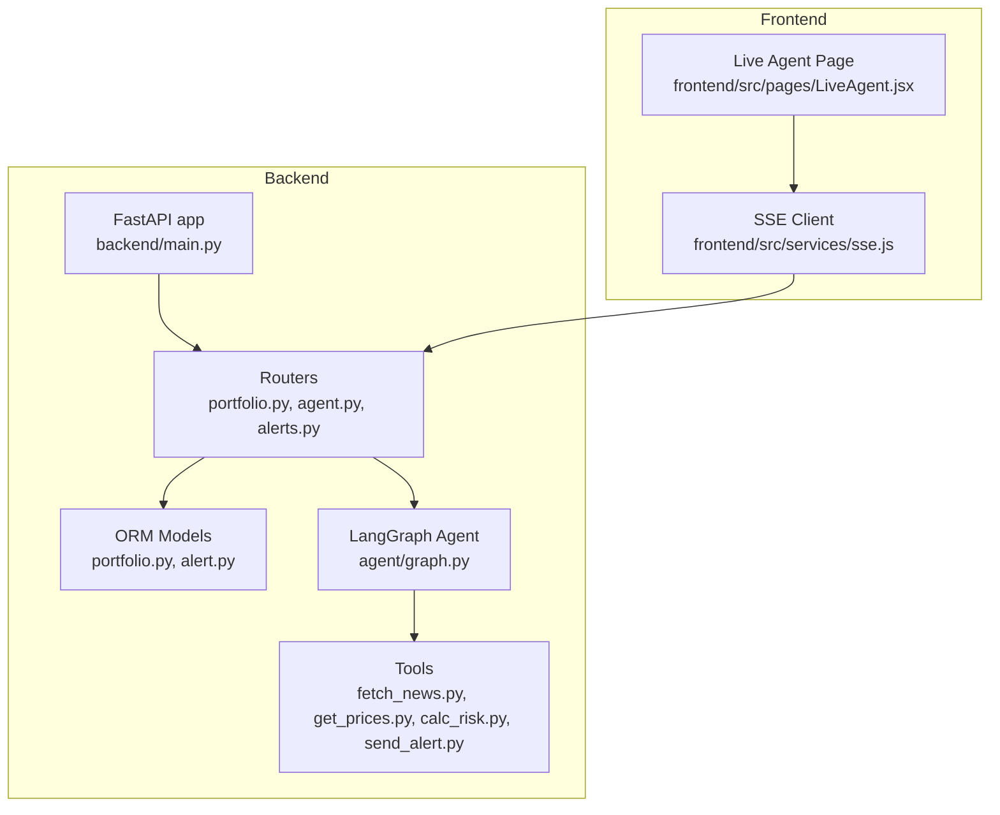
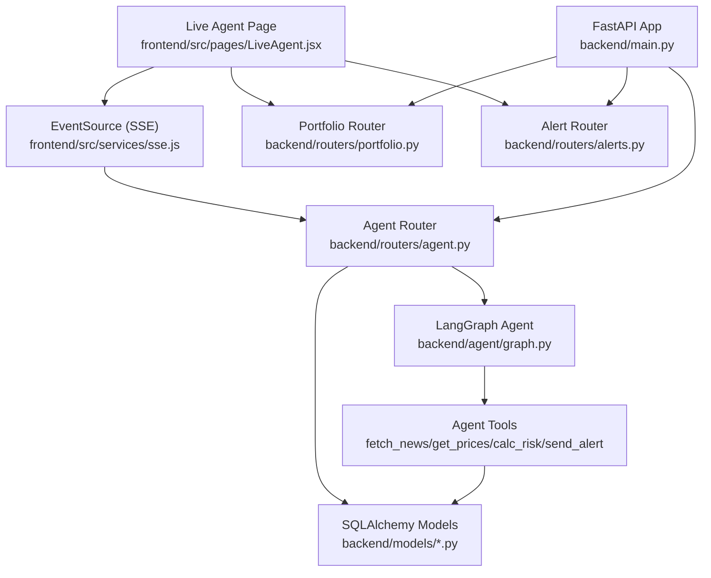
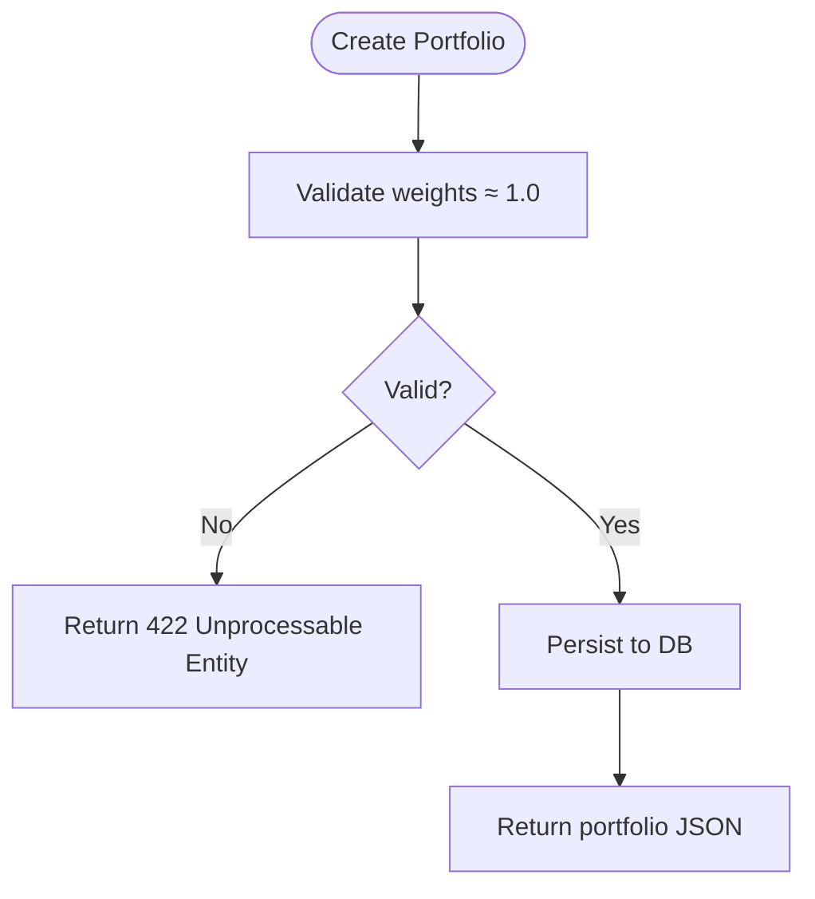
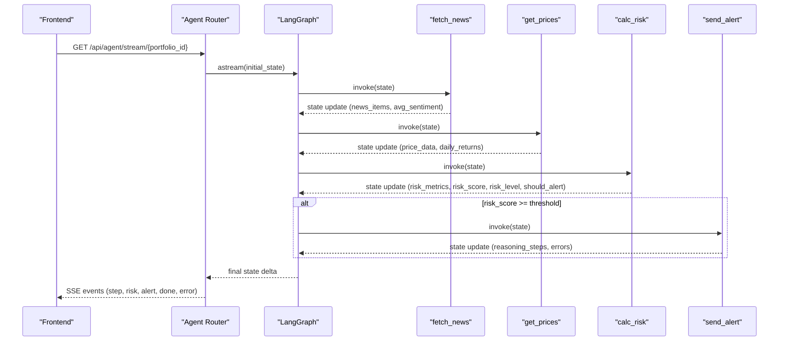
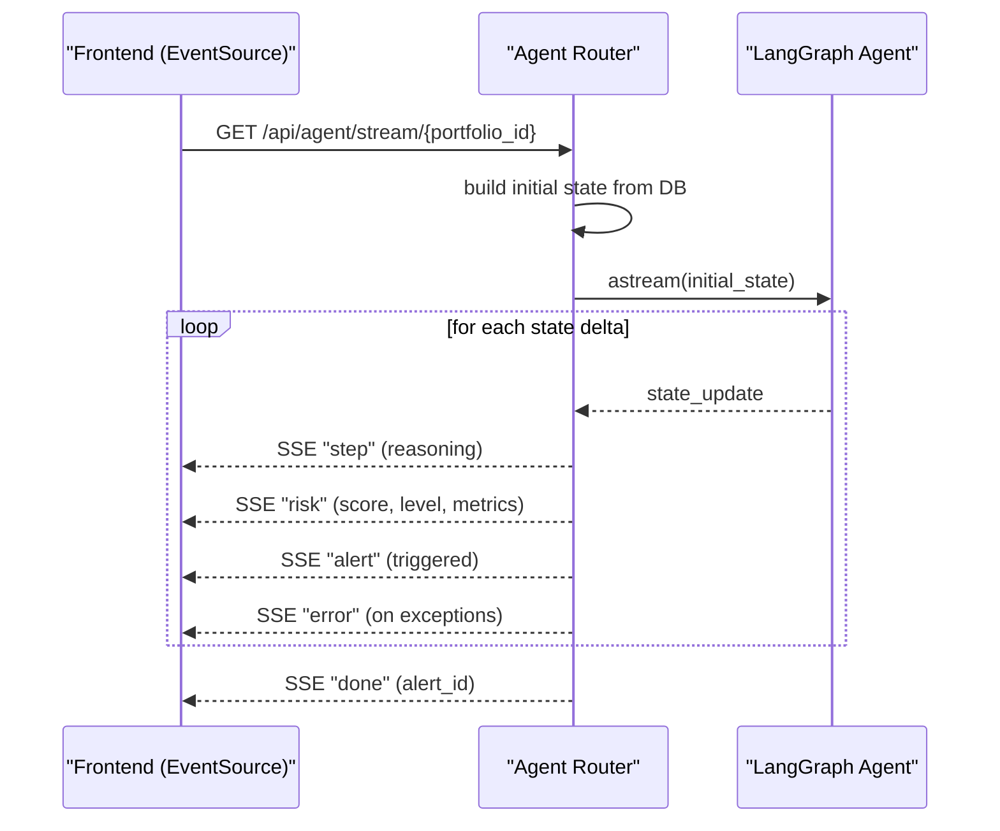
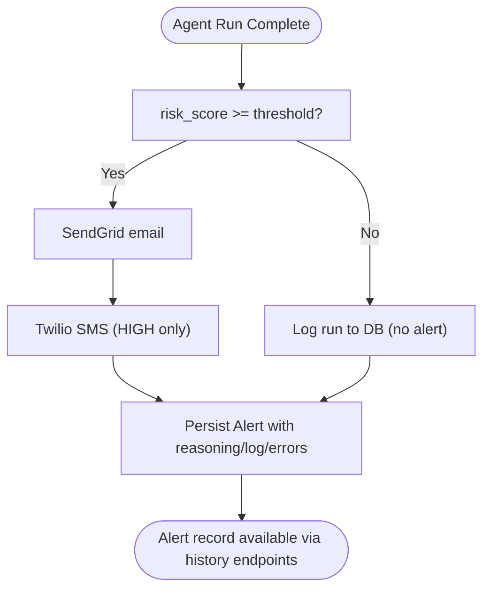
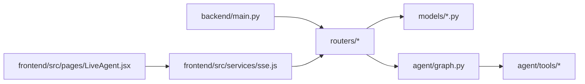

# Key Features and Capabilities

<cite>
**Referenced Files in This Document**
- [backend/main.py](file://backend/main.py)
- [backend/models/portfolio.py](file://backend/models/portfolio.py)
- [backend/models/alert.py](file://backend/models/alert.py)
- [backend/routers/portfolio.py](file://backend/routers/portfolio.py)
- [backend/routers/agent.py](file://backend/routers/agent.py)
- [backend/routers/alerts.py](file://backend/routers/alerts.py)
- [backend/agent/graph.py](file://backend/agent/graph.py)
- [backend/agent/state.py](file://backend/agent/state.py)
- [backend/agent/tools/fetch_news.py](file://backend/agent/tools/fetch_news.py)
- [backend/agent/tools/get_prices.py](file://backend/agent/tools/get_prices.py)
- [backend/agent/tools/calc_risk.py](file://backend/agent/tools/calc_risk.py)
- [backend/agent/tools/send_alert.py](file://backend/agent/tools/send_alert.py)
- [frontend/src/services/sse.js](file://frontend/src/services/sse.js)
- [frontend/src/pages/LiveAgent.jsx](file://frontend/src/pages/LiveAgent.jsx)
</cite>

## Table of Contents
1. [Introduction](#introduction)
2. [Project Structure](#project-structure)
3. [Core Components](#core-components)
4. [Architecture Overview](#architecture-overview)
5. [Detailed Component Analysis](#detailed-component-analysis)
6. [Dependency Analysis](#dependency-analysis)
7. [Performance Considerations](#performance-considerations)
8. [Troubleshooting Guide](#troubleshooting-guide)
9. [Conclusion](#conclusion)
10. [Appendices](#appendices)

## Introduction
This document presents the key features and capabilities of the ishwarambare-app platform, focusing on:
- Portfolio management with CRUD operations, ticker weight management, and portfolio selection interfaces
- An AI-powered risk analysis engine built on LangGraph state machines
- Real-time streaming via Server-Sent Events (SSE) for live agent execution visualization and interactive risk updates
- An alert system with configurable risk thresholds and multi-channel notifications
- Historical tracking and audit trails for complete transparency of agent runs and decisions
- Practical usage examples demonstrating how users can create portfolios, trigger risk analysis, monitor results in real time, and manage alerts
- Integration between frontend components and backend services for a cohesive user experience

## Project Structure
The platform is organized into a FastAPI backend and a Vite/React frontend:
- Backend exposes REST endpoints for portfolios, agent runs, and alerts, and hosts the LangGraph agent
- Frontend consumes SSE for live updates and integrates with portfolio and alert APIs

**Diagram sources**
- [backend/main.py:12-59](file://backend/main.py#L12-L59)
- [backend/routers/portfolio.py:1-124](file://backend/routers/portfolio.py#L1-L124)
- [backend/routers/agent.py:1-243](file://backend/routers/agent.py#L1-L243)
- [backend/routers/alerts.py:1-84](file://backend/routers/alerts.py#L1-L84)
- [backend/models/portfolio.py:16-63](file://backend/models/portfolio.py#L16-L63)
- [backend/models/alert.py:14-77](file://backend/models/alert.py#L14-L77)
- [backend/agent/graph.py:162-204](file://backend/agent/graph.py#L162-L204)
- [backend/agent/tools/fetch_news.py:99-164](file://backend/agent/tools/fetch_news.py#L99-L164)
- [backend/agent/tools/get_prices.py:84-139](file://backend/agent/tools/get_prices.py#L84-L139)
- [backend/agent/tools/calc_risk.py:149-255](file://backend/agent/tools/calc_risk.py#L149-L255)
- [backend/agent/tools/send_alert.py:157-231](file://backend/agent/tools/send_alert.py#L157-L231)
- [frontend/src/services/sse.js:19-63](file://frontend/src/services/sse.js#L19-L63)
- [frontend/src/pages/LiveAgent.jsx:15-95](file://frontend/src/pages/LiveAgent.jsx#L15-L95)

**Section sources**
- [backend/main.py:12-59](file://backend/main.py#L12-L59)
- [backend/routers/portfolio.py:1-124](file://backend/routers/portfolio.py#L1-L124)
- [backend/routers/agent.py:1-243](file://backend/routers/agent.py#L1-L243)
- [backend/routers/alerts.py:1-84](file://backend/routers/alerts.py#L1-L84)
- [backend/models/portfolio.py:16-63](file://backend/models/portfolio.py#L16-L63)
- [backend/models/alert.py:14-77](file://backend/models/alert.py#L14-L77)
- [backend/agent/graph.py:162-204](file://backend/agent/graph.py#L162-L204)
- [frontend/src/services/sse.js:19-63](file://frontend/src/services/sse.js#L19-L63)
- [frontend/src/pages/LiveAgent.jsx:15-95](file://frontend/src/pages/LiveAgent.jsx#L15-L95)

## Core Components
- Portfolio Management
  - Create, list, update, and delete portfolios with ticker-weight mappings
  - Validation ensures weights approximately sum to 1.0
  - Stores user contact and risk threshold for alerts
- AI-Powered Risk Analysis Engine
  - LangGraph StateGraph with four nodes: fetch news → get prices → calculate risk → conditional alert
  - Deterministic routing based on composite risk score
  - Rich audit trail and error logs streamed via SSE
- Real-Time Streaming (SSE)
  - Live agent execution visualization and risk updates
  - Event types: step, risk, alert, done, error
- Alert System
  - Configurable risk thresholds per portfolio
  - Multi-channel delivery: Email (SendGrid) and SMS (Twilio) for HIGH risk
  - Historical alert records with reasoning logs and metrics
- Historical Tracking and Audit Trail
  - Complete run logs and error traces persisted for transparency
  - Alert history endpoints for review and statistics

**Section sources**
- [backend/routers/portfolio.py:56-123](file://backend/routers/portfolio.py#L56-L123)
- [backend/models/portfolio.py:16-63](file://backend/models/portfolio.py#L16-L63)
- [backend/agent/graph.py:45-156](file://backend/agent/graph.py#L45-L156)
- [backend/routers/agent.py:39-168](file://backend/routers/agent.py#L39-L168)
- [backend/agent/tools/send_alert.py:157-231](file://backend/agent/tools/send_alert.py#L157-L231)
- [backend/models/alert.py:14-77](file://backend/models/alert.py#L14-L77)
- [backend/routers/alerts.py:22-84](file://backend/routers/alerts.py#L22-L84)

## Architecture Overview
The system integrates frontend and backend as follows:
- Frontend connects to SSE for live agent updates
- Frontend triggers agent runs and lists portfolios/alerts via REST endpoints
- Backend orchestrates the LangGraph agent, computes risk metrics, and persists results

**Diagram sources**
- [backend/main.py:12-59](file://backend/main.py#L12-L59)
- [backend/routers/portfolio.py:1-124](file://backend/routers/portfolio.py#L1-L124)
- [backend/routers/agent.py:1-243](file://backend/routers/agent.py#L1-L243)
- [backend/routers/alerts.py:1-84](file://backend/routers/alerts.py#L1-L84)
- [backend/models/portfolio.py:16-63](file://backend/models/portfolio.py#L16-L63)
- [backend/models/alert.py:14-77](file://backend/models/alert.py#L14-L77)
- [backend/agent/graph.py:162-204](file://backend/agent/graph.py#L162-L204)
- [backend/agent/tools/fetch_news.py:99-164](file://backend/agent/tools/fetch_news.py#L99-L164)
- [backend/agent/tools/get_prices.py:84-139](file://backend/agent/tools/get_prices.py#L84-L139)
- [backend/agent/tools/calc_risk.py:149-255](file://backend/agent/tools/calc_risk.py#L149-L255)
- [backend/agent/tools/send_alert.py:157-231](file://backend/agent/tools/send_alert.py#L157-L231)
- [frontend/src/services/sse.js:19-63](file://frontend/src/services/sse.js#L19-L63)
- [frontend/src/pages/LiveAgent.jsx:15-95](file://frontend/src/pages/LiveAgent.jsx#L15-L95)

## Detailed Component Analysis

### Portfolio Management System
- CRUD Operations
  - List: Retrieve all portfolios ordered by creation date
  - Create: Validate weights approximately sum to 1.0; store name, tickers, optional contact, and risk threshold
  - Update: Modify name, tickers, contact, threshold, and activation flag
  - Delete: Remove a portfolio by ID
- Ticker Weight Management
  - Tickers stored as JSON mapping ticker to weight
  - Helper property converts JSON to dict and vice versa
- Portfolio Selection Interfaces
  - Live Agent page allows selecting a portfolio for real-time analysis

**Diagram sources**
- [backend/routers/portfolio.py:56-77](file://backend/routers/portfolio.py#L56-L77)
- [backend/models/portfolio.py:38-48](file://backend/models/portfolio.py#L38-L48)

**Section sources**
- [backend/routers/portfolio.py:50-123](file://backend/routers/portfolio.py#L50-L123)
- [backend/models/portfolio.py:16-63](file://backend/models/portfolio.py#L16-L63)
- [frontend/src/pages/LiveAgent.jsx:40-50](file://frontend/src/pages/LiveAgent.jsx#L40-L50)

### AI-Powered Risk Analysis Engine (LangGraph)
- Four-Node Workflow
  - fetch_news: Retrieve headlines and compute average sentiment
  - get_prices: Download 1-year price history and daily returns
  - calc_risk: Compute Sharpe/Sortino ratios, volatility, drawdown, and composite risk score
  - send_alert: Conditional alert dispatch for HIGH risk
- State Machine and Streaming
  - TypedDict AgentState flows through nodes
  - Conditional edge routes based on risk score threshold
  - Graph supports streaming via astream() for SSE-ready deltas
- Deterministic Routing
  - Risk score threshold determines whether to send alert or log and end

**Diagram sources**
- [backend/routers/agent.py:39-168](file://backend/routers/agent.py#L39-L168)
- [backend/agent/graph.py:162-204](file://backend/agent/graph.py#L162-L204)
- [backend/agent/tools/fetch_news.py:99-164](file://backend/agent/tools/fetch_news.py#L99-L164)
- [backend/agent/tools/get_prices.py:84-139](file://backend/agent/tools/get_prices.py#L84-L139)
- [backend/agent/tools/calc_risk.py:149-255](file://backend/agent/tools/calc_risk.py#L149-L255)
- [backend/agent/tools/send_alert.py:157-231](file://backend/agent/tools/send_alert.py#L157-L231)

**Section sources**
- [backend/agent/graph.py:45-156](file://backend/agent/graph.py#L45-L156)
- [backend/agent/state.py:28-58](file://backend/agent/state.py#L28-L58)
- [backend/routers/agent.py:39-168](file://backend/routers/agent.py#L39-L168)

### Real-Time Streaming with Server-Sent Events (SSE)
- SSE Endpoint
  - Streams agent reasoning steps, risk metrics, alert decision, and completion
  - Emits structured events with type and payload
- Frontend Integration
  - EventSource wrapper handles connection lifecycle and event routing
  - Live Agent page displays agent feed and risk gauge synchronized with SSE

**Diagram sources**
- [backend/routers/agent.py:39-168](file://backend/routers/agent.py#L39-L168)
- [frontend/src/services/sse.js:21-62](file://frontend/src/services/sse.js#L21-L62)

**Section sources**
- [backend/routers/agent.py:39-168](file://backend/routers/agent.py#L39-L168)
- [frontend/src/services/sse.js:19-63](file://frontend/src/services/sse.js#L19-L63)
- [frontend/src/pages/LiveAgent.jsx:15-95](file://frontend/src/pages/LiveAgent.jsx#L15-L95)

### Alert System and Historical Tracking
- Configurable Risk Thresholds
  - Each portfolio stores a risk threshold; alerts trigger when risk score meets/exceeds threshold
- Multi-Channel Notification Delivery
  - Email via SendGrid; SMS via Twilio for HIGH risk
  - Mock mode logs alert details when credentials are missing
- Historical Tracking and Audit Trail
  - Alerts persist risk metrics, reasoning logs, and errors
  - Alert history endpoints support listing, filtering, and statistics

**Diagram sources**
- [backend/agent/tools/send_alert.py:157-231](file://backend/agent/tools/send_alert.py#L157-L231)
- [backend/routers/agent.py:128-159](file://backend/routers/agent.py#L128-L159)
- [backend/models/alert.py:14-77](file://backend/models/alert.py#L14-L77)
- [backend/routers/alerts.py:22-84](file://backend/routers/alerts.py#L22-L84)

**Section sources**
- [backend/models/portfolio.py:29](file://backend/models/portfolio.py#L29)
- [backend/agent/tools/send_alert.py:157-231](file://backend/agent/tools/send_alert.py#L157-L231)
- [backend/routers/agent.py:128-159](file://backend/routers/agent.py#L128-L159)
- [backend/models/alert.py:14-77](file://backend/models/alert.py#L14-L77)
- [backend/routers/alerts.py:22-84](file://backend/routers/alerts.py#L22-L84)

### Practical Usage Examples
- Create a Portfolio
  - Use the portfolio creation endpoint with a ticker-weight mapping that approximately sums to 1.0
  - Optionally set user email, phone, and risk threshold
  - Reference: [backend/routers/portfolio.py:56-77](file://backend/routers/portfolio.py#L56-L77)
- Initiate Risk Analysis
  - Trigger a live run via SSE or a synchronous run endpoint
  - Select a portfolio from the Live Agent page and watch real-time updates
  - References:
    - [backend/routers/agent.py:39-168](file://backend/routers/agent.py#L39-L168)
    - [frontend/src/pages/LiveAgent.jsx:40-50](file://frontend/src/pages/LiveAgent.jsx#L40-L50)
    - [frontend/src/services/sse.js:21-62](file://frontend/src/services/sse.js#L21-L62)
- Monitor Real-Time Results
  - Observe reasoning steps, risk score, and alert decision via SSE events
  - References:
    - [backend/routers/agent.py:94-122](file://backend/routers/agent.py#L94-L122)
    - [frontend/src/services/sse.js:25-51](file://frontend/src/services/sse.js#L25-L51)
- Manage Alerts
  - Review alert history and detailed reasoning logs
  - Adjust portfolio risk threshold to fine-tune alert sensitivity
  - References:
    - [backend/routers/alerts.py:22-56](file://backend/routers/alerts.py#L22-L56)
    - [backend/models/portfolio.py:29](file://backend/models/portfolio.py#L29)

## Dependency Analysis
- Backend Dependencies
  - FastAPI app aggregates routers and middleware
  - ORM models define portfolio and alert schemas
  - Agent depends on tools for fetching news, prices, computing risk, and sending alerts
- Frontend Integration
  - Live Agent page composes portfolio selection and real-time visualization
  - SSE service encapsulates EventSource handling

**Diagram sources**
- [backend/main.py:12-59](file://backend/main.py#L12-L59)
- [backend/routers/portfolio.py:1-124](file://backend/routers/portfolio.py#L1-L124)
- [backend/routers/agent.py:1-243](file://backend/routers/agent.py#L1-L243)
- [backend/routers/alerts.py:1-84](file://backend/routers/alerts.py#L1-L84)
- [backend/models/portfolio.py:16-63](file://backend/models/portfolio.py#L16-L63)
- [backend/models/alert.py:14-77](file://backend/models/alert.py#L14-L77)
- [backend/agent/graph.py:162-204](file://backend/agent/graph.py#L162-L204)
- [frontend/src/services/sse.js:19-63](file://frontend/src/services/sse.js#L19-L63)
- [frontend/src/pages/LiveAgent.jsx:15-95](file://frontend/src/pages/LiveAgent.jsx#L15-L95)

**Section sources**
- [backend/main.py:12-59](file://backend/main.py#L12-L59)
- [backend/agent/graph.py:162-204](file://backend/agent/graph.py#L162-L204)

## Performance Considerations
- SSE Streaming
  - Uses async iteration and small delays for readability; production deployments should tune buffering and network timeouts
- LangGraph Execution
  - Each tool is a pure function; ensure tool calls remain lightweight to keep streaming responsive
- Data Persistence
  - Database writes occur in a thread executor to avoid blocking the async loop
- Network Resilience
  - Tools include fallbacks (mock data) to maintain pipeline continuity under network failures

[No sources needed since this section provides general guidance]

## Troubleshooting Guide
- Portfolio Creation Fails (422)
  - Cause: Weights do not approximately sum to 1.0
  - Action: Adjust ticker weights so their sum falls within the accepted tolerance
  - Reference: [backend/routers/portfolio.py:59-65](file://backend/routers/portfolio.py#L59-L65)
- SSE Disconnection
  - Symptom: Client disconnects mid-run
  - Behavior: Backend logs disconnection and stops streaming
  - Reference: [backend/routers/agent.py:87-89](file://backend/routers/agent.py#L87-L89)
- Agent Run Errors
  - Symptom: Error events emitted via SSE
  - Action: Inspect reasoning logs and errors persisted in alerts
  - References:
    - [backend/routers/agent.py:123-126](file://backend/routers/agent.py#L123-L126)
    - [backend/models/alert.py:46-55](file://backend/models/alert.py#L46-L55)
- Alert Delivery Issues
  - Symptom: Missing email/SMS
  - Causes: Missing credentials or external service errors
  - Action: Verify SendGrid/Twilio configuration; check alert reasoning logs
  - Reference: [backend/agent/tools/send_alert.py:125-155](file://backend/agent/tools/send_alert.py#L125-L155)

**Section sources**
- [backend/routers/portfolio.py:59-65](file://backend/routers/portfolio.py#L59-L65)
- [backend/routers/agent.py:87-89](file://backend/routers/agent.py#L87-L89)
- [backend/routers/agent.py:123-126](file://backend/routers/agent.py#L123-L126)
- [backend/models/alert.py:46-55](file://backend/models/alert.py#L46-L55)
- [backend/agent/tools/send_alert.py:125-155](file://backend/agent/tools/send_alert.py#L125-L155)

## Conclusion
The ishwarambare-app platform delivers a robust, transparent, and real-time portfolio risk analysis solution:
- Portfolio management with strict weight validation and flexible configuration
- A deterministic, interpretable AI agent powered by LangGraph that combines quantitative metrics with sentiment-driven insights
- Live visualization of agent reasoning and risk updates via SSE
- Configurable, multi-channel alerting with comprehensive audit trails
- Seamless frontend-backend integration enabling intuitive user experiences

[No sources needed since this section summarizes without analyzing specific files]

## Appendices
- API Endpoints Overview
  - Portfolios: list, create, get, update, delete
  - Agent: stream (SSE), run (sync), status
  - Alerts: list, detail, portfolio-specific, stats
- Frontend Pages
  - Live Agent page integrates portfolio selection with real-time agent visualization

[No sources needed since this section provides general guidance]