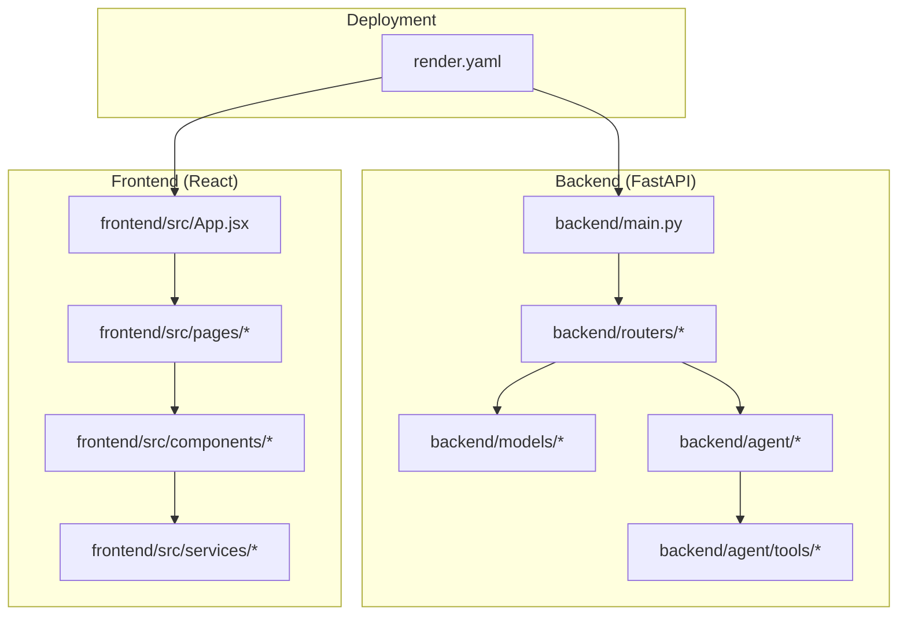
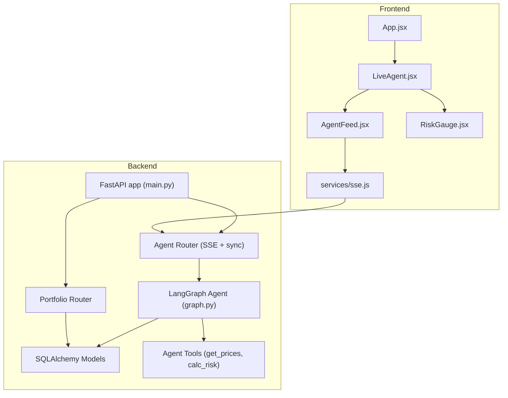
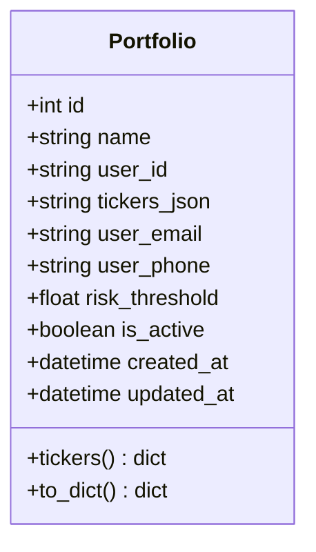
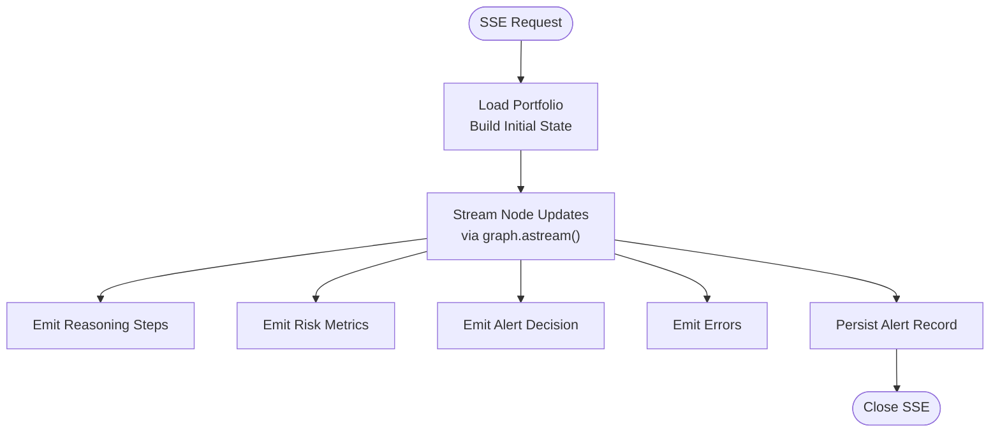
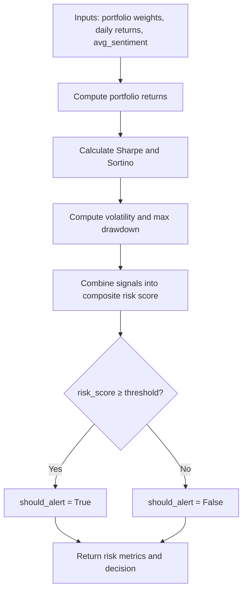
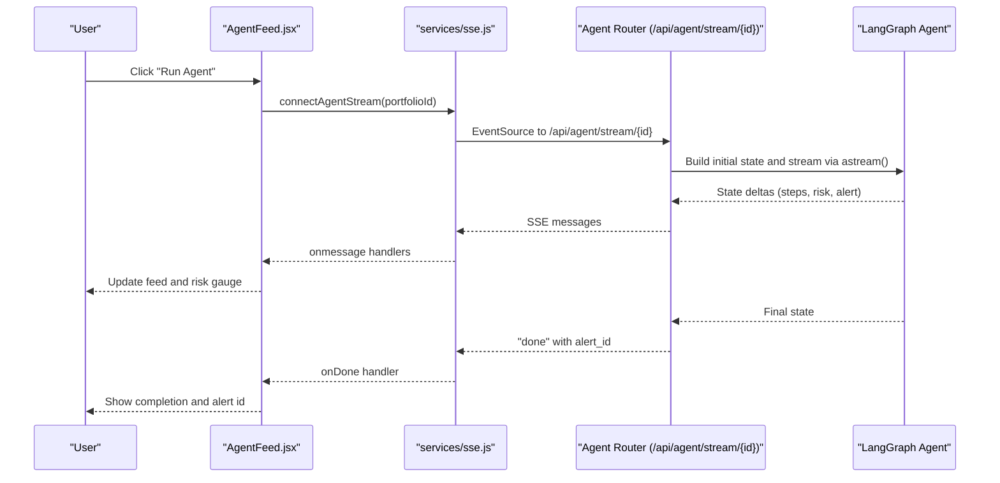
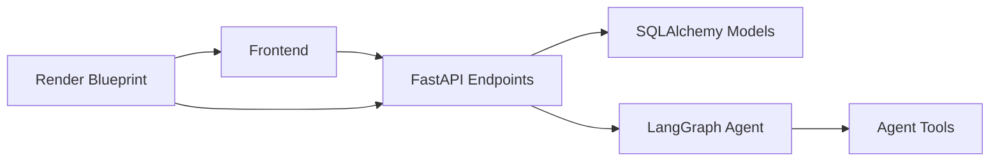

# Project Overview

<cite>
**Referenced Files in This Document**
- [README.md](file://README.md)
- [backend/main.py](file://backend/main.py)
- [backend/routers/portfolio.py](file://backend/routers/portfolio.py)
- [backend/routers/agent.py](file://backend/routers/agent.py)
- [backend/agent/graph.py](file://backend/agent/graph.py)
- [backend/agent/state.py](file://backend/agent/state.py)
- [backend/agent/tools/calc_risk.py](file://backend/agent/tools/calc_risk.py)
- [backend/agent/tools/get_prices.py](file://backend/agent/tools/get_prices.py)
- [backend/models/portfolio.py](file://backend/models/portfolio.py)
- [frontend/src/App.jsx](file://frontend/src/App.jsx)
- [frontend/src/pages/LiveAgent.jsx](file://frontend/src/pages/LiveAgent.jsx)
- [frontend/src/components/AgentFeed.jsx](file://frontend/src/components/AgentFeed.jsx)
- [frontend/src/components/RiskGauge.jsx](file://frontend/src/components/RiskGauge.jsx)
- [frontend/src/services/sse.js](file://frontend/src/services/sse.js)
- [render.yaml](file://render.yaml)
</cite>

## Table of Contents
1. [Introduction](#introduction)
2. [Project Structure](#project-structure)
3. [Core Components](#core-components)
4. [Architecture Overview](#architecture-overview)
5. [Detailed Component Analysis](#detailed-component-analysis)
6. [Dependency Analysis](#dependency-analysis)
7. [Performance Considerations](#performance-considerations)
8. [Troubleshooting Guide](#troubleshooting-guide)
9. [Conclusion](#conclusion)
10. [Appendices](#appendices)

## Introduction
ishwarambare-app is a full-stack financial portfolio risk analysis platform designed to help investors automate portfolio risk assessment. It combines a FastAPI backend with a React frontend to deliver a modern, real-time financial analysis experience. At its core, the platform executes a LangGraph agent workflow to perform portfolio risk analysis, emitting structured, streaming updates via server-sent events (SSE) to power a live, interactive user interface.

The platform’s value proposition centers on:
- Automated portfolio risk assessment using quantitative metrics (Sharpe, Sortino ratios, volatility, drawdown) combined with sentiment analysis from financial news.
- Real-time visibility into the agent’s reasoning process through SSE streaming, enabling investors to observe each step of the portfolio risk analysis.
- Practical, beginner-friendly guidance alongside advanced technical implementation details for developers.

The system fits into the broader financial technology (FinTech) ecosystem by integrating:
- REST APIs for portfolio lifecycle management.
- SSE streaming for real-time dashboards and alerts.
- Modular, extensible agent workflows suitable for future enhancements such as Retrieval-Augmented Generation (RAG) integrations.

## Project Structure
The repository is organized into two primary directories:
- backend: FastAPI application with routers, models, agent workflow, and tools.
- frontend: React application with routing, pages, components, and SSE client utilities.

**Diagram sources**
- [backend/main.py:1-59](file://backend/main.py#L1-L59)
- [frontend/src/App.jsx:1-21](file://frontend/src/App.jsx#L1-L21)
- [render.yaml:1-48](file://render.yaml#L1-L48)

**Section sources**
- [README.md:5-25](file://README.md#L5-L25)
- [backend/main.py:12-44](file://backend/main.py#L12-L44)
- [frontend/src/App.jsx:8-20](file://frontend/src/App.jsx#L8-L20)

## Core Components
- FastAPI Application: Defines the API surface, middleware, and router registration. It exposes endpoints for portfolio management, agent execution, and alerts.
- Portfolio Model and Router: Manages portfolio creation, updates, retrieval, and deletion with validation for weights and risk thresholds.
- LangGraph Agent Workflow: Orchestrates a four-node pipeline (fetch news → get prices → calculate risk → conditional alert) and streams state deltas via SSE.
- SSE Client (React): Connects to the backend via EventSource to render live agent reasoning, risk metrics, and alerts.
- Deployment Blueprint: Automates building and serving the backend and frontend on Render.

Practical examples:
- Portfolio setup: Create a portfolio with ticker weights that sum approximately to 1.0; optionally configure email and phone for alerts.
- Risk assessment: Trigger a live agent run to compute Sharpe, Sortino ratios, volatility, and drawdown; watch the reasoning feed and risk gauge update in real time.
- Real-time monitoring: Use the dedicated Live Agent page to select a portfolio and observe streaming updates until completion.

**Section sources**
- [backend/routers/portfolio.py:27-77](file://backend/routers/portfolio.py#L27-L77)
- [backend/models/portfolio.py:16-62](file://backend/models/portfolio.py#L16-L62)
- [backend/agent/graph.py:45-121](file://backend/agent/graph.py#L45-L121)
- [backend/routers/agent.py:39-168](file://backend/routers/agent.py#L39-L168)
- [frontend/src/services/sse.js:21-62](file://frontend/src/services/sse.js#L21-L62)

## Architecture Overview
The system architecture integrates a React frontend with a FastAPI backend through REST and SSE. The backend encapsulates portfolio management and the LangGraph agent workflow, which performs quantitative risk analysis and optionally triggers alerts.

**Diagram sources**
- [frontend/src/App.jsx:8-20](file://frontend/src/App.jsx#L8-L20)
- [frontend/src/pages/LiveAgent.jsx:15-94](file://frontend/src/pages/LiveAgent.jsx#L15-L94)
- [frontend/src/components/AgentFeed.jsx:28-174](file://frontend/src/components/AgentFeed.jsx#L28-L174)
- [frontend/src/components/RiskGauge.jsx:20-100](file://frontend/src/components/RiskGauge.jsx#L20-L100)
- [frontend/src/services/sse.js:21-62](file://frontend/src/services/sse.js#L21-L62)
- [backend/main.py:12-44](file://backend/main.py#L12-L44)
- [backend/routers/portfolio.py:50-123](file://backend/routers/portfolio.py#L50-L123)
- [backend/routers/agent.py:39-242](file://backend/routers/agent.py#L39-L242)
- [backend/agent/graph.py:162-203](file://backend/agent/graph.py#L162-L203)
- [backend/agent/tools/get_prices.py:84-138](file://backend/agent/tools/get_prices.py#L84-L138)
- [backend/agent/tools/calc_risk.py:149-254](file://backend/agent/tools/calc_risk.py#L149-L254)

## Detailed Component Analysis

### Backend: Portfolio Management
- Responsibilities: Create, list, update, and delete portfolios; validate that weights sum approximately to 1.0; persist user contact and risk threshold.
- Data model: Stores portfolio name, user identity, tickers as JSON, and alert preferences; exposes a helper property to parse tickers.
- Validation: Rejects invalid weight distributions with a descriptive 422 error.

**Diagram sources**
- [backend/models/portfolio.py:16-62](file://backend/models/portfolio.py#L16-L62)

**Section sources**
- [backend/routers/portfolio.py:27-123](file://backend/routers/portfolio.py#L27-L123)
- [backend/models/portfolio.py:16-62](file://backend/models/portfolio.py#L16-L62)

### Backend: Agent Workflow and SSE Streaming
- LangGraph StateGraph: Defines a linear pipeline with a conditional edge post-calculation. The graph supports synchronous invocation and streaming via astate iteration.
- SSE Endpoint: Streams structured messages to the client (initialization, reasoning steps, risk metrics, alert decision, completion, and errors).
- Persistence: On completion, the backend persists alert records with computed metrics and contact delivery flags.

**Diagram sources**
- [backend/routers/agent.py:39-168](file://backend/routers/agent.py#L39-L168)
- [backend/agent/graph.py:162-203](file://backend/agent/graph.py#L162-L203)

**Section sources**
- [backend/routers/agent.py:39-242](file://backend/routers/agent.py#L39-L242)
- [backend/agent/graph.py:45-121](file://backend/agent/graph.py#L45-L121)

### Backend: Risk Calculation Tool
- Inputs: Portfolio weights and daily returns; blends average sentiment into the composite risk score.
- Outputs: Sharpe ratio, Sortino ratio, annualized volatility, max drawdown, and a composite risk score mapped to LOW/MEDIUM/HIGH.
- Decision logic: Conditional alert triggered when the composite risk score exceeds a threshold.

**Diagram sources**
- [backend/agent/tools/calc_risk.py:149-254](file://backend/agent/tools/calc_risk.py#L149-L254)

**Section sources**
- [backend/agent/tools/calc_risk.py:149-254](file://backend/agent/tools/calc_risk.py#L149-L254)

### Backend: Price Retrieval Tool
- Data source: Attempts to fetch 1-year historical prices via a third-party library; falls back to synthetic geometric Brownian motion data when unavailable.
- Returns: Daily returns per ticker for downstream risk calculation.

**Section sources**
- [backend/agent/tools/get_prices.py:84-138](file://backend/agent/tools/get_prices.py#L84-L138)

### Frontend: SSE Client and Live Monitoring
- SSE Client: Wraps EventSource to handle start, step, risk, alert, done, and error events.
- Live Agent Page: Allows selecting a portfolio and displays the reasoning feed and a risk gauge.
- Agent Feed: Renders streamed reasoning steps, tracks status, and supports start/stop/reset controls.
- Risk Gauge: Visualizes the composite risk score and key metrics.

**Diagram sources**
- [frontend/src/components/AgentFeed.jsx:41-77](file://frontend/src/components/AgentFeed.jsx#L41-L77)
- [frontend/src/services/sse.js:21-62](file://frontend/src/services/sse.js#L21-L62)
- [backend/routers/agent.py:39-168](file://backend/routers/agent.py#L39-L168)
- [backend/agent/graph.py:162-203](file://backend/agent/graph.py#L162-L203)

**Section sources**
- [frontend/src/services/sse.js:21-62](file://frontend/src/services/sse.js#L21-L62)
- [frontend/src/pages/LiveAgent.jsx:15-94](file://frontend/src/pages/LiveAgent.jsx#L15-L94)
- [frontend/src/components/AgentFeed.jsx:28-174](file://frontend/src/components/AgentFeed.jsx#L28-L174)
- [frontend/src/components/RiskGauge.jsx:20-100](file://frontend/src/components/RiskGauge.jsx#L20-L100)

### Conceptual Overview
For beginners:
- Think of the platform as a “smart assistant” that analyzes your investment mix, considers market conditions and recent news sentiment, and tells you whether your portfolio is risky right now. You can watch it think in real time and receive alerts if risk crosses a threshold you set.

For experienced developers:
- The backend implements a modular LangGraph agent workflow with typed state, deterministic conditional edges, and SSE streaming. The frontend consumes these streams via EventSource and renders a live reasoning feed and risk visualization. The system is designed for scalability and extensibility, with clear separation of concerns between portfolio management, agent orchestration, and presentation.

[No sources needed since this section doesn't analyze specific source files]

## Dependency Analysis
High-level dependencies:
- Frontend depends on the backend’s REST and SSE endpoints.
- Backend depends on SQLAlchemy for persistence, LangGraph for workflow orchestration, and optional third-party libraries for price retrieval.
- Deployment configuration ties the frontend and backend together on Render.

**Diagram sources**
- [backend/main.py:12-44](file://backend/main.py#L12-L44)
- [backend/routers/agent.py:39-242](file://backend/routers/agent.py#L39-L242)
- [backend/agent/graph.py:162-203](file://backend/agent/graph.py#L162-L203)
- [render.yaml:4-43](file://render.yaml#L4-L43)

**Section sources**
- [backend/main.py:12-44](file://backend/main.py#L12-L44)
- [backend/routers/agent.py:39-242](file://backend/routers/agent.py#L39-L242)
- [render.yaml:4-43](file://render.yaml#L4-L43)

## Performance Considerations
- SSE streaming: The backend emits state deltas incrementally and includes a small delay to improve readability; adjust timing for production throughput vs. UX trade-offs.
- Asynchronous persistence: Database writes occur in a thread executor to avoid blocking the async event loop.
- Data retrieval fallback: When external price data is unavailable, synthetic price generation ensures the pipeline remains functional.
- Frontend rendering: Large reasoning feeds can impact DOM performance; consider pagination or virtualization for extended sessions.

[No sources needed since this section provides general guidance]

## Troubleshooting Guide
Common issues and resolutions:
- Portfolio weight validation: Ensure weights sum to approximately 1.0; otherwise, the backend returns a 422 error with guidance.
- SSE connectivity: If the connection drops, the frontend’s error handler notifies and closes the stream; retry by restarting the agent run.
- Missing price data: If external data fetching fails, the system falls back to synthetic price generation; verify network connectivity or environment configuration.
- CORS and origins: Confirm ALLOWED_ORIGINS matches the frontend origin to prevent blocked requests.

**Section sources**
- [backend/routers/portfolio.py:58-65](file://backend/routers/portfolio.py#L58-L65)
- [frontend/src/services/sse.js:54-57](file://frontend/src/services/sse.js#L54-L57)
- [backend/agent/tools/get_prices.py:106-116](file://backend/agent/tools/get_prices.py#L106-L116)
- [backend/main.py:19-30](file://backend/main.py#L19-L30)

## Conclusion
ishwarambare-app delivers a robust, real-time portfolio risk analysis platform that blends quantitative finance with modern web technologies. Its LangGraph agent workflow provides transparent, auditable reasoning, while SSE streaming offers an engaging, live user experience. The modular backend and React frontend enable straightforward extension and deployment, positioning the platform as a strong foundation for further FinTech innovation.

[No sources needed since this section summarizes without analyzing specific files]

## Appendices

### API Reference Overview
- Portfolios: List, create, update, delete portfolios with weight validation and risk threshold configuration.
- Agent: Trigger a live agent run via SSE or a synchronous endpoint; receive structured updates and persisted results.
- Alerts: Historical alert records are persisted with computed metrics and delivery flags.

**Section sources**
- [backend/routers/portfolio.py:50-123](file://backend/routers/portfolio.py#L50-L123)
- [backend/routers/agent.py:39-242](file://backend/routers/agent.py#L39-L242)
- [backend/models/portfolio.py:16-62](file://backend/models/portfolio.py#L16-L62)

### Deployment Strategy
- Render Blueprint: Builds and serves the backend and frontend, sets health checks, and configures environment variables for production.
- Custom domains: Configure DNS and SSL via Render’s dashboard for the chosen domain.

**Section sources**
- [render.yaml:4-43](file://render.yaml#L4-L43)
- [README.md:78-108](file://README.md#L78-L108)