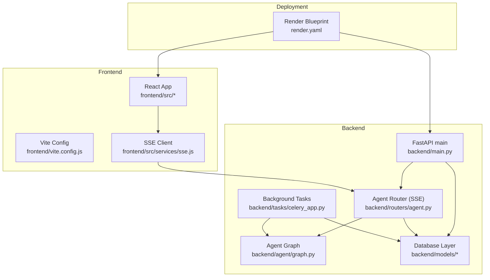
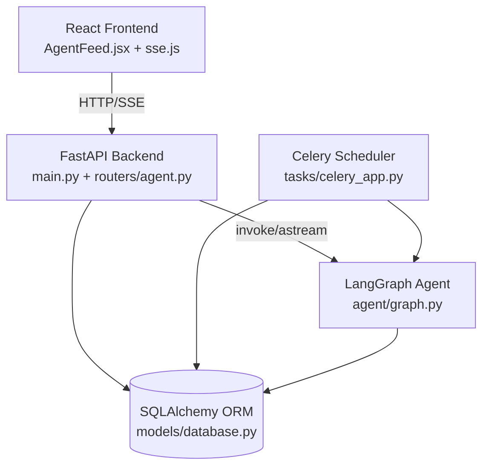
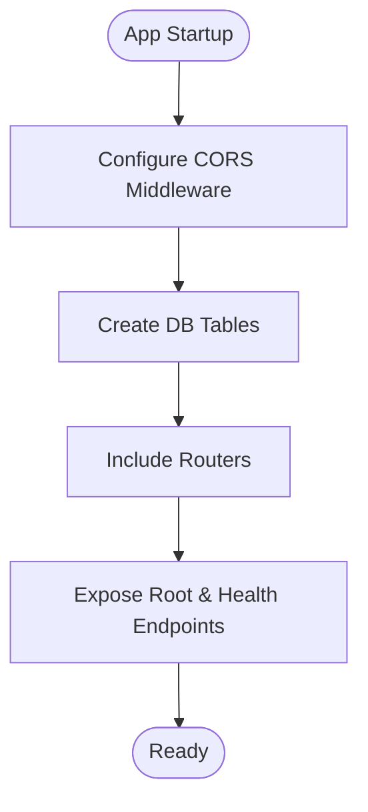
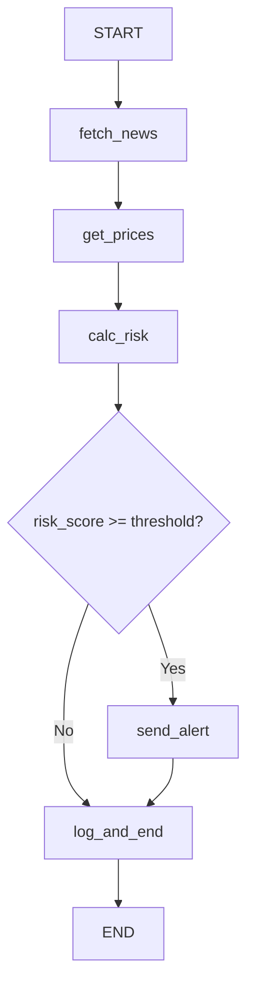
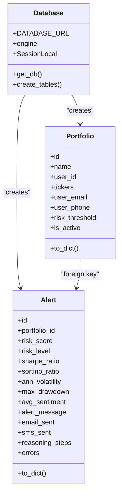
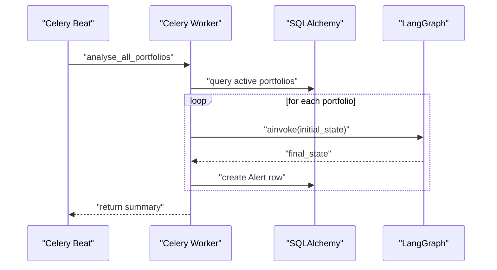
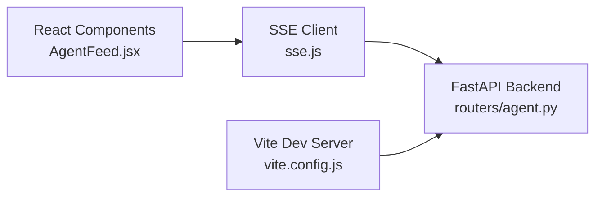
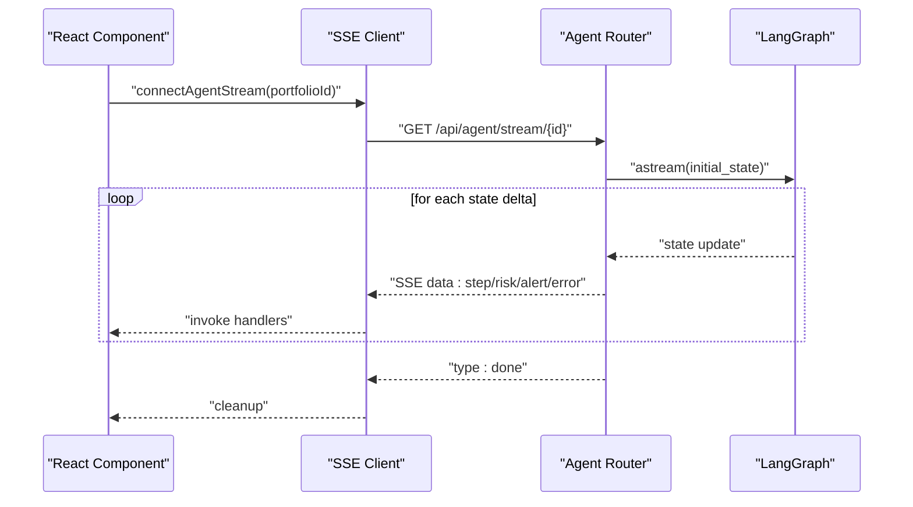
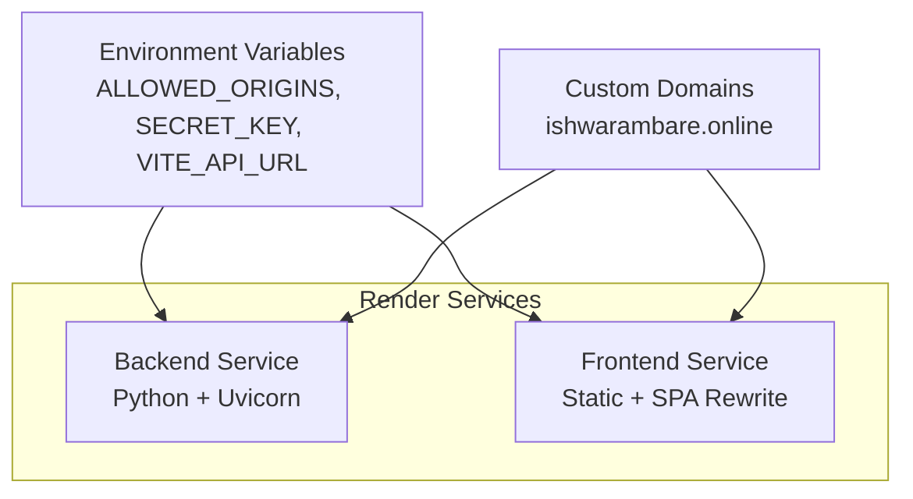
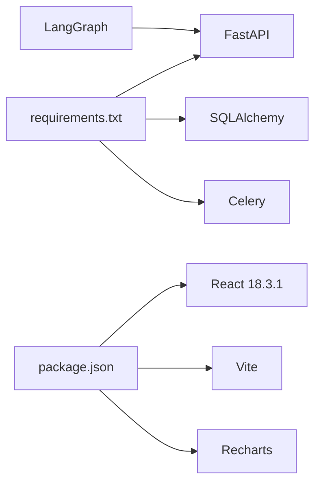

# Technology Stack Overview

<cite>
**Referenced Files in This Document**
- [backend/main.py](file://backend/main.py)
- [backend/agent/graph.py](file://backend/agent/graph.py)
- [backend/routers/agent.py](file://backend/routers/agent.py)
- [backend/models/database.py](file://backend/models/database.py)
- [backend/models/portfolio.py](file://backend/models/portfolio.py)
- [backend/models/alert.py](file://backend/models/alert.py)
- [backend/tasks/celery_app.py](file://backend/tasks/celery_app.py)
- [backend/requirements.txt](file://backend/requirements.txt)
- [frontend/package.json](file://frontend/package.json)
- [frontend/vite.config.js](file://frontend/vite.config.js)
- [frontend/src/services/sse.js](file://frontend/src/services/sse.js)
- [frontend/src/components/AgentFeed.jsx](file://frontend/src/components/AgentFeed.jsx)
- [render.yaml](file://render.yaml)
- [README.md](file://README.md)
</cite>

## Table of Contents
1. [Introduction](#introduction)
2. [Project Structure](#project-structure)
3. [Core Components](#core-components)
4. [Architecture Overview](#architecture-overview)
5. [Detailed Component Analysis](#detailed-component-analysis)
6. [Dependency Analysis](#dependency-analysis)
7. [Performance Considerations](#performance-considerations)
8. [Troubleshooting Guide](#troubleshooting-guide)
9. [Conclusion](#conclusion)

## Introduction
This document presents the technology stack overview for the ishwarambare-app platform, focusing on how the backend (FastAPI, LangGraph, SQLAlchemy, Celery), frontend (React 18.3.1 with Vite), and deployment infrastructure (Render) collaborate to deliver a high-performance, scalable, and maintainable AI-powered financial analysis solution. The platform emphasizes real-time insights through Server-Sent Events (SSE), robust data persistence across PostgreSQL and SQLite, and automated background processing for continuous portfolio monitoring.

## Project Structure
The repository follows a clear separation of concerns:
- Backend: FastAPI application with modular routers, SQLAlchemy ORM models, LangGraph agent workflows, and Celery task scheduling.
- Frontend: React 18.3.1 application built with Vite, using ES modules and modern tooling.
- Deployment: Render blueprint defining two services (backend and static frontend) with environment-specific configuration.

**Diagram sources**
- [backend/main.py:12-59](file://backend/main.py#L12-L59)
- [backend/agent/graph.py:162-203](file://backend/agent/graph.py#L162-L203)
- [backend/routers/agent.py:39-168](file://backend/routers/agent.py#L39-L168)
- [backend/models/database.py:15-42](file://backend/models/database.py#L15-L42)
- [backend/tasks/celery_app.py:35-128](file://backend/tasks/celery_app.py#L35-L128)
- [frontend/vite.config.js:5-22](file://frontend/vite.config.js#L5-L22)
- [frontend/src/services/sse.js:21-62](file://frontend/src/services/sse.js#L21-L62)
- [render.yaml:4-43](file://render.yaml#L4-L43)

**Section sources**
- [README.md:1-129](file://README.md#L1-L129)
- [render.yaml:4-43](file://render.yaml#L4-L43)

## Core Components
This section outlines the primary technologies and their roles:
- Backend Web Framework: FastAPI provides type-safe APIs, automatic OpenAPI docs, and async support.
- AI Agent Orchestration: LangGraph defines a stateful workflow for fetching news, retrieving prices, computing risk, and optionally dispatching alerts.
- Database Abstraction: SQLAlchemy offers ORM models and flexible engine configuration for SQLite (development) and PostgreSQL (production).
- Background Task Processing: Celery with Redis powers scheduled portfolio analysis runs.
- Frontend Framework: React 18.3.1 with Vite delivers a modern build pipeline and component-driven UI.
- Real-Time Communication: SSE streams agent reasoning and risk updates to the React frontend.
- Deployment Infrastructure: Render manages separate backend and frontend services with environment variables and routing.

**Section sources**
- [backend/main.py:12-59](file://backend/main.py#L12-L59)
- [backend/agent/graph.py:162-203](file://backend/agent/graph.py#L162-L203)
- [backend/models/database.py:15-42](file://backend/models/database.py#L15-L42)
- [backend/tasks/celery_app.py:35-128](file://backend/tasks/celery_app.py#L35-L128)
- [frontend/package.json:11-25](file://frontend/package.json#L11-L25)
- [frontend/vite.config.js:5-22](file://frontend/vite.config.js#L5-L22)
- [render.yaml:4-43](file://render.yaml#L4-L43)

## Architecture Overview
The platform architecture integrates the backend, frontend, and deployment layers to enable real-time AI-driven financial analysis:
- FastAPI exposes REST endpoints and SSE streams for agent runs.
- LangGraph orchestrates agent nodes and emits state deltas suitable for SSE.
- SQLAlchemy persists portfolios and alerts, supporting both SQLite and PostgreSQL.
- Celery schedules daily portfolio analysis and invokes the LangGraph agent synchronously within a loop.
- React consumes SSE events to visualize agent reasoning and risk metrics.
- Render deploys the backend and frontend as distinct services with environment-specific configuration.

**Diagram sources**
- [backend/main.py:12-59](file://backend/main.py#L12-L59)
- [backend/routers/agent.py:39-168](file://backend/routers/agent.py#L39-L168)
- [backend/agent/graph.py:162-203](file://backend/agent/graph.py#L162-L203)
- [backend/models/database.py:15-42](file://backend/models/database.py#L15-L42)
- [backend/tasks/celery_app.py:35-128](file://backend/tasks/celery_app.py#L35-L128)
- [frontend/src/components/AgentFeed.jsx:28-175](file://frontend/src/components/AgentFeed.jsx#L28-L175)
- [frontend/src/services/sse.js:21-62](file://frontend/src/services/sse.js#L21-L62)

## Detailed Component Analysis

### Backend Web Framework (FastAPI)
- Application initialization sets up CORS, startup hooks, and route registration.
- Startup creates database tables and exposes health checks.
- Routers organize endpoints by domain (items, auth, portfolio, agent, alerts).

**Diagram sources**
- [backend/main.py:12-59](file://backend/main.py#L12-L59)

**Section sources**
- [backend/main.py:12-59](file://backend/main.py#L12-L59)

### AI Agent Workflow Orchestration (LangGraph)
- The agent graph defines a linear workflow: fetch news → get prices → calculate risk, followed by a conditional branch to send alerts or log completion.
- The graph supports both synchronous invocation and streaming via aiter events for SSE.
- Initial state encapsulates portfolio context, user contact info, and reasoning logs.

**Diagram sources**
- [backend/agent/graph.py:162-203](file://backend/agent/graph.py#L162-L203)

**Section sources**
- [backend/agent/graph.py:45-122](file://backend/agent/graph.py#L45-L122)
- [backend/agent/graph.py:146-155](file://backend/agent/graph.py#L146-L155)
- [backend/agent/graph.py:210-242](file://backend/agent/graph.py#L210-L242)

### Database Layer (SQLAlchemy)
- Engine configuration supports SQLite by default and PostgreSQL via environment variable.
- Session management provides dependency injection for endpoints.
- Models define portfolios and alerts with JSON fields for tickers and reasoning logs.

**Diagram sources**
- [backend/models/database.py:15-42](file://backend/models/database.py#L15-L42)
- [backend/models/portfolio.py:16-63](file://backend/models/portfolio.py#L16-L63)
- [backend/models/alert.py:14-77](file://backend/models/alert.py#L14-L77)

**Section sources**
- [backend/models/database.py:15-42](file://backend/models/database.py#L15-L42)
- [backend/models/portfolio.py:16-63](file://backend/models/portfolio.py#L16-L63)
- [backend/models/alert.py:14-77](file://backend/models/alert.py#L14-L77)

### Background Task Processing (Celery)
- Celery application configured with Redis broker/backend and scheduled daily analysis at 08:00 UTC.
- The scheduled task iterates active portfolios, constructs initial agent state, runs the async agent in a new event loop, and persists results to the database.

**Diagram sources**
- [backend/tasks/celery_app.py:49-128](file://backend/tasks/celery_app.py#L49-L128)
- [backend/agent/graph.py:210-242](file://backend/agent/graph.py#L210-L242)
- [backend/models/alert.py:14-77](file://backend/models/alert.py#L14-L77)

**Section sources**
- [backend/tasks/celery_app.py:35-128](file://backend/tasks/celery_app.py#L35-L128)

### Frontend Stack (React 18.3.1 + Vite + Recharts)
- React 18.3.1 with ES modules and Vite build tooling.
- Recharts provides data visualization for portfolio analytics.
- Vite development server proxies API requests to the backend during local development.
- SSE client wraps EventSource for connecting to agent streams and updating UI components.

**Diagram sources**
- [frontend/src/components/AgentFeed.jsx:28-175](file://frontend/src/components/AgentFeed.jsx#L28-L175)
- [frontend/src/services/sse.js:21-62](file://frontend/src/services/sse.js#L21-L62)
- [frontend/vite.config.js:5-22](file://frontend/vite.config.js#L5-L22)
- [backend/routers/agent.py:39-168](file://backend/routers/agent.py#L39-L168)

**Section sources**
- [frontend/package.json:11-25](file://frontend/package.json#L11-L25)
- [frontend/vite.config.js:5-22](file://frontend/vite.config.js#L5-L22)
- [frontend/src/services/sse.js:21-62](file://frontend/src/services/sse.js#L21-L62)
- [frontend/src/components/AgentFeed.jsx:28-175](file://frontend/src/components/AgentFeed.jsx#L28-L175)

### Real-Time Communication (Server-Sent Events)
- The agent router exposes an SSE endpoint that streams reasoning steps, risk metrics, alert triggers, and completion signals.
- The frontend connects via EventSource, parses messages, and updates the UI in real time.
- The SSE implementation ensures compatibility with CORS and Nginx buffering.

**Diagram sources**
- [backend/routers/agent.py:39-168](file://backend/routers/agent.py#L39-L168)
- [frontend/src/services/sse.js:21-62](file://frontend/src/services/sse.js#L21-L62)
- [frontend/src/components/AgentFeed.jsx:28-175](file://frontend/src/components/AgentFeed.jsx#L28-L175)

**Section sources**
- [backend/routers/agent.py:39-168](file://backend/routers/agent.py#L39-L168)
- [frontend/src/services/sse.js:21-62](file://frontend/src/services/sse.js#L21-L62)
- [frontend/src/components/AgentFeed.jsx:28-175](file://frontend/src/components/AgentFeed.jsx#L28-L175)

### Deployment Infrastructure (Render)
- Two services: a Python web service for the backend and a static site for the frontend.
- Environment variables configure CORS origins, secret keys, and the API base URL for the frontend.
- Health checks and rewrites ensure proper routing and caching behavior.

**Diagram sources**
- [render.yaml:4-43](file://render.yaml#L4-L43)

**Section sources**
- [render.yaml:4-43](file://render.yaml#L4-L43)
- [README.md:78-108](file://README.md#L78-L108)

## Dependency Analysis
- Backend dependencies are declared in the requirements file and include FastAPI, Uvicorn, SQLAlchemy, and related packages.
- Frontend dependencies include React, Recharts, Axios, and Vite with React plugin.
- The agent depends on LangGraph for workflow orchestration and integrates with external tools for news, pricing, risk calculation, and alerting.

**Diagram sources**
- [backend/requirements.txt:1-20](file://backend/requirements.txt#L1-L20)
- [frontend/package.json:11-25](file://frontend/package.json#L11-L25)

**Section sources**
- [backend/requirements.txt:1-20](file://backend/requirements.txt#L1-L20)
- [frontend/package.json:11-25](file://frontend/package.json#L11-L25)

## Performance Considerations
- Asynchronous streaming: SSE leverages FastAPI’s async capabilities to stream agent updates without blocking the event loop.
- Executor offloading: Database writes in SSE endpoints are executed in a thread pool to prevent blocking the async loop.
- Lightweight defaults: SQLite is used for zero-config development, while PostgreSQL is supported for production scaling.
- Scheduled processing: Celery handles periodic tasks outside of request-response latency, ensuring responsiveness under load.
- Frontend bundling: Vite builds optimize assets and disables source maps in production for reduced bundle size.

[No sources needed since this section provides general guidance]

## Troubleshooting Guide
- CORS and SSE: Ensure CORS middleware allows origins and credentials for SSE compatibility.
- Database connectivity: Verify DATABASE_URL environment variable points to the correct backend; SQLite requires thread relaxation configuration.
- Redis availability: Confirm Redis is reachable for Celery broker and backend; adjust REDIS_URL for hosted instances.
- Frontend API base URL: Set VITE_API_URL to the backend service URL on Render.
- Health checks: Use the /health endpoint to validate backend readiness.

**Section sources**
- [backend/main.py:18-30](file://backend/main.py#L18-L30)
- [backend/models/database.py:15-18](file://backend/models/database.py#L15-L18)
- [backend/tasks/celery_app.py:29](file://backend/tasks/celery_app.py#L29)
- [render.yaml:15-42](file://render.yaml#L15-L42)
- [backend/main.py:56-58](file://backend/main.py#L56-L58)

## Conclusion
The ishwarambare-app platform combines FastAPI, LangGraph, SQLAlchemy, and Celery to form a cohesive backend, augmented by a modern React frontend and Render deployment. This stack achieves performance through asynchronous streaming and scheduled processing, scalability by supporting PostgreSQL, and maintainability via modular components and clear separation of concerns. Together, these technologies enable sophisticated AI-powered financial analysis with real-time transparency and reliable automation.